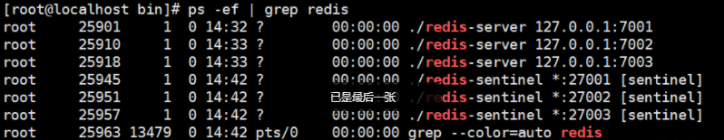
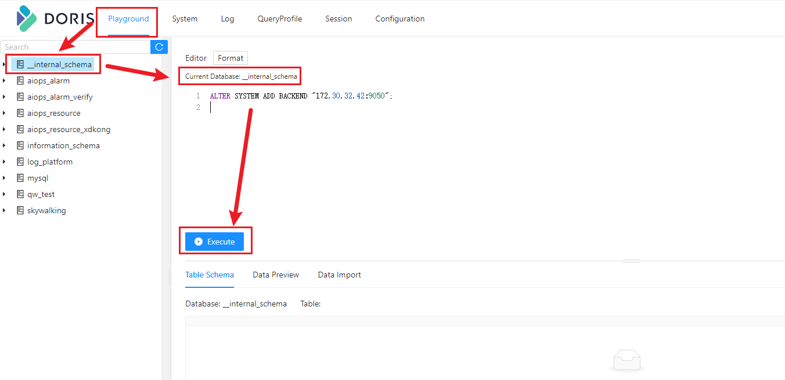
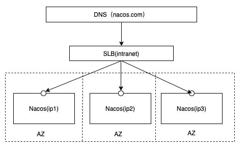
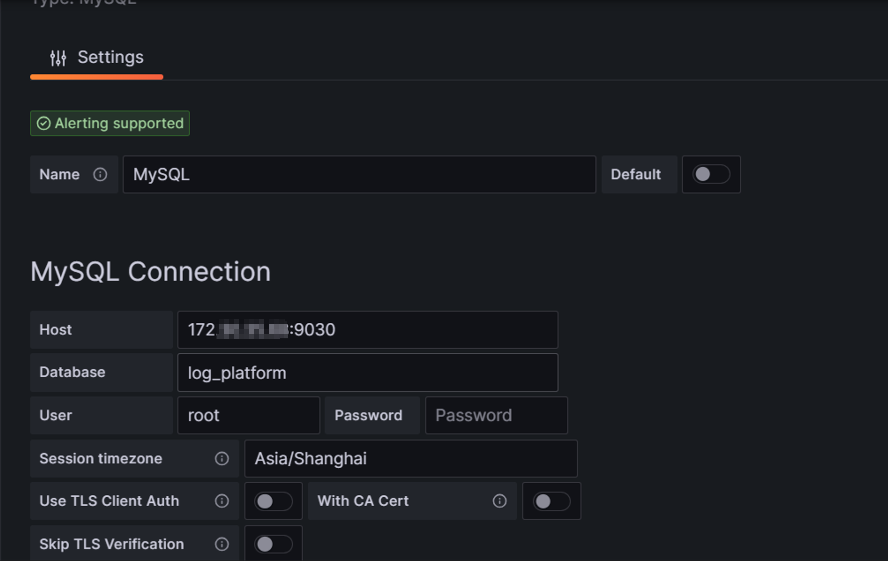
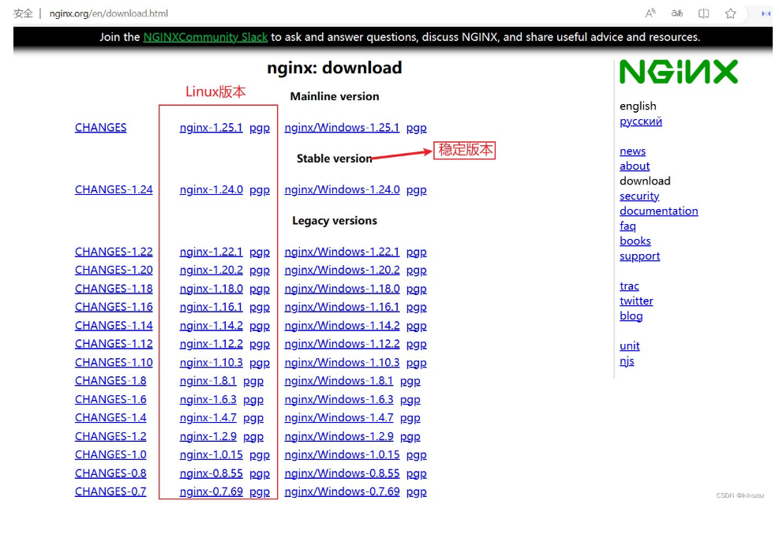

# **中间件部署**

<a name="3cf1e956"></a>

## JDK安装

> 注意：如果之前已经安装过jdk，且版本不低于1.8，以下步骤可以忽略


<a name="5cec45ad"></a>

### 查看Linux自带的jdk是否已安装

命令如下：
`java -version`

<a name="c740ef61"></a>

### 如需卸载操作系统自带的openjdk

参考以下命令：

```shell
> rpm -qa|grep jdk
> rpm -e --nodeps 包名（即上面命令出现的包名）
```

> 注意：因为linux系统可能会内置openjdk，如果内置jdk版本低于1.8，则需要卸载


<a name="eea4d112"></a>

### 安装jdk

在发布包->XX架构的包->01_中间件安装包中找到jdk-8u371-linux-x64.tar.gz，上传到/data/public目录下(如果没有自行创建），并解压


```shell
> cd /data/public

> tar -xvzf jdk-8u371-linux-x64.tar.gz
```

<a name="9c7647ff"></a>

### 修改系统环境变量

可选择修改/etc/profile，也可以在/etc/profile.d目录下新建development.sh文件填写

```shell
export JAVA_HOME=/data/public/jdk1.8.0_371
export JRE_HOME=$JAVA_HOME/jre
export CLASSPATH=.:$JAVA_HOME/lib:$JRE_HOME/lib:$CLASSPATH
export PATH=$JAVA_HOME/bin:$JRE_HOME/bin:$PATH
```

刷新，使其生效

```shell
> source /etc/profile
# 或者执行
> source development.sh
```

<a name="148a8e73"></a>

### 检查安装结果

安装完毕后输入命令java -version查看版本是否安装成功。类似如下显示表示正确安装

```latex
java version "1.8.0_371"
Java(TM) SE Runtime Environment (build 1.8.0_371-b11)
Java HotSpot(TM) 64-Bit Server VM (build 25.371-b11, mixed mode)
```

<a name="83470fd7"></a>

## MySQL部署

<a name="dceecfd5"></a>

### 查看是否已经安装mysql

`rpm -qa | grep -i mysql`
<a name="0874d9da"></a>

### 查看mysql版本

`mysql --version`

如果已经安装了5.7版本的, 则可以直接用已安装的, 否则需要卸载以前的重新安装。
<a name="b8be85a9"></a>

### 卸载mysql

`rpm -e xxx（上面出现的包名）`
<a name="51d92214"></a>

### 上传解压

```
cd /data/public/mysql (此目录自己定义)
在发布包->03_公共包->01_中间件安装包中找到mysql-5.7.43-linux-glibc2.12-x86_64.tar.gz压缩包上传到该目录, 解压
tar -zxvf mysql-5.7.43-linux-glibc2.12-x86_64.tar.gz
```

<a name="ba9abe38"></a>

### 创建mysql用户组和mysql用户

检查是否有mysql用户组和mysql用户
`groups mysql`
创建用户和用户组
`groupadd mysql && useradd -r -g mysql mysql`

<a name="8f7b6ec0"></a>

### 创建数据目录并赋予权限

```
mkdir /var/lib/mysql
chown mysql:mysql -R /var/lib/mysql
```

<a name="522ff48e"></a>

### 修改配置文件 （没有就新建）

```
[root@iflyops-1 etc]# vim /etc/my.cnf

[mysqld]
datadir=/var/lib/mysql
socket=/tmp/mysql.sock
# Disabling symbolic-links is recommended to prevent assorted security risks
symbolic-links=0
# Settings user and group are ignored when systemd is used.
# If you need to run mysqld under a different user or group,
# customize your systemd unit file for mariadb according to the
# instructions in http://fedoraproject.org/wiki/Systemd

log-error=/var/lib/mysql/mysql.err
pid-file=/var/lib/mysql/mysql.pid

#
# include all files from the config directory
#
!includedir /etc/my.cnf.d
```

<a name="27ce0055"></a>

### 初始化

将/data/public/mysql-5.7.43-linux-glibc2.12-x86_64文件夹移动到/usr/local/下并更名为mysql

```
mkdir /etc/my.cnf.d
mv mysql-5.7.43-linux-glibc2.12-x86_64 /usr/local/mysql
cd /usr/local/mysql/bin/
./mysqld --defaults-file=/etc/my.cnf --basedir=/usr/local/mysql/ --datadir=/var/lib/mysql --user=mysql --initialize
```

查看初始化密码

```shell
sudo grep 'temporary password' /var/lib/mysql/mysql.err
```


<a name="fd4d12a8"></a>

### 启动mysql

```
cp /usr/local/mysql/support-files/mysql.server /etc/init.d/mysql
service mysql start
service mysql status
```

<a name="466d236f"></a>

### 登录

/usr/local/mysql/bin/mysql -u root -p

回车后输入上方的密码

<a name="294c9b97"></a>

### 修改密码

```
第一次登录必须设置密码
SET PASSWORD = PASSWORD('123456');
```

### 修改其它主机权限，使得主机均可访问该数据库

```
GRANT ALL PRIVILEGES ON *.* TO 'root'@'%' IDENTIFIED BY '123456' WITH GRANT OPTION;
FLUSH PRIVILEGES;  
```

## zookeeper部署

### 单机部署

- 创建zookeeper文件夹

```bash
mkdir /data/public/zookeeper
```

- 在发布包->03公共包->01中间件安装包中找到apache-zookeeper-3.8.1-bin.tar.gz, 上传到/data/public/zookeeper目录下，解压apache-zookeeper-3.8.1-bin.tar.gz压缩包

```bash
cd /data/public/zookeeper
tar -xzvf apache-zookeeper-3.8.1-bin.tar.gz
```

- 在zookeeper目录下，创建zookeeper-data文件夹

```bash
mkdir zookeeper-data
```

- 进入解压后的文件夹

  ```
  cd apache-zookeeper-3.8.1-bin/
  ```

- 复制conf/zoo_sample.cfg得到conf/zoo.cfg文件配置

```bash
cd conf
cp zoo_sample.cfg zoo.cfg
```

- 修改zoo.cfg

```properties
# The number of milliseconds of each tick
tickTime=2000
# The number of ticks that the initial 
# synchronization phase can take
initLimit=10
# The number of ticks that can pass between 
# sending a request and getting an acknowledgement
syncLimit=5
# the directory where the snapshot is stored.
# do not use /tmp for storage, /tmp here is just 
# example sakes.
dataDir=/data/public/zookeeper/zookeeper-data
# the port at which the clients will connect
clientPort=2181
# the maximum number of client connections.
# increase this if you need to handle more clients
#maxClientCnxns=60
#
# Be sure to read the maintenance section of the 
# administrator guide before turning on autopurge.
#
# https://zookeeper.apache.org/doc/current/zookeeperAdmin.html#sc_maintenance
#
# The number of snapshots to retain in dataDir
#autopurge.snapRetainCount=3
# Purge task interval in hours
# Set to "0" to disable auto purge feature
#autopurge.purgeInterval=1
## Metrics Providers
#
# https://prometheus.io Metrics Exporter
#metricsProvider.className=org.apache.zookeeper.metrics.prometheus.PrometheusMetricsProvider
#metricsProvider.httpHost=0.0.0.0
#metricsProvider.httpPort=7000
#metricsProvider.exportJvmInfo=true

```

- 启动服务

```bash
cd /data/public/zookeeper/apache-zookeeper-3.8.1-bin/
bin/zkServer.sh start
```

<a name="e0882be7"></a>

### 集群部署

- 创建zookeeper文件夹

```bash
mkdir zookeeper
```

- 在zookeeper目录中，解压apache-zookeeper-3.8.1-bin.tar.gz压缩包

```bash
tar -xzvf apache-zookeeper-3.8.1-bin.tar.gz
```

- 在zookeeper目录下，创建zookeeper-data文件夹

```bash
mkdir zookeeper-data
```

- 进入解压后的文件夹，复制conf/zoo_sample.cfg得到conf/zoo.cfg文件配置

```bash
cd conf
cp zoo_sample.cfg zoo.cfg
```

- 修改zoo.cfg

```properties
# The number of milliseconds of each tick
tickTime=2000
# The number of ticks that the initial 
# synchronization phase can take
initLimit=10
# The number of ticks that can pass between 
# sending a request and getting an acknowledgement
syncLimit=5
# the directory where the snapshot is stored.
# do not use /tmp for storage, /tmp here is just 
# example sakes.
dataDir=/data/public/zookeeper/2181/zookeeper-data
# the port at which the clients will connect
clientPort=2181
# the maximum number of client connections.
# increase this if you need to handle more clients
#maxClientCnxns=60
#
# Be sure to read the maintenance section of the 
# administrator guide before turning on autopurge.
#
# https://zookeeper.apache.org/doc/current/zookeeperAdmin.html#sc_maintenance
#
# The number of snapshots to retain in dataDir
#autopurge.snapRetainCount=3
# Purge task interval in hours
# Set to "0" to disable auto purge feature
#autopurge.purgeInterval=1
## Metrics Providers
#
# https://prometheus.io Metrics Exporter
#metricsProvider.className=org.apache.zookeeper.metrics.prometheus.PrometheusMetricsProvider
#metricsProvider.httpHost=0.0.0.0
#metricsProvider.httpPort=7000
#metricsProvider.exportJvmInfo=true
server.1=node1:2888:3888
server.2=node2:2888:3888
server.3=node3:2888:3888
```
- 启动服务在三个node节点上，分别在/zookeeper/data/myid写入节点标记：
```bash
node1节点上写:1
node2节点上写:2
node3节点上写:3
```


- 启动服务 在node1、node2、node3上，分别启动zkServer

```bash
bin/zkServer.sh start
```

## Kafka部署

- 创建kafka文件夹

```bash
mkdir /data/public/kafka
```

- 在发布包->03公共包->01中间件安装包中找到kafka_2.13-2.8.2.tgz, 上传到/data/public/Kafka目录下，在kafka目录中，解压kafka_2.13-2.8.2.tgz压缩包

```bash
cd /data/public/kafka
tar -xzvf kafka_2.13-2.8.2.tgz
```

- 进入解压后文件夹，修改config/server.properties文件，配置以下配置项

  ```
  cd kafka_2.13-2.8.2/
  vim config/server.properties
  ```

  

```properties
broker.id=0 #在单机时无需修改，但在集群下部署时往往需要修改。它是个每一个 broker 在集群中的唯一表示，要求是正数。当该服务器的 IP 地址发生改变时， broker.id 没有变化，则不会影响 consumers 的消息情况
host.name=127.0.0.1 #对外暴露的服务端口，如果外网需要向broker发送消息必须配置；如果只在内网使用，不需要配置此项，配置listeners即可 #advertised.listeners=PLAINTEXT://your.host.name:9092
log.dirs=/mnt/service/kafka_2.13-2.8.2/data #Kafka 把所有的消息都保存在磁盘上，存放这些数据的目录通过 log.dirs 指定。可以使用多路径，使用逗号分隔。如果是多路径，Kafka 会根据“最少 使用”原则，把同一个分区的日志片段保存到同一路径下。会往拥有最少数据分区的路径新增分区。
zookeeper.connect=127.0.0.1:2181,127.0.0.2:2181,127.0.0.3:2181 #zookeeper 集群的地址，可以是多个，多个之间用逗号分割。（一组hostname:port/path 列表,hostname 是 zk 的机器名或 IP、port 是 zk 的端口、/path 是可选 zk 的路径，如果不指定，默认使用根路径）
```

broker.id：如果是集群，每个节点的不能重复，比如3节点，就分别设置为0、1、2
host.name：节点IP
log.dirs：数据保存目录
zookeeper.connect：zookeeper服务地址

- kafka日志配置

`$KAFKA_HOME/config/log4j.properties`中有如下默认操作日志的`DatePattern`配置：
```properties
log4j.appender.kafkaAppender.DatePattern='.'yyyy-MM-dd-HH
```
只要每个小时有日志生成，那么每个小时都会生成日志文件；对日志记录和问题排查都带来不便，建议修改为：
```properties
log4j.appender.kafkaAppender.DatePattern='.'yyyy-MM-dd
```
以上仅为示例，需要将`$KAFKA_HOME/config/log4j.properties`中所有`DatePattern`均修改为示例格式

- 启动服务

```bash
cd /data/public/kafka/kafka_2.13-2.8.2/
./bin/kafka-server-start.sh -daemon config/server.properties &
```

<a name="Z6pKo"></a>

## elasticsearch8.7集群部署（单机部署参考集群部署步骤）

<a name="e3CI9"></a>

### 添加elastic用户

useradd elastic

### 设置内核参数
vi /etc/sysctl.conf
```bash
#增加以下参数
vm.max_map_count=655360
```
执行以下命令，确保参数生效：
sysctl -p

### 设置资源参数
vi /etc/security/limits.conf
```bash
在末尾增加如下
* soft nofile 65536
* hard nofile 131072
* soft nproc 65536
* hard nproc 131072
```
### 设置用户参数

```bash
vi /etc/security/limits.d/20-nproc.conf
添加如下：
# 设置elastic用户参数
elastic    soft    nproc     65536
```
### 解压项目

```bash
tar -zxvf elasticsearch-8.7.1-linux-x86_64.tar.gz
mv elasticsearch-8.7.1 elasticsearch
```
### 创建数据文件夹及日志文件夹

```
cd /data/public/elasticsearch
mkdir data
```

### 给elastic用户赋权切换到elastic用户

```shell
chown -R elastic /data/public/elasticsearch
su elastic
```

### 生成证书

./bin/elasticsearch-certutil ca
```bash
This tool assists you in the generation of X.509 certificates and certificate
signing requests for use with SSL/TLS in the Elastic stack.

The 'ca' mode generates a new 'certificate authority'
This will create a new X.509 certificate and private key that can be used
to sign certificate when running in 'cert' mode.

Use the 'ca-dn' option if you wish to configure the 'distinguished name'
of the certificate authority

By default the 'ca' mode produces a single PKCS#12 output file which holds:
    * The CA certificate
    * The CA's private key

If you elect to generate PEM format certificates (the -pem option), then the output will
be a zip file containing individual files for the CA certificate and private key

Please enter the desired output file [elastic-stack-ca.p12]: 【不用管，直接回车】
Enter password for elastic-stack-ca.p12 : 【输入密码】
```
### 生成密钥

```shell
./bin/elasticsearch-certutil cert --ca elastic-stack-ca.p12
```

### 将凭证迁移到指定目录

```shell
mkdir ./config/cert
mv ./elastic-certificates.p12 ./config/cert/
chmod 777 ./config/cert/elastic-certificates.p12
```


其他节点 直接复制上述文件过去

### 修改配置文件
其他节点自行配置
```bash
vim ./config/elasticsearch.yml

cluster.name: es-cluster
node.name: node-1

#文件位置自定义
path.data: /data/public/elasticsearch/data
path.logs: /data/public/elasticsearch/logs

network.host: 0.0.0.0
http.port: 9200

discovery.seed_hosts: ["host1","host2","host3"]
cluster.initial_master_nodes: ["node-1","node-2","node-3"]

http.cors.enabled: true
http.cors.allow-origin: "*"
http.cors.allow-headers: Authorization,X-Requested-With,Content-Type,Content-Length

xpack.security.enabled: true
xpack.security.enrollment.enabled: true

xpack.security.transport.ssl:
  enabled: true
  verification_mode: certificate
  keystore.path: cert/elastic-certificates.p12
  truststore.path: cert/elastic-certificates.p12
```

### 各个节点上添加密码
./bin/elasticsearch-keystore add xpack.security.transport.ssl.keystore.secure_password
输入之前设置的密码
./bin/elasticsearch-keystore add xpack.security.transport.ssl.truststore.secure_password
输入之前设置的密码
### 启动
./bin/elasticsearch -d

### 重设elastic密码

./elasticsearch-reset-password -u elastic -i

### 注意：如果设置了账号密码需要修改 oap服务连接es的配置，添加账号密码 。es开启认证后如果删除security索引，需要重新设置es的密码 否则访问401

<a name="0bd1415c"></a>

## Redis单节点部署
### 下载 gcc依赖

1. Redis是基于C语言编写的，所以首先要在Linux中安装Redis所需要的gcc依赖

```shell
yum install -y gcc tcl
```

<a name="0155f015"></a>

### 获取redis安装包并解压

在发布包->03公共包->01中间件安装包中找到redis-6.2.7.tar.gz, 上传到/data/public/redis目录下，并解压

```shell
> mkdir -p /data/public

> cd /data/public

# 解压
> tar -zxvf redis-6.2.7.tar.gz
```

> 安装目录/data/public可根据实际情况调整


<a name="984612f0"></a>

### 编译

```shell
> cd redis-6.2.7

# 执行编译命令
> make
```

<a name="e655a410"></a>

### 安装

```shell
# 执行安装命令
> make PREFIX=/data/public/redis-6.2.7 install
```

PREFIX=
这个关键字的作用是编译的时候用于指定程序存放的路径。比如我们现在就是指定了redis必须存放在/data/public/redis-6.2.7。假设不添加该关键字Linux会将可执行文件存放在/usr/local/bin目录，
库文件会存放在/usr/local/lib目录。配置文件会存放在/usr/local/etc目录。其他的资源文件会存放在usr/local/share目录。这里指定号目录也方便后续的卸载，后续直接rm
-rf /data/public/redis-6.2.7 即可删除redis。

<a name="9d3ffed0"></a>

### 修改配置文件

1.在目录/data/public/redis-6.2.7 下有一个redis.conf的配置文件。
修改该文件

```shell
 vim redis.conf
```

1. 修改bind 监听的地址，默认是127.0.0.1,会导致只能在本地访问，改为0.0.0.0表示任何ip都可以访问
2. 修改 daemonize 守护进程，默认是no, 修改为yes后可后台进行
3. 修改 打开配置文件，找到# requirepass foobared，将上述行的注释符号#去掉，并将密码修改为你想要设置的密码。例如：requirepass 【你的新密码】,设置后访问redis必须输入密码

### 启动redis

根据上面的操作已经将redis安装完成了。在目录/data/public/redis-6.2.7 输入下面命令启动redis

```shell
> ./bin/redis-server ./redis.conf

# 查看是否启动成功
> ps -ef|grep redis
root     445830 439938  0 19:34 pts/2    00:00:01 ./bin/redis-server 127.0.0.1:6379
root     446949 439938  0 19:47 pts/2    00:00:00 grep --color=auto redis
```

<a name="af153919"></a>

### redis.conf配置文件（非必看）

可以通过redis-cli命令进入redis控制台后通过CONFIG GET * 的方式读取所有配置项。 如下：

```shell
./bin/redis-cli

127.0.0.1:6379> CONFIG GET *
  1) "dbfilename"
  2) "dump.rdb"
  3) "requirepass"
  4) ""
  5) "masterauth"
  6) ""
  7) "cluster-announce-ip"
  8) ""
  9) "unixsocket"
 10) ""
 11) "logfile"
 12) ""
 13) "pidfile"
 14) "/var/run/redis_6379.pid"
 15) "slave-announce-ip"
 16) ""
 17) "replica-announce-ip"
 18) ""
 19) "maxmemory"
 20) "0"
 21) "proto-max-bulk-len"
 22) "536870912"
 23) "client-query-buffer-limit"
 24) "1073741824"
 25) "maxmemory-samples"
 26) "5"
 27) "lfu-log-factor"
 28) "10"
 29) "lfu-decay-time"
 30) "1"
 31) "timeout"
 32) "0"
 33) "active-defrag-threshold-lower"
 34) "10"
 35) "active-defrag-threshold-upper"
 36) "100"
 37) "active-defrag-ignore-bytes"
 38) "104857600"
 39) "active-defrag-cycle-min"
 40) "5"
 41) "active-defrag-cycle-max"
 42) "75"
 43) "active-defrag-max-scan-fields"
 44) "1000"
 45) "auto-aof-rewrite-percentage"
 46) "100"
 47) "auto-aof-rewrite-min-size"
 48) "67108864"
 49) "hash-max-ziplist-entries"
 50) "512"
 51) "hash-max-ziplist-value"
 52) "64"
 53) "stream-node-max-bytes"
 54) "4096"
 55) "stream-node-max-entries"
 56) "100"
 57) "list-max-ziplist-size"
 58) "-2"
 59) "list-compress-depth"
 60) "0"
 61) "set-max-intset-entries"
 62) "512"
 63) "zset-max-ziplist-entries"
 64) "128"
 65) "zset-max-ziplist-value"
 66) "64"
 67) "hll-sparse-max-bytes"
 68) "3000"
 69) "lua-time-limit"
 70) "5000"
 71) "slowlog-log-slower-than"
 72) "10000"
 73) "latency-monitor-threshold"
 74) "0"
 75) "slowlog-max-len"
 76) "128"
 77) "port"
 78) "6379"
 79) "cluster-announce-port"
 80) "0"
 81) "cluster-announce-bus-port"
 82) "0"
 83) "tcp-backlog"
 84) "511"
 85) "databases"
 86) "16"
 87) "repl-ping-slave-period"
 88) "10"
 89) "repl-ping-replica-period"
 90) "10"
 91) "repl-timeout"
 92) "60"
 93) "repl-backlog-size"
 94) "1048576"
 95) "repl-backlog-ttl"
 96) "3600"
 97) "maxclients"
 98) "10000"
 99) "watchdog-period"
100) "0"
101) "slave-priority"
102) "100"
103) "replica-priority"
104) "100"
105) "slave-announce-port"
106) "0"
107) "replica-announce-port"
108) "0"
109) "min-slaves-to-write"
110) "0"
111) "min-replicas-to-write"
112) "0"
113) "min-slaves-max-lag"
114) "10"
115) "min-replicas-max-lag"
116) "10"
117) "hz"
118) "10"
119) "cluster-node-timeout"
120) "15000"
121) "cluster-migration-barrier"
122) "1"
123) "cluster-slave-validity-factor"
124) "10"
125) "cluster-replica-validity-factor"
126) "10"
127) "repl-diskless-sync-delay"
128) "5"
129) "tcp-keepalive"
130) "300"
131) "cluster-require-full-coverage"
132) "yes"
133) "cluster-slave-no-failover"
134) "no"
135) "cluster-replica-no-failover"
136) "no"
137) "no-appendfsync-on-rewrite"
138) "no"
139) "slave-serve-stale-data"
140) "yes"
141) "replica-serve-stale-data"
142) "yes"
143) "slave-read-only"
144) "yes"
145) "replica-read-only"
146) "yes"
147) "slave-ignore-maxmemory"
148) "yes"
149) "replica-ignore-maxmemory"
150) "yes"
151) "stop-writes-on-bgsave-error"
152) "yes"
153) "daemonize"
154) "no"
155) "rdbcompression"
156) "yes"
157) "rdbchecksum"
158) "yes"
159) "activerehashing"
160) "yes"
161) "activedefrag"
162) "no"
163) "protected-mode"
164) "yes"
165) "repl-disable-tcp-nodelay"
166) "no"
167) "repl-diskless-sync"
168) "no"
169) "aof-rewrite-incremental-fsync"
170) "yes"
171) "rdb-save-incremental-fsync"
172) "yes"
173) "aof-load-truncated"
174) "yes"
175) "aof-use-rdb-preamble"
176) "yes"
177) "lazyfree-lazy-eviction"
178) "no"
179) "lazyfree-lazy-expire"
180) "no"
181) "lazyfree-lazy-server-del"
182) "no"
183) "slave-lazy-flush"
184) "no"
185) "replica-lazy-flush"
186) "no"
187) "dynamic-hz"
188) "yes"
189) "maxmemory-policy"
190) "noeviction"
191) "loglevel"
192) "notice"
193) "supervised"
194) "no"
195) "appendfsync"
196) "everysec"
197) "syslog-facility"
198) "local0"
199) "appendonly"
200) "no"
201) "dir"
202) "/data/public/redis"
203) "save"
204) "900 1 300 10 60 10000"
205) "client-output-buffer-limit"
206) "normal 0 0 0 slave 268435456 67108864 60 pubsub 33554432 8388608 60"
207) "unixsocketperm"
208) "0"
209) "slaveof"
210) ""
211) "notify-keyspace-events"
212) ""
213) "bind"
214) "127.0.0.1"
```

这里列举下比较重要的配置项

| 配置项名称          | 配置项范围                        | 说明                                                                                                                                                                             |
|----------------|------------------------------|--------------------------------------------------------------------------------------------------------------------------------------------------------------------------------|
| daemonize      | yes、no                       | yes表示启用守护进程，默认是no即不以守护进程方式运行。其中Windows系统下不支持启用守护进程方式运行                                                                                                                         |
| port           |                              | 指定 Redis 监听端口，默认端口为 6379                                                                                                                                                       |
| bind           |                              | 绑定的主机地址,如果需要设置远程访问则直接将这个属性备注下或者改为bind * 即可,这个属性和下面的protected-mode控制了是否可以远程访问 。                                                                                                 |
| protected-mode | yes 、no                      | 保护模式，该模式控制外部网是否可以连接redis服务，默认是yes,所以默认我们外网是无法访问的，如需外网连接rendis服务则需要将此属性改为no。                                                                                                    |
| timeout        | 300                          | 当客户端闲置多长时间后关闭连接，如果指定为 0，表示关闭该功能                                                                                                                                                |
| loglevel       | debug、verbose、notice、warning | 日志级别，默认为 notice                                                                                                                                                                |
| databases      | 16                           | 设置数据库的数量，默认的数据库是0。整个通过客户端工具可以看得到                                                                                                                                               |
| rdbcompression | yes、no                       | 指定存储至本地数据库时是否压缩数据，默认为 yes，Redis 采用 LZF 压缩，如果为了节省 CPU 时间，可以关闭该选项，但会导致数据库文件变的巨大。                                                                                                 |
| dbfilename     | dump.rdb                     | 指定本地数据库文件名，默认值为 dump.rdb                                                                                                                                                       |
| dir            |                              | 指定本地数据库存放目录                                                                                                                                                                    |
| requirepass    |                              | 设置 Redis 连接密码，如果配置了连接密码，客户端在连接 Redis 时需要通过 AUTH  命令提供密码，默认关闭                                                                                                                   |
| maxclients     | 0                            | 设置同一时间最大客户端连接数，默认无限制，Redis 可以同时打开的客户端连接数为 Redis 进程可以打开的最大文件描述符数，如果设置 maxclients 0，表示不作限制。当客户端连接数到达限制时，Redis 会关闭新的连接并向客户端返回 max number of clients reached 错误信息。                 |
| maxmemory      | XXX                          | 指定 Redis 最大内存限制，Redis 在启动时会把数据加载到内存中，达到最大内存后，Redis 会先尝试清除已到期或即将到期的 Key，当此方法处理 后，仍然到达最大内存设置，将无法再进行写入操作，但仍然可以进行读取操作。Redis 新的 vm 机制，会把 Key 存放内存，Value 会存放在 swap 区。配置项值范围列里XXX为数值。 |

<a name="74589f7a"></a>

## Redis哨兵模式一主两从节点部署
### 获取redis安装包并解压

1. 从交付产物中获取redis安装包redis-6.2.7.tar.gz
2. 解压压缩包至/data/public目录中，没有该目录则创建

```shell
> mkdir -p /data/public

> cd /data/public

# 解压
> tar -zxvf redis-6.2.7.tar.gz
```

> 安装目录/data/public可根据实际情况调整

* 以上操作三个节点同步执行

### 编译

```shell
> cd redis-6.2.7

# 执行编译命令
> make
```

* 以上操作三个节点同步执行

### 安装

```shell
# 执行安装命令
> make PREFIX=/data/public/redis-6.2.7 install
```

PREFIX=
这个关键字的作用是编译的时候用于指定程序存放的路径。比如我们现在就是指定了redis必须存放在/data/public/redis-6.2.7。假设不添加该关键字Linux会将可执行文件存放在/usr/local/bin目录，
库文件会存放在/usr/local/lib目录。配置文件会存放在/usr/local/etc目录。其他的资源文件会存放在usr/local/share目录。这里指定号目录也方便后续的卸载，后续直接rm
-rf /data/public/redis-6.2.7 即可删除redis。

* 以上操作三个节点同步执行

### 修改配置文件
#### 修改Redis的配置文件
1.在目录/data/public/redis-6.2.7 下有一个redis.conf的配置文件。
修改该文件

```shell
 vim redis.conf
```

1. 修改bind 监听的地址，默认是127.0.0.1,会导致只能在本地访问，改为0.0.0.0表示任何ip都可以访问
2. 修改 daemonize 守护进程，默认是no, 修改为yes后可后台进行
3. 打开配置文件，找到# requirepass foobared，将上述行的注释符号#去掉，并将密
码修改为你想要设置的密码

* 以上操作三个节点同步执行
#### 修改哨兵的配置文件
1.在目录/data/public/redis-6.2.7 下有一个sentinel.conf的配置文件。
修改该文件

```shell
 vim sentinel.conf
```
1. 修改 daemonize 守护进程，默认是no, 修改为yes后可后台进行
2. 修改 sentinel monitor mymaster 127.0.0.1 7001 2 为监控master 的ip和端口
3. 修改 sentinel auth-pass master-name password 为master 节点的密码 

* 以上操作三个节点同步执行

### 启动redis

根据上面的操作已经将redis安装完成了。在目录/data/public/redis-6.2.7 输入下面命令启动redis

```shell
> ./bin/redis-server ./redis.conf

# 查看是否启动成功
> ps -ef|grep redis
root     445830 439938  0 19:34 pts/2    00:00:01 ./bin/redis-server 127.0.0.1:6379
root     446949 439938  0 19:47 pts/2    00:00:00 grep --color=auto redis
```
* 以上操作三个节点同步执行
### 设置主从关系
分别进入redis客户端
```shell
./redis-cli -p 6379
```
查看当前redis主机节点信息
```shell
info replication
```

分别在另外两台机器上执行以下命令 ，完成主从关系建立

```shell
auth <password>
SLAVEOF 主节点ip  6379
```

### 启动哨兵节点
```shell
cd /data/public/redis-6.2.7

./bin/redis-sentinel ./sentinel.conf
```
* 以上操作三个节点同步执行

### 验证
```shell
ps -ef | grep redis
```
* 看到三个哨兵和三个redis都启动起来了(当前部署的3个实例都在一台服务器上)



## Redis分片集群模式（三主三从）
### 获取redis安装包并解压

1. 从交付产物中获取redis安装包redis-6.2.7.tar.gz
2. 解压压缩包至/data/public目录中，没有该目录则创建

```shell
> mkdir -p /data/public

> cd /data/public

# 解压
> tar -zxvf redis-6.2.7.tar.gz
```

> 安装目录/data/public可根据实际情况调整

* 以上操作六个节点同步执行

### 编译

```shell
> cd redis-6.2.7

# 执行编译命令
> make
```

* 以上操作六个节点同步执行

### 安装

```shell
# 执行安装命令
> make PREFIX=/data/public/redis-6.2.7 install
```

PREFIX=
这个关键字的作用是编译的时候用于指定程序存放的路径。比如我们现在就是指定了redis必须存放在/data/public/redis-6.2.7。假设不添加该关键字Linux会将可执行文件存放在/usr/local/bin目录，
库文件会存放在/usr/local/lib目录。配置文件会存放在/usr/local/etc目录。其他的资源文件会存放在usr/local/share目录。这里指定号目录也方便后续的卸载，后续直接rm
-rf /data/public/redis-6.2.7 即可删除redis。

* 以上操作六个节点同步执行

### 修改配置文件
#### 修改集群的配置文件
1、创建data文件夹，存放pid、log等文件
```shell
mkdir -p /data/public/redis-6.2.7/data
```
1.在目录/data/public/redis-6.2.7 下有一个redis.conf的配置文件。
修改该文件

```shell
 vim redis.conf
```
修改项及修改后值
```shell
bind 0.0.0.0 # 绑定地址 0.0.0.0表示任何ip都可以访问
protected-mode yes # 保护模式
port 6379 # 默认6379，可按需修改
daemonize yes # 后台进行
pidfile /data/public/redis-6.2.7/data/redis_6379.pid # pid文件路径，名称根据当前端口修改
logfile /data/public/redis-6.2.7/data/redis_6379.log # 日志路径，名称根据当前端口修改
databases 1 # 数据库数量，分片集群只允许一个库
dbfilename redis_6379.rdb # 持久化文件名称
dir /data/public/redis-6.2.7/data # 持久化文件存放目录
requirepass bljBUFo9dixIA7tJ # 密码改为你想要设置的密码
cluster-enabled yes # 开启集群功能
cluster-config-file nodes-6379.conf # 集群的配置文件名称，不需要我们创建，由redis自己维护
cluster-node-timeout 15000 # 节点心跳失败的超时时间
```
* 以上操作六个节点同步执行

### 启动redis

根据上面的操作已经将redis安装完成了。在目录/data/public/redis-6.2.7 输入下面命令启动redis

```shell
> /data/public/redis-6.2.7/bin/redis-server /data/public/redis-6.2.7/redis.conf

# 查看是否启动成功
> ps -ef|grep redis
root     445830 439938  0 19:34 pts/2    00:00:01 /data/public/redis-6.2.7/bin/redis-server 0.0.0.0:6379 [cluster]
root     446949 439938  0 19:47 pts/2    00:00:00 grep --color=auto redis
```
* 以上操作六个节点同步执行

### 创建集群
在任一节点上，执行创建集群命令，密码是redis.conf中设置的密码 `--cluster-replicas 1`表示1个副本，则六个节点会自动分配成三主三从
```shell
> /data/public/redis-6.2.7/bin/redis-cli -a 'bljBUFo9dixIA7tJ' --cluster create --cluster-replicas 1 192.168.0.1:6379 192.168.0.2:6379 192.168.0.3:6379 192.168.0.4:6379 192.168.0.5:6379 192.168.0.6:6379

# 命令执行后，会先将节点分主从关系，要求选择yes同意关系分配
Can I set the above configuration? (type 'yes' to accept): yes
# 最后成功会显示
[OK] All nodes agree about slots configuration.
>>> Check for open slots...
>>> Check slots coverage...
[OK] All 16384 slots covered.
```

检查集群状态
```shell
> /data/public/redis-6.2.7/bin/redis-cli -a 'bljBUFo9dixIA7tJ' -h 192.168.0.1 -p 6379
> info cluster
# Cluster
cluster_enabled:1
```

## VictoriaMetrics部署

### 单机部署
#### 获取VM安装包并解压

1. 从交付产物中获取VM安装包victoria-metrics-linux-amd64-v1.93.9.tar.gz
2. 解压压缩包至/data/public/victoria-metrics目录中，没有该目录则创建

```shell
> mkdir -p /data/public/victoria-metrics

# 解压
> tar zxvf victoria-metrics-linux-amd64-v1.93.9.tar.gz -C /data/public/victoria-metrics
```

VictoriaMetrics 解压缩之后，里边就一个二进制：

```shell
> cd /data/public/victoria-metrics

> ll vic*
-rwxr-xr-x 1 mysql mysql 20183250 12月 13 06:45 victoria-metrics-prod
```

<a name="771fa5d7"></a>

#### 启动VictoriaMetrics

```shell
> nohup ./victoria-metrics-prod &> stdout.log &
[1] 466325

> ss -tlnp|grep 466325
LISTEN     0      128          *:8428                     *:*                   users:(("victoria-metric",pid=466325,fd=7))
```

通过上面的命令可以看出，单机版本的 VictoriaMetrics 监听在 8428 端口。通过浏览器访问 VictoriaMetrics 的
8428页面，如果可以正常访问就说安装成功了。

当然，我仅仅使用 nohup 简单启动的，如果生产环境，建议使用 systemd 托管并设置开机自启动。
### 集群部署
如集群有172.20.40.124,172.20.40.125,172.20.40.126三台机器，则每台机器执行以下操作：

#### 获取VictoriaMetrics安装包并解压

1. 从交付产物中获取VM安装包victoria-metrics-linux-arm64-v1.93.14-cluster.tar.gz
2. 解压压缩包至/data/public/victoria-metrics-cluster目录中，没有该目录则创建

```shell
> mkdir -p /data/public/victoria-metrics-cluster/data

# 解压
> tar zxvf victoria-metrics-linux-arm64-v1.93.14-cluster.tar.gz -C /data/public/victoria-metrics-cluster
> cd /data/public/victoria-metrics-cluster
```
#### 部署vmstorage-prod 组件服务
vim /lib/systemd/system/vmstorage.service
```
[Unit]
Description=Vmstorage Server
After=network.target
 
[Service]
Restart=on-failure
WorkingDirectory=/data/public/victoria-metrics-cluster/
ExecStart=/data/public/victoria-metrics-cluster/vmstorage-prod -loggerTimezone Asia/Shanghai -storageDataPath /data/public/victoria-metrics-cluster/data/ -httpListenAddr :8482 -vminsertAddr :8400 -vmselectAddr :8401
 
[Install]
WantedBy=multi-user.target
```
#### 部署 vminsert-prod 组件
vim /lib/systemd/system/vminsert.service

*注*：其中的IP为集群机器的IP，有多少个机器就写多少个，端口最好不改，如果要改，3个组件的端口要保持一致

```
[Unit]
Description=Vminsert Server
After=network.target
 
[Service]
Restart=on-failure
WorkingDirectory=/data/public/victoria-metrics-cluster/
ExecStart=/data/public/victoria-metrics-cluster/vminsert-prod -httpListenAddr :8480 -storageNode=172.20.40.124:8400,172.20.40.125:8400,172.20.40.126:8400
 
[Install]
WantedBy=multi-user.target
```
#### 部署vmselect-prod 组件服务
vim /lib/systemd/system/vmselect.service
```
[Unit]
Description=Vmselect Server
After=network.target
 
[Service]
Restart=on-failure
WorkingDirectory=/data/public/victoria-metrics-cluster/
ExecStart=/data/public/victoria-metrics-cluster/vmselect-prod -httpListenAddr :8481 -storageNode=172.20.40.124:8401,172.20.40.125:8401,172.20.40.126:8401
 
[Install]
WantedBy=multi-user.target
```

#### 启动VM

```shell
###
systemctl daemon-reload
 
##
systemctl list-unit-files|grep vm
 
## 启动 vmstorage
systemctl start vmstorage.service
netstat -ntlp|grep vmstorage
 
##  启动 vminsert
systemctl start vminsert
netstat -ntlp|grep vmin
 
## 启动vmselect
systemctl enable vmselect && systemctl start vmselect
netstat -ntlp|grep vmse
```
#### 验证
```
## 查看vmstorage 的三个端口
curl http://127.0.0.1:8480/metrics
curl http://127.0.0.1:8481/metrics
curl http://127.0.0.1:8482/metrics
```
#### 查看图形化界面
```
http://<vmselect>/select/0/vmui/
http://172.20.40.124:8481/select/0/vmui/
```
#### 集群写入地址
```
http://172.20.40.124:8480/insert/0/prometheus
```

## Doris系统部署

确定好规模资源以后，按照部署文档部署Doris系统

部署前先检查硬件, 如果CPU架构是**X86**, 需要先检查CPU支持的指令集
运行以下命令，有输出结果，表示机器支持 AVX2 指令集, 使用`apache-doris-2.1.6-bin-x64.tar.gz`安装包部署

```shell
cat /proc/cpuinfo | grep avx2
```
如果机器不支持 AVX2 指令集，可以使用`apache-doris-2.1.6-bin-x64-noavx2.tar.gz`安装包进行部署

doris系统分为FE和BE两种服务，根据需求可选择集群部署和单点部署，本文以1FE、3BE为例，单点部署时FE和BE可共用一台服务器

部署home目录 `/data/public/doris`, 将doris的安装包解压到此目录

数据存储目录 `/data/public/doris/storage`

在3台机器上分别创建这两个目录

| 节点ip      | 部署角色 | 数据存储目录      |                                                                                         |
|-----------|------|-------------|-----------------------------------------------------------------------------------------|
| 127.0.0.1 | FE   |             | 部署后访问地址: [http://127.0.0.1:8030/login](http://127.0.0.1:8030/login)<br />用户名:root, 密码:空 |
| 127.0.0.1 | BE   | /data/public/doris/storage |                                                                                         |
| 127.0.0.2 | BE   | /data/public/doris/storage |                                                                                         |
| 127.0.0.3 | BE   | /data/public/doris/storage |                                                                                         |

- 操作系统检查

1.关闭swap分区

临时关闭，机器重启后还会被打开
```
swapoff -a 
```
永久关闭方法，使用 Linux root 账户，注释掉 /etc/fstab 中的 swap 分区，然后重启即可彻底关闭 swap 分区。
```
# /etc/fstab
# <file system>        <dir>         <type>    <options>             <dump> <pass>
tmpfs                  /tmp          tmpfs     nodev,nosuid          0      0
/dev/sda1              /             ext4      defaults,noatime      0      1
# /dev/sda2              none          swap      defaults              0      0
/dev/sda3              /home         ext4      defaults,noatime      0      2
```
2.配置NTP服务

Doris 的元数据要求时间精度要小于 5000ms，所以所有集群所有机器要进行时钟同步，避免因为时钟问题引发的元数据不一致导致服务出现异常。通常情况下，可以通过配置 NTP 服务保证各节点时钟同步。
```
sudo systemctl start ntpd.service
sudo systemctl enable ntpd.service
```

3.设置系统最大打开文件句柄数

```
vi /etc/security/limits.conf 
* soft nofile 1000000
* hard nofile 1000000
```

4.修改虚拟内存区域数量

```
sysctl -w vm.max_map_count=2000000
```

5.关闭透明大页

在部署 Doris 时，建议关闭透明大页。
```
echo never > /sys/kernel/mm/transparent_hugepage/enabled
echo never > /sys/kernel/mm/transparent_hugepage/defrag
```

- FE 配置

配置文件: fe/conf/fe.conf

修改 `priority_networks`， 修改为机器的ip，例如ip为172.30.35.68，我们可以通过掩码的方式配置为 priority_networks = 172.30.35.0/24

启动命令

```bash
sh bin/start_fe.sh --daemon
```

服务检查

启动Doris FE后，我们可以通过Doris FE 提供的Web UI 来检查是否启动成功，在浏览器中输入：http://127.0.0.1:8030，用户名为root，密码为空。

在FE的WEB-UI页面中，查看FE状态命令：show proc '/frontends';

Join和Alive均为true说明FE状态正常

- BE配置

配置文件: be/conf/be.conf

修改 `priority_networks`为当前机器ip地址，例如ip为172.30.35.68，我们可以通过掩码的方式配置为 priority_networks = 172.30.35.0/24，
`storage_root_path`(数据存储目录)设置为`/data/public/doris/storage`

启动命令

```bash
sh bin/start_be.sh --daemon
```

- 添加BE

在FE的web页面, 执行如下sql添加BE


```bash
ALTER SYSTEM ADD BACKEND "127.0.0.1:9050";
ALTER SYSTEM ADD BACKEND "127.0.0.2:9050";
ALTER SYSTEM ADD BACKEND "127.0.0.3:9050";
```
服务检查

在FE的web页面，查看BE状态命令：show proc '/backends';

Alive均为true则BE服务启动正常

- 用户相关操作
  登录数据库示例：

```shell
mysql -h FE-HOST -P9030 -uroot -p
```

数据库初始root用户为空，用以上命令登录，FE-HOST为FE的IP地址，9030 是fe.conf 中的 query_port 配置，修改root和admin用户的密码，执行以下命令：
```
mysql> SET PASSWORD FOR 'root' = PASSWORD('password');
mysql> SET PASSWORD FOR 'admin' = PASSWORD('password');
```
将password改为要设置的密码，注意如果修改了用户密码后，在日志服务，告警服务的配置文件中，要把密码配置正确。

创建数据库：
```
mysql> create database log_platform;
```

<a name="43d3a0b7"></a>

## nacos部署  
提供基于2.2.3版本适配达梦数据库的部署包
### 单机部署
- 上传jar包到部署目录 /data/public，没有该目录则创建
```shell
tar -zxvf nacos-server-2.2.3.tar.gz
```

- 配置nacos数据库
```shell
#连接mysql 创建nacos的数据库
CREATE DATABASE nacos;
use nacos;
source /data/public/nacos/conf/mysql-schema.sql #初始化数据
exit;
```

- 修改nacos配置文件 -mysql存储部署 注意配置mysql存储后不可再配置dm
```properties
vim /data/public/nacos/conf/application.properties
#配置数据源
spring.datasource.platform=mysql
spring.sql.init.platform=mysql
### Count of DB:
db.num=1
### Connect URL of DB:
db.url.0=jdbc:mysql://ip:port/nacos_config
&characterEncoding=utf8&connectTimeout=1000&socketTimeout=3000&autoReconnect=
true&useUnicode=true&useSSL=false&serverTimezone=UTC #修改ip为mysql部署ip,端口为mysql配置的端口号 库名根据脚本实际生成的库名配置
db.user.0=root #mysql登录名
db.password.0= #mysql登录密码
#nacos鉴权配置
nacos.core.auth.enabled=true
nacos.core.auth.plugin.nacos.token.cache.enable=false
nacos.core.auth.server.identity.key=${自定义，保证所有节点一致}
nacos.core.auth.server.identity.value=${自定义，保证所有节点一致}
nacos.core.auth.plugin.nacos.token.secret.key=${自定义，保证所有节点一致}
```
- 修改nacos配置文件 -dm8存储部署 注意配置dm存储后不可再配置mysql
```properties
vim /data/public/nacos/conf/application.properties
#配置数据源
spring.datasource.platform=dameng
### Count of DB:
db.num=1
### Connect URL of DB:
db.url.0=jdbc:dm://ip:port?schema=nacos_config?  # 修改ip为达梦的部署ip,端口为达梦配置的端口号 库名根据脚本实际生成的库名配置
characterEncoding=utf8&connectTimeout=1000&socketTimeout=3000&autoReconnect=
true&useUnicode=true&useSSL=false&serverTimezone=UTC 
db.user.0=root #dm登录名
db.password.0= #dm登录密码
#nacos鉴权配置
nacos.core.auth.enabled=true
nacos.core.auth.plugin.nacos.token.cache.enable=false
nacos.core.auth.server.identity.key=${自定义，保证所有节点一致}
nacos.core.auth.server.identity.value=${自定义，保证所有节点一致}
nacos.core.auth.plugin.nacos.token.secret.key=${自定义，保证所有节点一致}
```

- 启动nacos  进入nacos bin目录
```shell
sh startup.sh -m standalone #-m standalone参数表示以单机模式启动Nacos
jps -l #查看是否启动成功
```

- 访问管理端
```shell
访问地址：http://ip:8848/nacos
默认用户名密码：nacos/nacos
```

_**注意：**_

（1）nacos默认创建public命名空间，可观测服务需要新建一个属于自己的命名空间，例如st-observable，并且确保可观测所有服务均在同一命名空间（st-observable）下。该操作在后续的服务部署文档中会有体现。

（2） 在创建命名空间的时候，命名空间ID不建议采用随机生成策略，而是填写st-observable，因为可观测服务默认的配置文件均以st-observable为命名空间ID。

### 集群部署

- 推荐用户把所有服务列表放到一个vip下面，然后挂到一个域名下面
- http://ip1:port/openAPI 直连ip模式，机器挂则需要修改ip才可以使用。

- http://SLB:port/openAPI 挂载SLB模式(内网SLB，不可暴露到公网，以免带来安全风险)，直连SLB即可，下面挂server真实ip，可读性不好。

- http://nacos.com:port/openAPI 域名 + SLB模式(内网SLB，不可暴露到公网，以免带来安全风险)，可读性好，而且换ip方便，推荐模式




| 端口 | 与主端口的偏移量 | 描述 |
| --- | --- | --- |
| 8848 | 0 | 主端口，客户端、控制台及OpenAPI所使用的HTTP端口 |
| 9848 | 1000 | 客户端gRPC请求服务端端口，用于客户端向服务端发起连接和请求 |
| 9849 | 1001 | 服务端gRPC请求服务端端口，用于服务间同步等 |
| 7848 | -1000 | Jraft请求服务端端口，用于处理服务端间的Raft相关请求 |

**使用VIP/nginx请求时，需要配置成TCP转发，不能配置http2转发，否则连接会被nginx断开。** **9849和7848端口为服务端之间的通信端口，请勿暴露到外部网络环境和客户端测。**
#### 1.预备环境准备
请确保是在环境中安装使用:

1. 64 bit OS Linux/Unix/Mac，推荐使用Linux系统。
2. 64 bit JDK 1.8+；[下载](http://www.oracle.com/technetwork/java/javase/downloads/jdk8-downloads-2133151.html). [配置](https://docs.oracle.com/cd/E19182-01/820-7851/inst_cli_jdk_javahome_t/)。
3. Maven 3.2.x+；[下载](https://maven.apache.org/download.cgi). [配置](https://maven.apache.org/settings.html)。
4. 3个或3个以上Nacos节点才能构成集群。
#### 2. 下载源码或者安装包
使用提供的二开后的2.2.3版本（支持mysql和达梦存储）
#### 3. 配置集群配置文件
在nacos的解压目录nacos/的conf目录下，有配置文件cluster.conf，请每行配置成ip
。（请配置3个或3个以上节点）
```
# ip:port
200.8.9.16:8848
200.8.9.17:8848
200.8.9.18:8848
```
#####  开启默认鉴权插件（可选）
之后修改conf目录下的application.properties文件。
设置其中
```
nacos.core.auth.enabled=true
nacos.core.auth.system.type=nacos
nacos.core.auth.plugin.nacos.token.secret.key=${自定义，保证所有节点一致}
nacos.core.auth.server.identity.key=${自定义，保证所有节点一致}
nacos.core.auth.server.identity.value=${自定义，保证所有节点一致}
```
描述内容详情可查看[权限认证](https://nacos.io/docs/latest/plugin/auth-plugin/).
注意，文档中的默认值SecretKey012345678901234567890123456789012345678901234567890123456789和VGhpc0lzTXlDdXN0b21TZWNyZXRLZXkwMTIzNDU2Nzg=为公开默认值，可用于临时测试，实际使用时请**务必**更换为自定义的其他有效值。
#### 4. 确定数据源

- 使用内置数据源：无需进行任何配置
- 使用外置数据源：生产使用建议至少主备模式，或者采用高可用数据库。
- 初始化 MySQL或dm 数据库：sql文件可以在部署包的conf/目录下找到

##### application.properties 配置
参考单机部署步骤中的配置

#### 5. 启动服务器
##### Linux/Unix/Mac
##### Stand-alone mode

```
sh startup.sh -m standalone
```
##### 集群模式
使用内置数据源

```
sh startup.sh -p embedded
```
使用外置数据源

```
sh startup.sh
```
#### 6. 服务注册&发现和配置管理
#### 服务注册
curl -X POST 'http://127.0.0.1:8848/nacos/v1/ns/instance?serviceName=nacos.naming.serviceName&ip=20.18.7.10&port=8080'
注意：如果开启默认鉴权插件，需要在Header中带上用户名密码。
#### 服务发现
curl -X GET 'http://127.0.0.1:8848/nacos/v1/ns/instance/list?serviceName=nacos.naming.serviceName'
注意：如果开启默认鉴权插件，需要在Header中带上用户名密码。
#### 发布配置
curl -X POST "http://127.0.0.1:8848/nacos/v1/cs/configs?dataId=nacos.cfg.dataId&group=test&content=helloWorld"
注意：如果开启默认鉴权插件，需要在Header中带上用户名密码。
#### 获取配置
curl -X GET "http://127.0.0.1:8848/nacos/v1/cs/configs?dataId=nacos.cfg.dataId&group=test"
注意：如果开启默认鉴权插件，需要在Header中带上用户名密码。
#### 7. 关闭服务器
Linux/Unix/Mac
**Terminal window**

```
sh shutdown.sh
```
<a name="43d3a0b7"></a>

## grafana部署
#### 1、上传jar包到部署目录 /data/public/grafana，没有该目录则创建，然后解压
```shell
tar -zxvf grafana-10.0.2.linux-amd64.tar.gz
```

#### 2、修改grafana admin用户密码（可选）
```shell
./grafana-cli admin reset-admin-password new_password #进入到grafana bin目录下执行
```

#### 3、设置免密登录（可选）
- 修改grafana配置文件

在grafana配置文件grafana-10.0.2/conf/defaults.ini中，找到[auth.anonymous]配置块，将其下匿名访问控制enabled设置为true
```shell
[auth.anonymous]
# enable anonymous access
enabled = true

# specify role for unauthenticated users
org_role = Admin
```

#### 4、启动grafana
```shell
nohup ./grafana-server & # 进入到grafana bin目录下执行
ps -auxf | grep grafana #查看是否启动成功
```

#### 5、访问管理端
```shell
访问地址：http://ip:3000
默认用户名密码：admin/admin
```

#### 6、数据源配置

web端搜索框搜索Data sources，然后根据需要配置数据源，例如mysql数据源配置




#### 7、dashboard导入（智慧城市）

grafana中导入智慧城市nginx&埋点大盘：智慧城市nginx&埋点大盘-1709023288238.json(见部署包)

## dm linux 环境部署
### 安装前准备
用户在安装 DM 数据库之前需要检查或修改操作系统的配置，以保证 DM 数据库能够正确安装和运行。

本文演示环境如下：

|  操作系统   | CPU  |数据库|
|  ----  | ----  |----  |
| CentOS7  | x86_64 架构 |dm8_20240116_x86_rh7_64|

#### 新建 dmdba 用户
注意
安装前必须创建 dmdba 用户，禁止使用 root 用户安装数据库。

创建用户所在的组，命令如下：
```shell
groupadd dinstall -g 2001
```
创建用户，命令如下：
```shell
useradd  -G dinstall -m -d /home/dmdba -s /bin/bash -u 2001 dmdba
```
修改用户密码，命令如下：
```
passwd dmdba
```
#### 修改文件打开最大数
在 Linux、Solaris、AIX 和 HP-UNIX 等系统中，操作系统默认会对程序使用资源进行限制。如果不取消对应的限制，则数据库的性能将会受到影响。

永久修改和临时修改。

* 重启服务器后永久生效。
使用 root 用户打开 /etc/security/limits.conf 文件进行修改，命令如下：

```
vi /etc/security/limits.conf
```
在最后需要添加如下配置：

```
dmdba  soft      nice       0
dmdba  hard      nice       0
dmdba  soft      as         unlimited
dmdba  hard      as         unlimited
dmdba  soft      fsize      unlimited
dmdba  hard      fsize      unlimited
dmdba  soft      nproc      65536
dmdba  hard      nproc      65536
dmdba  soft      nofile     65536
dmdba  hard      nofile     65536
dmdba  soft      core       unlimited
dmdba  hard      core       unlimited
dmdba  soft      data       unlimited
dmdba  hard      data       unlimited
```

注意
修改配置文件后重启服务器生效。

切换到 dmdba 用户，查看是否生效，命令如下：

```
su - dmdba
```
```
ulimit -a
```
参数配置已生效。

* 设置参数临时生效
可使用 dmdba 用户执行如下命令，使设置临时生效：

```
ulimit -n 65536
ulimit -u 65536
```
建议
使用永久修改方式进行配置。

#### 目录规划
1. 可根据实际需求规划安装目录，本示例使用默认配置 DM 数据库安装在 /home/dmdba 文件夹下。

2. 规划创建实例保存目录、归档保存目录、备份保存目录。

```
##实例保存目录
mkdir /dmdata/data
##归档保存目录
mkdir -p /dmdata/arch
##备份保存目录
mkdir -p /dmdata/dmbak
```
* 注意 使用 root 用户建立文件夹，待 dmdba 用户建立完成后需将文件所有者更改为 dmdba 用户，否则无法安装到该目录下

#### 修改目录权限
将新建的路径目录权限的用户修改为 dmdba，用户组修改为 dinstall。命令如下：

```
chown -R dmdba:dinstall /dmdata/data
chown -R dmdba:dinstall /dmdata/arch
chown -R dmdba:dinstall /dmdata/dmbak
```
给路径下的文件设置 755 权限。命令如下：

```
chmod -R 755 /dmdata/data
chmod -R 755 /dmdata/arch
chmod -R 755 /dmdata/dmbak
```

### 数据库命令行安装

#### 挂载镜像
切换到 root 用户，将 DM 数据库的 iso 安装包保存在任意位置，例如 /data/public/dm 目录下，执行如下命令挂载镜像：

```
cd  /data/public/dm
mount -o loop dm8_20240116_x86_rh7_64.iso /mnt
```
执行 df -h命令查看挂载是否成功
```
/dev/loop0                   907M  907M     0 100% /mnt #看到这个表示挂载成功
```

#### 安装
切换至 dmdba 用户下，在 /mnt 目录下使用命令行安装数据库程序，依次执行以下命令安装 DM 数据库。

```
su - dmdba
cd /mnt
```

执行如下命令进行安装。

```
./DMInstall.bin -i
```
按需求选择安装语言，没有 key 文件选择 "n"，时区按需求选择一般选择 “21”，安装类型选择“1”，安装目录按实际情况配置。

数据库安装大概 1~2 分钟。

数据库安装完成后，需要切换至root用户执行/home/dmdba/dmdbms/script/root/root_installer.sh脚本，创建 DmAPService，否则会影响数据库备份。


### 配置实例
命令行方式初始化实例
使用 dmdba 用户配置实例，进入到 DM 数据库安装目录下的 bin 目录中。

```
su - dmdba
cd /home/dmdba/dmdbms/bin
```


使用 dminit 命令初始化实例，dminit 命令可设置多种参数，可执行如下命令查看可配置参数。

```
./dminit help
```

需要注意的是 页大小 (page_size)、簇大小 (extent_size)、大小写敏感 (case_sensitive)、字符集 (charset) 、VARCHAR 类型以字符为单位 (LENGTH_IN_CHAR)、空格填充模式 (BLANK_PAD_MODE) 、页检查模式（PAGE CHECK） 等部分参数，一旦确定无法修改，在初始化实例时确认需求后谨慎设置。

部分参数解释如下：

* page_size：数据文件使用的页大小。取值范围 4、8、16、32，单位：KB。缺省值为 8。可选参数。选择的页大小越大，则 DM 支持的元组长度也越大，但同时空间利用率可能下降。数据库创建成功后无法再修改页大小，可通过系统函数 SF_GET_PAGE_SIZE()获取系统的页大小。
* extent_size：数据文件使用的簇大小，即每次分配新的段空间时连续的页数。取值范围 16、32、64。单位：页数。缺省值为 16。可选参数。数据库创建成功后无法再修改簇大小，可通过系统函数 SF_GET_EXTENT_SIZE()获取系统的簇大小。
* case_sensitive： 标识符大小写敏感。当大小写敏感时，小写的标识符应用""括起，否则被系统自动转换为大写；当大小写不敏感时，系统不会转换标识符的大小写，系统比较函数会将大写字母全部转为小写字母再进行比较。取值：Y、y、1 表示敏感；N、n、0 表示不敏感。缺省值为 Y。可选参数。此参数在数据库创建成功后无法修改，可通过系统函数 SF_GET_CASE_SENSITIVE_FLAG()或 CASE_SENSITIVE()查询设置的参数置。
* charset：字符集选项。取值范围 0、1、2。0 代表 GB18030，1 代表 UTF-8，2 代表韩文字符集 EUC-KR。缺省值为 0。可选参数。此参数在数据库创建成功后无法修改，可通过系统函数 SF_GET_UNICODE_FLAG()或 UNICODE()查询设置的参数置。
* LENGTH_IN_CHAR：VARCHAR 类型对象的长度是否以字符为单位。取值范围：1、Y 表示是，0、N 表示否。缺省值为 0。可选参数。1 或 Y：是，所有 VARCHAR 类型对象的长度以字符为单位。这种情况下，定义长度并非真正按照字符长度调整，而是将存储长度值按照理论字符长度进行放大。所以会出现实际可插入字符数超过定义长度的情况，这种情况也是允许的。同时，存储的字节长度 32767 上限仍然不变，也就是说，即使定义列长度为 32767 字符，其实际能插入的字符串占用总字节长度仍然不能超过 32767；0 或 N：否，所有 VARCHAR 类型对象的长度以字节为单位。此参数在数据库创建成功后无法修改，可通过查询 V$PARAMETER 中的 LENGTH_IN_CHAR 参数名查看此参数的设置值。
* BLANK_PAD_MODE：设置字符串比较时，结尾空格填充模式是否兼容 ORACLE。1：兼容；0：不兼容。缺省值为 0。可选参数。此参数在数据库创建成功后无法修改，可通过查询 V$PARAMETER 中的 BLANK_PAD_MODE 参数名查看此参数的设置值。
* PAGE_CHECK：PAGE_CHECK 为页检查模式。取值范围 0、1、2、3。0：禁用页校验；1：开启页校验并使用 CRC 校验；2：开启页校验并使用指定的 HASH 算法进行校验；3：开启页校验并使用快速 CRC 校验。缺省值为 3。可选参数。在数据库创建成功后无法修改。
更多 dminit 参数解释可参考达梦数据库安装目录下 doc 目录中《DM8_dminit 使用手册》。

建议
在实际使用中，初始化时建议提前设置好 COMPATIBLE_MODE 的参数值，便于更好的兼容其他数据库。参数说明：是否兼容其他数据库模式。0：不兼容，1：兼容 SQL92 标准，2：部分兼容 ORACLE，3：部分兼容 MS SQL SERVER，4：部分兼容 MYSQL，5：兼容 DM6，6：部分兼容 TERADATA，7：部分兼容 POSTGRES。


使用自定义初始化实例的参数：

以下命令设置页为大小写敏感，字符集为 utf_8，数据库名为 DMTEST。

```
./dminit path=/dmdata/data PAGE_SIZE=32 EXTENT_SIZE=32 CASE_SENSITIVE=y CHARSET=1 DB_NAME=DMTEST INSTANCE_NAME=DBSERVER
```

注意
需要设置大小写敏感为否，兼容mysql 项目的适配

### 注册服务

DM 提供了将 DM 服务脚本注册成操作系统服务的脚本，同时也提供了卸载操作系统服务的脚本。注册和卸载脚本文件所在目录为安装目录的“/script/root”子目录下。

注册服务脚本为 dm_service_installer.sh，用户可以使用注册服务脚本将服务脚本注册成为操作系统服务。注册服务需使用 root 用户进行注册，使用 root 用户进入数据库安装目录的 /script/root 下，如下所示：

```
cd /home/dmdba/dmdbms/script/root/
```
注册实例服务，如下所示：

```
./dm_service_installer.sh -t dmserver -dm_ini /dmdata/data/DMTEST/dm.ini -p DMTEST
```

部分参数说明：

标志	参数	说明
-t	服务类型	注册服务类型，支持一下服务类型：dmap、dmamon、dmserver、dmwatcher、dmmonitor、dmasmsvr、dmasmsvrm、dmcss、dmcssm。
-dm_ini	INI 文件路径	指定服务所需要的 dm.ini 文件路径。
-p	服务名后缀	指定服务名后缀，生成的操作系统服务名为“服务脚本模板名，称 + 服务名后缀”。此参数只针对 dmserver、dmwatcher、dmmonitor、dmasmsvr、dmasmsvrm、dmcss、dmcssm 服务脚本生效。
更多参数说明和脚本使用方法可参考数据库安装目录下 doc 目录中 《DM8_Linux 服务脚本使用手册》。

进入数据安装目录下 bin 目录中可以看到已经注册好的服务 DmServiceDMTEST。

```
cd /home/dmdba/dmdbms/bin
ls
```

### 启动和停止数据库

使用 dmdba 用户进入 DM 安装目录下的 bin 目录下，启动数据库，如下所示：

#### 启动数据库
```
[dmdba@localhost ~]$ cd /home/dmdba/dmdbms/bin
[dmdba@localhost bin]$ ls
[dmdba@localhost bin]$ ./DmServiceDMTEST start
```


#### 停止数据库

```
[dmdba@localhost bin]$ ./DmServiceDMTEST stop
```


#### 重启数据库

```
[dmdba@localhost bin]$ ./DmServiceDMTEST restart
```


#### 查看数据库状态

```
[dmdba@localhost bin]$ ./DmServiceDMTEST status
```

## XXL-JOB部署（单机）
### 创建数据库

数据库脚本在部署包的config/doc文件夹中

#### 使用mysql数据库
执行部署包中xxl-job-mysql.sql文件，即可完成库表的初始化
```
# 连接数据库
mysql -uroot -p123456
# 执行数据库脚本
source /data/public/xxl-job/config/doc/xxl-job-mysql.sql;
```

#### 使用达梦数据库
在DM管理工具中使用SYSDBA创建好XXL_JOB用户(需给dba权限)，再登录XXL_JOB用户，将部署包中xxl-job-dm8.sql文件内容复制到新建查询窗口中执行。

### 部署服务
- 解压压缩包
```
unzip xxl-job.zip
```
- 修改config/application.properties配置文件
```
### web
server.port=8080
server.servlet.context-path=/xxl-job-admin

### actuator
management.server.servlet.context-path=/actuator
management.health.mail.enabled=false

### resources
spring.mvc.servlet.load-on-startup=0
spring.mvc.static-path-pattern=/static/**
spring.resources.static-locations=classpath:/static/

### freemarker
spring.freemarker.templateLoaderPath=classpath:/templates/
spring.freemarker.suffix=.ftl
spring.freemarker.charset=UTF-8
spring.freemarker.request-context-attribute=request
spring.freemarker.settings.number_format=0.##########

### mybatis
mybatis.mapper-locations=classpath:/mybatis-mapper/*Mapper.xml
#mybatis.type-aliases-package=com.xxl.job.admin.core.model

### xxl-job, datasource
# mysql
#spring.datasource.url=jdbc:mysql://127.0.0.1:23306/xxl_job?useUnicode=true&characterEncoding=UTF-8&autoReconnect=true&serverTimezone=Asia/Shanghai
#spring.datasource.username=root
#spring.datasource.password=password
#spring.datasource.driver-class-name=com.mysql.cj.jdbc.Driver

# dm
spring.datasource.url=jdbc:dm://127.0.0.1:5237
spring.datasource.username=XXL_JOB
spring.datasource.password=123456789
spring.datasource.driver-class-name=dm.jdbc.driver.DmDriver

### datasource-pool
spring.datasource.type=com.zaxxer.hikari.HikariDataSource
spring.datasource.hikari.minimum-idle=10
spring.datasource.hikari.maximum-pool-size=30
spring.datasource.hikari.auto-commit=true
spring.datasource.hikari.idle-timeout=30000
spring.datasource.hikari.pool-name=HikariCP
spring.datasource.hikari.max-lifetime=900000
spring.datasource.hikari.connection-timeout=10000
spring.datasource.hikari.connection-test-query=SELECT 1
spring.datasource.hikari.validation-timeout=10000

### xxl-job, email
spring.mail.host=smtp.qq.com
spring.mail.port=25
spring.mail.username=xxx@qq.com
spring.mail.from=xxx@qq.com
spring.mail.password=xxx
spring.mail.properties.mail.smtp.auth=true
spring.mail.properties.mail.smtp.starttls.enable=true
spring.mail.properties.mail.smtp.starttls.required=true
spring.mail.properties.mail.smtp.socketFactory.class=javax.net.ssl.SSLSocketFactory

### xxl-job, access token
xxl.job.accessToken=aafb230a-1bef-411d-8853-5f3d4edebb95

### xxl-job, i18n (default is zh_CN, and you can choose "zh_CN", "zh_TC" and "en")
xxl.job.i18n=zh_CN

## xxl-job, triggerpool max size
xxl.job.triggerpool.fast.max=200
xxl.job.triggerpool.slow.max=100

### xxl-job, log retention days
xxl.job.logretentiondays=30

```
需修改上面配置中以下配置项：

server.port：修改为合适的端口号

xxl.job.accessToken：accessToken，注意使用xxl-job注册执行器配置的accessToken要与这里保持一致

数据库配置：数据库支持mysql和达梦两种，根据情况选择配置数据库连接信息

- 启动服务
```
sh start.sh
```
- 管理页面访问
地址：http://ip:port/xxl-job-admin
用户名：admin   
密码：123456
请在管理页面修改密码，避免弱密码问题

## XXL-JOB部署（集群）

依照上面单机部署方式，部署多个节点，连接同一个数据库，如果在同一台服务器上启动多个服务，需注意修改启动端口为不同端口；如在不同机器上需校准不同节点服务器时间。

## Nginx安装

​        检查准备部署前端包的机器上是否安装nginx，如果已经安装，则检查是否安装--with-http_ssl_module、--with-http_v2_module 、--with-http_gzip_static_module 和--with-http_stub_status_module模块，可以进入nginx安装目录，通过以下命令查看当前 nginx 是否已安装这些模块

```
./sbin/nginx -V
```

如果没有安装或缺少模块，需要卸载nginx，然后重新编译安装 nginx。

如果首次安装，安装前请先执行以下命令进行依赖下载

```
yum install -y gcc-c++ pcre pcre-devel zlib zlib-devel openssl openssl-devel
```

1、访问官网（https://nginx.org/en/download.html），下载Nginx安装包，上传到部署机器



2 、 解压包，进入解压后的nginx文件下

```
#解压包
tar -zxf nginx-1.20.2.tar.gz
#进入到nginx文件夹下
cd nginx-1.20.2
```

3、配置nginx

```
./configure --prefix=/data/public/nginx --with-http_ssl_module --with-http_v2_module --with-http_gzip_static_module --with-http_stub_status_module
```

4、编译安装nginx

```
make&&make install
```

5、进入安装后的nginx目录下，运行nginx

```
./sbin/nginx
```

6、浏览器访问部署机器ip，端口默认80，页面显示Welcome to nginx!则部署运行成功