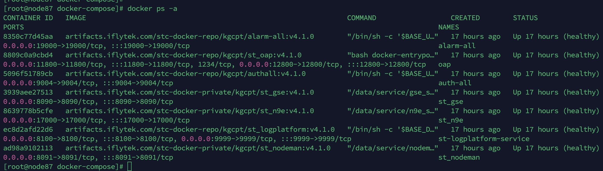

# 容器化部署应用
```
    说明：为了优化部署操作节约部署成本，我们对现有应用做了容器化编排。提供了docker-compose.yml、.env容器化脚本和环境变量配置文件。
```
## 容器化部署可观测平台步骤
    
### 安装docker环境
CentOS Docker 安装：（如果环境安装过docker 和dockercompose可以略过docker环境安装步骤）
如果你之前安装过 docker，请先删掉
```
    yum remove docker \
                  docker-client \
                  docker-client-latest \
                  docker-common \
                  docker-latest \
                  docker-latest-logrotate \
                  docker-logrotate \
                  docker-engine
```
安装依赖，下载 repo 文件，并把软件仓库地址替换为镜像站：
```
    yum install -y yum-utils
    yum-config-manager --add-repo https://download.docker.com/linux/centos/docker-ce.repo
    sed -i 's+https://download.docker.com+https://mirrors.tuna.tsinghua.edu.cn/docker-ce+' /etc/yum.repos.d/docker-ce.repo
```
最后安装：
```
    yum install docker-ce docker-ce-cli containerd.io docker-buildx-plugin docker-compose-plugin
```
安装成功后，启动 Docker 引擎：
```
    sudo systemctl start docker
```
如果希望 Docker 在系统启动时也启动可以使用以下命令：
```
    sudo systemctl enable --now docker
```
Docker 安装完默认未启动。并且已经创建好 docker 用户组，但该用户组下没有用户。
运行以下命令来验证安装是否成功：
```
[root@master docker-compose]# docker -v
Docker version 24.0.4, build 3713ee1
[root@master docker-compose]# docker compose version
Docker Compose version v2.17.2
```
### 修改docker-compose配置文件
从部署包获取docker-compose.yml 和.env环境配置文件。
获取到文件后在创建/data/docker-compose目录，将docker-compose.yml 和.env 文件上传到/data/docker-compose
```
mkdir /data/docker-compose
```
修改环境变量配置，请按照实际部署情况修改nacos 地址、账号、和相关应用的配置：
```
vim /data/docker-compose/.env #根据具体部署的情况修改相关配置
.env配置文件配置了可观测平台所有应用的环境变量，具体配置参数不在该文档详述、请参考各应用的部署文档关于环境变量的描述 
```
检查docker compose文件格式是否合规：
```
#检查文件格式
docker-compose config
```

创建挂载目录，挂载容器日志：
```
#创建挂载目录：
mkdir /data/docker-compose/auth-all/logs
mkdir /data/docker-compose/auth-all/config
mkdir /data/docker-compose/alarm-all/logs
mkdir /data/docker-compose/st-logplatform-service/logs
mkdir /data/docker-compose/st-n9e/logs
mkdir /data/docker-compose/st-nodeman/logs
mkdir /data/docker-compose/st-nodeman/download
mkdir /data/docker-compose/st-nodeman/plugins
mkdir /data/docker-compose/st-gse/logs
mkdir /data/docker-compose/st-gse/plugins
mkdir data/docker-compose/st-gse/download
mkdir /data/docker-compose/skywalking/logs
```
注意：如果环境已经部署过可观测平台且是物理节点部署，那么nodeman挂载目录必须是 
原来服务的download:/data/service/nodeman_service/download
原来服务的/plugins:/data/service/nodeman_service/plugins
### 启动容器前置条件
请确认告警系统、指标监控系统、日志系统、权限系统、调用链系统、采控系统的sql已完成初始化、相关nacos已经完成配置，若未做相关操作请先看考各个服务的部署文档将sql初始化并完成nacos配置


### 公司内网环境启动容器：
        
启动容器之前请先检查当前环境是否可以访问公司stc镜像仓库，如果网络不通，或者是私有化部署环境请联系可观测平台同事拉取应用镜像到本地，再上传至部署机器。

如果之前已经部署过星际可观测平台，请先确认已经关闭了星际可观测的服务防止端口冲突

启动容器：
```    
#登陆公司stc仓库
docker login artifacts.iflytek.com -u userName -p key
#执行docker-compose命令
docker compose up -d
#检查docker容器启动情况
docker ps -a
```
-u userName   请填写域账号
-p key 请填写质效平台的api key 一般情况下业务线同事的账号没有技术中心仓库权限，如果执行受阻，请联系可观测平台研发。
容器包括了 st_oap、st_logplatform、alarm-all、st_n9e、auth-all、st_gse、st_nodeman应用。
    
执行成功截图如下（容器STATUS状态为up ）：



### 私有化部署启动容器
联系可观测平台同事获取镜像地址和相关账号，并拉取镜像到本地：
```  
#拉取镜像
docker pull artifacts.iflytek.com/stc-docker-repo/kgcpt/auth-all:${版本号}
docker pull artifacts.iflytek.com/stc-docker-repo/kgcpt/st_oap:${版本号}
docker pull artifacts.iflytek.com/stc-docker-repo/kgcpt/alarm-all:${版本号}
docker pull artifacts.iflytek.com/stc-docker-repo/kgcpt/st_logplatform:${版本号}
docker pull artifacts.iflytek.com/stc-docker-repo/kgcpt/st_n9e:${版本号}
docker pull artifacts.iflytek.com/stc-docker-repo/kgcpt/st_gse:${版本号}
#镜像本地打包 （以auth-all服务为例）
docker save -o auth-all.tar artifacts.iflytek.com/stc-docker-repo/kgcpt/auth-all:${版本号}
#镜像文件上传 请将镜像文件上传到目标机器后执行以下命令： （以auth-all服务为例）
sha256sum auth-all.tar #校验jar包完整性
docker load -i auth-all.tar #load 镜像到本地
```  
修改docker-compose.yml 文件 server下的image 改为本地镜像（以auth-all服务为例）：
``` 
#tag image 格式为 <镜像名称>:<标签>，如 auth-all:local
docker tag <auth-all 的 MAGE ID >  auth:local
``` 
```
docker-compose.yml
services:
  auth-all:
    image: artifacts.iflytek.com/stc-docker-repo/kgcpt/auth-all:v4.0.9
    container_name: auth-all
 #改为
 services:
  auth-all:
    image: auth-all:local
    container_name: auth-all   
```
启动容器：
```
#执行docker-compose命令（在/data/docker-compose目录下 也就是docker-compose.yml 所在目录）
docker-compose up -d
#检查docker容器启动情况
docker ps -a
```
### 停止容器
停止由docker-compose创建的镜像
docker compose down