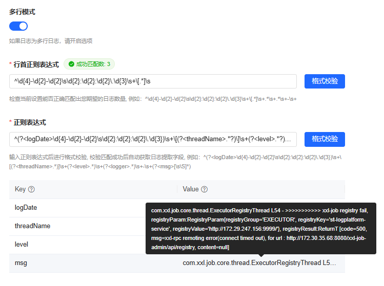
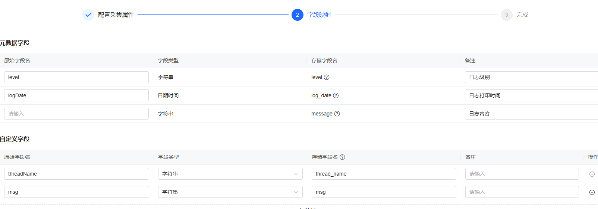
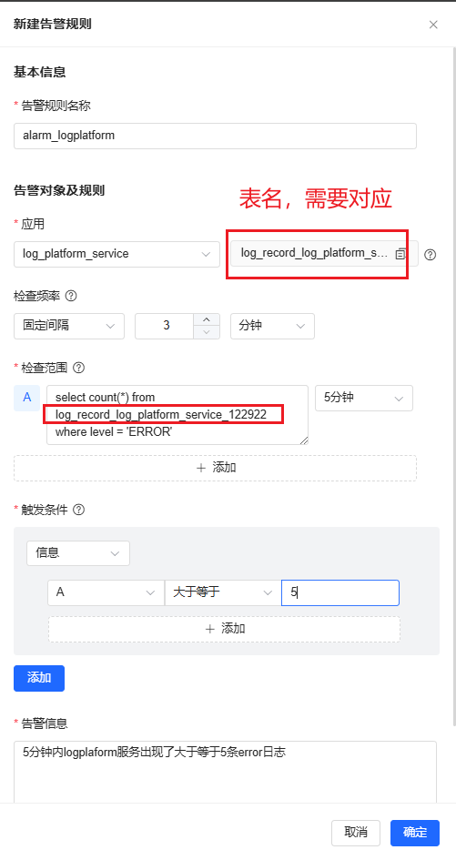

# 日志系统部署

## 组件依赖版本
请参照中间件部署文档, 分别部署如下依赖的组件

| 名称                     | 版本       | 简介     |                                                           |
|------------------------|----------|--------|-----------------------------------------------------------|
| jdk                    | java8    |        |                                                           |
| nacos                  | 2.2.3    |        |                                                           |
| Doris                  | 2.1.6    |        | [https://doris.apache.org/](https://doris.apache.org/)    |
| Kafka                  | 2.8.2    |        |                                                           |
| Zookeeper              | 3.8.1    |        |                                                           |
| vector                 | 0.34.1.2 | 日志采集插件 | 可通过`[环境配置]`菜单进行在线安装日志采集插件, 无法在线安装的环境参考下方的`Vector离线手动部署`文档 |
| auth-all               | 自构建      | 权限系统   |                                                           |
| st-logplatform-service | 自构建      | 日志后端服务 |                                                           |

## 日志后台服务部署

部署目录`/data/service/ `

### 解压st-logplatform-service.zip

```
cd /data/service/
unzip st-logplatform-service.zip
```

### 修改config/bootstrap-startrace.yml

如果当前部署环境部署Nacos则使用Nacos作为配置中心, 需要修改`bootstrap-startrace.yml`文件，需要修改`st-log-platform.nacos` 下面的配置, 修改为当前环境的Nacos配置信息

```yaml
st-log-platform:
  nacos:
    server-addr: ${CONFIG_NACOS_SERVER_ADDR:127.0.0.1:8848}
    username: ${CONFIG_NACOS_USERNAME:nacos}
    password: ${CONFIG_NACOS_PASSWORD:nacos}
    config-namespace: ${CONFIG_NACOS_NAMESPACE:st-observable}
    discovery-namespace: ${CONFIG_NACOS_NAMESPACE:st-observable}
    group: ${LOG_NACOS_SERVER_GROUP:ST-LOG-PLATFORM}

spring:
  application:
    name: st-logplatform-service
  cloud:
    nacos:
      config:
        server-addr: ${st-log-platform.nacos.server-addr}
        username: ${st-log-platform.nacos.username}
        password: ${st-log-platform.nacos.password}
        namespace: ${st-log-platform.nacos.config-namespace}
        group: ${st-log-platform.nacos.group}
        file-extension: yml
        refresh-enabled: true
        enabled: true  # 开启/关闭使用配置中心配置
        extension-configs:
          - data-id: config-custom.yml
            group: ${st-log-platform.nacos.group}
          - data-id: application-startrace.yml
            group: ${st-log-platform.nacos.group}
      discovery:
        server-addr: ${st-log-platform.nacos.server-addr}
        username: ${st-log-platform.nacos.username}
        password: ${st-log-platform.nacos.password}
        namespace: ${st-log-platform.nacos.discovery-namespace}
        enabled: true   # 开启/关闭使用注册中心
```

### 配置修改

1. 在nacos上新建命名空间为st-observable（如已存在，忽略此步骤）
2. 编辑本地配置文件`config-custom.yml`和`application-startrace.yml`


`config-custom.yml`：此文件内容主要放置常用部署修改内容

```yaml
st-log-platform:
  config:
    db:
      url: 127.0.0.1 #doris数据库FE服务器ip
      username: root # doris数据库用户
      password: 80iARbu3nPK6UxzT6zBe # doris数据库用户密码
    kafka:
      bootstrap-servers: 127.0.0.1:9092 # kafka部署地址，多个以逗号(,)隔开
    xxl-job:
      admin-server-ip: 127.0.0.1 # xxl-job调度中心部署地址
    grafana:
      url: http://127.0.0.1:3000/d/ffb8ddd6-f2c9-4f6c-9e8d-8352cc99a798/nginxe9809a-e794a8-e5a4a7-e79b98?orgId=1  # Grafana Nginx仪表盘地址
    elasticsearch:
      uris: 127.0.0.1:9200 #elasticsearch集群地址，多个以逗号(,)隔开
      username: elastic
      password: 80iARbu3nPK6UxzT6zBe
```

`application-startrace.yml`：除以下情况除外，此配置文件一般不需要修改

● 配置中xxl-job默认端口号是8080，如果部署xxl-job时不是8080，请修改sop.xxl-job.admin.addresses中端口号

● 请注意保持st-log-platform.config.xxl-job.accessToken值，与部署xxl-job时设置的accessToken值保持一致(默认部署为一致)

● st-log-platform.config.kafka.log-record-topic配置为线上接入日志时，采集日志上报的topic，只能填一个值

● st-log-platform.config.kafka.consumer.topics-to-listen为消费的topic，可以是多个以逗号','隔开，上面st-log-platform.config.kafka.log-record-topic中配置的topic，在这里不用再配

```yaml
st-log-platform:
  config:
    kafka:
      log-record-topic: log_record_topic # 日志记录使用的Topic
      consumer:
        topics-to-listen: # kafka消费topic, 默认会消费log-record-topic, 在这里可以添加额外需要消费的Topic
    xxl-job:
      enabled: true # 是否启用xxl-job
      accessToken: aafb230a-1bef-411d-8853-5f3d4edebb95 # 执行器的通信令牌，非空时启用
    storage:
      type: doris
    stack-error:
      type: regex # 错误堆栈信息解析方式
  auth-enable: true # 是否开启权限认证
  deploy-job-enable: true
  deploy-alarm-platform: true # 是否部署了统一告警平台
  alarm:
    alarm-server: alarm-all # 告警平台服务地址
    alarm-server-path: alarm # 告警平台服务Http请求前缀
    send-alarm:
      core-pool-size: 1
      max-pool-size: 2
  access:
    vector-kafka-bootstrap-servers: ${spring.kafka.bootstrap-servers}
    vector-topic: ${st-log-platform.config.kafka.log-record-topic} # vector写入的kafka topic
  http-server:
    thread-pool:
      core-pool-size: 5
      max-pool-size: 10
      queue-capacity-size: 5000


server:
  port: 8100
  servlet:
    context-path: /log-platform

spring:
  datasource:
    driver-class-name: com.mysql.cj.jdbc.Driver
    url: jdbc:mysql://${st-log-platform.config.db.url}:9030/log_platform?characterEncoding=utf-8&useSSL=false&serverTimezone=Asia/Shanghai
    username: ${st-log-platform.config.db.username}
    password: ${st-log-platform.config.db.password}
    hikari:
      maximum-pool-size: 60  # 最大连接数，默认值10
      minimum-idle: 10  # 最小空闲连接数，默认值10
      connection-timeout: 60000 # 连接超时时间（毫秒），默认值60000（30秒）
      idle-timeout: 600000  # 空闲连接超时时间，默认值600000（10分钟）
      max-lifetime: 3600000 # 连接最大存活时间，默认值1800000（30分钟）
      connection-test-query: select 1 # 连接测试查询
  jackson:
    date-format: yyyy-MM-dd HH:mm:ss.SSS
    time-zone: GMT+8
  kafka:
    bootstrap-servers: ${st-log-platform.config.kafka.bootstrap-servers}
    listener:
      concurrency: 1
    consumer:
      enable-auto-commit: false
      key-deserializer: org.apache.kafka.common.serialization.StringDeserializer
      value-deserializer: org.apache.kafka.common.serialization.StringDeserializer
      auto-offset-reset: latest
      max-poll-records: 500
      fetch-max-bytes: 52428800
      max-partition-fetch-bytes: 10485760
      fetch-max-wait-ms: 3000
      fetch-min-bytes: 10485760
      group-id: log-consumer
      topics-to-listen: ${st-log-platform.config.kafka.log-record-topic},${st-log-platform.config.kafka.consumer.topics-to-listen}
    producer:
      key-serializer: org.apache.kafka.common.serialization.StringSerializer
      value-serializer: org.apache.kafka.common.serialization.StringSerializer
      batch-size: 163840  # single request 批处理大小（以字节为单位），默认16KB = 16384
      properties.linger.ms: 500
  elasticsearch:
    uris: ${st-log-platform.config.elasticsearch.uris}
  config:
    import: config-custom.yml

#健康自测
management:
  endpoints:
    enabled-by-default: false
  endpoint:
    health:
      enabled: true
  health:
    elasticsearch:
      enabled: false #关闭es健康自测，防止doris启动报错

mybatis-plus:
  global-config:
    enable-sql-runner: true
  configuration:
    map-underscore-to-camel-case: false
    call-setters-on-nulls: true
    #log-impl: org.apache.ibatis.logging.stdout.StdOutImpl #开启sql日志, 生产环境关闭

# xxl-job配置
sop:
  xxl-job:
    enabled: ${st-log-platform.config.xxl-job.enabled}
    admin:
      addresses: http://${st-log-platform.config.xxl-job.admin-server-ip}:8080/xxl-job-admin # 调度中心部署地址-如调度中心集群部署存在多个地址则用逗号分隔
    accessToken: ${st-log-platform.config.xxl-job.accessToken} # 执行器的通信令牌，非空时启用
    executor:
      appname: ${spring.application.name} # 与xxl-job-admin配置的appname一致
      address:
      ip:  # 执行器的IP地址，执行器IP默认为空，表示自动获取IP
      port: 9999  # 执行器的端口号，默认值为9999
      logpath: logs/xxljob
      logretentiondays: 7

doris:
  stream-load:
    datasource:
      host: ${st-log-platform.config.db.url}
      port: 8030
      database: log_platform
      user: ${st-log-platform.config.db.username}
      password: ${st-log-platform.config.db.password}
    data:
      dir: /data/public/st-logplatform-service/log-data-file/
      fail-file-keep-hour: 48
      fail-file-clear-cron: 0 0 2 * * ?
      merge:
        core-pool-size: 1
        max-pool-size: 1
        concurrent-operator-count: 1
        max-size-mb: 70
        max-wait-second: 60
    send:
      async-enable: true  #是否启用异步导入
      max-filter-ratio: 0  # 最大容忍可过滤（数据不规范等原因）的数据比例,取值范围是0~1,例如:0.1
      core-pool-size: 2
      max-pool-size: 2
      load-to-single-tablet: true
    retry:
      core-pool-size: 1
      max-pool-size: 1
      fail-send-cron: 0 0 */1 * * ?  #doris-stream-load失败重试定时cron

es:
  storage-async:
    # 收集kafka后合并数据的线程池配置
    collect-merge:
      core-pool-size: 1
      max-pool-size: 2
      pool-queue-size: 100 # 线程池阻塞队列大小
      blocking-queue-capacity: 100 # 消费kafka数据的阻塞队列大小
      max-wait-time-seconds: 60 # 攒批超时发送等待时间
      batch-list-size: 100 # 攒批数量大小，单位：条
    # 发送es数据的线程池配置
    send:
      core-pool-size: 1
      max-pool-size: 2
      pool-queue-size: 100 # 线程池阻塞队列大小
      blocking-queue-capacity: 100 # 发送任务阻塞队列的大小
```

### 启动服务

```bash
./run.sh start
```

### 请求安装部署接口

提供服务安装接口，请求后自动创建基础数据库表，推送配置到nacos，使用说明：

1. 需预先创建好log_platform数据库

2. 修改好本地`bootstrap-startrace.yml`、`config-custom.yml`和`application-startrace.yml`配置文件

3. 请求install接口
    ```
    #请求命令
    curl http://127.0.0.1:8100/log-platform/upgrade/install
    
    #请求返回
    {"success":true,"data":"安装初始化4.1.1成功","errorCode":null,"errorMessage":null}
    ```
4. 请求install接口成功后，再重启服务

## 日志服务自动挂起

为了在生产环境下，提升日志服务的可靠性和稳定，确保业务的连续性，实现日志服务的自动拉起，采用 `supervisord` 实现日志服务的自动拉起：

### 安装和配置supervisord

使用 yum 方式安装 supervisord：

````shell
# 安装 EPEL 仓库
sudo yum install epel-release
# 更新仓库缓存
sudo yum update
# 安装 supervisord
sudo yum install -y supervisor
````

在安装完 `supervisor` 后，修改配置文件（`/etc/supervisord.conf`）中的 `minfds` 和 `minprocs` 参数，增加 `supervisord` 所能管理的文件描述符和进程数的上限，确保在高并发、高负载的环境中，`supervisor` 可以正常运行而不出现资源瓶颈：

````shell
vim /etc/supervisord.conf
````

````conf
# 在[supervisord]中修改以下配置
minfds=655350                 ;
minprocs=65535                ;

[include]
;files = relative/directory/*.ini
files = /etc/supervisord.d/*.ini
````

安装完成后，`supervisord` 需要启动并设置为开机自启：

````shell
# 开机自启动
systemctl enable supervisord
# 启动 supervisord 服务
systemctl start supervisord
# 查看 supervisord 服务状态
systemctl status supervisord
# 查看是否存在 supervisord 进程
ps -ef | grep supervisord
````

### 实现服务自动拉起

在 `/etc/supervisord.d/` 目录下，新建关于日志服务的配置文件名为 `logplatform.ini` ，内容如下：

````ini
[program:logplatform]
# 需要修改为日志服务的路径
command=/bin/sh /data/service/st-logplatform-service/run.sh start
directory=/data/service/st-logplatform-service
autostart=false
autorestart=true
startsecs=10
startretries=3
user=root
# 配置好存放日志的路径
stdout_logfile=/data/service/st-logplatform-service/logs/logplatform.out
stderr_logfile=/data/service/st-logplatform-service/logs/logplatform.err
# 需要改为服务器的Java环境地址，使用 echo $JAVA_HOME 命令
environment=JAVA_HOME="/data/package/jdk1.8.0_151",PATH="/data/package/jdk1.8.0_151/bin:/usr/bin:/bin"
````

在 `/etc/supervisord.d/` 目录下，给文件可执行权限：

````shell
chmod +x logplatform.ini
````

修改日志service的启动脚本 `run.sh` ：

````shell
#!/bin/sh
BASE_DIR=`cd $(dirname $0); pwd`
APP_NAME="st-logplatform-service"

if [ -f "$BASE_DIR/VERSION" ]; then
  SERVER_JAR=`cat $BASE_DIR/VERSION`
else
  echo "no VERSION file found"
  exit 1
fi

# 如果环境变量 JAVA_OPT 已设置，使用传入的；否则使用默认值
if [ -z "$JAVA_OPT" ]; then
  JAVA_OPT="-server -Xms2048m -Xmx2048m -Xmn1024m -XX:MetaspaceSize=512m -XX:MaxMetaspaceSize=512m"
fi

# 追加更多的 JVM 配置
JAVA_OPT="${JAVA_OPT} -XX:-OmitStackTraceInFastThrow -XX:+HeapDumpOnOutOfMemoryError -XX:HeapDumpPath=${BASE_DIR}/logs/heapdump.hprof"
JAVA_OPT="${JAVA_OPT} -Xloggc:${BASE_DIR}/logs/gc.log -verbose:gc -XX:+PrintGCDetails -XX:+PrintGCDateStamps -XX:+PrintGCTimeStamps -XX:+UseGCLogFileRotation -XX:NumberOfGCLogFiles=3 -XX:GCLogFileSize=1M"
JAVA_OPT="${JAVA_OPT} -Dlog4j2.formatMsgNoLookups=true"
JAVA_OPT="${JAVA_OPT} -Dspring.profiles.active=startrace"
JAVA_OPT="${JAVA_OPT} -DAPPLICATION=st-logplatform-service"


if [ "$1" = "start" ]; then
  java ${JAVA_OPT} -jar ${BASE_DIR}/${SERVER_JAR}
  echo "${APP_NAME} is starting"
elif [ "$1" = "stop" ]; then
  pid=`ps -ef | grep ${SERVER_JAR} | grep java | grep -v grep | awk '{print $2}'`
  if [ -z "$pid" ] ; then
    echo "no ${APP_NAME} running."
    exit 1;
  fi
  kill ${pid}
  echo "shut down ${APP_NAME} (${pid}) "
else
  echo "please use (sh run.sh start) or (sh run.sh stop)"
fi

````

配置完成后，重新加载 `supervisord` 配置，先停止原有的日志服务，使用supervisor启动服务：

````shell
# 重新加载 supervisor 配置
sudo supervisorctl reread
sudo supervisorctl update

# 启动服务
sudo supervisorctl start logplatform
# 查看supervisor是否正确监听到了日志服务
supervisorctl status
# 查看日志信息
tail -f /var/log/supervisor/supervisord.log
````

### 模拟服务崩溃

检查是否能够正确实现服务的自动挂起，直接杀死服务：

````shell
ps -ef | grep logplatform
kill -9 pid
````

然后在 `/data/service/st-logplatform-service/logs/logplatform.err` 日志中会生成记录：

````shell
/data/service/st-logplatform-service/run.sh: line 38: 836192 Killed                  java ${JAVA_OPT} -jar ${BASE_DIR}/${SERVER_JAR}
````

并且查看服务进程，会重新生成日志service服务，成功实现了日志服务的自动挂起。

## 日志服务告警配置

在平台中接入 `st-logplatform-service` 的日志，便于可视化观察错误信息，并配置告警机制，保能够及时发现并处理服务异常。

### st-logplatform-service的日志接入

首先，在可观测平台中，选择好合适的空间和业务组的数据单元后，新建应用 `log_platform_service` 。

在 日志接入 模块，建议使用在线接入，完成 `st-logplatform-service` 的日志接入。选择好应用和主机（`st-logplatform-service` 所在的主机地址），使用正则表达式接入。 
需要配置的内容如下：

- st-logplatform-service 的日志路径：/data/service/st-logplatform-service/logs/log-platform-service.log
- 日志样例：
   ```
   2025-01-08 00:02:03.928 [xxl-job, executor ExecutorRegistryThread] INFO com.xxl.job.core.thread.ExecutorRegistryThread L54 - >>>>>>>>>>> xxl-job registry fail, registryParam:RegistryParam{registryGroup='EXECUTOR', registryKey='st-logplatform-service', registryValue='http://172.29.247.156:9999/'}, registryResult:ReturnT [code=500, msg=xxl-rpc remoting error(connect timed out), for url : http://172.30.35.68:8080/xxl-job-admin/api/registry, content=null] 
   2025-01-08 00:02:36.932 [xxl-job, executor ExecutorRegistryThread] ERROR com.xxl.job.core.util.XxlJobRemotingUtil L139 - connect timed out 
   java.net.SocketTimeoutException: connect timed out
       at java.net.PlainSocketImpl.socketConnect(Native Method)
       at java.net.AbstractPlainSocketImpl.doConnect(AbstractPlainSocketImpl.java:350)
       at java.net.AbstractPlainSocketImpl.connectToAddress(AbstractPlainSocketImpl.java:206)
       at java.lang.Thread.run(Thread.java:748)
   2025-01-08 00:02:36.932 [xxl-job, executor ExecutorRegistryThread] INFO com.xxl.job.core.thread.ExecutorRegistryThread L54 - >>>>>>>>>>> xxl-job registry fail, registryParam:RegistryParam{registryGroup='EXECUTOR', registryKey='st-logplatform-service', registryValue='http://172.29.247.156:9999/'}, registryResult:ReturnT [code=500, msg=xxl-rpc remoting error(connect timed out), for url : http://172.30.35.68:8080/xxl-job-admin/api/registry, content=null] 
   ```
- 开启多行模式，行首正则表达式：
   ```
   ^\d{4}-\d{2}-\d{2}\s\d{2}:\d{2}:\d{2}\.\d{3}\s+\[.*]\s
   ```
- 正则表达式：
   ```
   ^(?<logDate>\d{4}-\d{2}-\d{2}\s\d{2}:\d{2}:\d{2}\.\d{3})\s+\[(?<threadName>.*?)\]\s+(?<level>.*?)\s+(?<msg>(.|\n)*)
   ```

校验行首正则表达式和正则表达式的结果为：



下一步，配置字段映射：



即可完成日志接入。

### 告警配置

接入日志后，首先完成告警规则的配置。以检查频率为 3 分钟，检查范围为 5 分钟，出现了超过 5 条 error 日志就需要告警为例：

在日志告警的日志告警规则中新建告警规则如下：



查询语句如下，注意表名：

````sql
select count() from tableName where level = 'ERROR'
````

启动告警规则，即成功实现告警规则的配置。

若需实现告警信息的通知下发，需要在智能告警服务完成相应的配置，详细内容参考：[告警概览操作文档](../guide/告警概览操作文档.md) 

## Vector离线手动部署

日志采集插件, 如已经通过`[星迹平台]-[环境配置]-[插件管理]` 菜单自动部署则无需执行此步骤

无法自动部署的环境, 可以通过如下文档进行离线手动部署，部署目录为 `/data/public/ `：

1. 安装包下载

在发布产物的 `01_发布包/01_X86架构的包/02_服务部署包/客户端安装包及插件` 或  `01_发布包/02_ARM架构的包/02_服务部署包/客户端安装包及插件` 目录下

根据服务器类型选择对应安装包，名为 `st_vector_linux_amd64_0.34.1.2.zip` 或 `st_vector_linux_arm64_0.34.1.2.zip`

2. 解压安装包

````shell
# 解压X86架构的包
tar -xzvf st_vector_linux_amd64_0.34.1.2.zip
# 解压ARM架构的包
tar -xzvf st_vector_linux_arm64_0.34.1.2.zip
````

3. 启动vector

编辑对应的 `vector.json` 配置文件(vector.json文件内容可以从`[数据接入]-[日志接入]`菜单的`查看配置`功能获取)

修改好vector的配置文件后，进入解压后的文件夹，用以下命令启动vector：

```shell
sh ./start.sh
```

## vector部署(k8s DaemonSet)
Kubernetes环境使用, 通过DaemonSet方式在每台物理机上部署日志采集

-  创建vector-config.yaml
   注意配置内容要按照项目自身清空修改路径和解析配置
```yaml
kind: ConfigMap
apiVersion: v1
metadata:
  name: vector-config
  namespace: stc-observable
data:
  vector.toml: |
    data_dir = "/data/public/vector/data_dir"
    
    [sources.moss]
    type = "file"
    include = [ "/data/observable/logs/*/*/logs/*.log" ]
      [sources.moss.multiline]
        start_pattern = '^\d{4}-\d{2}-\d{2}\s\d{2}:\d{2}:\d{2}\.\d{3}\s+\[.*\]\s+\[TID:.*\]\s'
        mode = "halt_before"
        condition_pattern = '^\d{4}-\d{2}-\d{2}\s\d{2}:\d{2}:\d{2}\.\d{3}\s+\[.*\]\s+\[TID:.*\]\s'
        timeout_ms = 3000
    
    [transforms.parse_moss]
    type = "remap"
    inputs = ["moss"]
    # 将message字段通过正则匹配出时间、线程名、级别、类名和日志内容，并将applicationCode字段添加到message字段中，最后输出message为json格式
    source = '''
      . |= parse_regex!(.message, r'^(?P<log_date>\d{4}-\d{2}-\d{2}\s\d{2}:\d{2}:\d{2}\.\d{3})\s+\[(?P<thread_name>.*)\]\s+\[TID:(?P<tid>.*)\]\s+(?P<level>[A-Z]+)\s+(?P<logger>.*)\s-\s(?P<msg>[\s\S]*)')
      .my_str_contact, err = (.file) + "-"  + (.host)
      .message.source = md5(.my_str_contact)
      .message.dateTime = to_unix_timestamp(parse_timestamp!(.log_date, format: "%Y-%m-%d %H:%M:%S.%3f"), unit: "nanoseconds")
      .message.threadName = (.thread_name)
      .message.level = (.level)
      .message.logger = (.logger)
      .message.message = (.msg)
      .message.traceId = (.tid)
      pathsArray, err = split(.file, "/")
      .message.applicationCode = replace(to_string(pathsArray[5]), "-", "_")
    '''
    
    # 日志输出，将日志内容输出到kafka集群
    [sinks.kafka_cluster] 
    type = "kafka"
    inputs = ["parse_moss"] 
    bootstrap_servers = "node1:9092,node2:9092,node3:9092"
    topic = "sop-log-topic" 
    encoding.codec = "text"
    batch.max_bytes = 10485760
    batch.max_events = 10000
    batch.timeout_secs = 1
    buffer.max_size = 268435488
    buffer.type = "disk"
    buffer.when_full = "block"
```

执行命令：kubectl apply -f vector-config.yaml

-  创建vector-daemonset.yaml
   注意vector-data-dir和datalogspath的磁盘挂载和映射
```yaml
apiVersion: apps/v1
kind: DaemonSet
metadata:
  name: vector
  namespace: stc-observable
spec:
  selector:
    matchLabels:
      name: vector
  template:
    metadata:
      labels:
        name: vector
    spec:
      serviceAccount: default
      containers:
      - name: vector-container
        image: timberio/vector:0.35.0-debian
        env:
          - name: VECTOR_CONFIG_TOML
            value: /etc/vector/vector.toml
        volumeMounts:
          - name: vector-config
            mountPath: /etc/vector
          - name: vector-data-dir
            mountPath: /data/public/vector/data_dir
          # 业务日志目录映射
          - name: datalogspath
            mountPath: /data/observable/logs
            readOnly: true
      volumes:
        - name: datalogspath
          hostPath:
            path: /data/observable/logs
        - name: vector-config
          configMap:
            name: vector-config
        - name: vector-data-dir
          hostPath:
            path: /data/public/vector/data_dir
```

执行命令：kubectl apply -f vector-daemonset.yaml