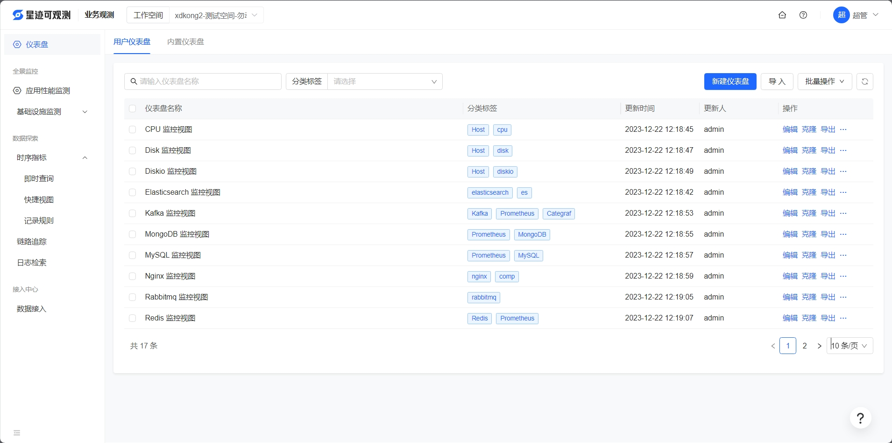
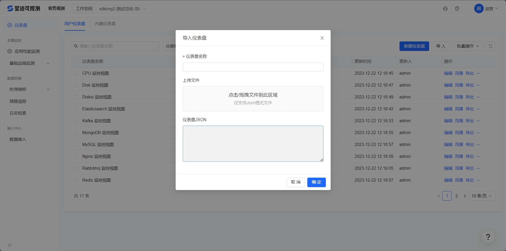
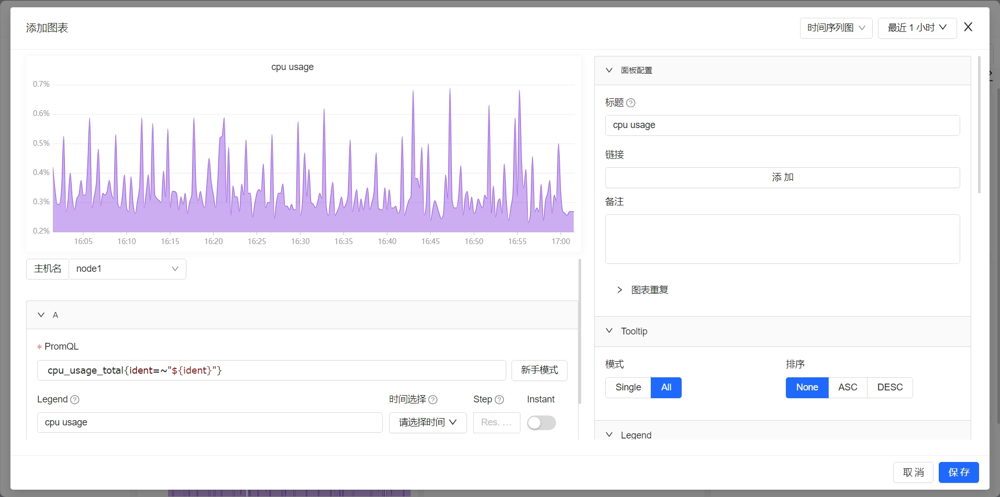
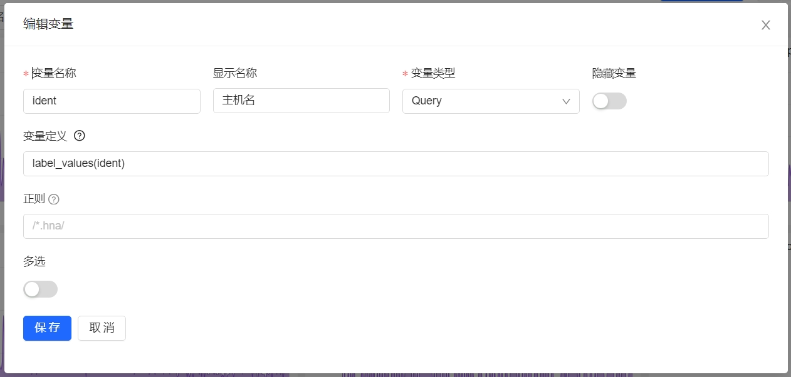

# 仪表盘

可观测的仪表盘可以对接兼容 promethues 协议的时序库。支持了 时间序列图、指标值、表格、饼图、蜂窝图、排行榜、文字卡片、仪表盘、内嵌文档等多种图表。

### 创建仪表盘的方式

1. 通过内置仪表盘创建自己的仪表盘(推荐)
2. 手动新增空白的仪表盘(需要一定的学习成本)
3. 导入提前疏理好的仪表盘(支持grafana的大盘模板)

点击业务观测的仪表盘进入仪表盘列表页，点击右上角(或指引中)的新增仪表盘按钮，可以按照自己的需求，创建仪表盘。

### 导入仪表盘

如果想配置业界常用的基础组件的仪表盘，但没有思路，可以点击右上角的，更多操作，点击批量导入，导入提前梳理好的仪表盘模板，仪表盘模板，可以点击 仪表盘-内置仪表盘 菜单找到，如下图

### 图表配置

本小节对仪表盘的功能进行详细介绍，这里以时序值为例，介绍下图表是否配置。创建好一个仪表盘之后，进去仪表盘编辑页面，点击右上角的 添加图标 按钮，弹出图表编辑视图，如下图

图表配置主要分三个区域，左上是预览图区域，展示了图表配置的最终效果，左下是数据筛选区，可以设置展示哪些数据，右边是图表的各种样式配置

左下是**数据筛选部分**：

夜莺的仪表盘也支持配置变量，如果仪表盘配置了变量，可以写 promql 时使用 $+变量名 的方式配置，这样后续再查询大盘的时候，可以通过切换变量快速查看不同对象的多个监控图表

右边是**样式配置参数**：

- 标题：每个图表可以配置一个标题，方便更直观地知道图表的用途
- 链接：有的场景我们可以先配置一个总览的图表，比如某个应用的健康度，当健康度异常时，点击点击这里配置的链接，进入另一个仪表盘，查看更详细的信息
- 备注：对图表更详细的说明
- Tooltip 模式: 设置为 Single 时，鼠标移动到图表上时显示单个图例，All 时显示全部的图例
- Legand: 图例展示设置，提供了表格、列表、隐藏三种
- 图表样式：可以配置折线图、柱状图、颜色是否渐变、是否堆叠、透明度、曲线宽度等
- 高级配置：可以配置Y轴的上界和下界、数值的单位等
- 阈值：可以在Y轴的某个位置标记红线阈值

### 大盘变量

大盘变量是夜莺仪表板中的一种动态元素，通过使用大盘变量，用户可以根据所选变量值快速查看和比较数据，增加仪表板的灵活性和易维护性。

举个具体的例子，当我们需要配置多个 MySQL 实例的仪表盘时，通过创建一个查询变量，从数据源中获取所有可用的 MySQL 实例名称。我们可以在仪表板中轻松选择所需实例，查看其性能指标、资源使用情况等。例如，使用以下 PromQL 查询作为变量来源：label_values(mysql_global_status_threads_connected, instance) ，可以把 instance 作为变量，在仪表板中，用户可以根据 instance（实例名称）快速切换，查看每个实例的连接数、查询速率、缓冲池使用情况等指标。

