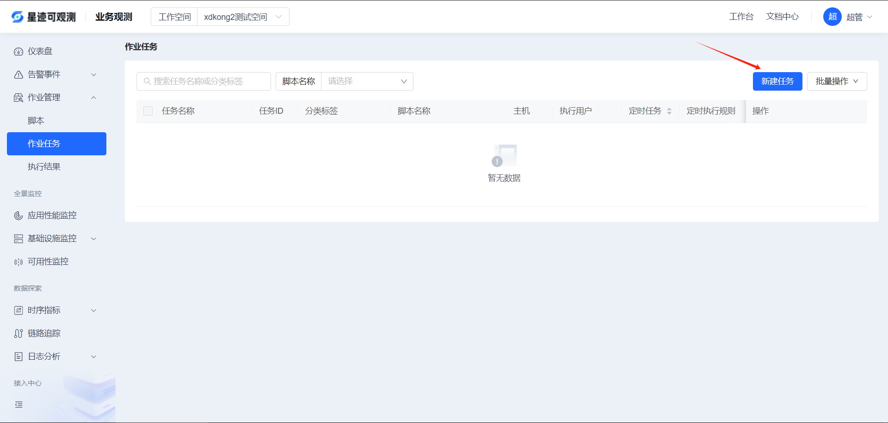
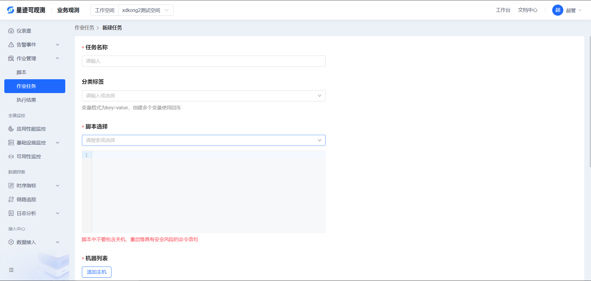
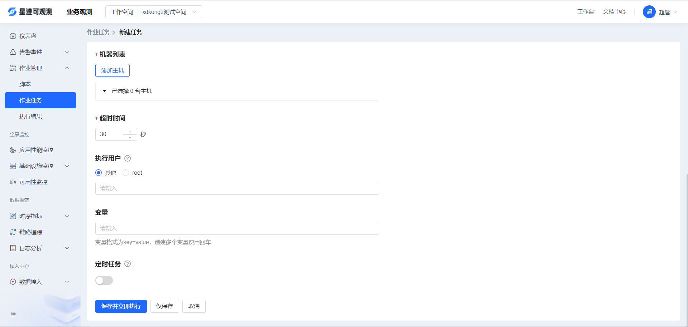
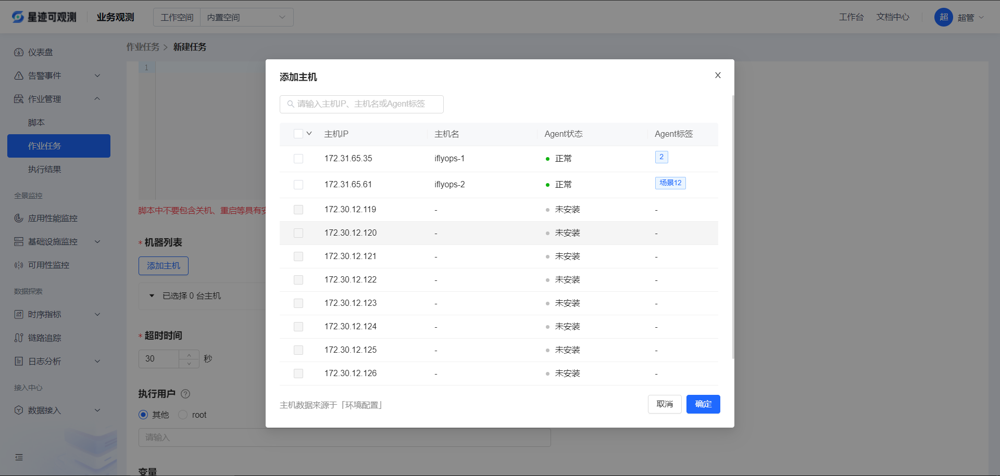
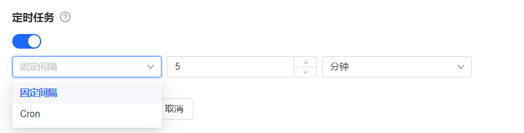
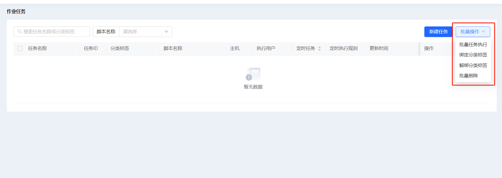
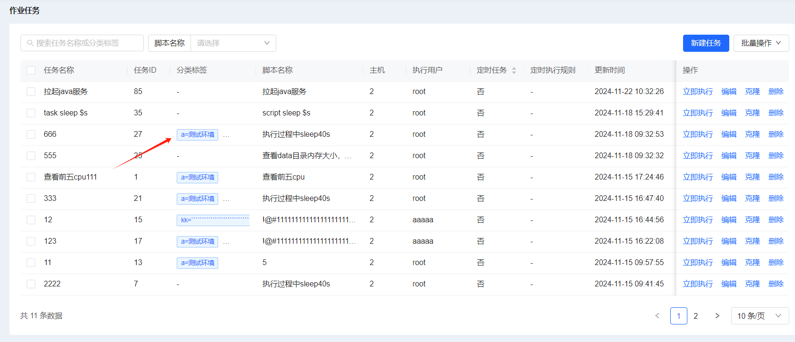
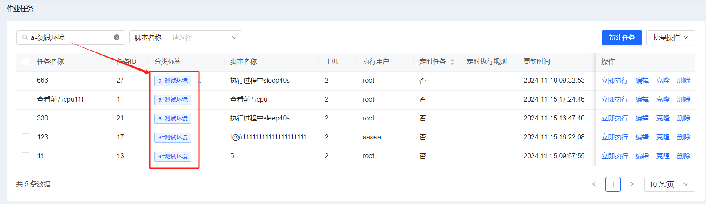
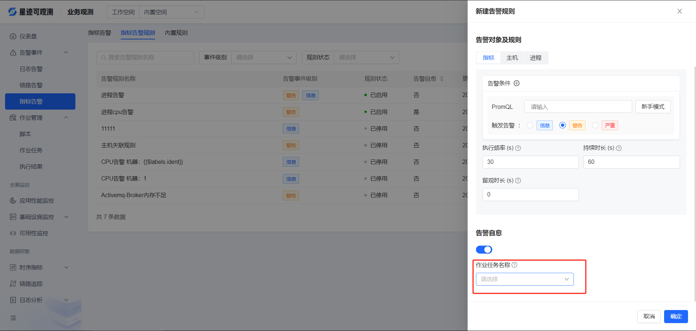

# 作业任务

作业任务是(Job)是一套基于管控平台Agent管道之上，提供基础操作的源自平台；具备上千台并发处理能力，除了支持脚本执行、定时任务等一系列基础运维场景，每个任务都可作为一个原子节点，提供给上层或周边系统/平台使用，例如告警自愈等，实现调度自动化。

作业任务的产生，必须先创建作业脚本，而作业任务的创建有两种方式：

1、进入平台后，打开**业务观测 > 作业管理 > 作业任务**

2、填写任务名称、分类标签、超时时间、执行用户和变量，选择脚本和执行机器

2.1 选择执行机器时，只能选择在线的机器；支持单页全选和所有页全选

2.2 定时任务需要指定执行间隔，或者cron表达式

    
2.3 定时任务编辑完成后支持“保存并立即执行”和“仅保存”

3、作业任务支持“立即执行”、“编辑”、“克隆”、“删除”的操作，以及“批量任务执行”、“批量删除”、“绑定分类标签”、“删除分类标签”的批量操作

3.1 立即执行会将任务下发到选择的指定机器中的agent中执行

3.2 编辑可以修改作业任务中内容

3.3 克隆可以快速创建相似的作业任务

3.4 删除可以删除不再使用的作业任务

3.5 批量执行任务可以选择多个任务快速执行

3.6 批量删除可以删除多个作业任务

3.7 绑定/删除分类标签，分类标签可以分类且支持快速筛选作业任务

点击标签实现快速筛选

4、告警规则中可以选择作业任务实现告警自愈的功能，告警规则触发时会调用指定的作业任务，在触发告警规则的机器中执行(原任务中的机器不再执行)

