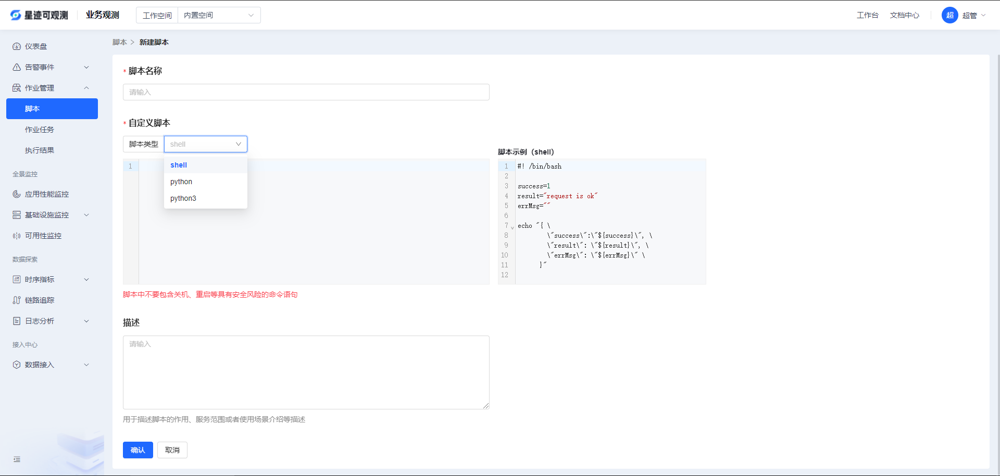
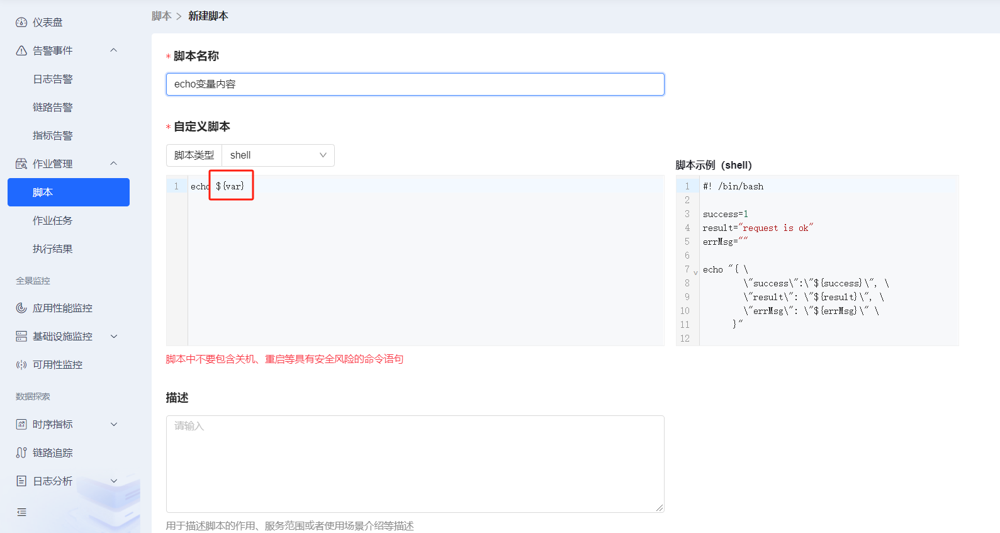
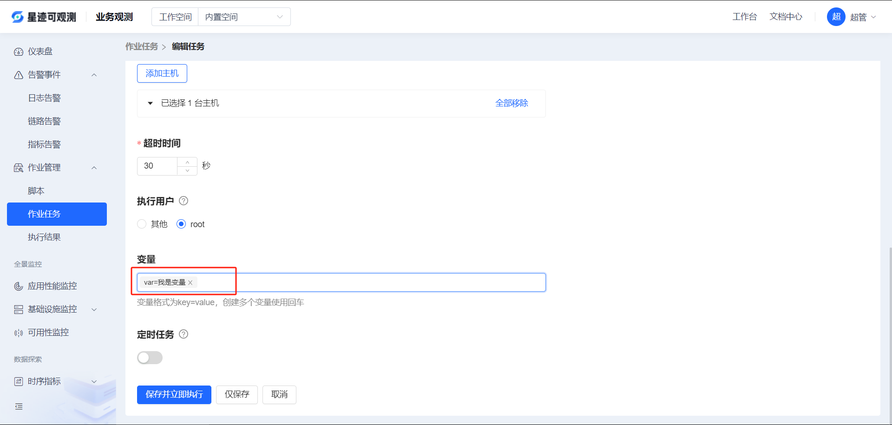
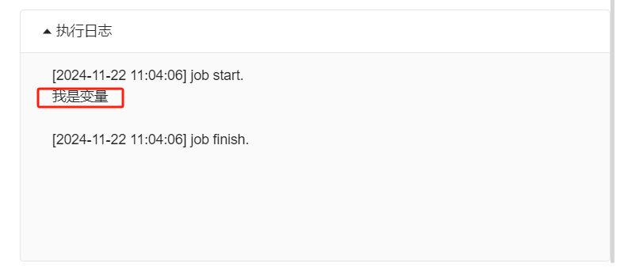

# 作业脚本

1、进入平台后，打开**业务观测 > 作业管理 > 脚本**

2、新建脚本

2.1 如上图所示点击“新建脚本”按钮，进入新建页面
    
2.2 选择脚本类型，填写脚本名称、内容和描述，最后点击“确认”按钮保存

2.3 作业脚本支持环境变量

2.3.1 脚本中使用${}包含变量

2.3.2 在作业任务中指定环境变量的值可以动态替换变量

2.3.3 执行结果

> 脚本内容不要包含关机、重启等具有安全风险的命令语句
