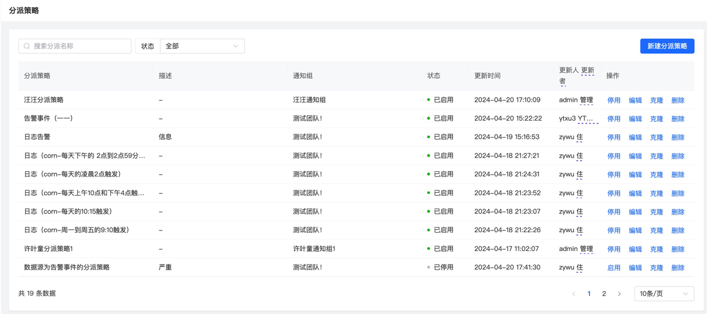
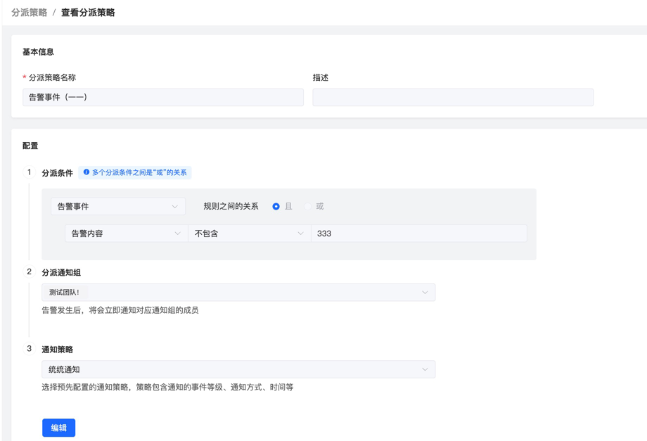
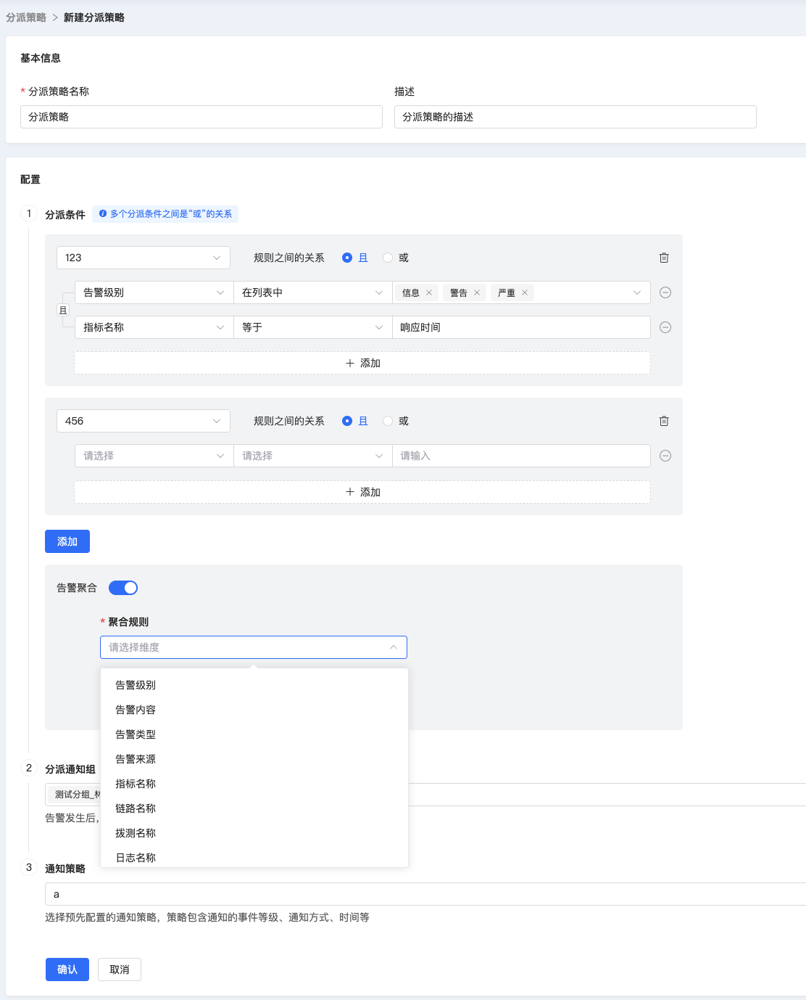
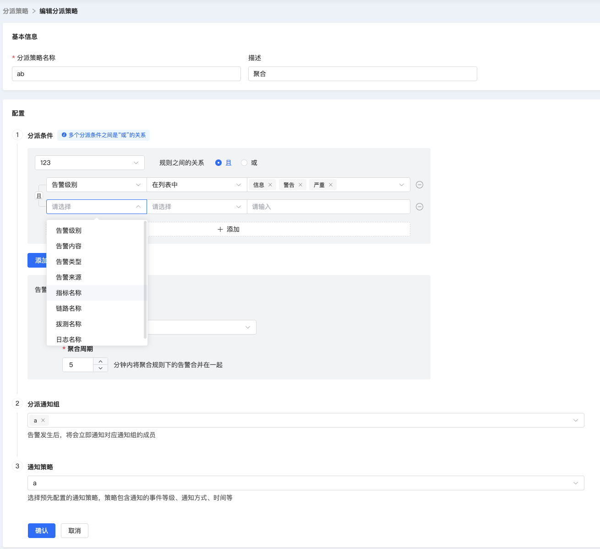

# 分派策略

分派策略定义了针对告警事件的分派条件和聚合条件，还有分派时所采用的通知策略，以及被分派的通知组。

## 主页

展示了分派条件的信息，包括名称、描述、状态等自身信息，还有分派策略所关联的通知组和通知策略。用户在主页可以根据分派策略名称和状态进行条件搜索，并针对单条策略进行启用、停用和删除操作。

## 详情

在主页点击分派策略名称，会跳转至详情页面。详情页面除展示名称、描述等基本信息之外，还详细展示了分派策略的判断条件和聚合条件。

判断条件声明了一些内置标签和自定义标签的取值范围，由用户创建时自定义，这些将作为判断告警是否需要被分派的依据。

聚合条件声明了标签名称，还有聚合周期（分钟），由用户自定义，在告警主流程中，去重告警会根据该字段进行周期性聚合。

此外，详情页还展示了接收通知的通知组（支持多选），和发送通知所采用的通知策略。

## 创建
页面所展示的元素和详情页相同，用户根据自己的需求设置分派策略的基本信息、分派条件、聚合条件，还有发送通知所采用的通知策略和目标通知组。

## 分派
页面所展示的元素和创建页相同，用户只需要根据需求对各属性进行修改。

