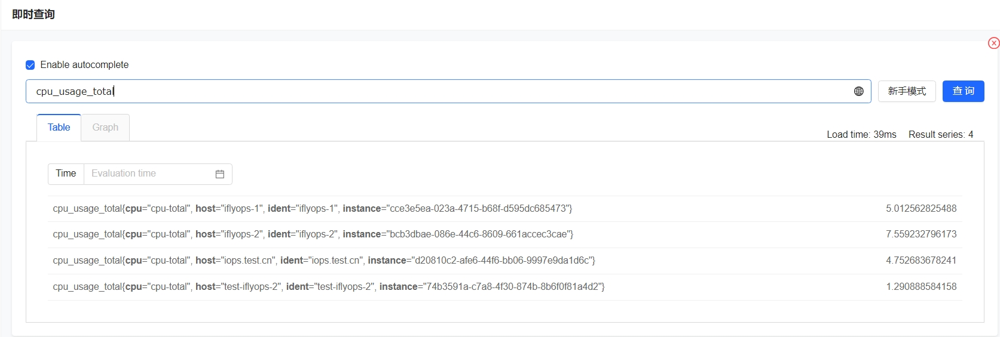
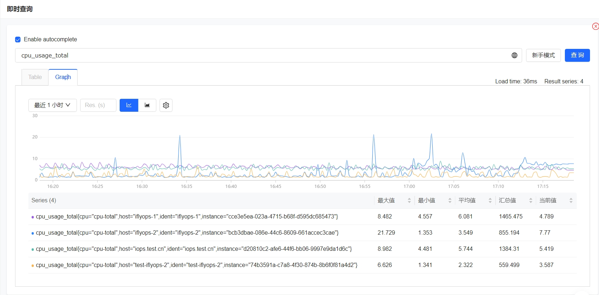
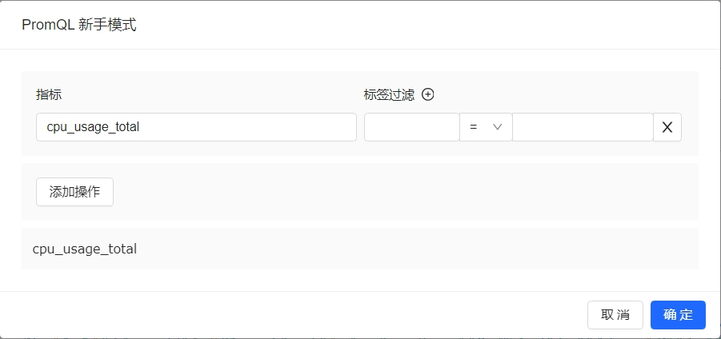

# 即时查询

采集器将监控数据上报到服务端之后，我们就可以查询数据了，即时查询页面提供了灵活的数据查询能力，支持使用 promql 语法查询所有的时序指标。

即时查询支持两种视图，Table 和 Graph 视图

Table 视图会将时序时间最近上报的点返回回来

Graph 视图展示的是时序值最近一个时间段内的数值变化

对应 promql 不太熟悉的同学，夜莺也提供了 新手模式 功能，通过点选的方式将 promql 构造出来

