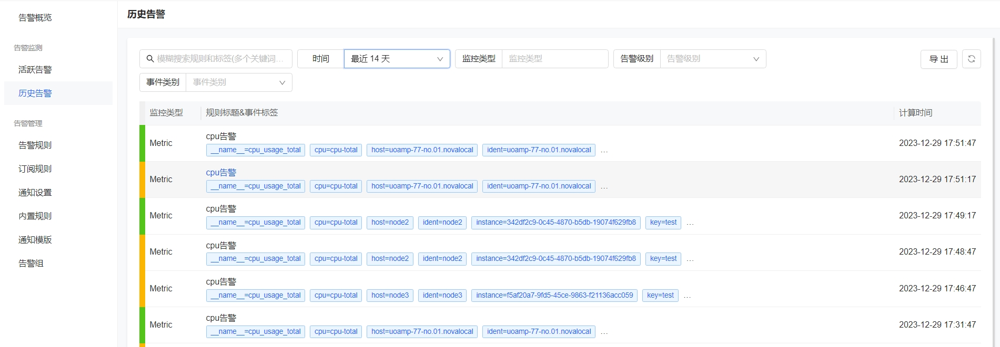
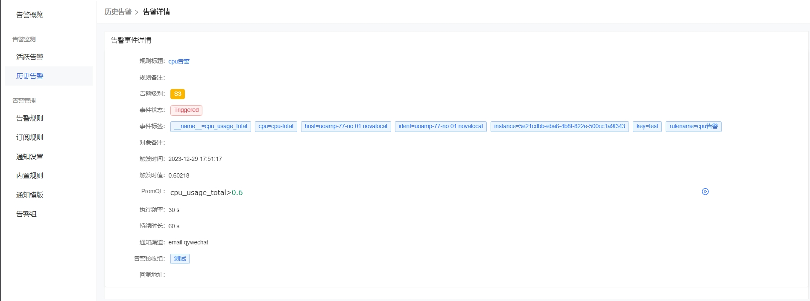

# 历史告警操作文档

历史告警页面是一个用于展示全部告警的列表页面，包括已恢复的和未恢复的告警。这个页面可以帮助用户了解过去的告警事件，以便分析系统状况和改进运维策略。

### 告警详情

点击告警事件的标题，可以进去告警事件详情页，查看告警事件的详细信息，以便更好的定位和处理相关问题，下面重点介绍下比较重要的几个字段

- 规则备注：在配置告警规则的时候，可以在备注中详细说明故障原因、影响范围以及解决方案，这样在 oncall 的同学收到告警之后，可以更有效率地跟进处理。
- 对象备注：如果产生的告警事件是一个机器相关的告警事件，如果机器之前有填写一些备注信息，会被放到对象备注中。
- 事件状态：有异常（Triggered）和恢复（Recovered）两种状态
- 事件标签：告警事件中的标签由时序数据的标签、告警规则中配置的附加标签、关联机器的附加标签和告警规则名称标签组成。通过这些标签，可以很方便地对告警事件做筛选过滤和统计分析。比如在配置屏蔽规则和订阅规则时，主要用的就是事件标签来作为筛选条件。

其他字段和告警规则中的类型，不再一一介绍