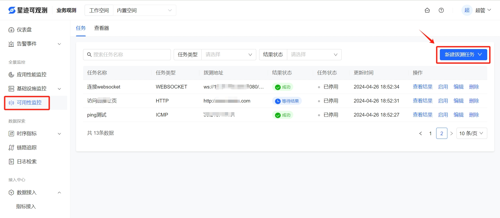
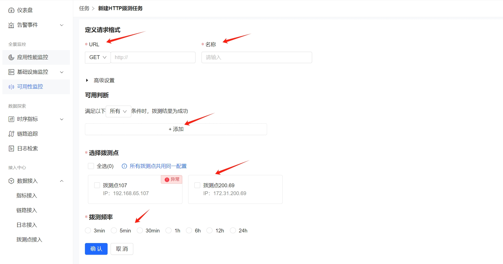
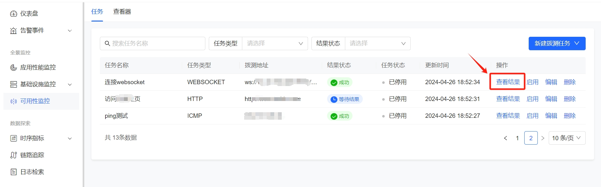
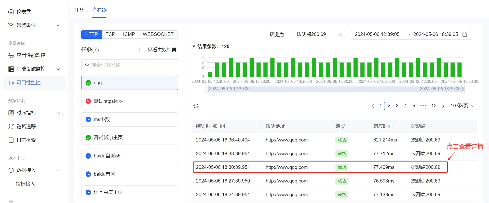
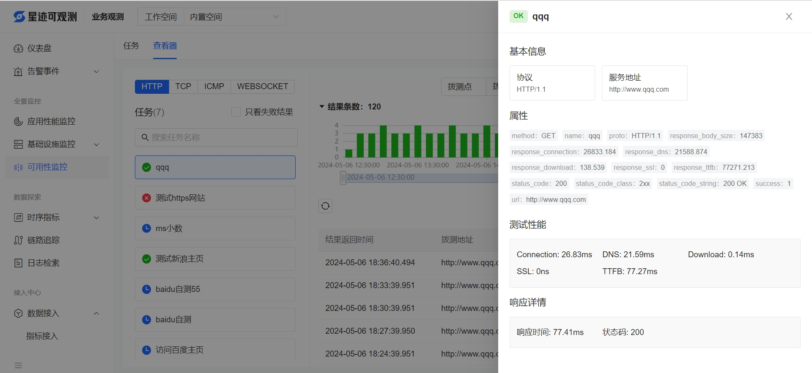
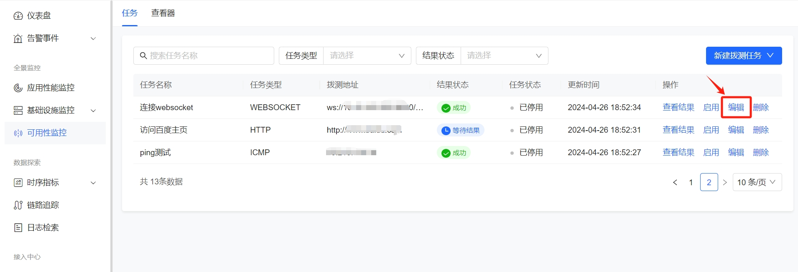
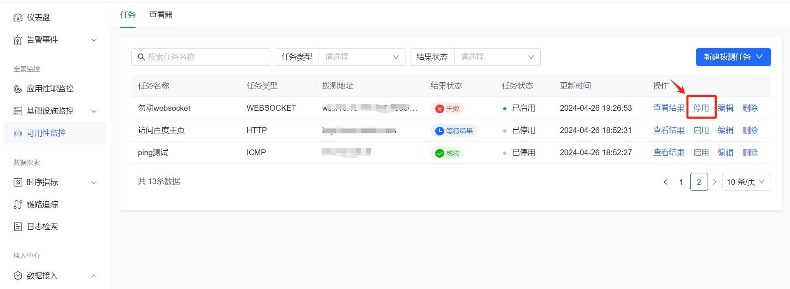
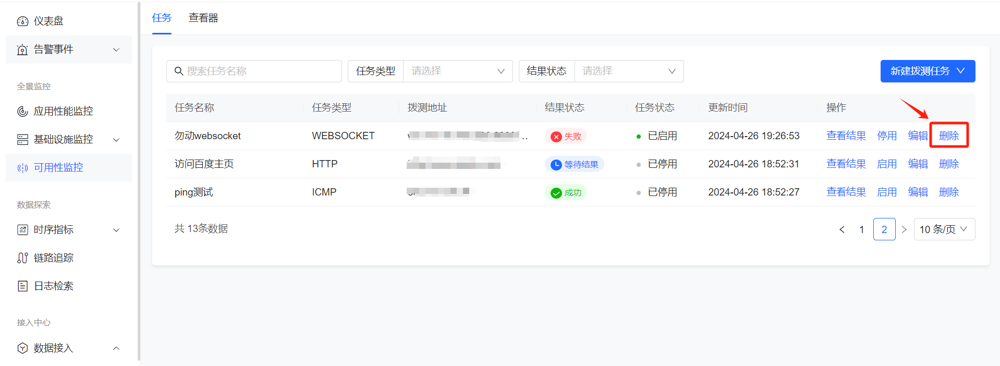

# 可用性监控
拨测的操作，首先需要在“拨测点接入”菜单中设置拨测点，然后在“可用性监控”菜单中创建拨测任务，拨测任务的具体操作如下：

1. 创建拨测任务

   创建好拨测点后，接下来可以创建拨测任务，具体操作如下：

   1.1 打开**业务观测 > 可用性监控**

   
   1.2 点击“新建拨测任务”，选择HTTP、TCP、ICMP、WEBSOCKET、自定义脚本拨测中的其中一项，进入拨测详情配置页面,如下图所示，填写必要的拨测信息、选择拨测点以及拨测频率,最后点击保存。

> 可用判断：该项必须添加至少一个条件，表示成功的判断依据。

2. 查看拨测结果
    
    拨测任务创建后，等待一段时间，点击“查看结果”链接，可以查看具体的拨测结果列表，点击列表中的一条记录可以弹出拨测详情，如下图所示：

图：点击“查看结果”

图：拨测结果列表

图：拨测详情

3. 修改拨测任务
   在拨测任务列表中点击“编辑”，可以对该任务进行修改。
  

4. 停用或启用拨测任务
   在拨测任务列表中点击“启用”或停用，可以对该任务进行启停操作。

5. 删除拨测任务
   在拨测任务列表中点击“删除”，即可删除该任务。

