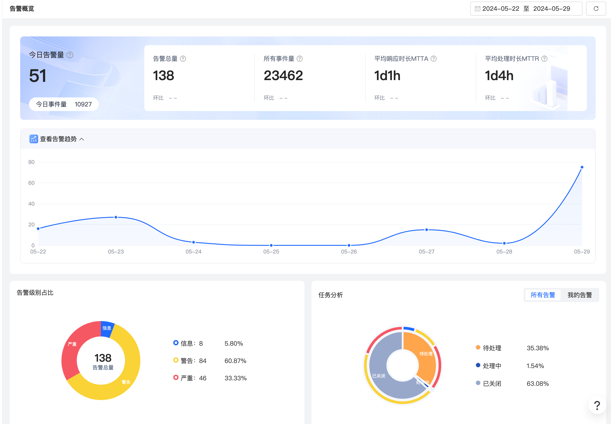
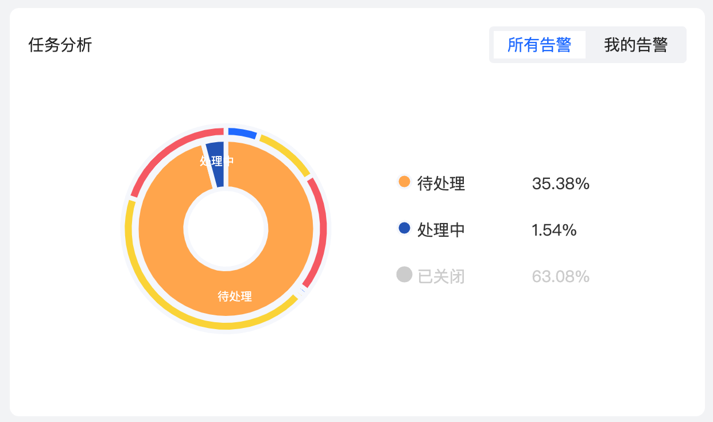

# 告警概览

告警概览是一个集中展示和管理告警信息的可视化界面，用户可以快速了解系统最近一段时间的告警趋势、高频类别和事件，帮助用户分析整体系统运行状态，及时发现并响应问题，提供系统稳定性。
星迹可观测智能告警的概览页面提供了默认近7天状态大盘，同时也支持灵活选择自定义区间查看不同区间内的数据统计。

## 操作步骤

1. 登录星迹可观察平台，点击服务入口中智能告警
2. 单击告警概览，在界面右上角选择日期选择器进行切换时间区间

3. 通过切换所有告警、我的告警进行查看当前任务统计状态

