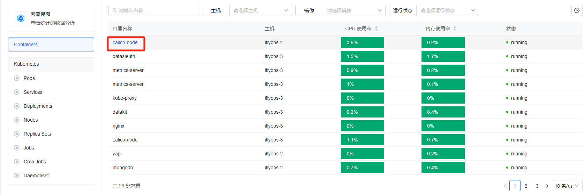
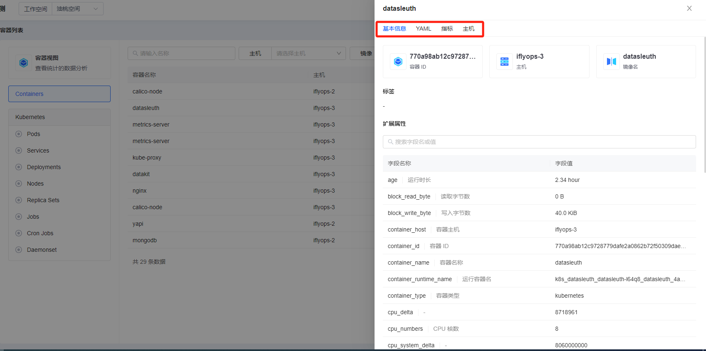

# 容器列表

容器列表功能展示接入到可观测系统中的所有容器及k8s资源，可以根据条件搜索相关的容器及k8s资源，点击名称可以进入详情页查看容器和k8s资源的详情。点击右上角六边形可以动态添加列表需要展示的列，当然这些信息都可以在详情中看到。

### 查看容器详情信息

点击列表中的容器名称进入详情页后，可以看到多个tab页，有基本信息，yaml信息，指标的仪表盘，容器所在主机的仪表盘，基本信息页可以看到容器的各种扩展属性。

