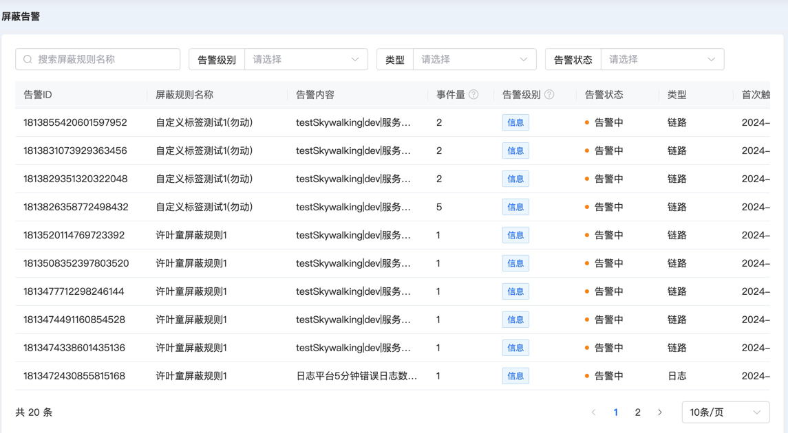
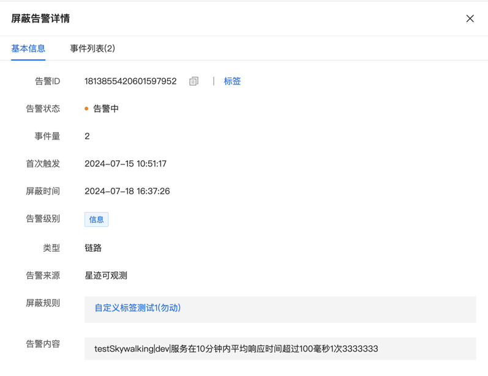
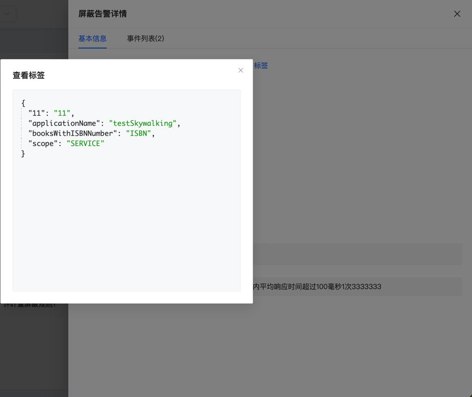
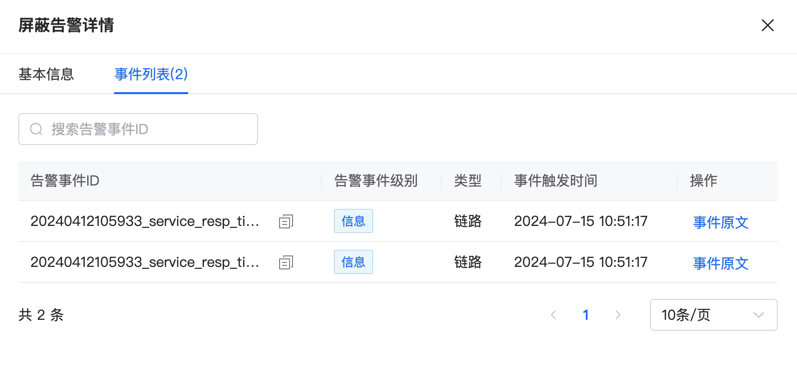
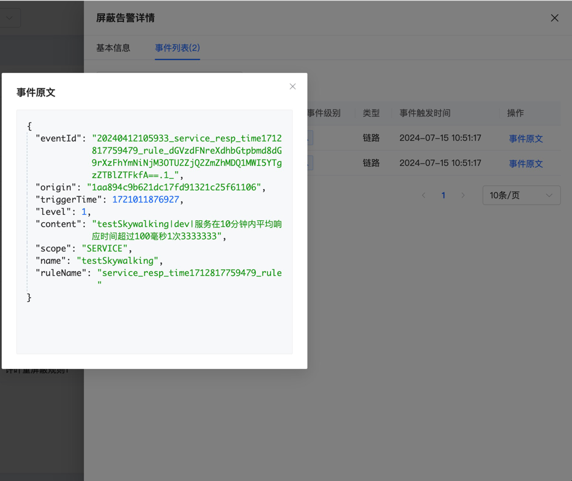

# 屏蔽告警

屏蔽告警是指满足屏蔽条件而没有参与后续分派和通知的告警事件

## 主页

展示屏蔽告警的基本信息，包括告警内容、级别、状态、类型和首次触发时间等基本信息，还有屏蔽时间和屏蔽规则名称等屏蔽条件相关的信息，以及告警对应的事件数量。支持按照告警ID、告警级别、告警类型和告警状态进行条件搜索。

## 详情

用户点击主页的告警ID就会跳转到详情页面，有两个子页面

### 基本信息

除告警来源信息之外，其余展示内容和主页相同。

点击该页面的标签按钮，展示该屏蔽告警的自定义标签内容。

### 事件列表

展示该屏蔽告警关联的所有告警事件，包括事件的原始ID、级别、类型和触发时间。

点击"事件原文"按钮，可以查看第三方告警事件的原始文本

