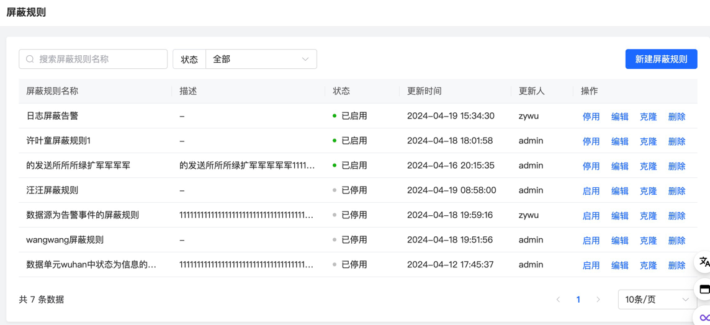
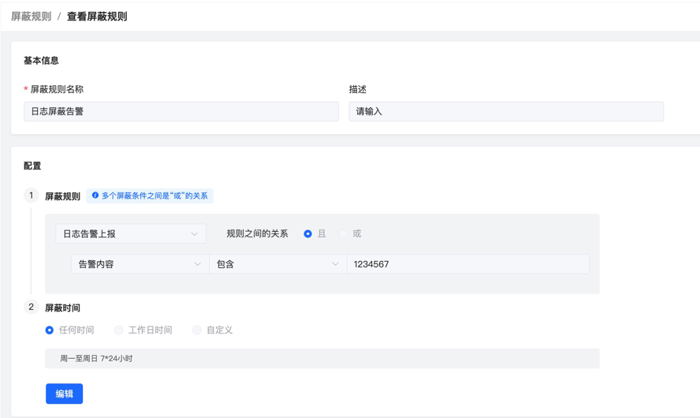
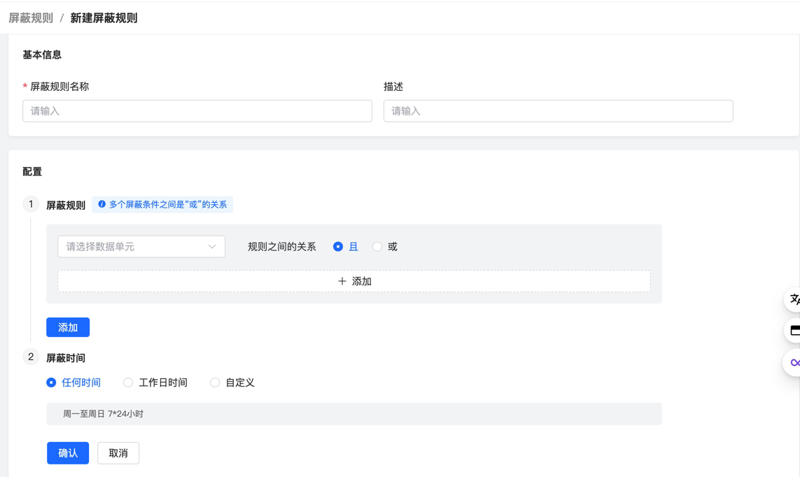
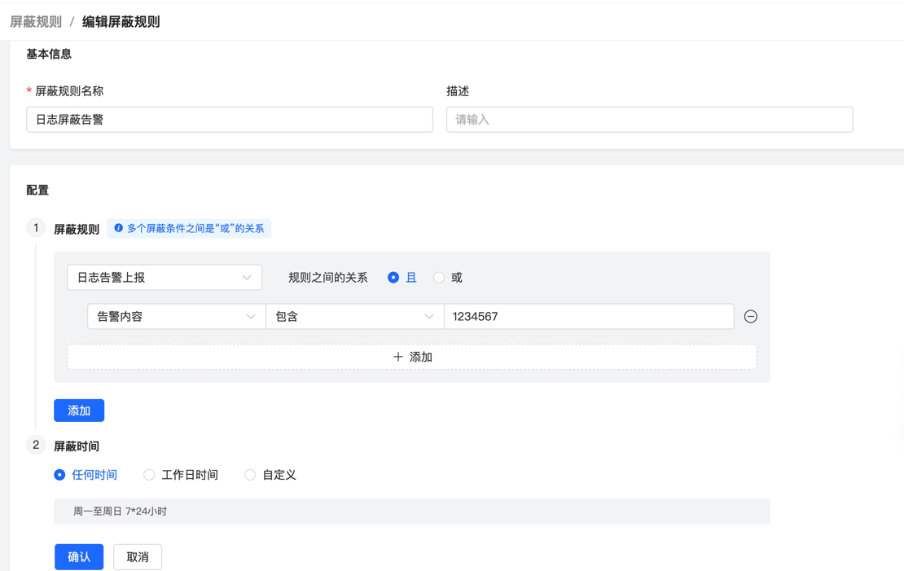

# 屏蔽规则

屏蔽规则定义了针对告警事件的屏蔽条件，被屏蔽的告警将不会参与到后续分派还有通知的流程中。

## 主页

展示了屏蔽规则包括名称、描述还有状态等基本信息，用户可以在页面对单条记录进行停用、启用和删除操作，还可以针对规则名称和状态进行条件搜索。

## 详情

展示了屏蔽条件的详细内容。

判断条件声明了内置标签或者自定义标签的取值，由用户自定义，这些将作为判断告警是否被屏蔽的依据。

屏蔽时间由用户自定义，只有在该时间段内符合了判断条件的告警，才会被屏蔽。

## 创建

页面元素与详情页相同，用户可以设置规则名称和描述，根据业务需求定制判断条件和屏蔽时间。

## 编辑

页面元素和详情创建页相同，用户可以针对屏蔽规则的各项内容进行修改。

