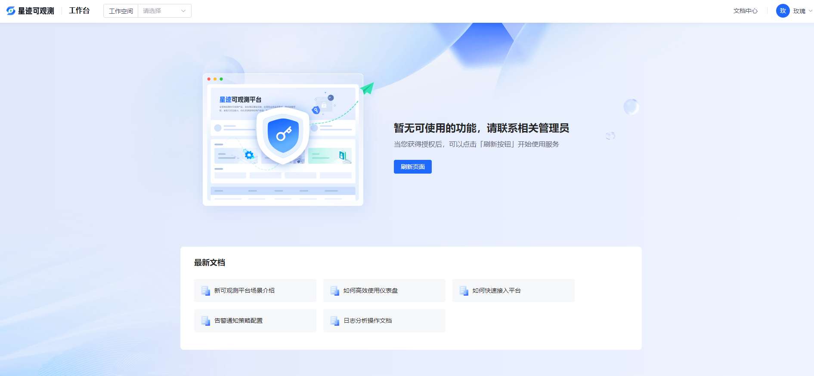
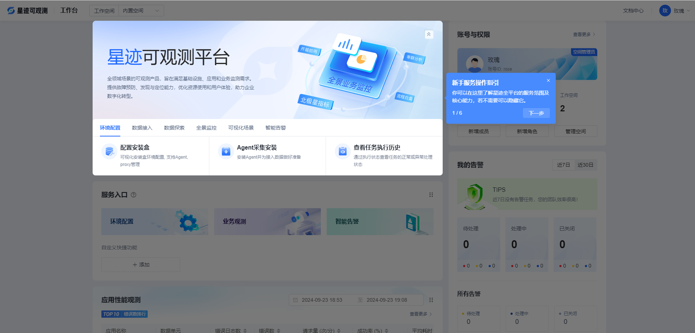
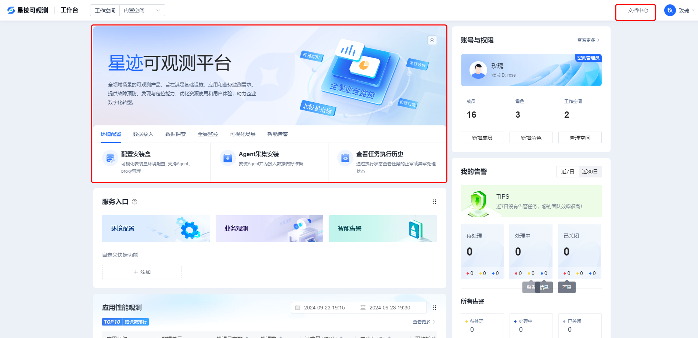
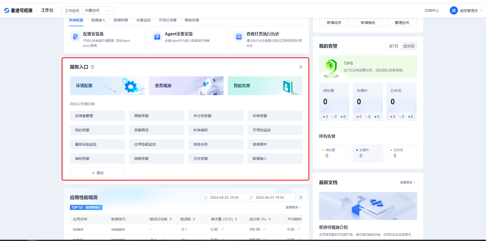
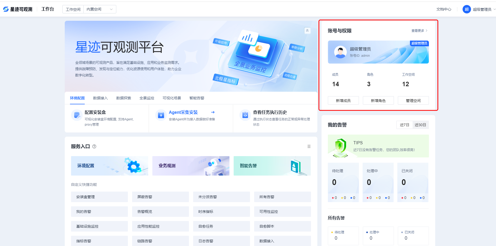
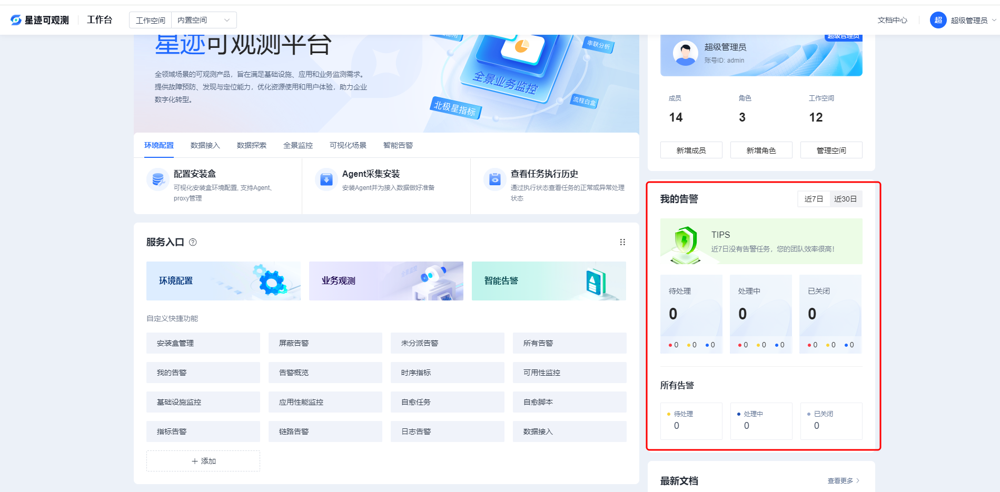
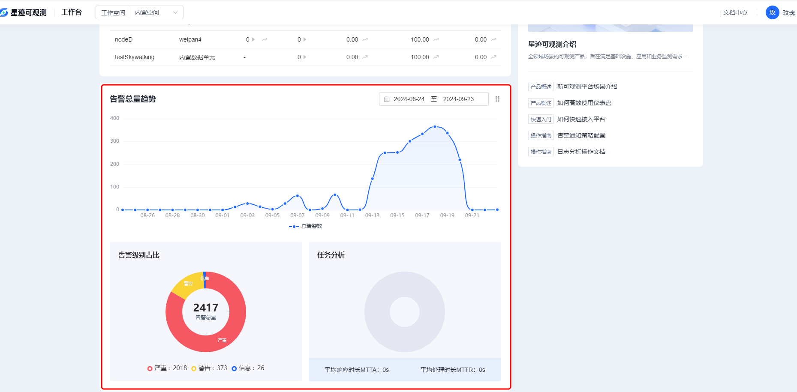
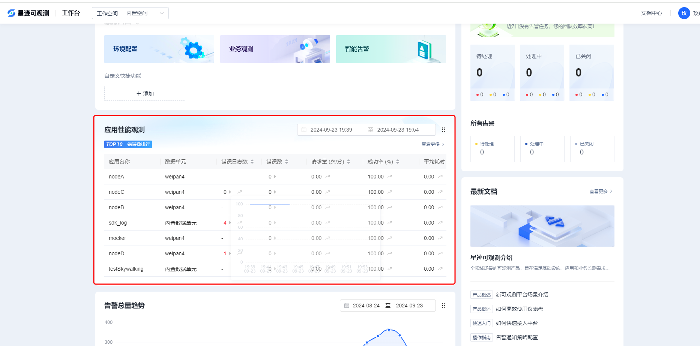

# 工作台
*  工作台页面是用户登录进来的首页面，如果用户没有被赋予任何空间，则跳转到无权限页面

* 如果用户首次登录，会展示相关的新手指引

*点击标红部分可以跳转对应的帮助文档

* 标红部分展示可观测平台的所有功能模块，点击可以跳转到可观测平台的对应功能，也可以新建快捷二级菜单

* 标红部分展示当前登录用户的权限相关信息，点击查看更多跳转到权限管理模块

* 标红部分展示当前登录用户，当前工作空间下的的告警相关信息

* 标红部分展示当前工作空间下的所有接入的top10应用性能监控信息，点击对应应用进行详细信息跳转

