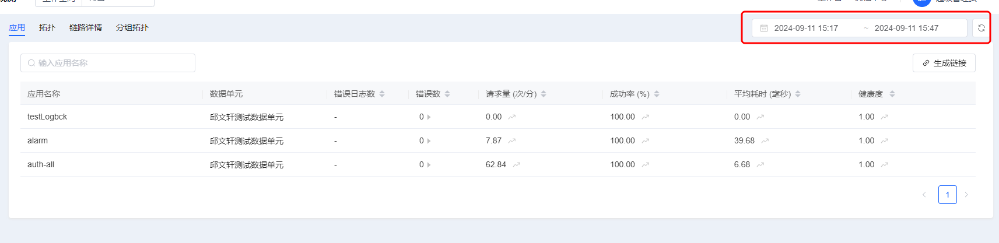
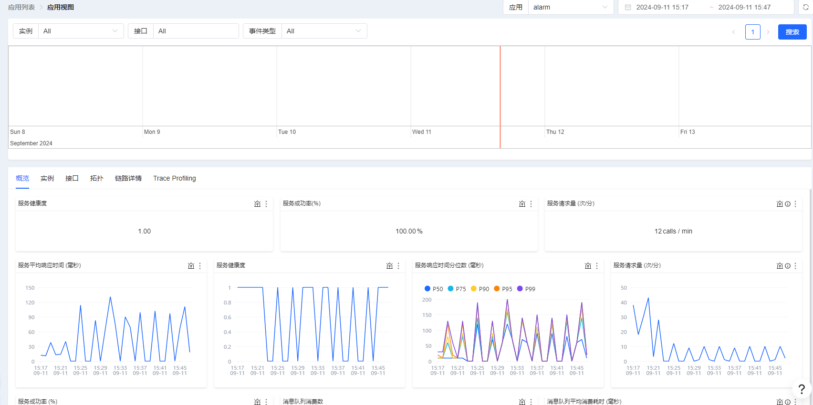
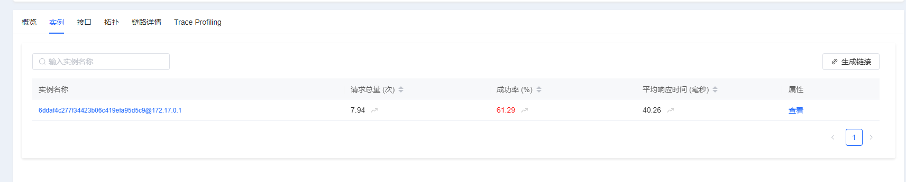
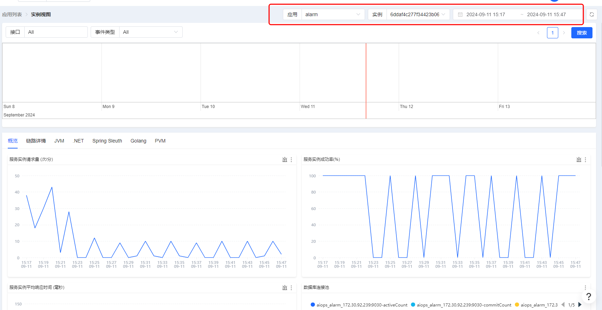
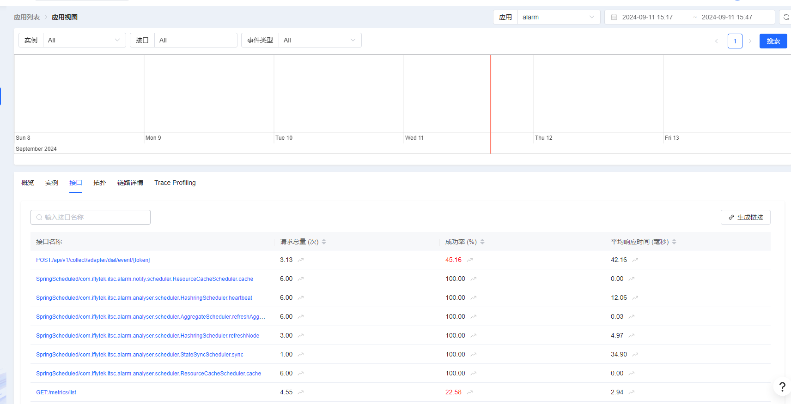
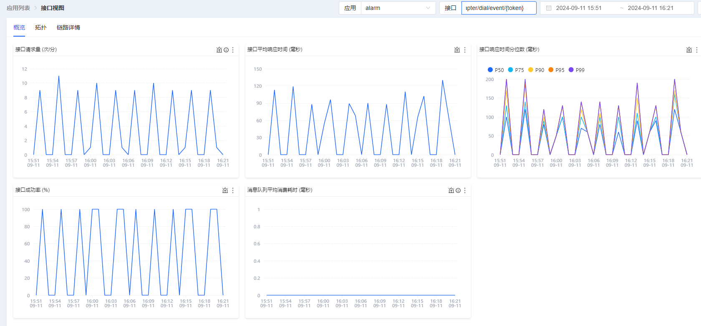
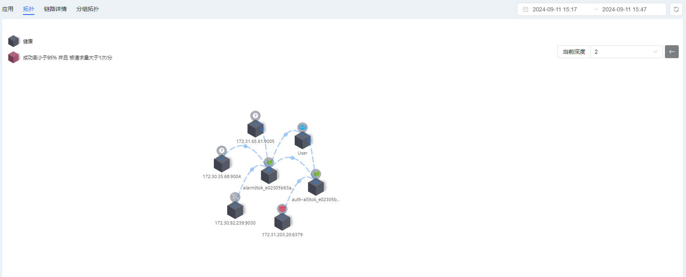
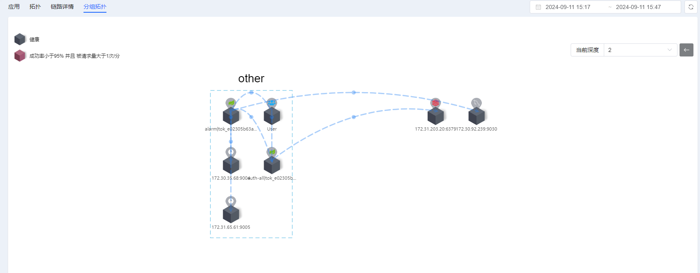

# 应用性能监控

## 应用
展示当前空间下接入的所有应用列表，可以根据时间筛选

点击应用名称可以下钻查看某一个应用的更多信息
概览tab下可以查看该应用的服务平均响应时间，服务健康度，服务响应时间分位数，服务请求量，服务成功率 (%)
等黄金指标

实例tab展示应用的所有实例列表数据

点击实例名称可以下钻查看实例的更多信息，实例黄金指标，链路详情，jvm等信息

接口tab展示该应用的相关接口列表

点击接口名称可以下钻到接口维度的更多指标，拓扑，链路详情

## 拓扑
展示所有接入应用和相关中间件的拓扑关系

## 链路详情
* 详见[链路追踪操作文档](./链路追踪操作文档.md)
## 分组拓扑
根据中间件，网关，应用服务层进行分组展示

