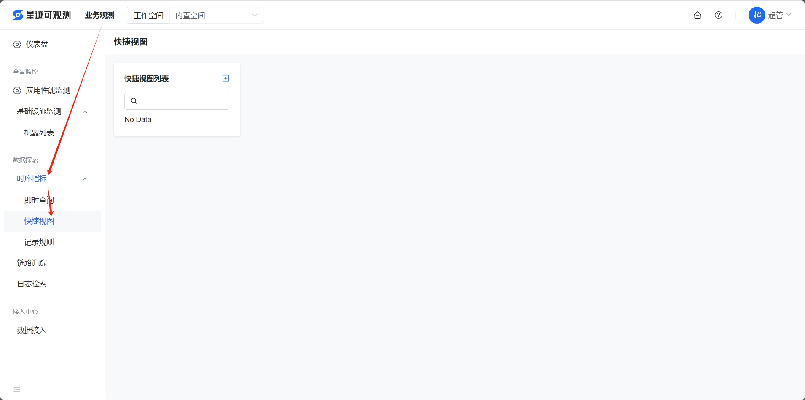
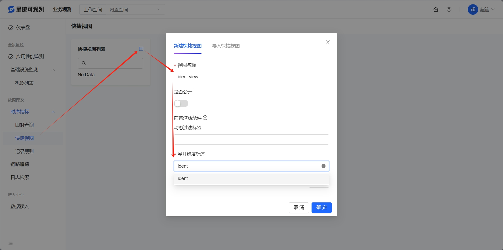
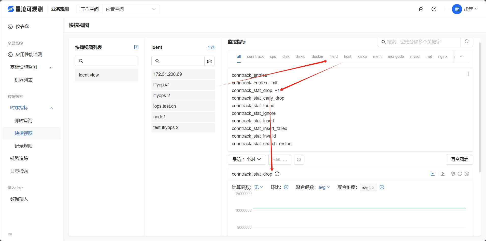
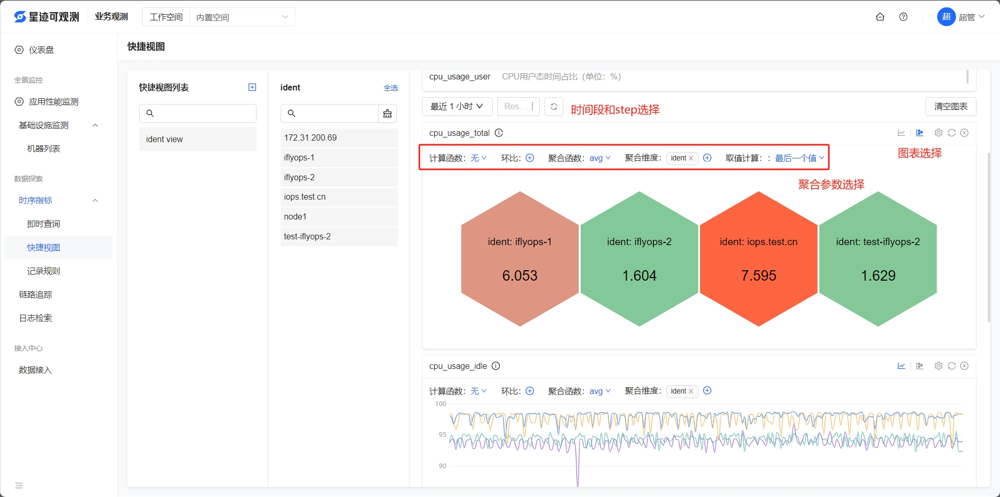

# 快捷视图

1. 进入平台后，打开**业务观测 > 时序指标 > 快捷视图**

2. 新增快捷视图列表

    这里演示按照主机维度(ident)展示数据

> ident: 代表主机的唯一标识hostname

3. 查看指定ident对应类型的指标

    选择ident后，可以看到右侧显示该机器上上报指标的类型，选怎类型和对应的指标(可以多选)后，下方可以看到这些指标的图表

4. 根据实际情况配置图表
    
    支持以下功能的选择：
    - 自定义图表的时间段和step
    - 选择标图类型：时序、聚合图(支持修改聚合配置)

