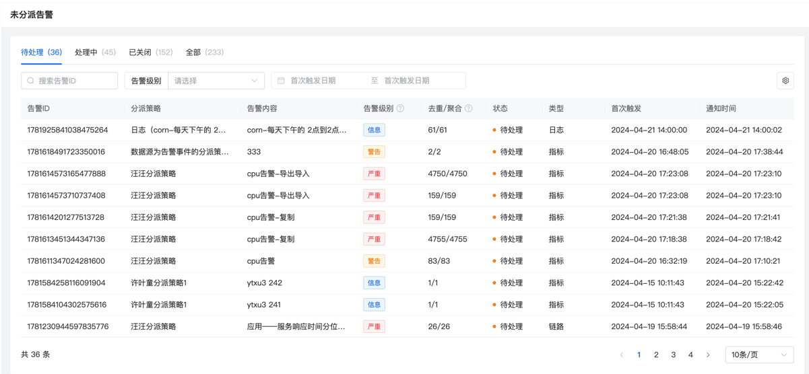
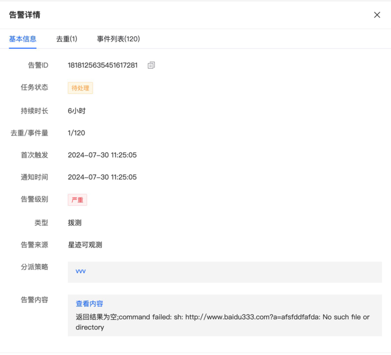
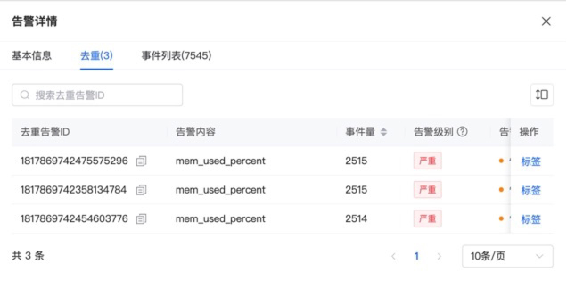
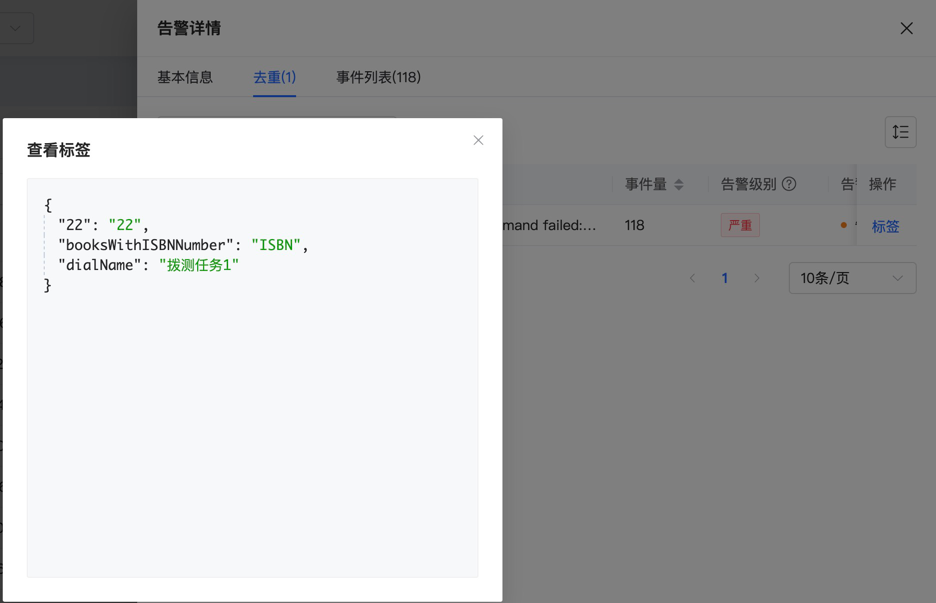
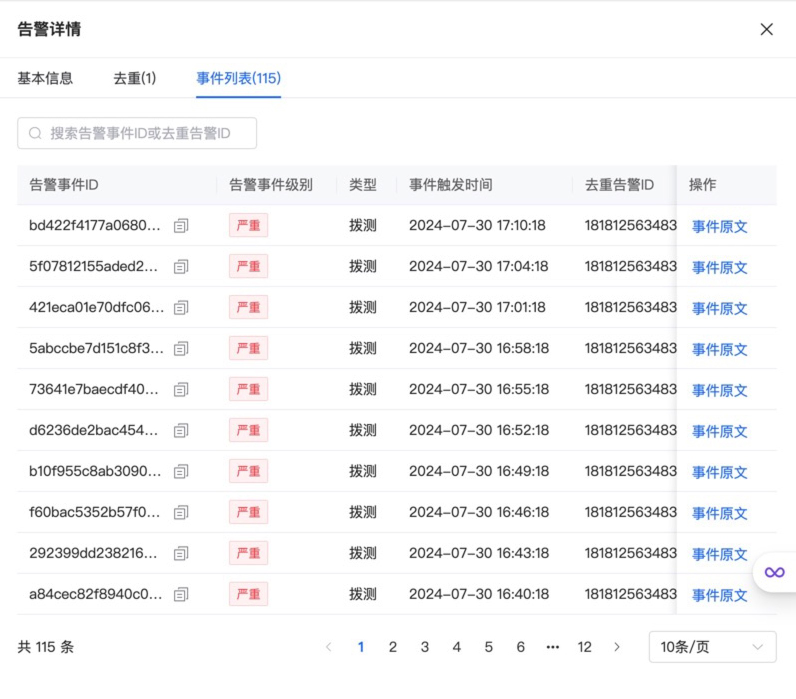
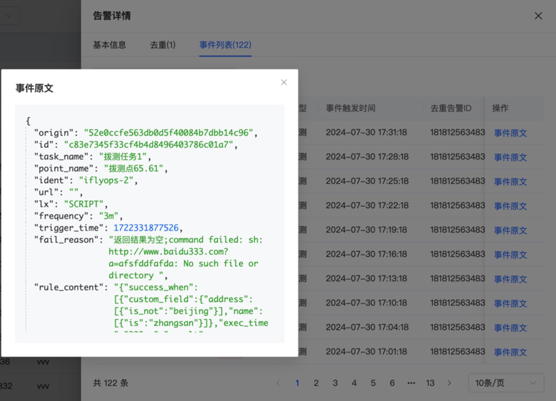

# 所有告警

## 主页

展示了当前所分派的所有告警信息，支持待处理、处理中、已关闭和全部告警的分类展示。

## 告警详情

用户点击告警ID，就会跳转到详情页面，有三个子页面

### 基本信息

展示了告警的状态、来源、级别、类型和内容等基础信息，触发时间、通知时间、持续时长等时域信息，还有告警命中的分派策略。

### 去重

展示当前聚合告警下的所有去重告警信息，包括状态、内容、级别、类型和触发时间，同时还展示了该去重告警所对应的告警事件数量。支持按照去重告警ID进行条件搜索。

用户点击"标签"按钮，可以查看指定去重告警的自定义标签数据。

### 事件列表

该聚合告警下的所有告警事件信息，包括事件的ID、级别、类型和触发时间，还有对应的去重告警ID。

用户点击"事件原文"按钮，可以查看告警平台接收的第三方告警事件的原始文本。

