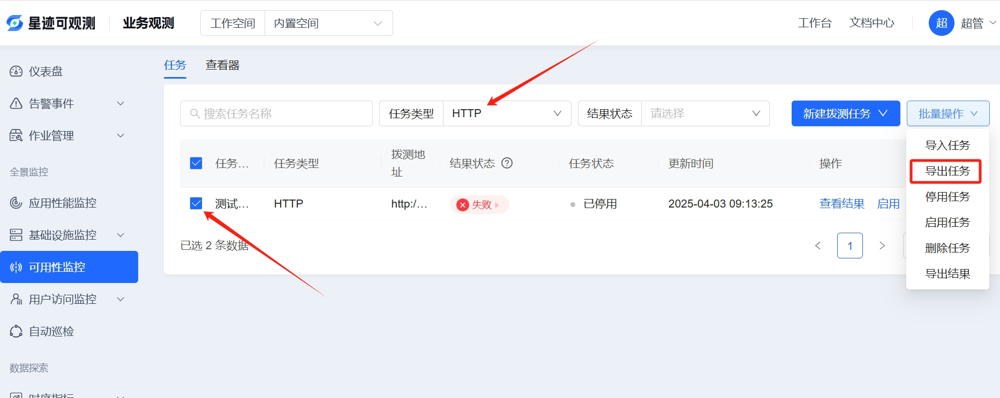
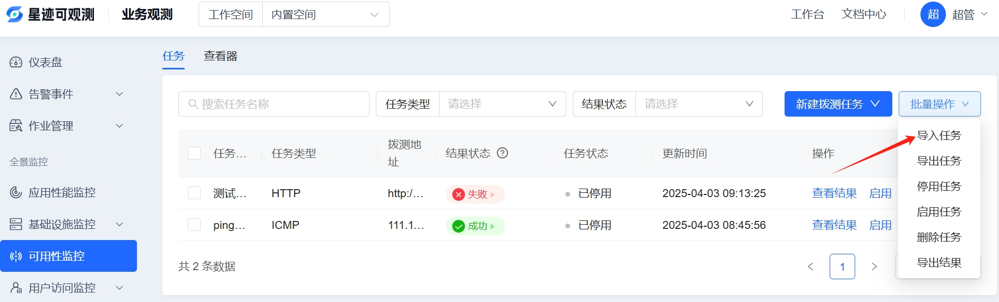
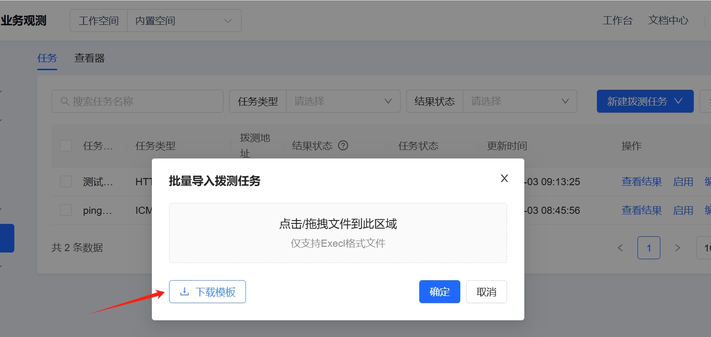
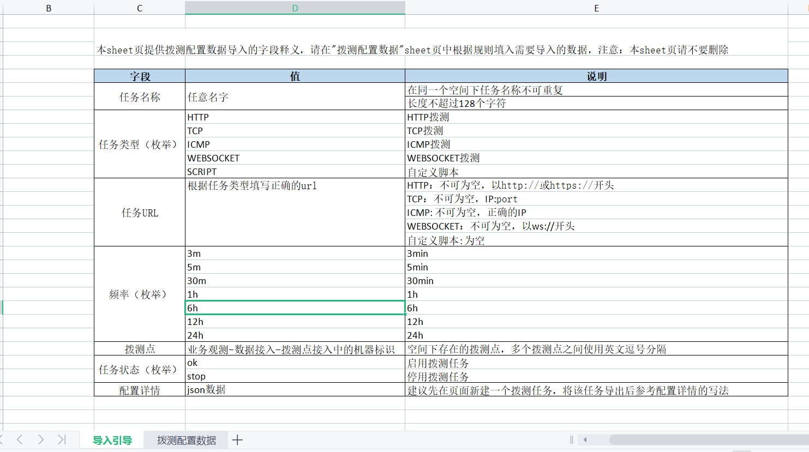

# 拨测任务导出
拨测配置的导出功能，可以支持拨测任务的快速平移。具体操作如下：

1. 进入平台后，打开**业务观测 >可用性监控** 在批量操作下拉框中可以看到拨测导出按钮，拨测导出支持条件筛选后导出，导出之前需要选中要导出的拨测任务，选中支持翻页操作，选中拨测任务后，点击“导出任务”即可。

# 拨测任务导入
拨测配置的导入功能，配合拨测任务的导出功能共同使用，目的是可以快速复制相似的拨测任务。具体操作如下：

1. 进入平台后，打开**业务观测 >可用性监控** 在批量操作下拉框中可以看到拨测任务导入按钮，在任务导入页面，可以下载导入模板

2. 在模板首页，是导入引导页，包含了导入字段的释义。这里特别强调，配置详情字段，建议在页面创建一个相同规则的拨测任务，导出该任务，将导出的任务配置详情字段作为任务导入的配置详情数据结构。这里，任务URL的内容会覆盖配置详情中url字段内容，导入的拨测任务，请尽量确保数据的准确性。

平台会对导入的数据做基本的准确性校验，错误的数据会反馈给用户一个excel，里面包含了数据导入失败的错误原因，请根据错误提示修改后再导入。