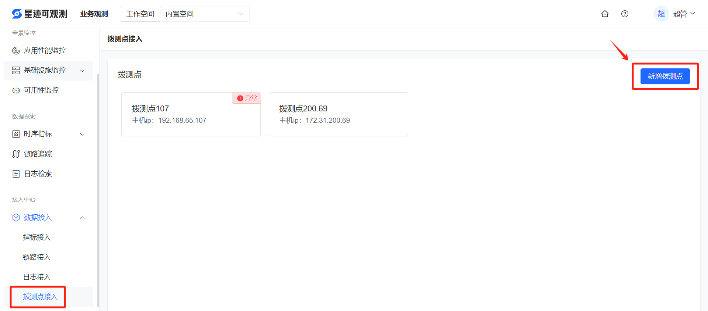
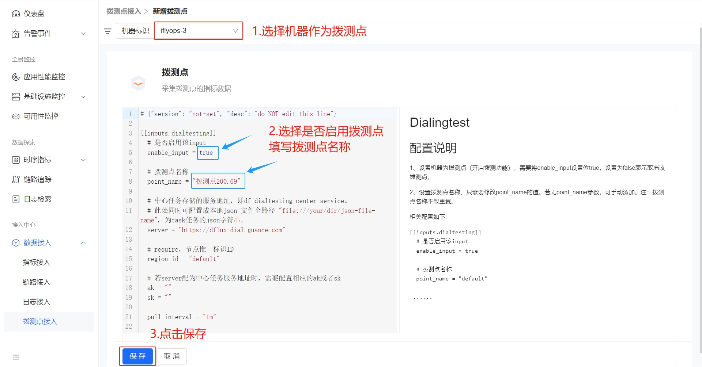

# 拨测点接入
拨测的操作，首先需要在“拨测点接入”菜单中设置拨测点，然后在“可用性监控”菜单中创建拨测任务。拨测点接入的具体操作如下：

1. 进入平台后，打开**业务观测 > 数据接入 > 拨测点接入**

2. 新增拨测点

    2.1 如上图所示点击“新增拨测点”按钮，进入新增页面

    2.2 选择机器，启动拨测点并设置拨测点名称

> enable_input: 为true代表启用拨测点；为false代表取消该拨测点

> point_name：代表拨测点名称，若配置中没有point_name参数，可手动在enable_input下方添加该参数。注意：拨测点名称不能重复

由于需要等待心跳返回，保存成功后需要等待一会才会看到新增的拨测点。

接下来可以进入系统的**业务观测 > 可用性监控** 中创建拨测任务，具体操作详见[可用性监控操作文档](../guide/可用性监控操作文档.md)。