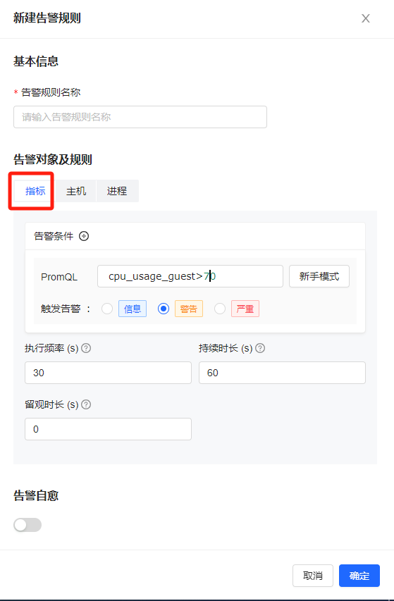
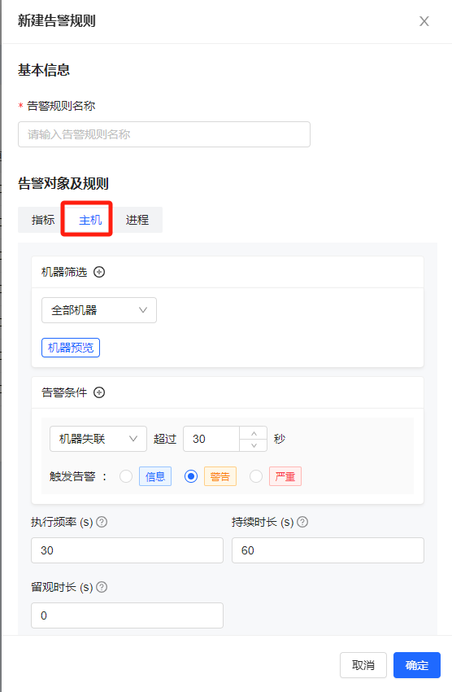
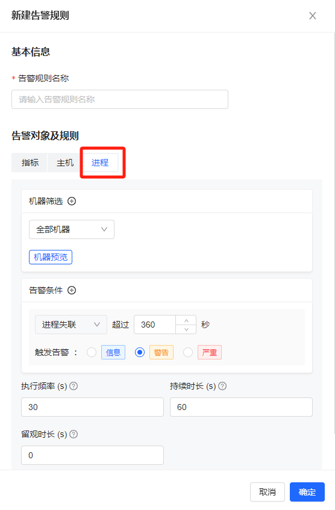
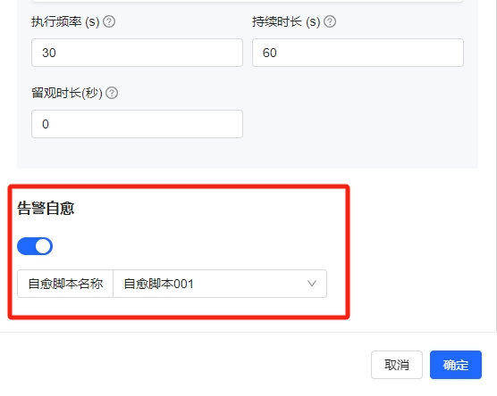
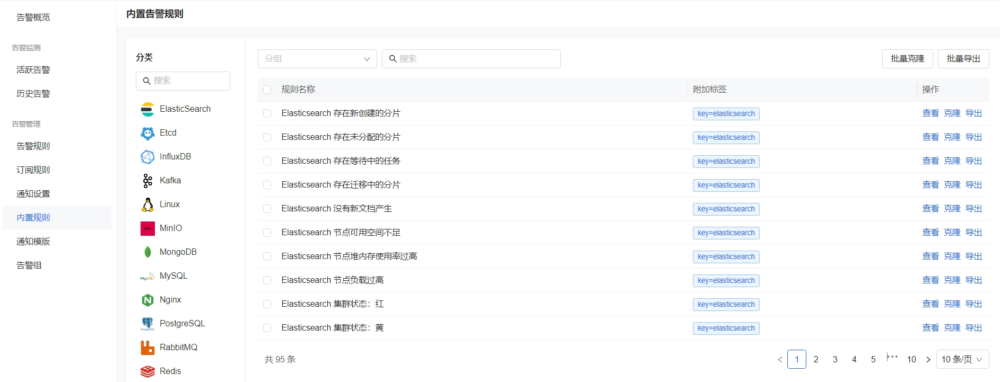
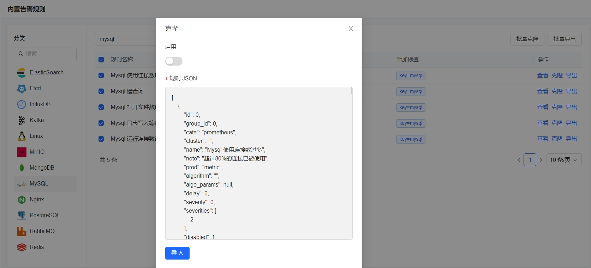

# 指标告警

指标监控系统不仅提供了强大的数据采集和可视化功能，还提供了灵活的告警配置能力，帮助我们实时掌握系统的运行状况，快速响应和解决潜在问题。在本节中，将详细介绍如何在夜莺监控系统中设置告警规则。

## 指标告警规则

告警规则提供了人性化的配置能力，可以满足各种场景下的配置需求。告警规则主要分为四部分，基础信息、规则配置，下面详细介绍下夜莺告警规则的配置参数。

### 基础信息
- 规则名称：告警规则的名称，可以表明这个规则是对什么进行的监控，支持配置变量，例如 内存告警 <code v-pre>{{ $labels.busigroup }}</code> 机器：<code v-pre>{{ $labels.ident }}</code>，如果告警事件中的标签包含了 busigroup 和 ident，最终告警事件中规则的标题会被替换为真实的 busigroup 和 ident， 内存告警 defaultbusigroup 机器：ningdeMacBook-Pro.local

### 规则配置

告警规则支持两种类型的告警，“指标”时序数据的告警 和 “主机” 类型的告警，下面分别进行介绍

#### “指标”类型告警

- 告警条件：本质上就是一条 promql，所以可以做一些条件筛选和四则运算，比如下面的告警规则：ttp_api_request_success{region="beijing"} / http_api_request_total{region="beijing"} < 0.995 表示：求取beijing这个region的所有http请求的成功率，如果成功率小于 99.5% 就告警。如果告警引擎通过此 promql 查到了数据，说明有有异常点产生，如果满足的持续时间，就会产生一个告警事件。
- 级别抑制：这里夜莺也有支持配置多个告警条件，如果打开了级别抑制开关，两个条件同时产生告警的话，只会发送高级别的告警，会对低级别的告警进行抑制，降低对大家的打扰。
- 执行频率 ：告警规则执行检查的频率
- 持续时长 ：通常持续时长大于执行频率，在持续时长内按照执行频率多次执行 promql 查询，每次都触发才生成告警；如果持续时长置为0，表示只要有一次 promql 查询触发阈值，就生成告警

#### “主机”类型告警

- 机器筛选：支持全部机器、业务组、标签、机器标识多种维度的筛选，筛选之后，可以点击机器预览
- 告警条件：“主机” 类型告警支持三种告警能力
    - 机器失联 机器失联告警是一种常见的监控告警场景，用于检测服务器在一定时间内无法正常连接或通信。服务器失联可能是由于硬件故障、网络问题、电源中断等原因导致的。通过设置失联告警，我们可以在第一时间得知服务器失联情况，迅速排查故障原因，并采取恢复措施。
    - 机器集群比例失联 在微服务架构中，一个服务通常由多个实例组成，以实现负载均衡和容错。当一台机器失联的时候，一般服务不受影响，但当超过一定比例的服务实例失联时，可能导致服务性能下降、延迟增加或部分功能失效。因此，夜莺告警提供了机器集群比例失联告警的能力，设置集群比例失联告警可以帮助运维团队及时发现问题，扩展服务实例或解决失联原因，确保服务正常运行。
    - 机器时间偏移 分布式系统通常有很多节点，各个节点之间需要保持时间同步，这样才能确保数据一致和处理事务。如果节点之间的时间出现偏差，那可能会导致一大堆麻烦，比如数据混乱、事务失败或性能下降。设置一个时间偏移告警，可以让我们快速发现和修复时间同步问题，保证系统顺利运行。

#### “进程”类型告警

- 机器筛选：与主机的机器刷选一样，支持全部机器、业务组、标签、机器标识多种维度的筛选，筛选之后，可以点击机器预览。
- 告警条件：只有进程失联告警，可以配置失联多少秒后告警，不能小于360s。

#### 告警自愈设置

- 选择开启告警自愈，开启后，需要进一步选择具体的告警自愈脚本。当告警产生时，会自动根据选择的自愈脚本形成一条告警自愈任务，进行自愈任务的下发和处理。告警自愈任务在指标告警的详情中查看到，也可以在业务观测 > 告警自愈 > 自愈任务列表中查看到。
  
## 内置规则

平台提供了很多内置的告警规则模板，方便用户快速部署和配置告警策略。内置告警规则模板包含一系列预定义的告警条件，用户可以根据自己的需求进行选择和调整。

比如我先给 MySQL 服务加上告警规则，选择 MySQL，右边会展示出梳理好的 MySQL 告警规则，列表左上角可以根据不同的采集器，选择不同的告警规则，点击全选按钮，然后批量克隆。

