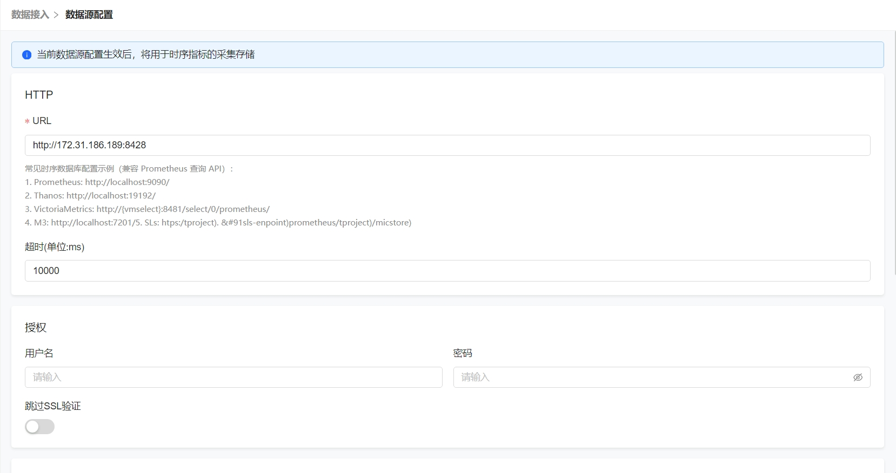
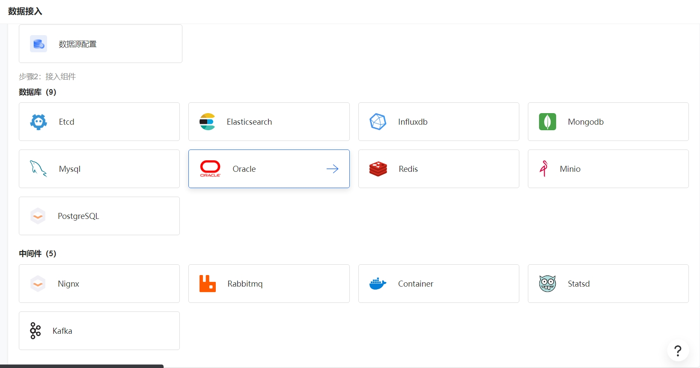
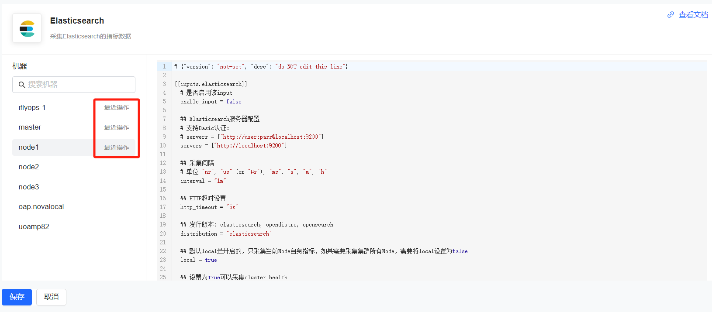

# 指标接入

### 数据源配置

可观测平台指标监控使用的数据源是vectoriametrics，支持promql语法的其他数据库也能够支持。平台中支持在线配置数据源信息

使用vm单节点时，URL配置：http://{vmselect}:8428

使用vm集群时，URL配置：http://{vmselect}:8481/select/0/prometheus/

### 组件接入

平台中将支持的采集的中间件按照数据库和非数据库展示出来(服务器默认采集)，点击需要配置的中间件进入

选择需要配置的主机，点击主机即可查看对应的配置，可在右侧配置中进行修改，查看或修改过配置的主机有个`最近操作`的标识，点击保存按钮的时候会把所有最近操作过的配置保存。

