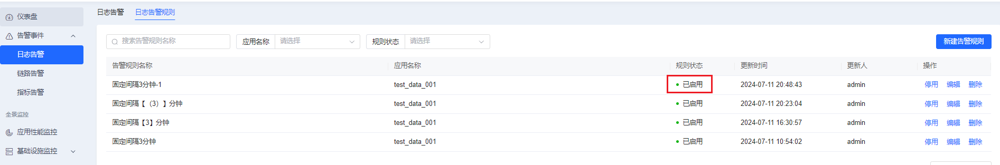
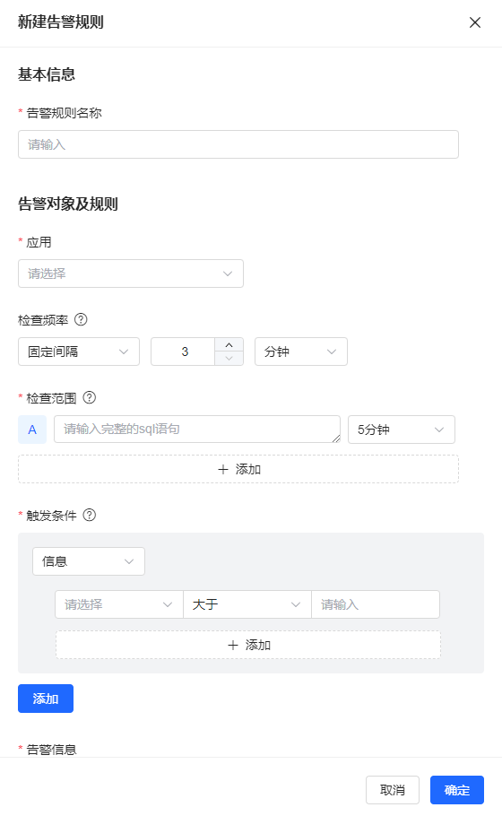
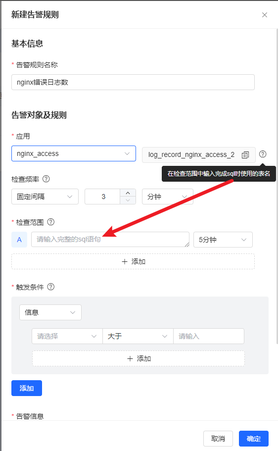
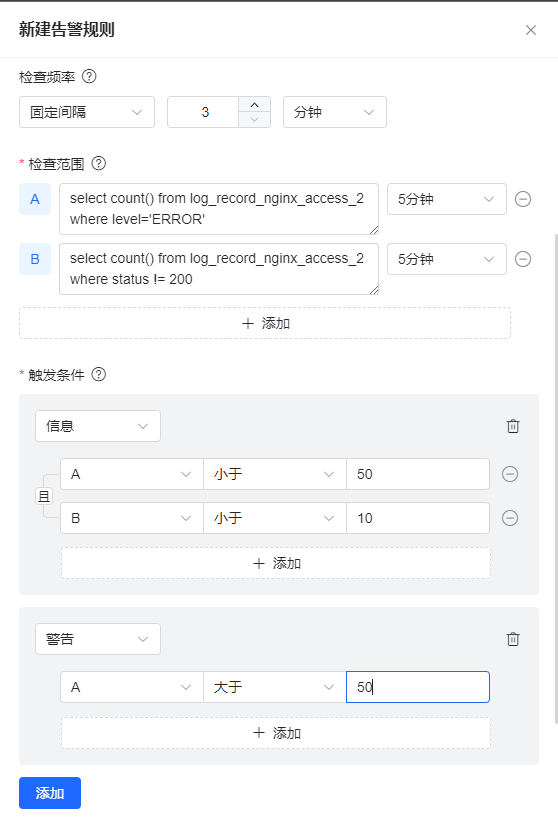
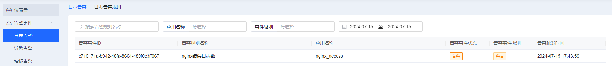
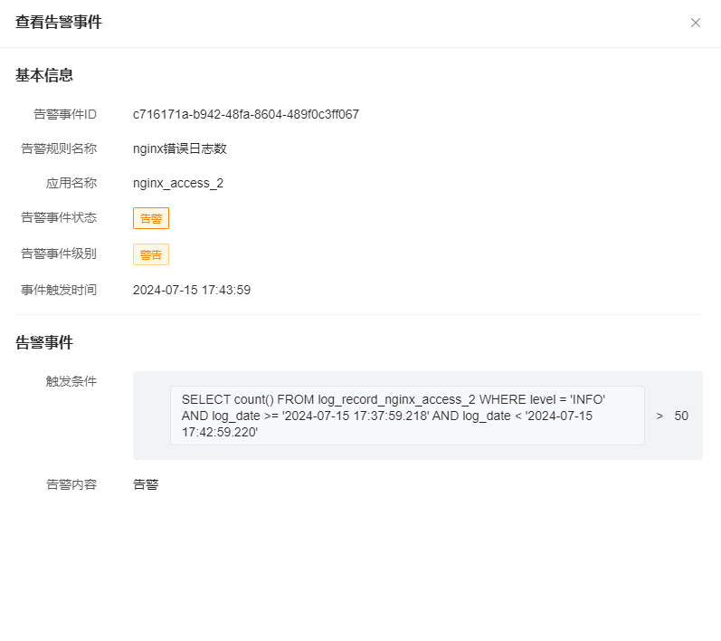

# 日志告警

## 进入日志告警规则菜单
可以对规则名称进行搜索、也可以根据条件筛选告警规则

如果暂时不想使用此规则也可以执行停用操作, 执行后该告警规则不会再产生告警数据

稍后想继续使用, 则可以可以启用让当前告警规则生效

**默认新创建的告警规则都是停用状态, 如果需要使用则在此页面进行启用操作**


## 新建告警规则
选择一个应用, 填写需要检查的SQL并设置触发告警的条件, 点击完成可以在告警规则列表查看创建的告警规则


### 输入告警规则名称
告警名称是一个告警规则的标识

### 选择应用
告警规则是以`[应用]`为维度进行告警监控, 
在应用下拉列表可以选择需要监控的应用

选择应用后, 在应用下拉框右侧会出现该应用对应的表名, 
表名在输入SQL时使用



### 设置检查频率
在检查频率下拉框选择`固定间隔`和`corn`表达式进行告警数据的检查, 
- 固定间隔: 固定每分钟或每小时执行一次SQL, 检查是否有告警数据产生, 最快每3分钟检查一次
- corn表达式: 根据设置的corn表达式执行SQL检查告警数据

### 输入检查SQL并设置检查范围
检查SQL可以设置多条, 每条SQL可以设置单独的检查范围,最多设置5条SQL, 
在每条SQL前使用大写英文字母标识该SQL和检查范围 

检查范围就是执行SQL的检查时间范围, 默认为5分钟, 表示每次执行SQL检查最近5分钟产生的数据

如下SQL表示nginx接入日志错误数
```sql
select count() from log_record_nginx_access_2 where level='ERROR' and log_date>=$__timeFrom() and log_date <= $__timeTo()
```
如下SQL表示nginx接入日志http返回状态码不等于200的数量
```sql
select count() from log_record_nginx_access_2 where status != 200 and log_date>=$__timeFrom() and log_date <= $__timeTo()
```

告警查询SQL中必须设置时间范围条件，开始时间为 $__timeFrom()，截止时间为 $__timeTo()，在后台执行时，会自动将开始、截止时间替换为检查范围的真实时间。

### 设置触发条件
可以对检查范围的多条SQL组合配置不同的触发条件, 
单个告警条件内可以选择多个SQL结果设置触发条件, 每个条件之间是`且`的关系
必须都满足才会产生告警

下图第一个触发条件表示如果nginx接入日志错误数最近5分钟内小于50条
并且http状态码不等于200的请求数不超过10条则会产生一条告警,
告警级别为`信息`

每个触发条件之间的关系是`或`的关系, 只要有一个条件满足就可以触发告警

下图第二个触发条件表示如果nginx接入日志http状态码不等于200的请求数最近5分钟内
超过50条则会产生一条告警,
告警级别为`警告`



### 添加告警信息
当告警产生时, 发送出去的文本信息

## 查看告警事件
在日志告警下面, 可以查看相应告警规则产生的告警


点击告警事件ID, 可以查看该告警产生的详细信息, 
包括执行时间以及由哪条SQL条件产生
