# 日志接入

## 日志接入菜单


## 接入前置条件

日志接入的所有功能都是在应用维度的基础上进行配置的, 在进行日志接入时,需要在星际系统的 `用户权限管理-空间管理`菜单下, 
选择一个数据单元创建应用, 具体操作可以参考 `空间管理` 操作文档

接入方式分为 `在线接入` 和 `离线接入` , 分别对应不用的业务场景
- 在线接入: 用户在日志接入配置页面, 进行日志采集路径等属性的配置, 星际系统将这些配置属性自动下发到对应机器的日志采集器, 不需用户感知, 通过页面操作
  就可以完成整个接入流程
- 离线接入: 用户对日志采集有定制的配置需求, 需要用户对日志采集器Vector比较熟悉, 可自行配置日志采集器

在线接入的前置条件是需要在星际系统的`环境配置`功能安装Agent和日志采集插件st-vector, 具体操作可以参考`环境配置`操作文档
在线接入和离线接入都可以通过在页面进行字段映射配置进行数据保存

一句话总结: 在线接入是星际系统负责管理日志采集插件的配置, 离线接入是用户手动维护日志采集器的配置

请根据以上描述, 选择合适的接入方式。

### 错误日志堆栈分析功能

目前此功能仅支持Java语言的日志，解析错误日志的堆栈信息获取错误类型，如：

````txt
2025-01-08 00:02:36.932 [xxl-job, executor ExecutorRegistryThread] ERROR com.xxl.job.core.util.XxlJobRemotingUtil L139 - connect timed out 
java.net.SocketTimeoutException: connect timed out
	at java.net.PlainSocketImpl.socketConnect(Native Method)
	at java.net.AbstractPlainSocketImpl.doConnect(AbstractPlainSocketImpl.java:350)
	at java.net.AbstractPlainSocketImpl.connectToAddress(AbstractPlainSocketImpl.java:206)
	at java.lang.Thread.run(Thread.java:748)
````

从上面日志中解析出 `java.net.SocketTimeoutException` ，之后从日志检索中可以查看。在错误日志分析的页面中效果为：


如需开启此功能，需要在日志接入的高级选项中打开：

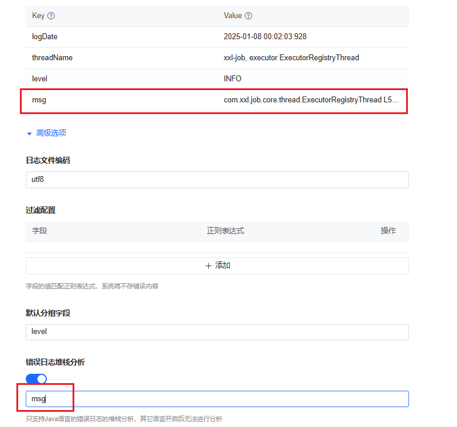

注意：需要提取到的堆栈信息的字段，如图 `msg` 进行正确配置到错误日志堆栈分析的输入内，否则无法成功解析获取错误类型。

## JSON类型接入文档

JSON类型接入针对的是日志输出内容为Json格式, 如果日志输出内容不是Json格式则会解析失败

### JSON在线接入案例

#### 日志输出样例
日志文件中不涉及跨行输出，每一行都是一条日志
```json
{
    "traceId":"",
    "level":"INFO",
    "dateTime":1700706936805920072,
    "ip":"172.30.12.119",
    "application":"LokiTest",
    "methodName":"logTest",
    "logger":"com.my.loki.test.LogTest",
    "message":"The turtle can grow up to 303 years old, and this year it is 147 years old.",
    "exception":"",
    "source":"71db762c-74e2-4e23-bb7b-04c0e66db6fd",
    "threadName":"main"
}
```

#### 选择应用
在日志接入页面, 选择需要接入日志的应用, 选择应用后, 会展示当前应用的接入详情, 包括是否接入、所属数据单元、插件信息、主机列表 

接入方式选择在线接入, 接入类型选择JSON
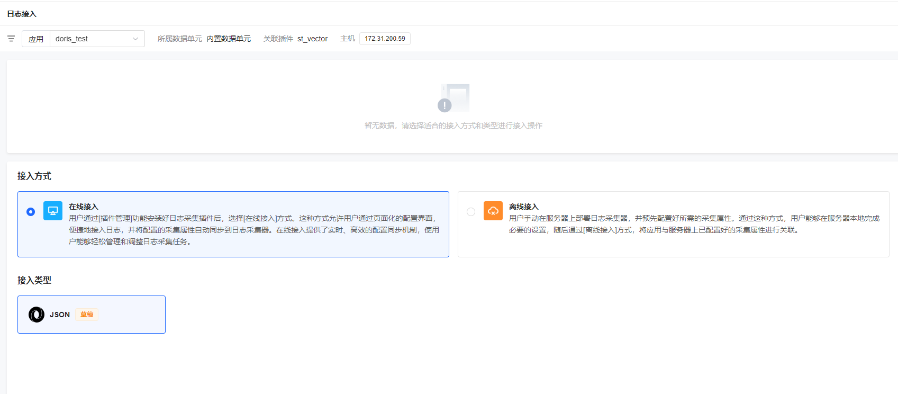

#### 选择主机
选择需要接入的主机, 可以选择某几台主机进行接入
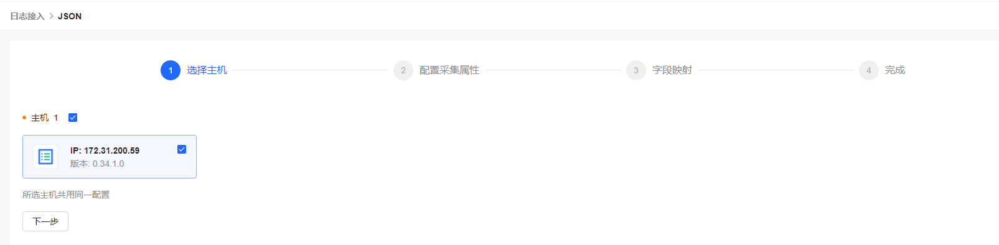

#### 配置采集属性
配置采集属性, 这里配置的日志路径是`/data/ob/logs/service/logs/info.log`, 则会采集`/data/ob/logs/service/logs`目录下的info.log文件
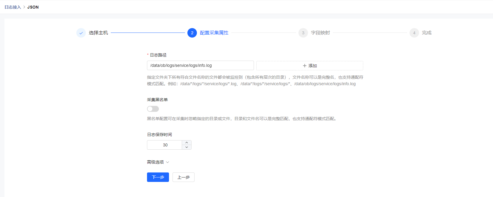

#### 配置字段映射
点击字段映射的自动解析, 将日志样例Json数据复制进去, 调整为如下格式
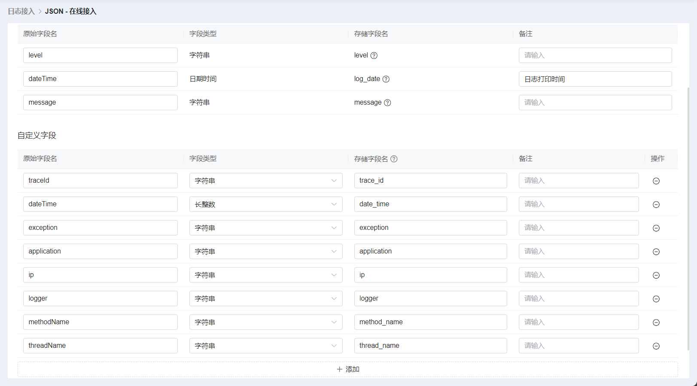

#### 完成接入
点击完成,接入完成后可以回到日志接入页面查看接入详情, 也可以在日志检索页面查看日志具体内容
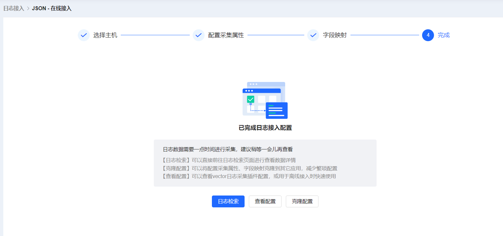
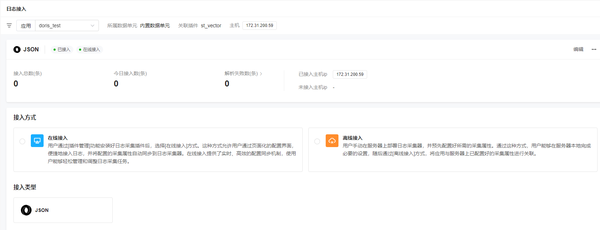

### JSON离线接入案例

#### 日志输出样例
日志文件中不涉及跨行输出，每一行都是一条日志
```json
{
    "traceId":"",
    "level":"INFO",
    "dateTime":1700706936805920072,
    "ip":"172.30.12.119",
    "application":"LokiTest",
    "methodName":"logTest",
    "logger":"com.my.loki.test.LogTest",
    "message":"The turtle can grow up to 303 years old, and this year it is 147 years old.",
    "exception":"",
    "source":"71db762c-74e2-4e23-bb7b-04c0e66db6fd",
    "threadName":"main"
}
```
离线接入步骤与在线接入基本一致, 区别在于离线接入不需要选择主机，且需要手动配置日志采集器。
以下是离线接入的具体步骤

#### 选择应用
在日志接入页面, 选择需要接入日志的应用, 选择应用后, 会展示当前应用的接入详情, 
包括是否接入、所属数据单元、插件信息、主机列表

接入方式选择离线接入, 接入类型选择JSON
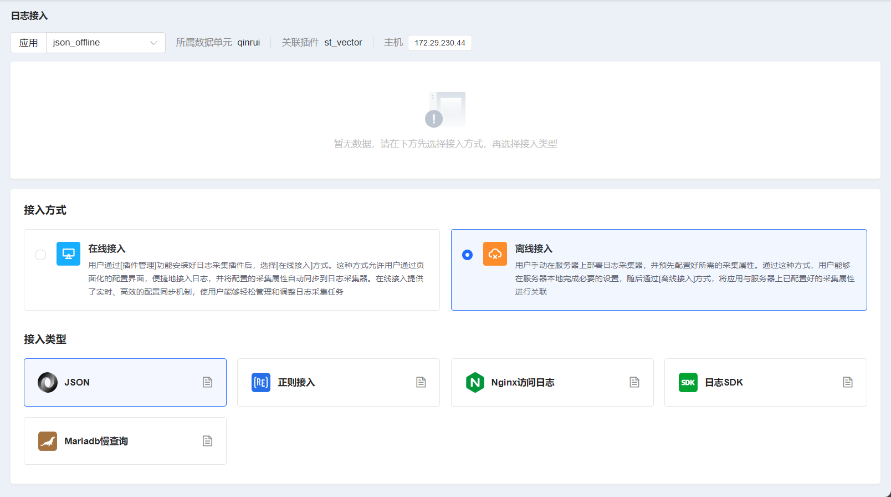

#### 配置采集属性
配置采集属性, 这里配置的日志路径是`/data/ob/logs/service/logs/info.log`, 则会采集`/data/ob/logs/service/logs`目录下的info.log文件
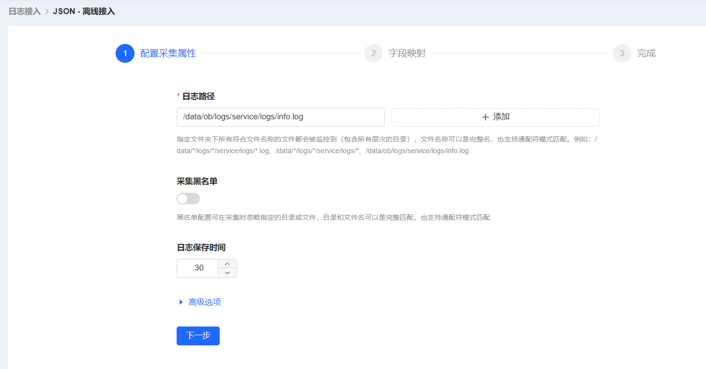

#### 配置字段映射
点击字段映射的自动解析, 将日志样例JSON数据复制进去, 调整为如下格式
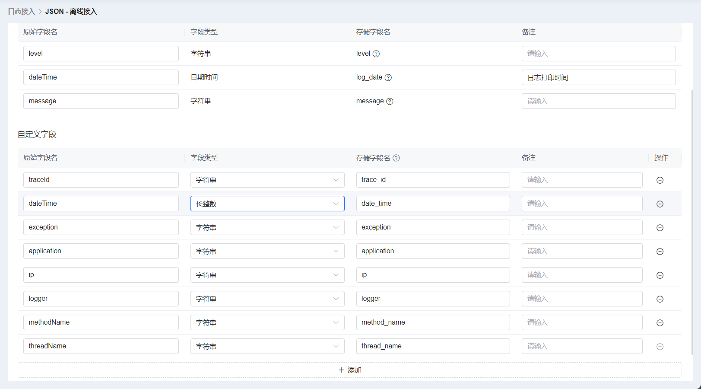

#### 完成接入
点击完成, 点击查看配置可以复制平台生成的`vector`配置文件内容（JSON）,在后面的配置日志采集器步骤中使用；
如有需要，也可点击克隆配置将当前配置克隆到其他应用。
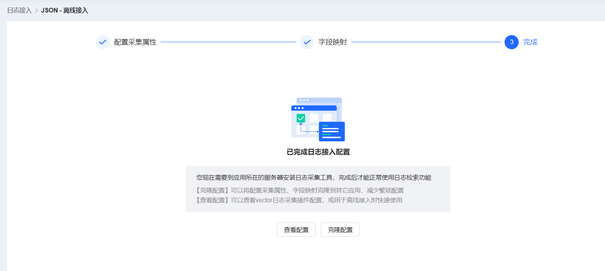
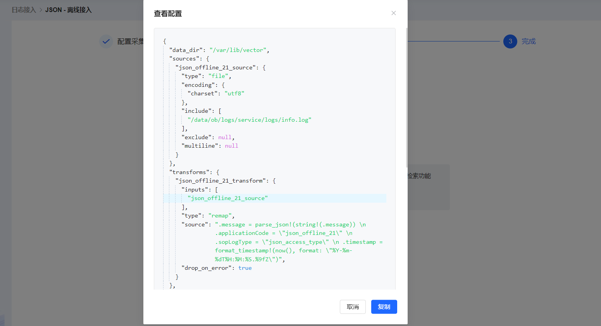
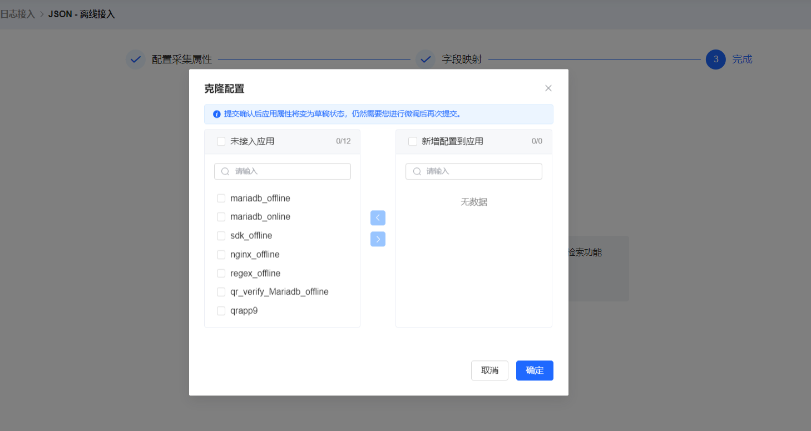

接入完成后可以回到日志接入页面查看接入详情, 也可以在日志检索页面查看日志具体内容
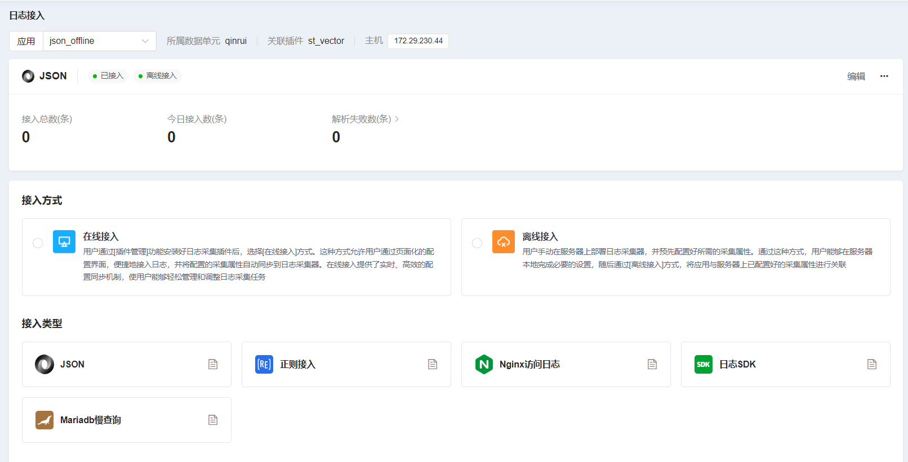


#### 手动配置日志采集器
离线接入需要手动配置日志采集器

##### 未接入过应用
如果安装的日志采集器`vector`没有接入过应用, 
在`vector`安装目录的`config`目录下创建`vector.json`配置文件,
将前面复制的`vector`配置文件内容粘贴到`vector.json`中, 
即完成日志采集器配置

##### 已接入过应用
如下图所示，假设`vector`已接入`app1`应用(其`applicationCode`为`app1_21`,系统自动生成)，
现在要接入`json_offline`应用(其`applicationCode`为`json_offline_21`,系统自动生成)，
只需将前面进行离线接入时复制的`vector`配置文件内容中
`json_offline`应用的`source`和`transform`字段内容添加到已有`vector.json`配置文件的相应位置，
并在`sinks`中添加新增`json_offline`应用的`transform`即完成日志采集器配置。

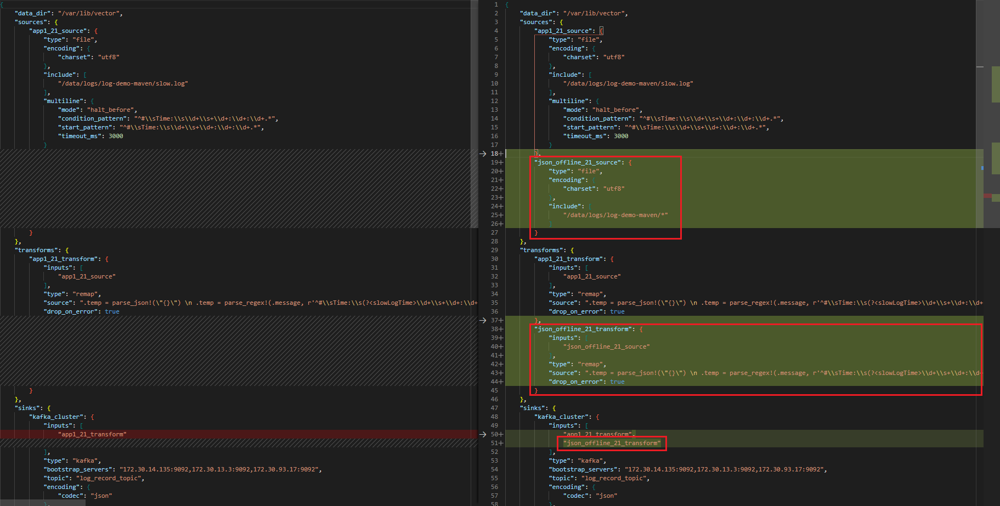

以下是新增应用前后的`vector.json`示例
新增`json_offline`应用前的`vector.json`：
```json
{
    "data_dir": "/var/lib/vector",
    "sources": {
        "app1_21_source": {
            "type": "file",
            "encoding": {
                "charset": "utf8"
            },
            "include": [
                "/data/logs/log-demo-maven/slow.log"
            ],
            "multiline": {
                "mode": "halt_before",
                "condition_pattern": "^#\\sTime:\\s\\d+\\s+\\d+:\\d+:\\d+.*",
                "start_pattern": "^#\\sTime:\\s\\d+\\s+\\d+:\\d+:\\d+.*",
                "timeout_ms": 3000
            }
        }
    },
    "transforms": {
        "app1_21_transform": {
            "inputs": [
                "app1_21_source"
            ],
            "type": "remap",
            "source": ".temp = parse_json!(\"{}\") \n .temp = parse_regex!(.message, r'^#\\sTime:\\s(?<slowLogTime>\\d+\\s+\\d+:\\d+:\\d+)\\n#\\sUser@Host:\\s(?<user>.*)\\s+@\\s+(?<slowLogHost>.*)\\n#\\sThread_id:\\s(?<threadId>.*)\\s+Schema:\\s(?<schema>.*)\\s+QC_hit:\\s(?<qcHit>.*)\\n#\\sQuery_time:\\s(?<queryCostTime>.*)\\s+Lock_time:\\s(?<lockTime>.*)\\s+Rows_sent:\\s(?<rowsSent>.*)\\s+Rows_examined:(?<rowsExamined>.*)\\n#\\sRows_affected:\\s(?<rowsAffected>.*)\\s+Bytes_sent:\\s(?<bytesSent>.*)\\n(?<sql>[\\s\\S]*)') \n .message = .temp \n del(.temp) \n .applicationCode = \"mariadb_online_21\" \n .sopLogType = \"json_access_type\" \n .timestamp = format_timestamp!(now(), format: \"%Y-%m-%dT%H:%M:%S.%9fZ\")",
            "drop_on_error": true
        }
    },
    "sinks": {
        "kafka_cluster": {
            "inputs": [
                "app1_21_transform"
            ],
            "type": "kafka",
            "bootstrap_servers": "172.30.14.135:9092,172.30.13.3:9092,172.30.93.17:9092",
            "topic": "log_record_topic",
            "encoding": {
                "codec": "json"
            },
            "batch": {
                "max_bytes": 10485760,
                "max_events": 10000,
                "timeout_secs": 1
            },
            "buffer": {
                "when_full": "block",
                "type": "disk",
                "max_size": 268435488
            }
        }
    }
}
```

新增`json_offline`应用后的`vector.json`：
```json
{
    "data_dir": "/var/lib/vector",
    "sources": {
        "app1_21_source": {
            "type": "file",
            "encoding": {
                "charset": "utf8"
            },
            "include": [
                "/data/logs/log-demo-maven/slow.log"
            ],
            "multiline": {
                "mode": "halt_before",
                "condition_pattern": "^#\\sTime:\\s\\d+\\s+\\d+:\\d+:\\d+.*",
                "start_pattern": "^#\\sTime:\\s\\d+\\s+\\d+:\\d+:\\d+.*",
                "timeout_ms": 3000
            }
        },
        "json_offline_21_source": {
            "type": "file",
            "encoding": {
              "charset": "utf8"
            },
            "include": [
             "/data/logs/log-demo-maven/*"
            ]
        }
    },
    "transforms": {
        "app1_21_transform": {
            "inputs": [
                "app1_21_source"
            ],
            "type": "remap",
            "source": ".temp = parse_json!(\"{}\") \n .temp = parse_regex!(.message, r'^#\\sTime:\\s(?<slowLogTime>\\d+\\s+\\d+:\\d+:\\d+)\\n#\\sUser@Host:\\s(?<user>.*)\\s+@\\s+(?<slowLogHost>.*)\\n#\\sThread_id:\\s(?<threadId>.*)\\s+Schema:\\s(?<schema>.*)\\s+QC_hit:\\s(?<qcHit>.*)\\n#\\sQuery_time:\\s(?<queryCostTime>.*)\\s+Lock_time:\\s(?<lockTime>.*)\\s+Rows_sent:\\s(?<rowsSent>.*)\\s+Rows_examined:(?<rowsExamined>.*)\\n#\\sRows_affected:\\s(?<rowsAffected>.*)\\s+Bytes_sent:\\s(?<bytesSent>.*)\\n(?<sql>[\\s\\S]*)') \n .message = .temp \n del(.temp) \n .applicationCode = \"mariadb_online_21\" \n .sopLogType = \"json_access_type\" \n .timestamp = format_timestamp!(now(), format: \"%Y-%m-%dT%H:%M:%S.%9fZ\")",
            "drop_on_error": true
        },
        "json_offline_21_transform": {
            "inputs": [
              "json_offline_21_source"
            ],
            "type": "remap",
            "source": ".temp = parse_json!(\"{}\") \n .temp = parse_regex!(.message, r'^#\\sTime:\\s(?<slowLogTime>\\d+\\s+\\d+:\\d+:\\d+)\\n#\\sUser@Host:\\s(?<user>.*)\\s+@\\s+(?<slowLogHost>.*)\\n#\\sThread_id:\\s(?<threadId>.*)\\s+Schema:\\s(?<schema>.*)\\s+QC_hit:\\s(?<qcHit>.*)\\n#\\sQuery_time:\\s(?<queryCostTime>.*)\\s+Lock_time:\\s(?<lockTime>.*)\\s+Rows_sent:\\s(?<rowsSent>.*)\\s+Rows_examined:(?<rowsExamined>.*)\\n#\\sRows_affected:\\s(?<rowsAffected>.*)\\s+Bytes_sent:\\s(?<bytesSent>.*)\\n(?<sql>[\\s\\S]*)') \n .message = .temp \n del(.temp) \n .applicationCode = \"qrapp8_21\" \n .sopLogType = \"json_access_type\" \n .timestamp = format_timestamp!(now(), format: \"%Y-%m-%dT%H:%M:%S.%9fZ\")",
            "drop_on_error": true
        }
    },
    "sinks": {
        "kafka_cluster": {
            "inputs": [
                "app1_21_transform",
                "json_offline_21_transform"
            ],
            "type": "kafka",
            "bootstrap_servers": "172.30.14.135:9092,172.30.13.3:9092,172.30.93.17:9092",
            "topic": "log_record_topic",
            "encoding": {
                "codec": "json"
            },
            "batch": {
                "max_bytes": 10485760,
                "max_events": 10000,
                "timeout_secs": 1
            },
            "buffer": {
                "when_full": "block",
                "type": "disk",
                "max_size": 268435488
            }
        }
    }
}
```


#### 启动日志采集器
配置好后启动日志采集器, 进入到日志采集器安装目录执行如下命令
```shell
nohup ./bin/vector --config config/vector.json -w > nohup.log 2>&1 &
```

## Nginx访问日志接入文档

Nginx访问日志接入可以快速的接入Nginx的access日志, 同时提取了常用的nginx字段, 整合了Nginx监控仪表盘 

### 修改Nginx的配置文件

离线接入和在线接入都必须要先修改 Nginx 的配置文件，实现两个功能：

- 配置 Nginx 的 access.log 的日志输出格式
- 实现 access.log 和 error.log 按天切割，过期删除（比如只保存最近7天的日志）

打开 Nginx 的配置文件 `nginx.conf` , 修改 log_format 日志格式和日志存储路径。 注意，log_format 后面的 main 需要和 access_log 最后的 main 相同, 且 log_format 的配置必须在配置日志存储路径的上方：

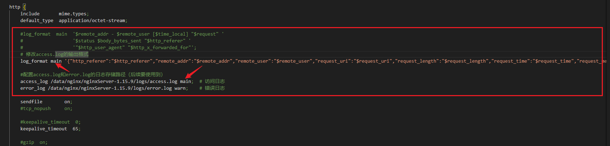

log_format 和日志存储路径的详细内容为：

```
# 修改access.log的输出格式(必须这样写，不能人为修改)
log_format main '{"http_referer":"$http_referer","remote_addr":"$remote_addr","remote_user":"$remote_user","request_uri":"$request_uri","request_length":"$request_length","request_time":"$request_time","request_method":"$request_method","upstream_addr":"$upstream_addr","upstream_response_time":"$upstream_response_time","http_user_agent":"$http_user_agent","http_x_forwarded_for":"$http_x_forwarded_for","status":"$status","time_local":"$time_iso8601","body_bytes_sent":"$body_bytes_sent","bytes_sent":"$bytes_sent","connection":"$connection","host":"$host","uri":"$uri"}';

# 配置access.log和error.log的日志存储路径（可以自定义存储路径，error.log 的日志级别warn也可根据需求修改）
access_log /data/nginx/nginxServer-1.15.9/logs/access.log main;  # 访问日志
error_log /data/nginx/nginxServer-1.15.9/logs/error.log warn;    # 错误日志
```

使用修改后的配置文件启动 Nginx，使用命令： `nginx -s reload`, 重新加载配置

实现日志切割和过期删除前，需要确保系统有 `logrotate` 环境，使用命令检查是否安装 `logrotate` ：

````shell
rpm -qa | grep logrotate   # centos；基于 RPM 包的麒麟版本
dpkg -l | grep logrotate   # Ubuntu；基于 Debian 包的麒麟版本
````

应出现的结果 logrotate 的版本 ，如若没有 `logrotate` 的环境，需要自行安装后再进行后续的操作。

在 `/etc/logrotate.d/` 目录下为 Nginx 创建一个新的名为 `nginx` 配置文件：

````shell
# 创建一个新的 nginx 配置文件，用于实现日志按天切割和过期删除：
touch /etc/logrotate.d/nginx
vim /etc/logrotate.d/nginx
````

logrotate 的 `nginx` 配置文件的内容如下：

````
# 需要配置为自己的access.log日志存储路径
/data/nginx/nginxServer-1.15.9/logs/access.log {
    daily                   
    missingok                         
    compress                
    delaycompress          
    notifempty                
    dateext                
    dateformat -%Y-%m-%d    
    sharedscripts          
    postrotate
        # 日志路径需要配置成自己的
        mv /data/nginx/nginxServer-1.15.9/logs/access.log-$(date +\%Y-\%m-\%d) /data/nginx/nginxServer-1.15.9/logs/access-$(date +\%Y-\%m-\%d).log
        # 需要配置为自己的nginx.pid
        if [ -f /data/nginx/nginxServer-1.15.9/logs/nginx.pid ]; then
            kill -USR1 `cat /data/nginx/nginxServer-1.15.9/logs/nginx.pid`
        fi
    endscript
}

# 需要配置为自己的error.log日志存储路径
/data/nginx/nginxServer-1.15.9/logs/error.log {
    daily                   
    missingok                             
    compress                
    delaycompress          
    notifempty              
    dateext                
    dateformat -%Y-%m-%d    
    sharedscripts          
    postrotate
        # 日志路径需要配置成自己的
        mv /data/nginx/nginxServer-1.15.9/logs/error.log-$(date +\%Y-\%m-\%d) /data/nginx/nginxServer-1.15.9/logs/error-$(date +\%Y-\%m-\%d).log
        # 需要配置为自己的nginx.pid
        if [ -f /data/nginx/nginxServer-1.15.9/logs/nginx.pid ]; then
            kill -USR1 `cat /data/nginx/nginxServer-1.15.9/logs/nginx.pid`
        fi
    endscript
}
````

编辑好的 logrotate 的 `nginx` 配置文件，使用如下命令测试：

````shell
sudo logrotate -f /etc/logrotate.d/nginx
````

执行命令无报错，并且能在 nginx 的日志目录下查看到格式为 `access-yyyy-MM-dd.log` 和 `error-yyyy-MM-dd.log` 的文件，即成功实现日志切割。

由于使用 logrotate 修改了日志文件格式，所以需要使用 cron 表达式，定时执行任务：

````shell
# 编辑 crontab 配置文件：
crontab -e
# 每天 2 点执行任务(替换日志存储路径)：
0 2 * * * find /data/nginx/nginxServer-1.15.9/logs/ -type f -name "access-*.log" -mtime +7 -exec rm -f {} \;
0 2 * * * find /data/nginx/nginxServer-1.15.9/logs/ -type f -name "error-*.log" -mtime +7 -exec rm -f {} \;
````

即成功实现日志过期删除策略。

### Nginx访问日志在线接入案例

#### 选择应用
在日志接入页面, 选择需要接入日志的Nginx应用, Nginx接入也需要先创建应用

选择应用后, 会展示当前应用的接入详情, 包括是否接入、所属数据单元、插件信息、主机列表

如果该应用所在数据单元在`环境配置`没有安装过日志插件, 则只会展示该应用的数据单元信息, 插件信息为`-`

接入方式选择在线接入, 接入类型选择Nginx访问日志
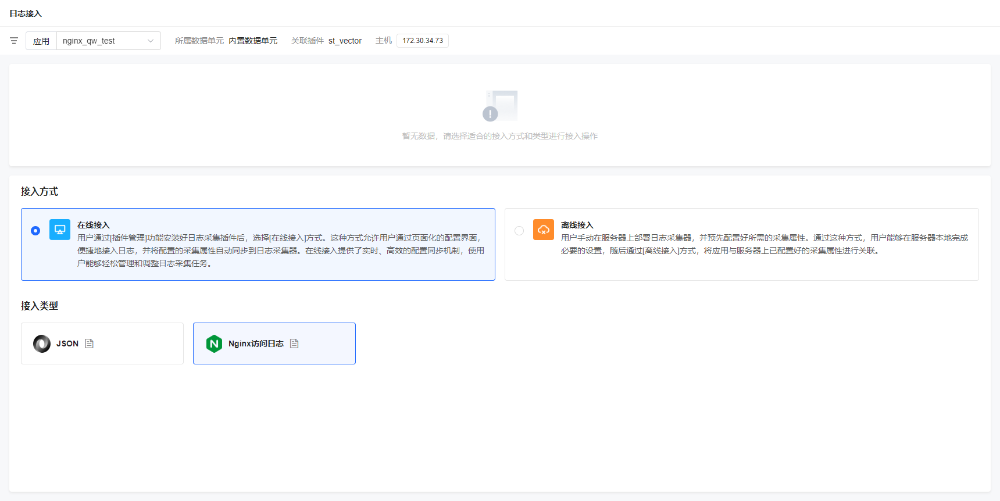


#### 选择主机
选择需要接入的主机, 可以选择某几台主机进行接入
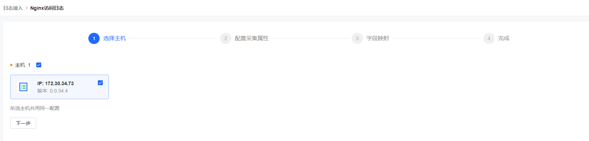

#### 配置采集属性
配置采集属性, 这里配置的日志路径是`/usr/local/nginx/logs/access.log`, 则会采集`/usr/local/nginx/logs`目录下的access.log日志文件
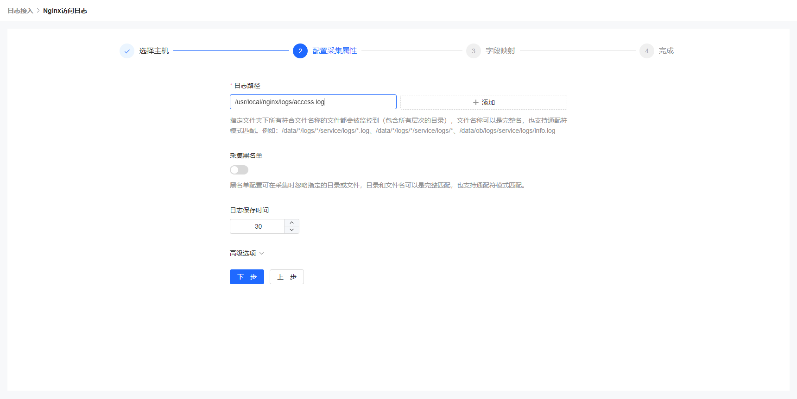

#### 配置字段映射
进入字段映射页面, 根据之前配置log_format日志格式, 自动填充好原始字段和存储字段的对应关系

如果增加或者删减log_format格式中的字段, 也需要同步在自定义字段中增减字段映射关系
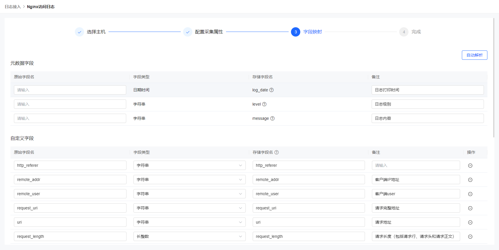

#### 完成接入
点击完成,接入完成后可以回到日志接入页面查看接入详情, 也可以在日志检索页面查看日志具体内容
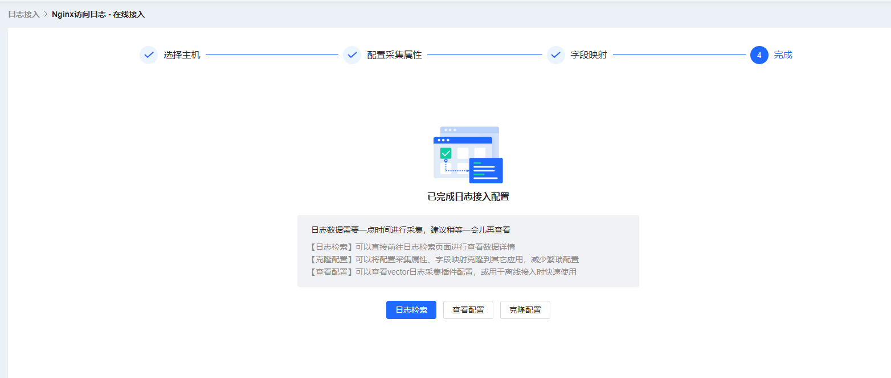
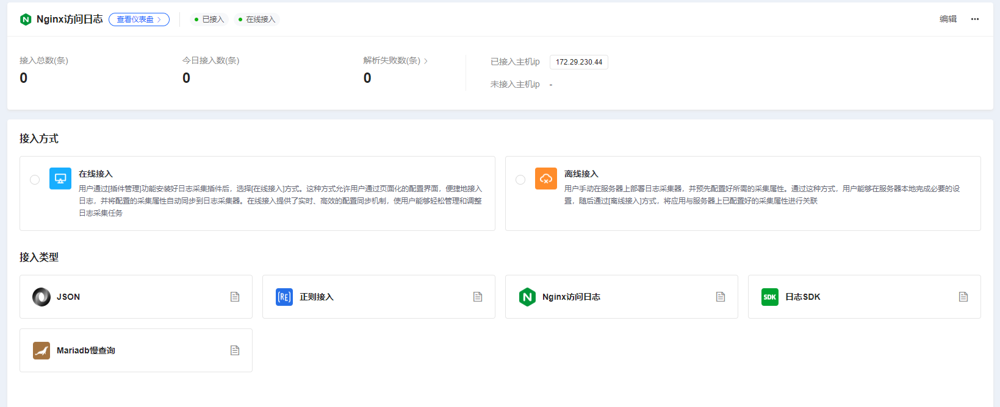


### Nginx访问日志离线接入案例

离线接入步骤与在线接入基本一致, 区别在于离线接入不需要选择主机，且需要手动配置日志采集器。
以下是离线接入的具体步骤


#### 选择应用
在日志接入页面, 选择需要接入日志的Nginx应用, Nginx接入也需要先创建应用

选择应用后, 会展示当前应用的接入详情, 包括是否接入、所属数据单元、插件信息、主机列表

如果该应用所在数据单元在`环境配置`没有安装过日志插件, 则只会展示该应用的数据单元信息, 插件信息为`-`

接入方式选择离线接入, 接入类型选择Nginx访问日志
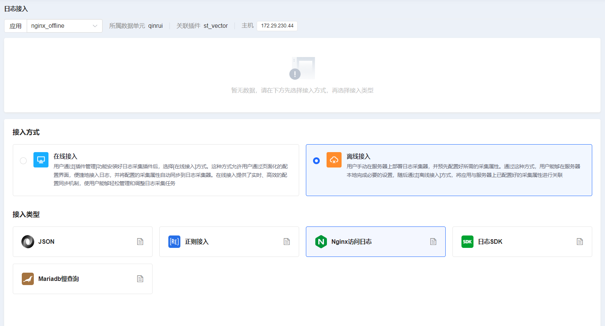


#### 配置采集属性
配置采集属性, 这里配置的日志路径是`/usr/local/nginx/logs/access.log`, 则会采集`/usr/local/nginx/logs`目录下的access.log日志文件
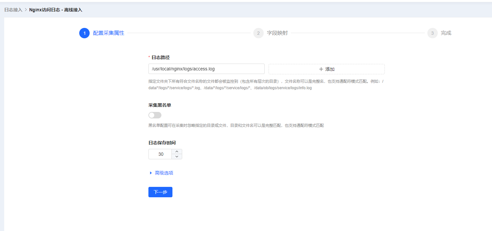


#### 配置字段映射
进入字段映射页面, 根据之前配置log_format日志格式, 自动填充好原始字段和存储字段的对应关系
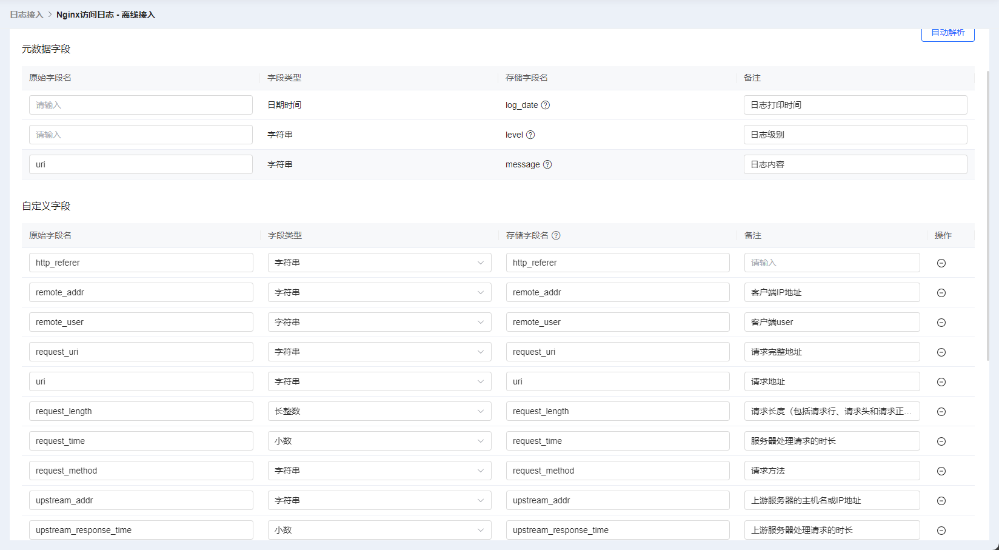

如果增加或者删减log_format格式中的字段, 也需要同步在自定义字段中增减字段映射关系
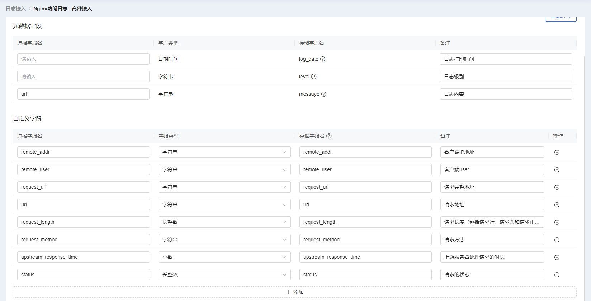

#### 完成接入
点击完成, 点击查看配置可以复制平台生成的`vector`配置文件内容（JSON）,在后面的配置日志采集器步骤中使用；
如有需要，也可点击克隆配置将当前配置克隆到其他应用。
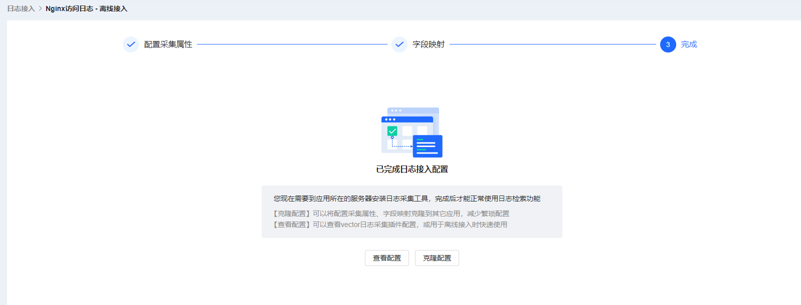
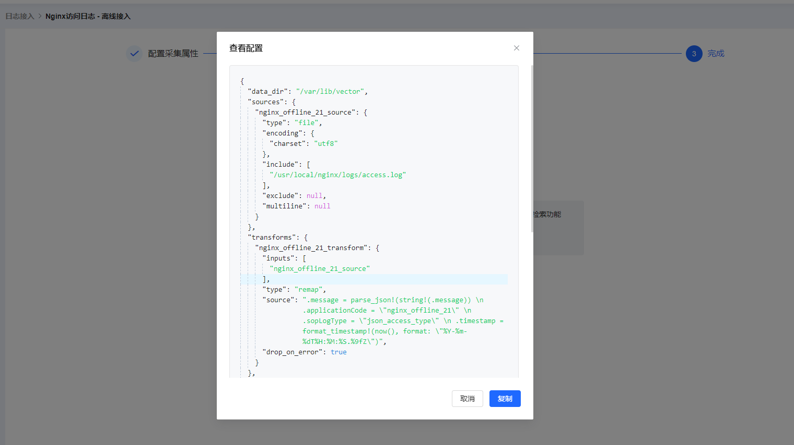
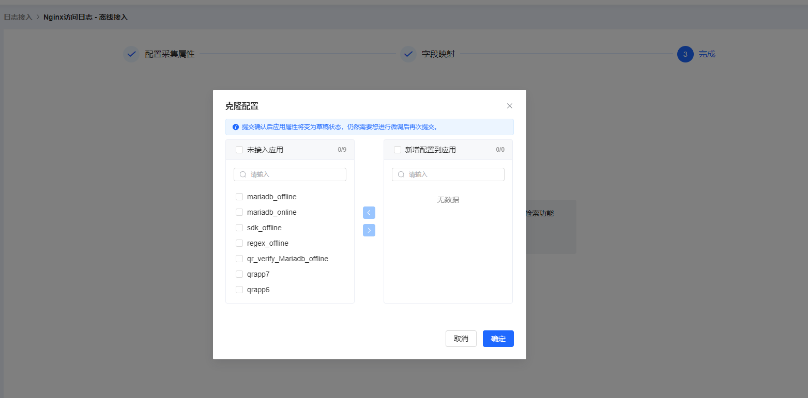

接入完成后，可以在日志接入页面查看接入详情, 也可以在日志检索页面查看日志具体内容)
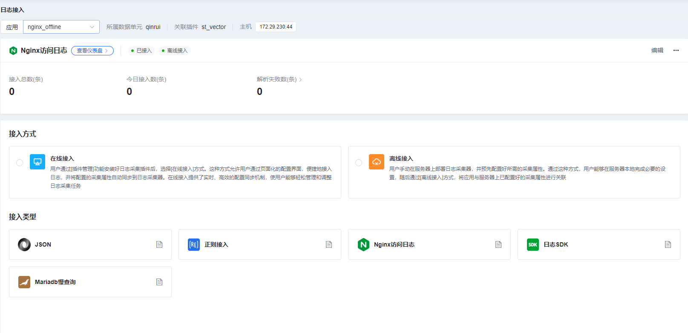


#### 手动配置日志采集器

##### 未接入过应用
如果安装的日志采集器`vector`没有接入过应用,
在`vector`安装目录的`config`目录下创建`vector.json`配置文件,
将前面复制的`vector`配置文件内容粘贴到`vector.json`中,
即完成日志采集器配置

##### 已接入过应用
如果安装的日志采集器`vector`已接入过其他应用,只需将前面复制的`vector`配置文件内容中
`sources`和`transforms`字段对应新增应用的内容添加到`vector.json`配置文件相应位置,
并在`sinks`中添加新增的`transform`, 即完成日志采集器配置


具体添加方式见`json`离线接入手动配置日志采集器[已接入过应用部分](#已接入过应用)

#### 启动日志采集器
配置好后启动日志采集器, 进入到日志采集器安装目录执行如下命令
```shell
nohup ./bin/vector --config config/vector.json -w > nohup.log 2>&1 &
```


## 日志SDK类型接入文档

日志SDK类型接入针对的是Java应用并且已接入星迹提供的日志SDK, 日志SDK接入请参考[日志sdk接入](/quick/日志sdk接入.html)

### 日志SDK在线接入案例

#### 日志输出样例
应用接入日志SDK后日志文件输出内容如下，每一行都是一条日志
```json
{
    "traceId":"",
    "level":"INFO",
    "dateTime":1700706936805920072,
    "ip":"172.30.12.119",
    "application":"LokiTest",
    "methodName":"logTest",
    "logger":"com.my.loki.test.LogTest",
    "message":"The turtle can grow up to 303 years old, and this year it is 147 years old.",
    "exception":"",
    "source":"71db762c-74e2-4e23-bb7b-04c0e66db6fd",
    "threadName":"main"
}
```

#### 选择应用
在日志接入页面, 选择需要接入日志的应用, 选择应用后, 会展示当前应用的接入详情, 包括是否接入、所属数据单元、插件信息、主机列表

接入方式选择在线接入, 接入类型选择日志SDK
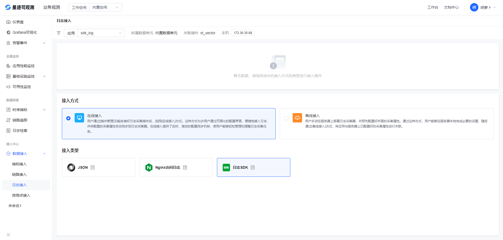

#### 选择主机
选择需要接入的主机, 可以选择某几台主机进行接入
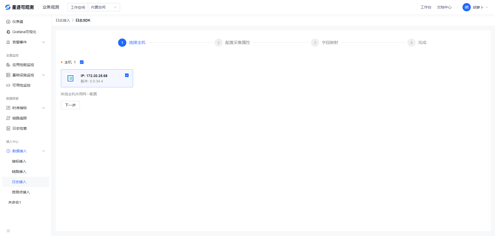

#### 配置采集属性
配置采集属性, 这里配置的日志路径是`/iflytek/service/log-test/logs/*`, 则会采集`/iflytek/service/log-test/logs/`目录下的所有文件
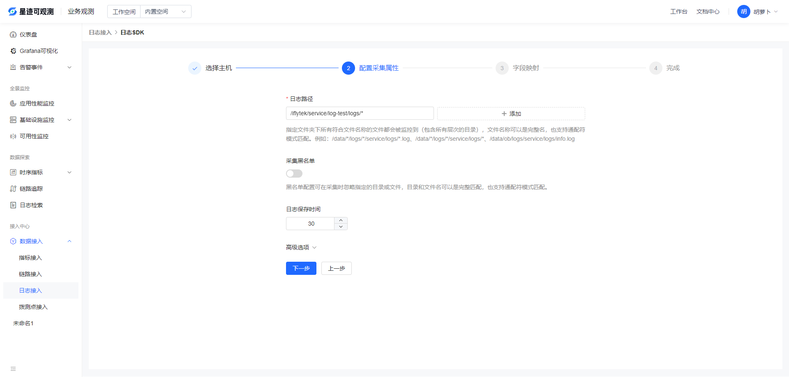

#### 配置字段映射
进入字段映射页面, 已内置好日志SDK的字段映射关系, 不需要再修改
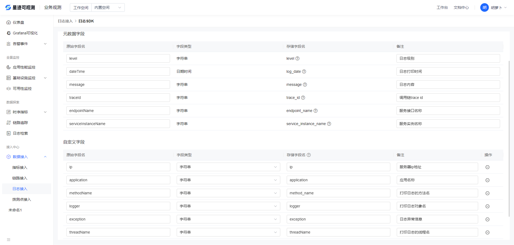

#### 完成接入
点击完成, 可以在日志接入页面查看接入详情, 也可以在日志检索页面查看日志具体内容
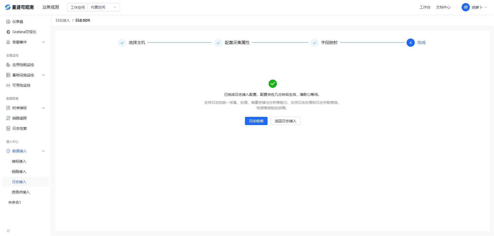
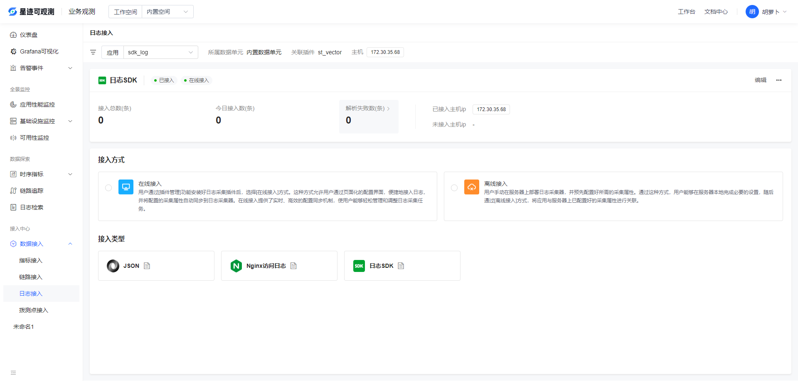

### 日志SDK离线接入案例

#### 日志输出样例
应用接入日志SDK后日志文件输出内容如下，每一行都是一条日志
```json
{
    "traceId":"",
    "level":"INFO",
    "dateTime":1700706936805920072,
    "ip":"172.30.12.119",
    "application":"LokiTest",
    "methodName":"logTest",
    "logger":"com.my.loki.test.LogTest",
    "message":"The turtle can grow up to 303 years old, and this year it is 147 years old.",
    "exception":"",
    "source":"71db762c-74e2-4e23-bb7b-04c0e66db6fd",
    "threadName":"main"
}
```

离线接入步骤与在线接入基本一致, 区别在于离线接入不需要选择主机，且需要手动配置日志采集器。  
以下是离线接入的具体步骤


#### 选择应用
在日志接入页面, 选择需要接入日志的应用, 选择应用后, 会展示当前应用的接入详情, 包括是否接入、所属数据单元、插件信息、主机列表

接入方式选择离线接入, 接入类型选择日志SDK
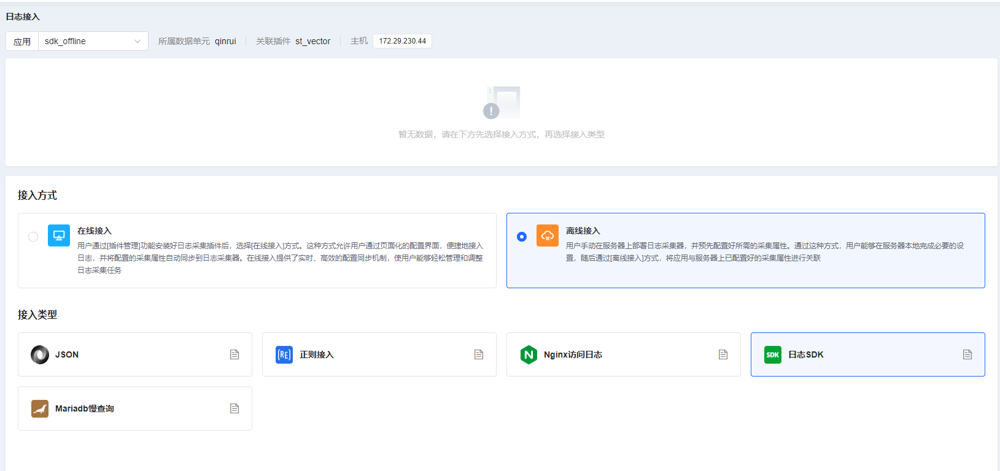


#### 配置采集属性
配置采集属性, 这里配置的日志路径是`/iflytek/service/log-test/logs/*`, 则会采集`/iflytek/service/log-test/logs/`目录下的所有文件
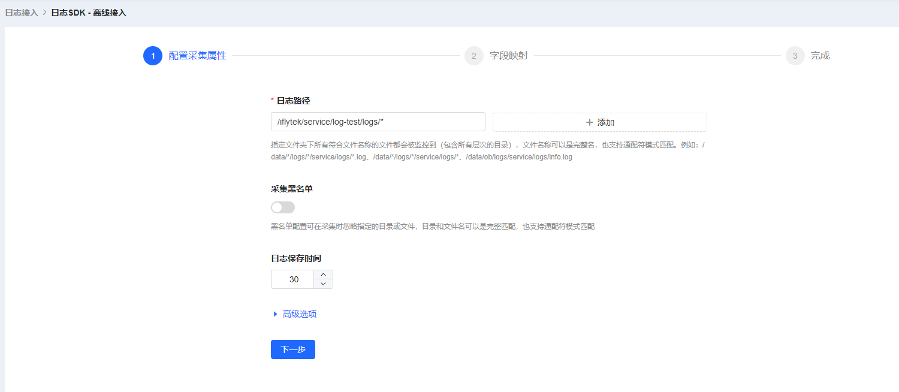

#### 配置字段映射
进入字段映射页面, 已内置好日志SDK的字段映射关系, 不需要再修改
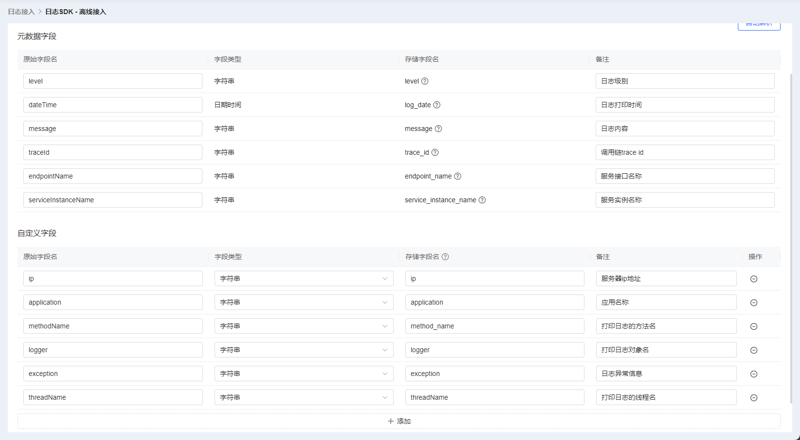

#### 完成接入
点击完成, 点击查看配置可以复制平台生成的`vector`配置文件内容（JSON）,在后面的配置日志采集器步骤中使用；
如有需要，也可点击克隆配置将当前配置克隆到其他应用。
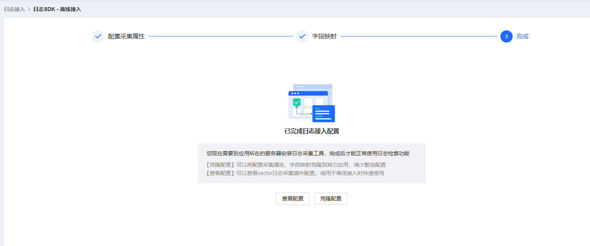
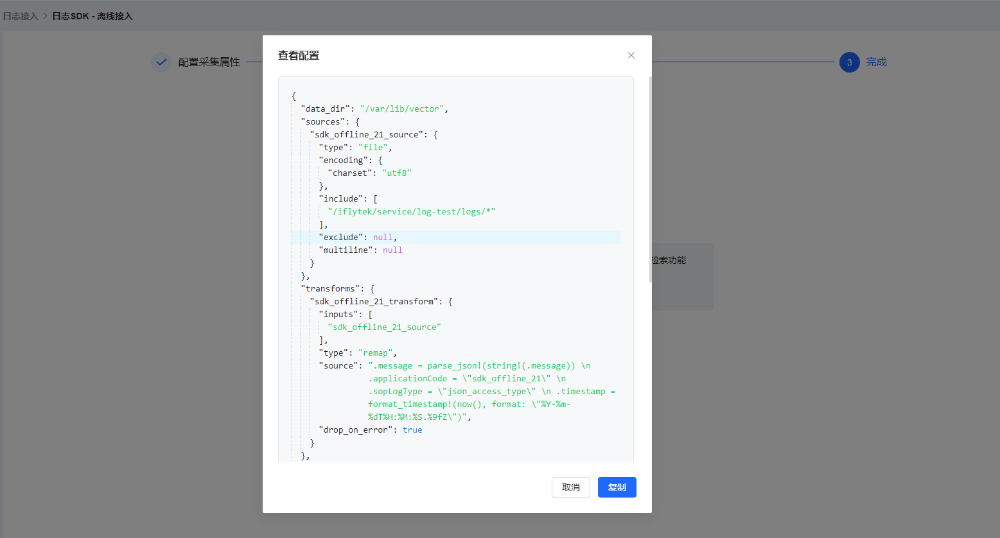
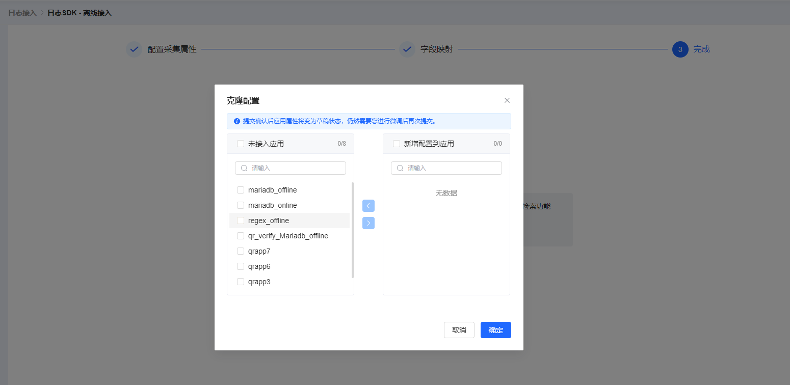

接入完成后，可以在日志接入页面查看接入详情, 也可以在日志检索页面查看日志具体内容)
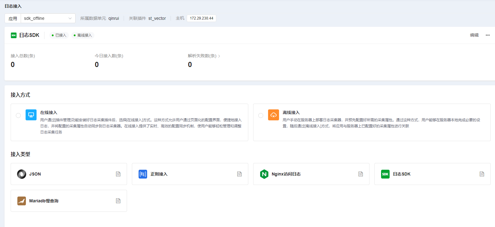


#### 手动配置日志采集器

##### 未接入过应用
如果安装的日志采集器`vector`没有接入过应用,
在`vector`安装目录的`config`目录下创建`vector.json`配置文件,
将前面复制的`vector`配置文件内容粘贴到`vector.json`中,
即完成日志采集器配置

##### 已接入过应用
如果安装的日志采集器`vector`已接入过其他应用,只需将前面复制的`vector`配置文件内容中
`sources`和`transforms`字段对应新增应用的内容添加到`vector.json`配置文件相应位置,
并在`sinks`中添加新增的`transform`, 即完成日志采集器配置

具体添加方式见`json`离线接入手动配置日志采集器[已接入过应用部分](#已接入过应用)

#### 启动日志采集器
配置好后启动日志采集器, 进入到日志采集器安装目录执行如下命令
```shell
nohup ./bin/vector --config config/vector.json -w > nohup.log 2>&1 &
```

## 日志正则类型接入文档
日志正则类型接入针对的是通过logback、log4j、log4j2等日志框架，根据配置pattern格式输出的日志采集

首先列出几种常见日志格式的样例和对应的正则式

日志示例1：

pattern："%d{yyyy-MM-dd HH:mm:ss.SSS} [%thread] %-5level %logger{50} L%line - %msg %n"

```text
2024-07-02 15:45:55.233 [http-nio-8100-exec-4] INFO  c.i.i.o.l.controller.LogAnalysisController L37 - 查询日志时间分布请求参数: applicationCode:sdk_log_1, type:LQL, query:, startTime:1569859200, endTime:1719906346 
2024-07-02 15:45:55.248 [http-nio-8100-exec-2] INFO  c.i.i.o.logplatform.application.LogQueryService L83 - build query to condition: QueryCondition(tableName=log_record_sdk_log_1, sql=SELECT *
FROM log_record_sdk_log_1
WHERE
	AND log_date >= '2019-10-01 00:00:00.000'
	AND log_date <= '2024-07-02 15:45:46.000'
ORDER BY log_date DESC
LIMIT 0, 20
```

```text
行首匹配正则：^\d{4}-\d{2}-\d{2}\s\d{2}:\d{2}:\d{2}\.\d{3}\s+\[.*\]\s+

正字段提取正则：^(?<logDate>\d{4}-\d{2}-\d{2}\s\d{2}:\d{2}:\d{2}\.\d{3})\s+\[(?<threadName>.*)\]\s+(?<level>.*)\s+(?<logger>.*)\s+L(?<line>\d+)\s+-\s+(?<msg>[\s\S]*)
```

日志示例2：

pattern：%d{yyyy-M-d HH:mm:ss.SSS,GMT+8} %t %p %logger{50}:%line - %m%n

```text
2024-7-3 00:00:00.018 scheduling-1 INFO c.iflytek.uap.login.base.start.RefreshAppCacheTask:46 - =================定时刷新应用缓存结束,用时6毫秒=================
2024-7-3 00:00:11.776 http-nio-8980-exec-10 WARN c.i.u.l.base.cas.service.login.BaseLoginServiceImp:436 - 检测到tgt为空或者已失效：null
```

```text
行首匹配正则：^\d{4}-\d+-\d+\s\d{2}:\d{2}:\d{2}\.\d{3}\s+.*\s+.*\s+.*:\d+\s

正字段提取正则：^(?P<log_date>\d{4}-\d+-\d+\s\d{2}:\d{2}:\d{2}\.\d{3})\s+(?P<thread_name>.*)\s+(?<level>.*)\s+(?<logger>.*)\s-\s(?P<msg>[\s\S]*)
```

日志示例3：

pattern："%d{yyyy-MM-dd HH:mm:ss.SSS} [%thread] %-5level %logger{50} - %msg %n"

```text
2024-04-18 21:58:26.169 [main] INFO  c.a.cloud.nacos.refresh.NacosContextRefresher - [Nacos Config] Listening config: dataId=swsj-as.yaml, group=swsj
111
222
2024-04-18 21:58:26.169 [main] INFO  c.a.cloud.nacos.refresh.NacosContextRefresher - [Nacos Config] Listening config: dataId=session-job.yaml, group=swsj
```

```text
行首匹配正则：^\d{4}-\d{2}-\d{2}\s\d{2}:\d{2}:\d{2}\.\d{3}\s+\[.*\]\s+.*\s+.*\s+-\s+

正字段提取正则：^(?<logDate>\d{4}-\d{2}-\d{2}\s\d{2}:\d{2}:\d{2}\.\d{3})\s+\[(?<threadName>.*)\]\s+(?<level>.*)\s+(?<logger>.*)\s+-\s+(?<msg>[\s\S]*)
```

日志示例4：

pattern："%d{yyyy-MM-dd HH:mm:ss.SSS,CTT} | %-5level | %thread | %-50logger{50} :%-4line | %msg%n"

```text
2024-07-16 19:19:49.654 | INFO  | http-nio-9004-exec-2 | c.i.itsc.web.exception.GlobalExceptionHandler      :54   | 请求地址:/auth/refreshToken,参数异常:刷新token不能为空
2024-07-16 19:19:49.847 | INFO  | http-nio-9004-exec-10 | c.i.itsc.web.exception.GlobalExceptionHandler      :54   | 请求地址:/auth/refreshToken,参数异常:刷新token不能为空
```

```text
行首匹配正则：^\d{4}-\d{2}-\d{2}\s\d{2}:\d{2}:\d{2}\.\d{3}\s\|

正字段提取正则：^(?<logDate>\d{4}-\d{2}-\d{2}\s\d{2}:\d{2}:\d{2}\.\d{3})\s\|\s+(?<level>.*)\s+\|\s(?<threadName>.*)\s\|\s(?<loger>.*)\s+:(?<line>\d+)\s+\|\s(?<msg>[\s\S]*)
```


### 正则日志在线接入案例
#### 选择应用
在日志接入页面, 选择需要接入日志的应用, 选择应用后, 会展示当前应用的接入详情, 包括是否接入、所属数据单元、插件信息、主机列表

接入方式选择在线接入, 接入类型选择正则接入
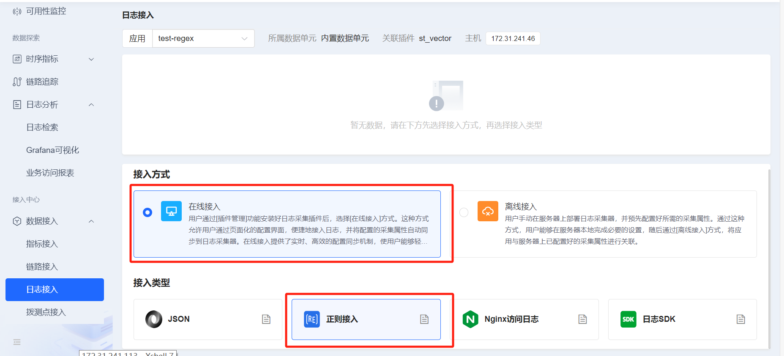

#### 选择主机
选择需要接入的主机, 可以选择某几台主机进行接入
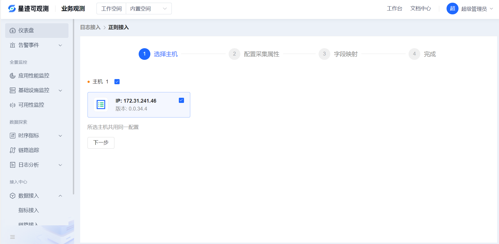

#### 配置采集属性
配置采集属性, 这里配置的日志路径是`/iflytek/service/log-test/logs/*`, 则会采集`/iflytek/service/log-test/logs/`目录下的所有文件
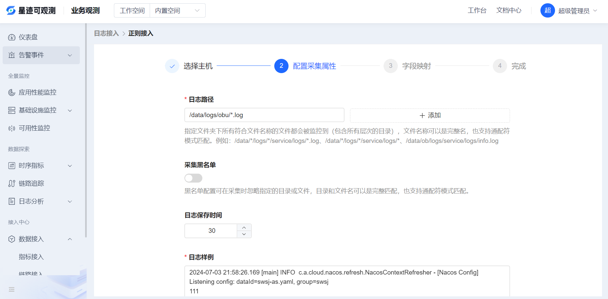

输入日志样例，可以从日志文件中摘取两行输入样例框，以便后续进行格式校验和字段提取校验

多行模式开关，如果日志打印有换行，比如异常栈信息打印，需打开多行模式开关，输入行首匹配的正则，采集组件采集日志时，会根据行首正则进行跨行处理，以保持日志的完整性，点击格式校验可以查看匹配出的日志行数
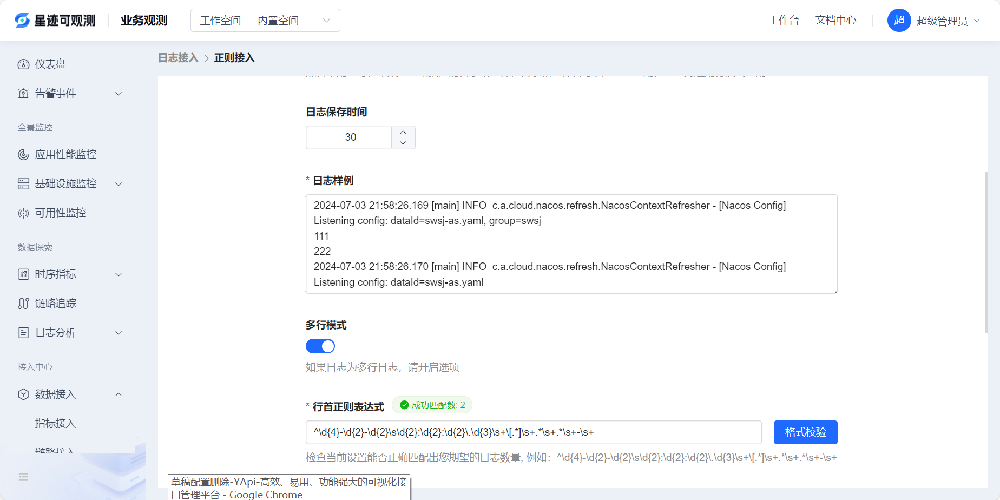

正则提取字段，根据格式输入字段提取正则表达式，点击校验会根据上面输入的日志样例和正则式提取出对应字段
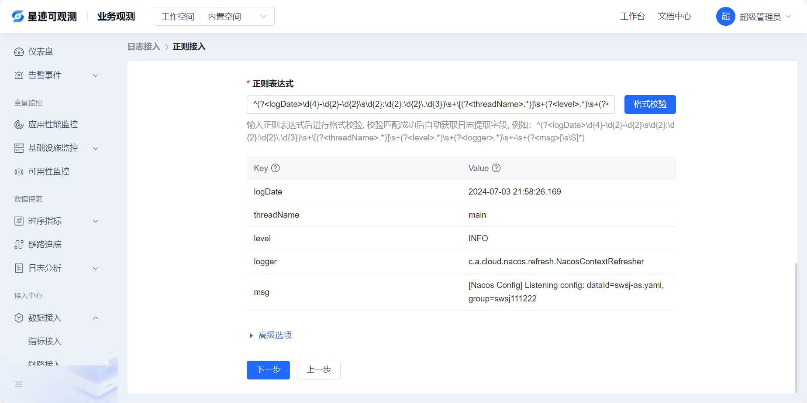

#### 配置字段映射
进入字段映射页面, 会显示默认的原始字段，并将上一步提取出的字段自动填到自定义字段中
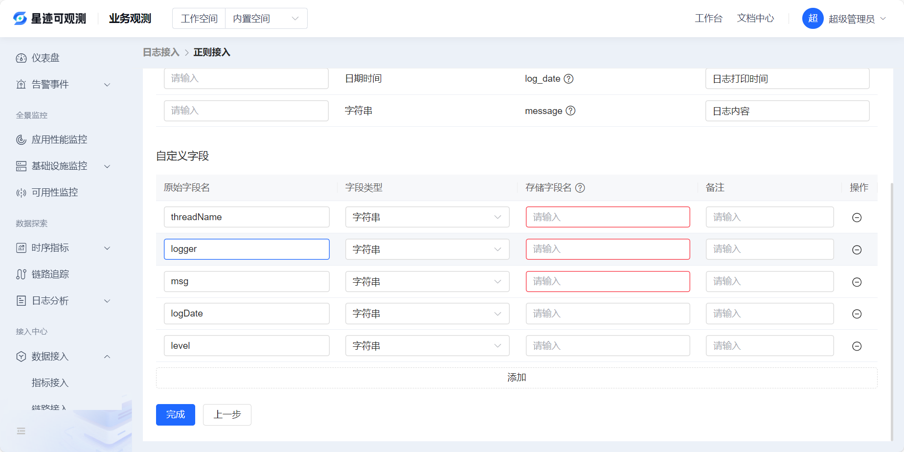

#### 完成接入
点击完成,接入完成后可以回到日志接入页面查看接入详情, 也可以在日志检索页面查看日志具体内容
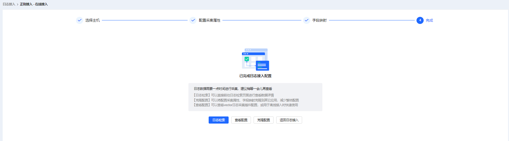
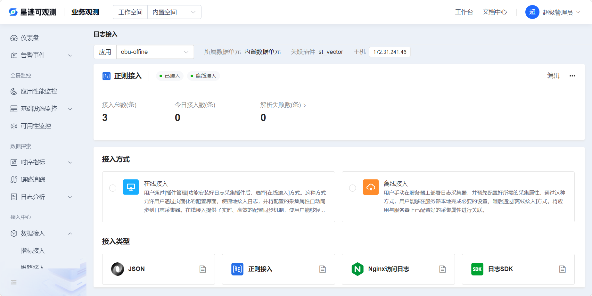


### 日志正则离线接入案例

#### 日志输出样例
```text
2024-04-18 21:58:26.169 [main] INFO  c.a.cloud.nacos.refresh.NacosContextRefresher - [Nacos Config] Listening config: dataId=swsj-as.yaml, group=swsj
111
222
2024-04-18 21:58:26.169 [main] INFO  c.a.cloud.nacos.refresh.NacosContextRefresher - [Nacos Config] Listening config: dataId=session-job.yaml, group=swsj
```

离线接入步骤与在线接入基本一致, 区别在于离线接入不需要选择主机，且需要手动配置日志采集器。  
以下是离线接入的具体步骤


#### 选择应用
在日志接入页面, 选择需要接入日志的应用, 选择应用后, 会展示当前应用的接入详情, 包括是否接入、所属数据单元、插件信息、主机列表

接入方式选择离线接入, 接入类型选择正则接入
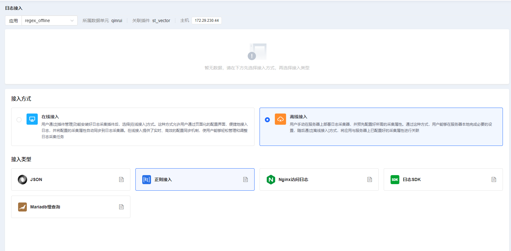


#### 配置采集属性
配置采集属性, 这里配置的日志路径是`/iflytek/service/log-test/logs/*`, 则会采集`/iflytek/service/log-test/logs/`目录下的所有文件
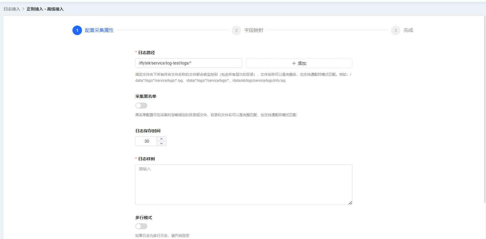

输入日志样例，可以从日志文件中摘取两行输入样例框，以便后续进行格式校验和字段提取校验

多行模式开关，如果日志打印有换行，比如异常栈信息打印，需打开多行模式开关，
输入行首匹配的正则，采集组件采集日志时，会根据行首正则进行跨行处理，以保持日志的完整性，点击格式校验可以查看匹配出的日志行数
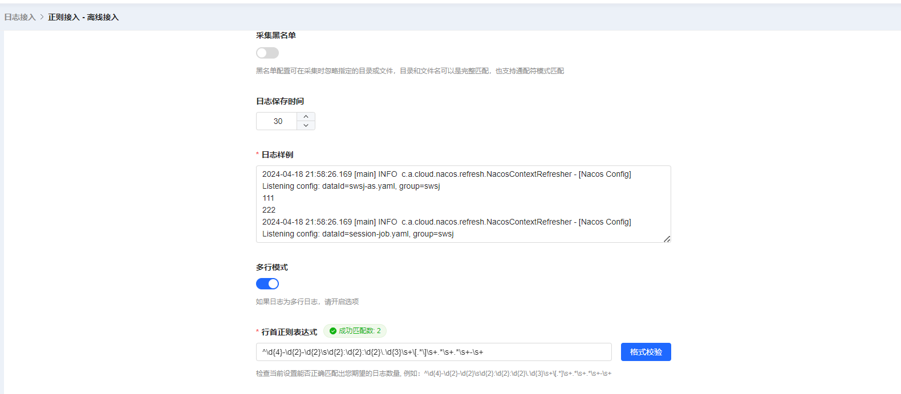

正则提取字段，根据格式输入字段提取正则表达式，点击校验会根据上面输入的日志样例和正则式提取出对应字段
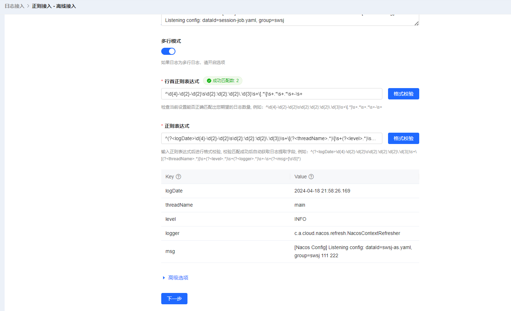


#### 配置字段映射
进入字段映射页面, 会显示默认的原始字段，并将上一步提取出的字段自动填到自定义字段中
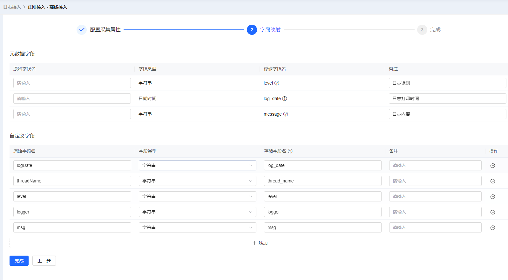

#### 完成接入
点击完成, 点击查看配置可以复制平台生成的`vector`配置文件内容（JSON）,在后面的配置日志采集器步骤中使用；
如有需要，也可点击克隆配置将当前配置克隆到其他应用。
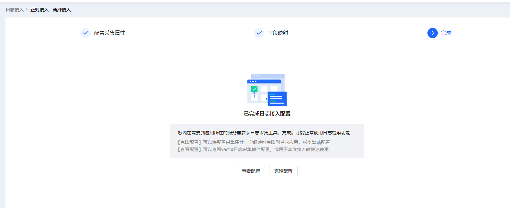
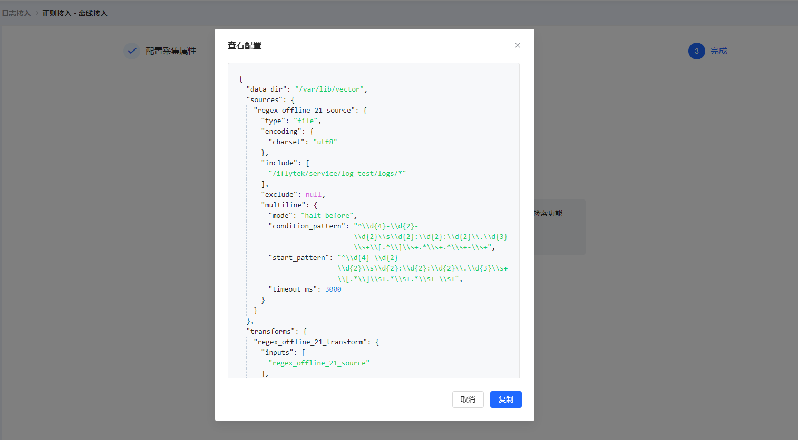
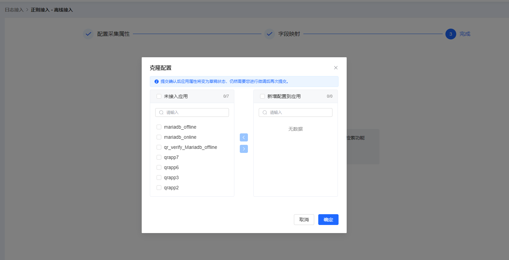

接入完成后，可以在日志接入页面查看接入详情, 也可以在日志检索页面查看日志具体内容)
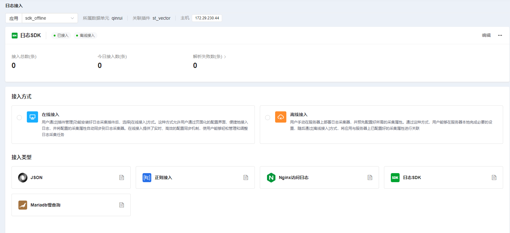


#### 手动配置日志采集器
##### 未接入过应用
如果安装的日志采集器`vector`没有接入过应用,
在`vector`安装目录的`config`目录下创建`vector.json`配置文件,
将前面复制的`vector`配置文件内容粘贴到`vector.json`中,
即完成日志采集器配置

##### 已接入过应用
如果安装的日志采集器`vector`已接入过其他应用,只需将前面复制的`vector`配置文件内容中
`sources`和`transforms`字段对应新增应用的内容添加到`vector.json`配置文件相应位置,
并在`sinks`中添加新增的`transform`, 即完成日志采集器配置

具体添加方式见`json`离线接入手动配置日志采集器[已接入过应用部分](#已接入过应用)

#### 启动日志采集器
配置好后启动日志采集器, 进入到日志采集器安装目录执行如下命令
```shell
nohup ./bin/vector --config config/vector.json -w > nohup.log 2>&1 &
```


## Mariadb慢查询接入文档


### Mariadb慢查询在线接入案例

#### Mariadb慢查询日志样例

```shell
# Time: 240823 15:52:11
# User@Host: u_gradeddomian_pre[u_gradeddomian_pre] @  [10.1.198.132]
# Thread_id: 8399  Schema: gradeddomian_pre  QC_hit: No
# Query_time: 325.098060  Lock_time: 0.000000  Rows_sent: 0  Rows_examined: 0
# Rows_affected: 0  Bytes_sent: 44
use gradeddomian_pre;
SET timestamp=1718689931;
ALTER TABLE gradeddomian_pre.t_ps_staff DROP INDEX if_person_domact;
```


#### 选择应用
在日志接入页面, 选择需要接入日志的应用, 选择应用后, 会展示当前应用的接入详情,
包括是否接入、所属数据单元、插件信息、主机列表

接入方式选择在线接入, 接入类型选择Mariadb慢查询
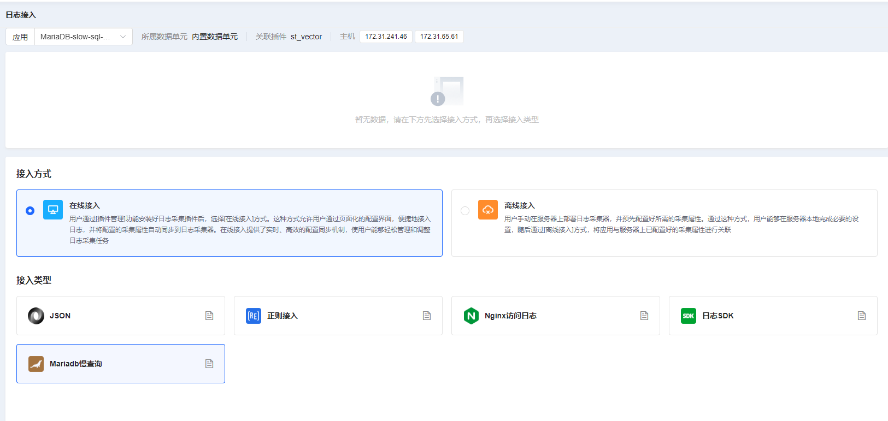

#### 选择主机
选择需要接入的主机, 可以选择某几台主机进行接入
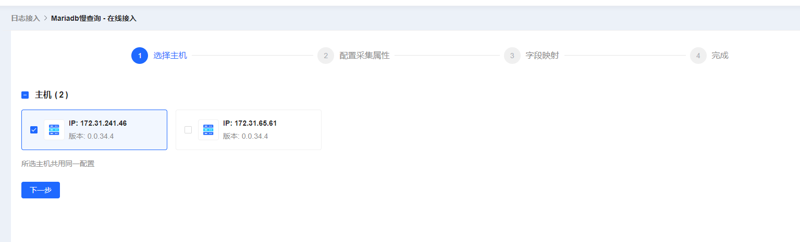


#### 配置采集属性
配置采集属性, 这里配置的日志路径是`/data/ob/logs/service/logs/show.log`,
则会采集`/data/ob/logs/service/logs`目录下的show.log文件
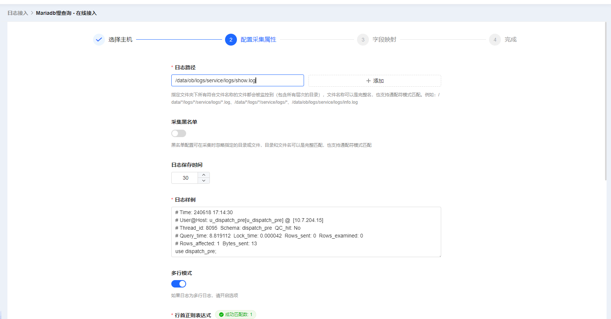

输入日志样例，可以从日志文件中摘取两行输入样例框，以便后续进行格式校验和字段提取校验

多行模式开关，如果日志打印有换行，比如异常栈信息打印，需打开多行模式开关，
输入行首匹配的正则，采集组件采集日志时，会根据行首正则进行跨行处理，以保持日志的完整性，点击格式校验可以查看匹配出的日志行数
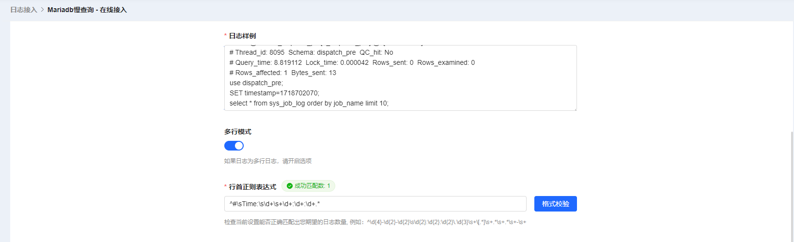

正则提取字段，根据格式输入字段提取正则表达式，点击校验会根据上面输入的日志样例和正则式提取出对应字段
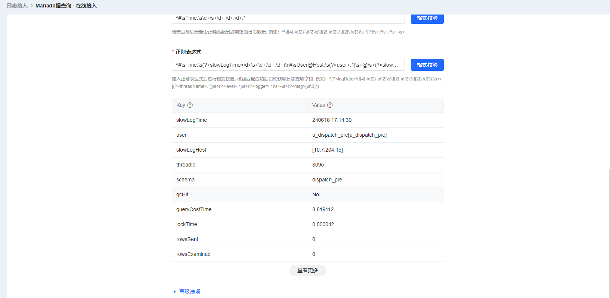

#### 配置字段映射
进入字段映射页面, 会显示默认的原始字段，并将上一步提取出的字段自动填到自定义字段中
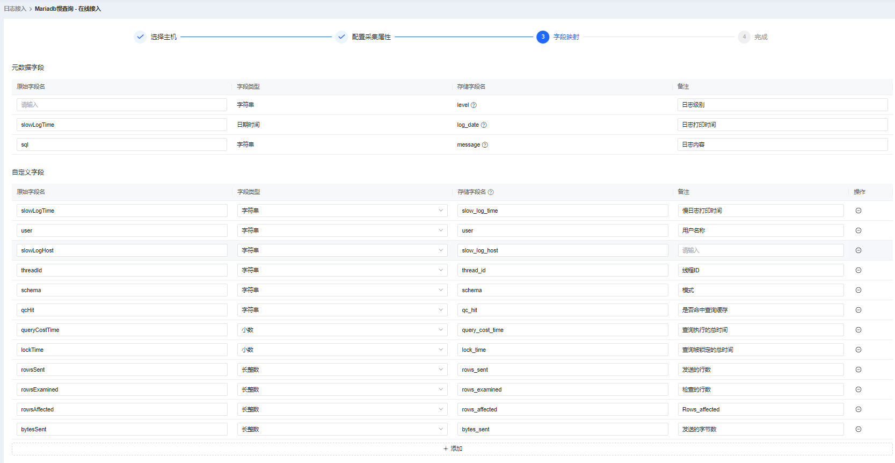

#### 完成接入
点击完成,接入完成后可以回到日志接入页面查看接入详情, 也可以在日志检索页面查看日志具体内容
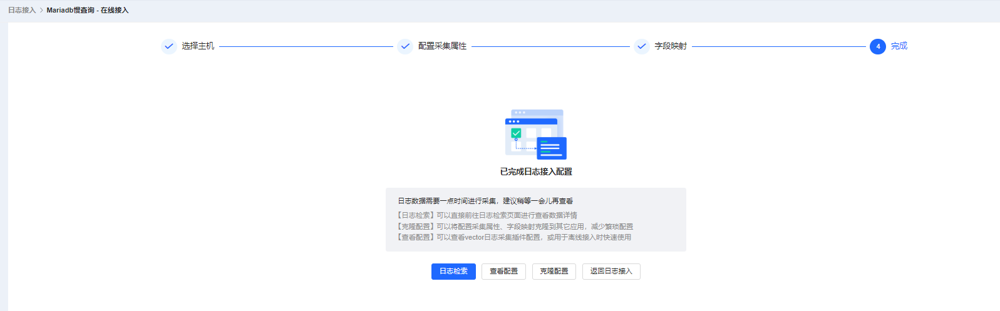
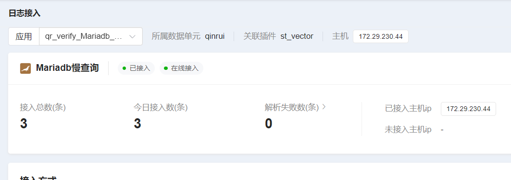


### Mariadb慢查询离线接入案例

#### Mariadb慢查询日志样例

```shell
# Time: 240823 15:52:11
# User@Host: u_gradeddomian_pre[u_gradeddomian_pre] @  [10.1.198.132]
# Thread_id: 8399  Schema: gradeddomian_pre  QC_hit: No
# Query_time: 325.098060  Lock_time: 0.000000  Rows_sent: 0  Rows_examined: 0
# Rows_affected: 0  Bytes_sent: 44
use gradeddomian_pre;
SET timestamp=1718689931;
ALTER TABLE gradeddomian_pre.t_ps_staff DROP INDEX if_person_domact;
```

离线接入步骤与在线接入基本一致, 区别在于离线接入不需要选择主机，且需要手动配置日志采集器。
以下是离线接入的具体步骤

#### 选择应用
在日志接入页面, 选择需要接入日志的应用, 选择应用后, 会展示当前应用的接入详情,
包括是否接入、所属数据单元、插件信息、主机列表

接入方式选择离线接入, 接入类型选择Mariadb慢查询
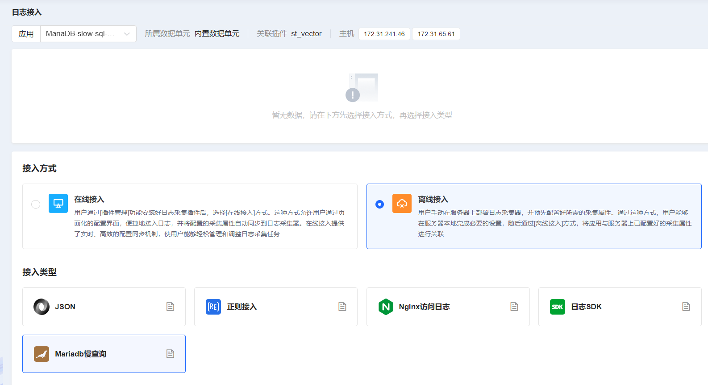

#### 配置采集属性
配置采集属性, 这里配置的日志路径是`/data/ob/logs/service/logs/show.log`,
则会采集`/data/ob/logs/service/logs`目录下的show.log文件
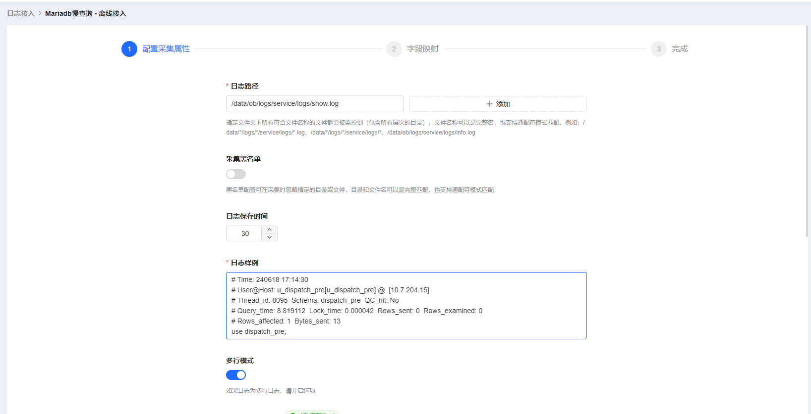

输入日志样例，可以从日志文件中摘取两行输入样例框，以便后续进行格式校验和字段提取校验

多行模式开关，如果日志打印有换行，比如异常栈信息打印，需打开多行模式开关，
输入行首匹配的正则，采集组件采集日志时，会根据行首正则进行跨行处理，以保持日志的完整性，点击格式校验可以查看匹配出的日志行数
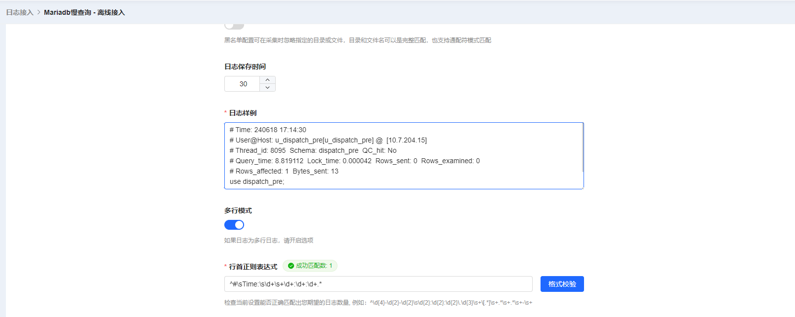

正则提取字段，根据格式输入字段提取正则表达式，点击校验会根据上面输入的日志样例和正则式提取出对应字段
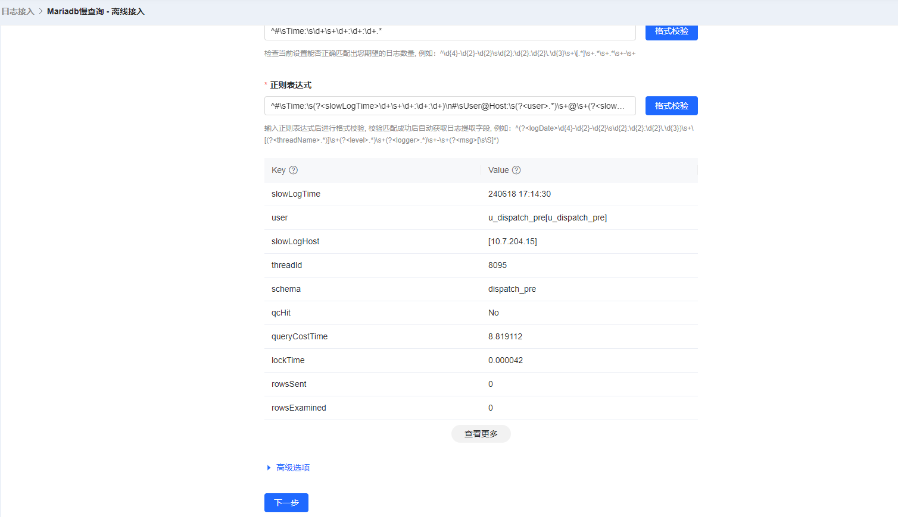

#### 配置字段映射
进入字段映射页面, 会显示默认的原始字段，并将上一步提取出的字段自动填到自定义字段中
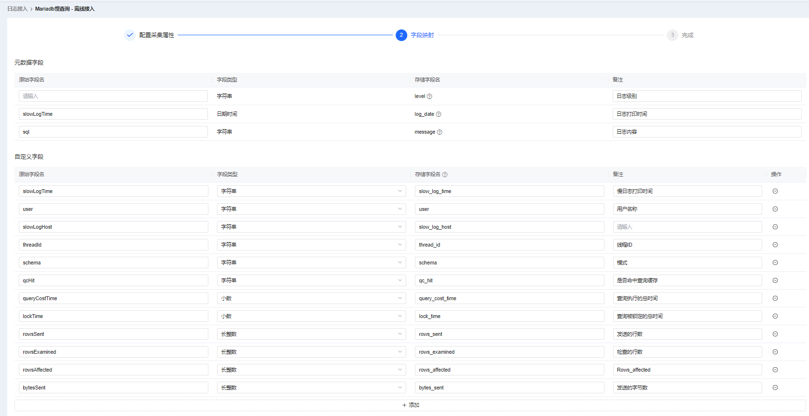

#### 完成接入
点击完成, 点击查看配置可以复制平台生成的`vector`配置文件内容（JSON）,在后面的配置日志采集器步骤中使用；
如有需要，也可点击克隆配置将当前配置克隆到其他应用。
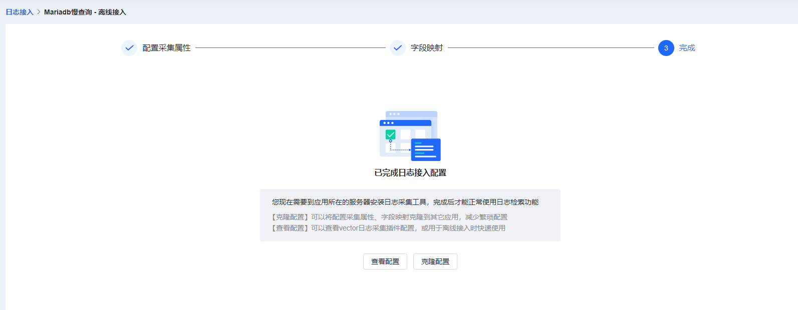
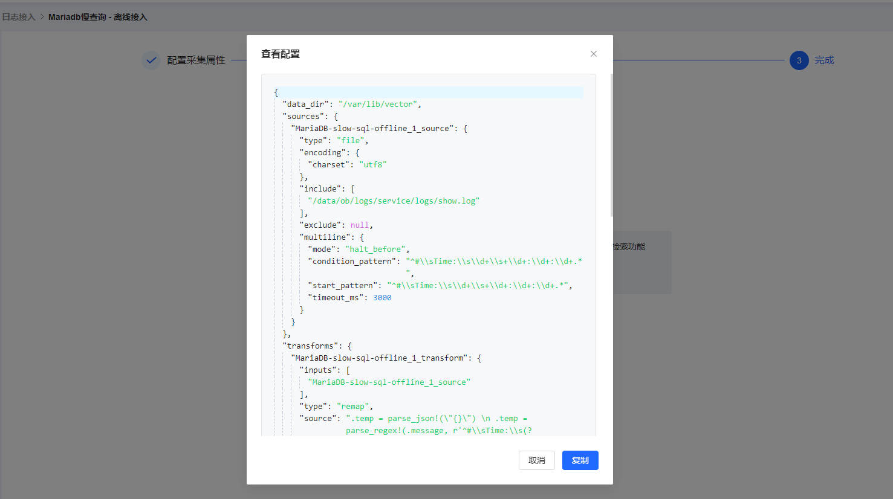
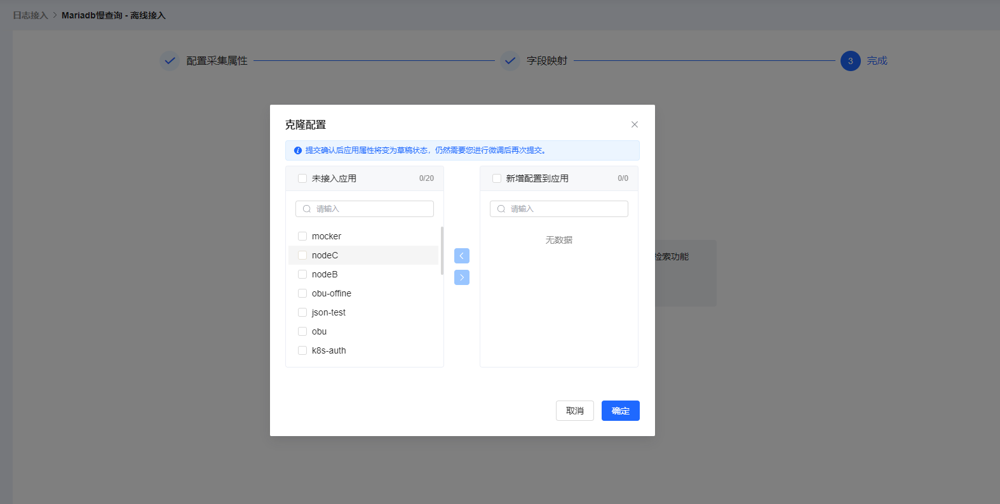

接入完成后可以回到日志接入页面查看接入详情, 也可以在日志检索页面查看日志具体内容
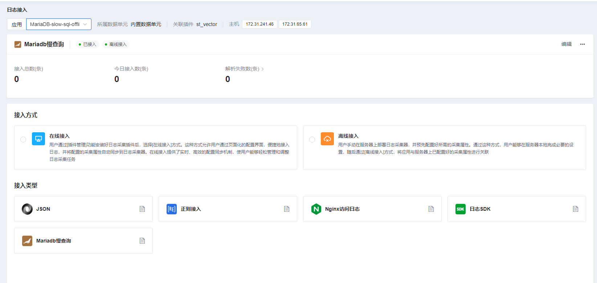


#### 手动配置日志采集器
##### 未接入过应用
如果安装的日志采集器`vector`没有接入过应用,
在`vector`安装目录的`config`目录下创建`vector.json`配置文件,
将前面复制的`vector`配置文件内容粘贴到`vector.json`中,
即完成日志采集器配置

##### 已接入过应用
如果安装的日志采集器`vector`已接入过其他应用,只需将前面复制的`vector`配置文件内容中
`sources`和`transforms`字段对应新增应用的内容添加到`vector.json`配置文件相应位置,
并在`sinks`中添加新增的`transform`, 即完成日志采集器配置

具体添加方式见`json`离线接入手动配置日志采集器[已接入过应用部分](#已接入过应用)

#### 启动日志采集器
配置好后启动日志采集器, 进入到日志采集器安装目录执行如下命令
```shell
nohup ./bin/vector --config config/vector.json -w > nohup.log 2>&1 &
```


## 主机审计日志接入文档
auditd 是 Linux 系统中的审计守护进程，用于记录系统的审计日志。它可以监控和记录系统中的各种活动，如文件访问、系统调用、用户登录等

主机审计日志接入可以快速的接入服务器的审计日志, 提取用户登录、用户操作事件以及常用的字段，用以追踪用户登录及执行的操作

由于linux系统的原始审计日志类型繁多，不同类型的日志字段也不同，接入之前需要先配置`auditd`和`laurel`，
对原始日志进行处理， 提取出需要的日志和常用的字段，方便后续的检索和分析。
### 修改auditd配置

centos7及openEuler 22默认已安装audit，执行命令`systemctl status auditd.service`查看auditd服务是否开启：
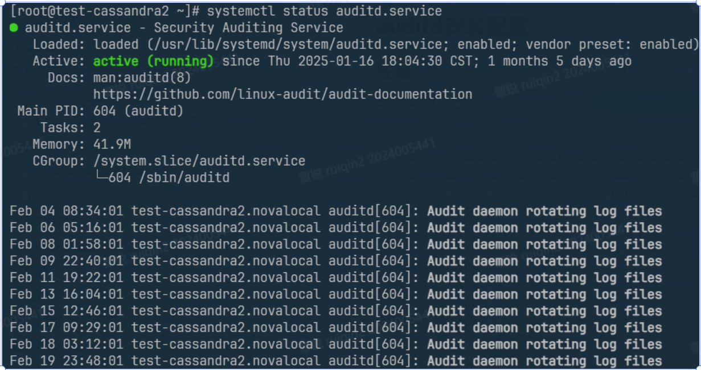

确认auditd服务开启后，修改auditd配置文件：`/etc/audit/rules.d/audit.rules`,添加如下内容：
`-a always,exit -F arch=b64 -S execve -k exec_commands`用以记录用户操作日志
```shell 
## First rule - delete all
-D

## Increase the buffers to survive stress events.
## Make this bigger for busy systems
-b 8192

## Set failure mode to syslog
-f 1

# 记录用户操作信息
-a always,exit -F arch=b64 -S execve -k exec_commands
```
然后执行`augenrules --load`加载添加的规则：
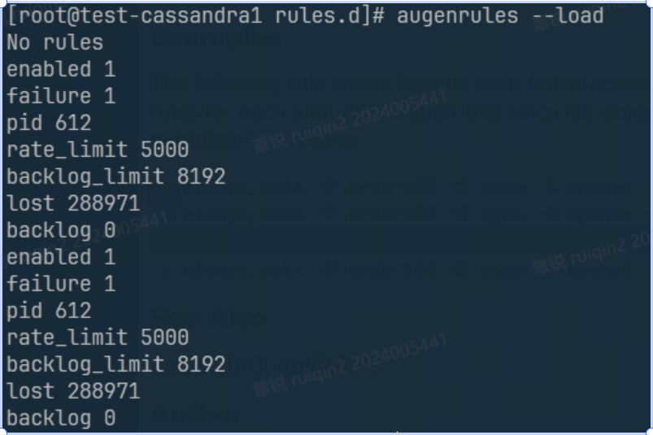


执行`auditctl -l`查看已生效规则：


auditd配置修改完成

### laurel插件安装、配置
laurel是一个auditd事件后处理插件，作用于系统内核，
功能是将原生linux审计日志转换成json格式并写入到指定文件

#### laurel安装
官方提供了两种安装包：
- 基于`musl-libc`的静态链接版本，构建于`Alpine 3.16`
- 基于`glibc` 的动态链接版本，构建于 `CentOS 7`
  检查系统基于`glibc`还是`musl-libc`：
- 执行`ldd --version`，如果输出结果提到了`GNU libc`,当前系统基于`glibc`

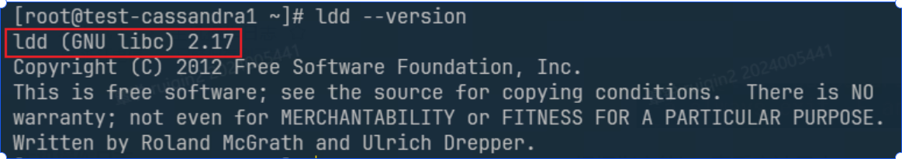

- 执行`ldd /bin/ls`，如果输出结果提到了`musl`，当前系统基于`musl`

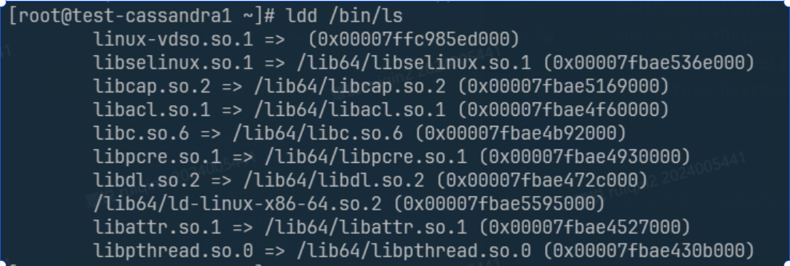

- 执行`hostnamectl`命令查看系统内核：
  - 如果内核为`x86_64`（cpu： Intel Xeon Processor，os：CentOS Linux 7）：

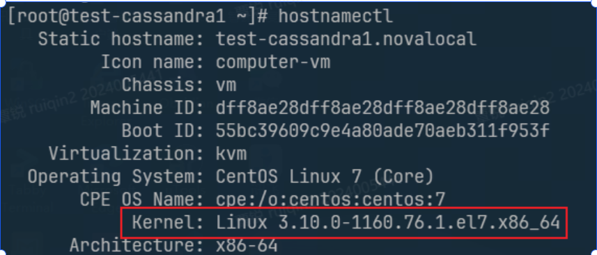

使用以下版本安装包（v0.6.3）：

  https://github.com/threathunters-io/laurel/releases

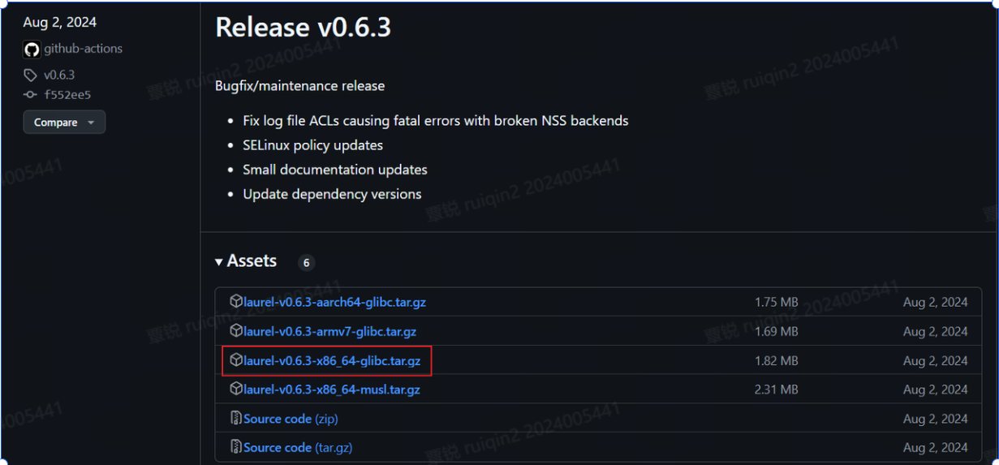

依次执行以下命令下载安装laurel：
```shell
wget https://github.com/threathunters-io/laurel/releases/download/v0.6.3/laurel-v0.6.3-x86_64-glibc.tar.gz
tar xzf laurel-v0.6.3-x86_64-glibc.tar.gz laurel
install -m755 laurel /usr/local/sbin/laurel
```
安装完成。

  - 如果内核为`aarch64`（cpu： Kunpeng 920，os：openEuler 22）：

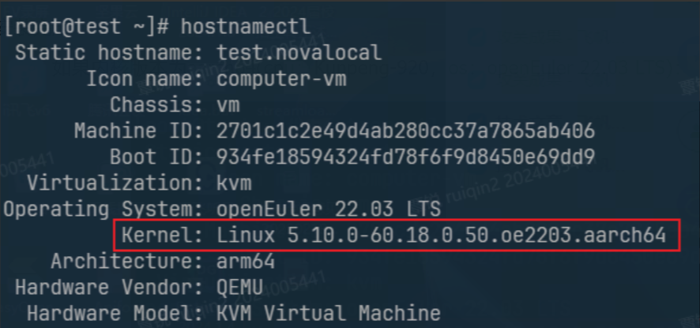

使用以下以该版本安装包（v0.6.3）：

https://github.com/threathunters-io/laurel/releases

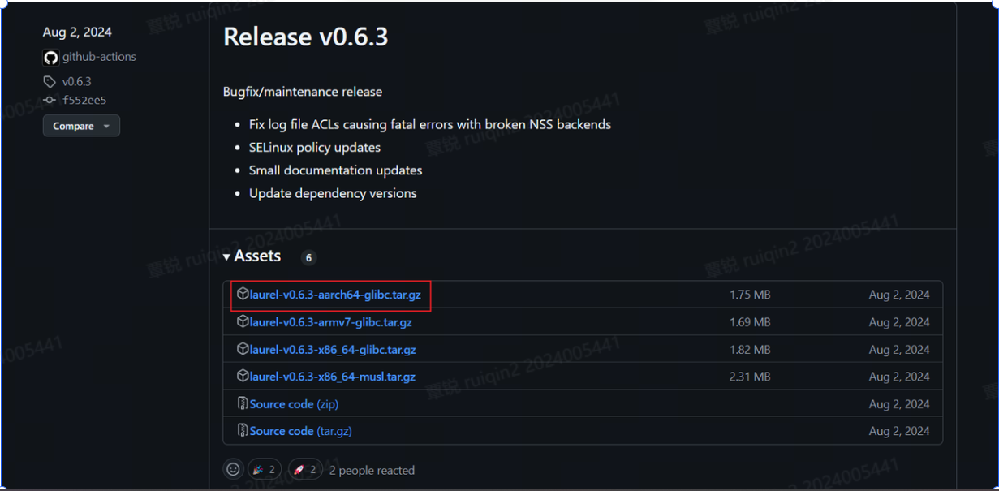

依次执行以下命令下载安装laurel：
```shell
wget https://github.com/threathunters-io/laurel/releases/download/v0.6.3/laurel-v0.6.3-aarch64-glibc.tar.gz
mkdir laurel_aarch64
tar xzf laurel-v0.6.3-aarch64-glibc.tar.gz -C ./laurel_aarch64
cd ./laurel_aarch64
install -m755 laurel /usr/local/sbin/laurel
```
安装完成。

#### laurel配置

- 为laurel创建一个专用用户"_laurel"：
  ```shell
  useradd --system --home-dir /var/log/laurel --create-home _laurel
  ```
  
- 复制以下示例配置文件到`/etc/laurel/config.toml` ，`/etc/laurel`文件夹不存在则新建文件夹和配置文件：
```shell
mkdir /etc/laurel
vim /etc/laurel/config.toml
```
以下提供的配置文件可直接使用，也可根据需求自行修改

`config.toml`：
```toml
# 写入日志文件的基础目录
# 所有生成的日志文件将存放在该目录中
# 注意确保此目录的权限适当，且_laurel用户有写入权限
directory = "/var/log/laurel"

# 从root用户降权到此指定用户
# 为增强安全性，Laurel会以指定的非root用户运行
user = "_laurel"

# 以秒为单位的周期性状态报告时间
# 状态报告包括运行版本、配置和解析统计信息
# 默认值为0，表示不输出状态报告
statusreport-period = 0

# 指定laurel读取审计事件的输入来源
# 默认为从标准输入读取("stdin")
# 也可以通过UNIX域套接字读取，如"unix:/path/to/socket"
input = "stdin"

# 启动时和每次输出状态报告时写入的标识字符串
# marker = "correct-horse-battery-staple"

[auditlog]
# 指定审计日志的文件名，默认为 audit.log
# 可以设置为 - 以输出到标准输出
# 可以使用"|"管道将输出重定向到另一个脚本或进程
file = "audit.json"

# 日志文件大小达到此字节数时进行轮转(设置为50MB)
size = 52428800

# 保留的历史日志文件代数
# 例如设为10，则最多保留10个旧的日志文件
generations = 5

# 使用POSIX ACL授予读取权限的用户列表
# read-users = [ "splunk" ]

# 在每行输出前添加前缀
# line-prefix = "@cee: "

# [debug]
# dump-state-period = 120

# [debug.log]
# file = "debug.log"
# size = 1000000
# generations = 3

# [debug.parse-error-log]
# file = "parse-error.log"
# size = 1000000
# generations = 3

# [filterlog]
# # If filter.filter-action is set to "log", filtered events are
# # written to this log. It is configured just like [auditlog].
# 过滤日志的文件名，默认为 filtered.log
# file = "filtered.log"
# size = 1000000
# generations = 3
# read-users = [ "splunk" ]

[transform]
# 指定 EXECVE 事件的参数输出格式，默认为 array（数组形式），也可以设置为 string（字符串形式）
execve-argv = [ "array" ]

# execve-argv = [ "array", "string" ]

# 限制 EXECVE 事件参数的最大字节数，超出部分会被截断并插入标记
execve-argv-limit-bytes = 100000

[translate]
# 是否翻译通用的数值（如架构、系统调用、套接字地址结构），默认为 false
universal = false

# 是否翻译用户ID（UID）和组ID（GID），默认为 false
user-db = false

# 如果翻译了数值，是否丢弃原始的数值字段，默认为 false
drop-raw = false

[enrich]
# 是否为进程ID（PID）相关事件添加上下文（如事件ID、命令名、可执行文件路径、父进程ID），默认为 true
pid = true

# 为每个 EXECVE 事件记录指定的环境变量（如 LD_PRELOAD 和 LD_LIBRARY_PATH）
execve-env = [ "LD_PRELOAD", "LD_LIBRARY_PATH" ]

# 是否为基于 SYSCALL 的事件添加容器信息，默认为 true
container = true

# 是否将容器信息作为顶级 CONTAINER_INFO 记录（已弃用），默认为 false
container_info = false

# 是否为运行在 systemd 服务中的进程添加 systemd cgroup 信息，默认为 true
systemd = true

# 是否为 SYSCALL execve 事件添加脚本上下文，默认为 true
script = true

# 是否为用户（UID）添加所属的用户组信息，默认为 true
user-groups = true

# 为丰富字段添加前缀。
# prefix = "enriched_"

[label-process]
# 将包含特定键的审计记录作为标签附加到进程（如 software_mgmt）
label-keys = [ "software_mgmt" ]

# 根据可执行文件路径的正则表达式为进程附加标签（如 java 和 amazon-ssm-agent）
label-exe.'^/opt/.*/bin/java$' = 'java'
label-exe.'^/usr/lib/jvm/.*/bin/java$' = 'java'
label-exe.'^/snap/amazon-ssm-agent/\d+/' = 'amazon-ssm-agent'

# 根据可执行文件路径的正则表达式移除进程标签（如 bin/php$）
unlabel-exe."bin/php$" = "java"

# 根据命令行参数的正则表达式为进程附加标签（如 weblogic）。
label-argv."^(?:\\S+/)?java .* -Dweblogic" = "weblogic"
# unlabel-argv."…" = "…"

# 命令行参数的最大数量限制，默认为 32。
label-argv-count = 32
# 命令行参数的最大字节数限制，默认为 4096。
label-argv-bytes = 4096

# 根据脚本路径的正则表达式为进程附加标签（如 maint）
label-script."^/root/maint-.*[.]sh$" = "maint"

# 将标签传播到子进程（如 software_mgmt 和 amazon-ssm-agent）
propagate-labels = [ "software_mgmt", "amazon-ssm-agent" ]

[filter]
# 过滤包含指定键的审计记录
# filter-keys = ["filter-this"]

# 基于标签过滤审计记录
# filter-labels = ["software_mgmt"]

# 是否过滤没有指定键的事件，默认为 false
filter-null-keys = false

# 是否保留每个进程的第一个事件（即使它被过滤），默认为 true
# keep-first-per-process = true

# 对过滤事件的处理方式，默认为 drop（丢弃），也可以设置为 log（记录到过滤日志）
filter-action = "drop"
````

- 执行`auditctl -v`查看`auditd`版本是`auditd 2`还是`audit 3`


并将以下提供的示例配置文件根据auditd版本复制到指定路径：
- `/etc/audit/plugins.d/laurel.conf` for auditd 3
- `/etc/audisp/plugins.d/laurel.conf` for auditd 2

`laurel.conf`:
```shell
active = yes
direction = out
type = always
format = string
path = /usr/local/sbin/laurel
args = --config /etc/laurel/config.toml
```

- 执行`sestatus`查看当前系统是否启用了 SELinux（Security-Enhanced Linux）,
默认未启用：`disabled`

  
  如果启用了则执行以下命令编译提供的策略并将其安装到正在运行的内核中，未启用则忽略这一步:
```shell
make -C contrib/selinux
semodule -i contrib/selinux/laurel.pp
restorecon -v -R -F /usr/local/sbin/laurel /etc/laurel /var/log/laurel /etc/audit/plugins.d/laurel.conf
```

- 通知 `auditd` 守护进程重新加载其配置文件
```shell
pkill -HUP auditd
```
- 执行命令`systemctl status auditd.service`查看`laurel`的运行情况，
`laurel`正常运行的话应该是审计服务对应的控制组（CGroup）的一部分：

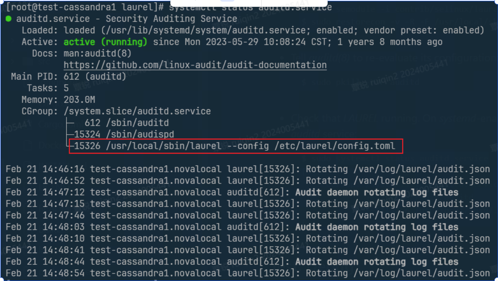

`laurel`配置、启动完成，前往`/etc/laurel/config.toml`指定的路径
`/var/log/laurel/audit.json`可以查看以`json`格式输出的系统审计日志：

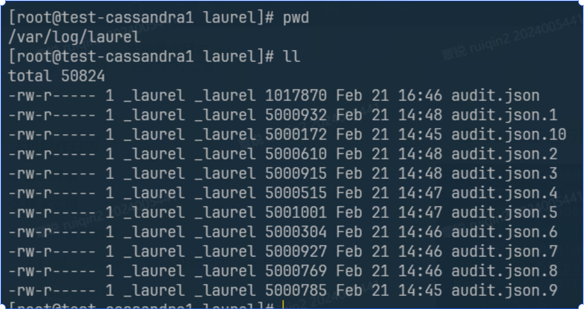


### 主机审计日志在线接入案例

#### 选择应用
在日志接入页面, 选择需要接入主机审计日志的应用

选择应用后, 会展示当前应用的接入详情, 包括是否接入、所属数据单元、插件信息、主机列表

如果该应用所在数据单元在`环境配置`没有安装过日志插件, 则只会展示该应用的数据单元信息, 插件信息为`-`

接入方式选择在线接入, 接入类型选择主机审计日志

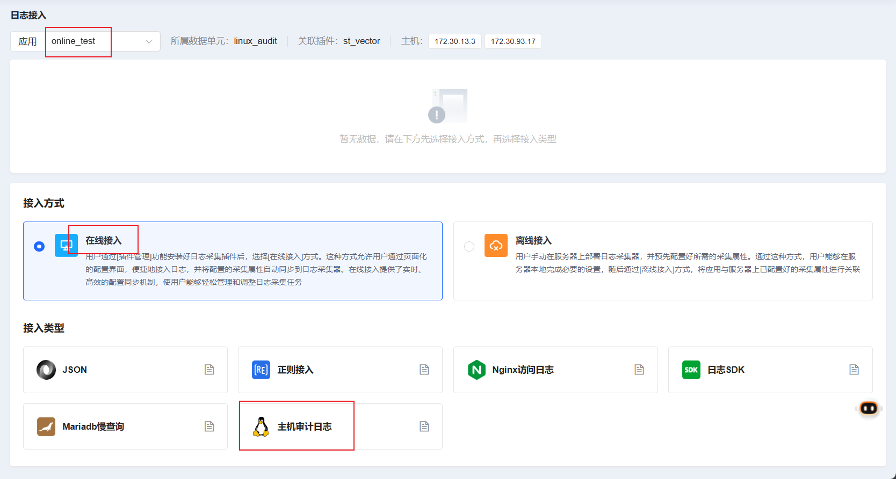


#### 选择主机
选择需要接入的主机, 可以选择某几台主机进行接入，然后选择下一步

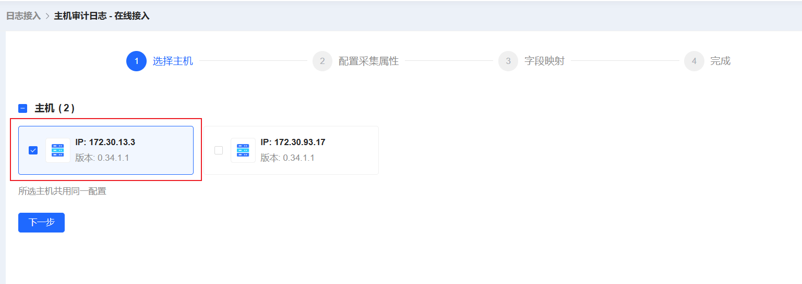


#### 配置采集属性
配置采集属性, 这里配置的日志路径是`/var/log/laurel/audit.json`, 
则会采集`/var/log/laurel`目录下的`audit.json`日志文件

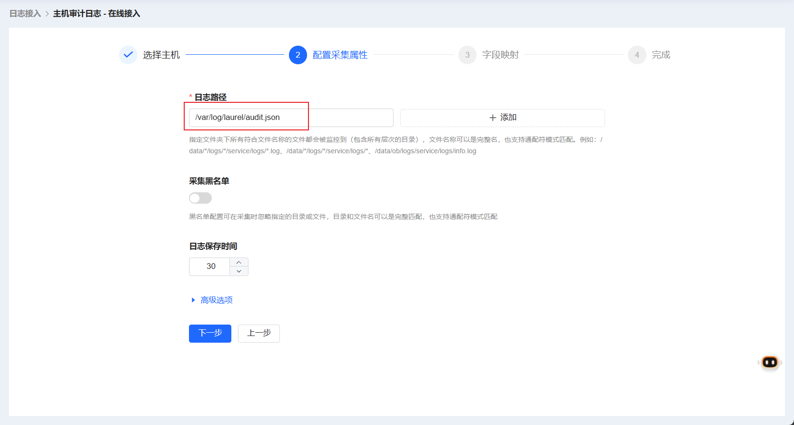


#### 配置字段映射
进入字段映射页面, 根据预定义的audit日志格式, 自动填充好原始字段和存储字段的对应关系

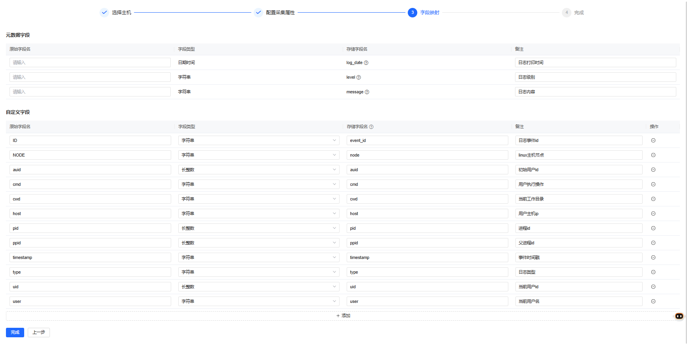


#### 完成接入
点击完成,接入完成后可以回到日志接入页面查看接入详情, 也可以在日志检索页面查看日志具体内容

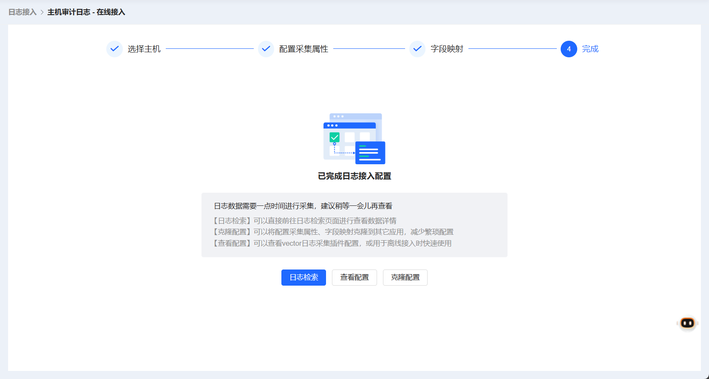

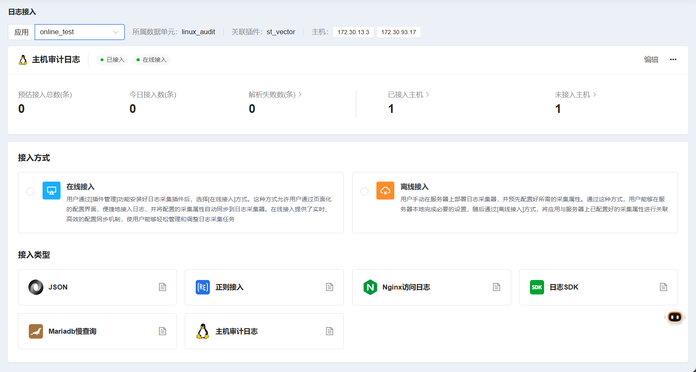


### 主机审计日志离线接入案例

离线接入步骤与在线接入基本一致, 区别在于离线接入不需要选择主机，且需要手动配置日志采集器。
以下是离线接入的具体步骤


#### 选择应用
在日志接入页面, 选择需要接入主机审计日志的应用

选择应用后, 会展示当前应用的接入详情, 包括是否接入、所属数据单元、插件信息、主机列表

如果该应用所在数据单元在`环境配置`没有安装过日志插件, 则只会展示该应用的数据单元信息, 插件信息为`-`

接入方式选择离线接入, 接入类型选择主机审计日志

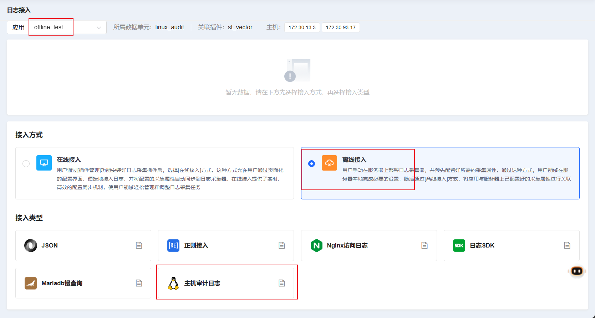


#### 配置采集属性
配置采集属性, 这里配置的日志路径是`/var/log/laurel/audit.json`, 
则会采集`/var/log/laurel`目录下的`audit.json`日志文件

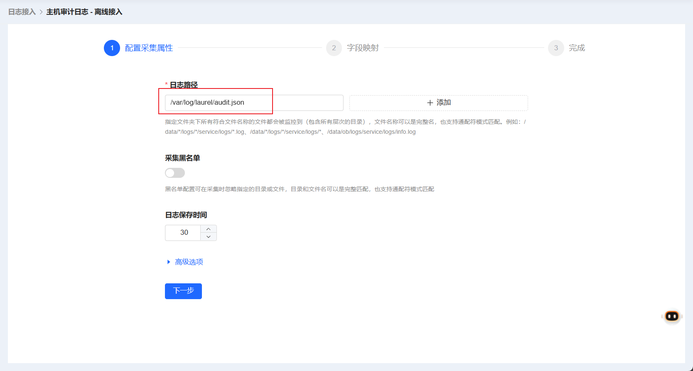


#### 配置字段映射
点击下一步进入字段映射页面, 根据预定义的audit日志格式, 自动填充好原始字段和存储字段的对应关系

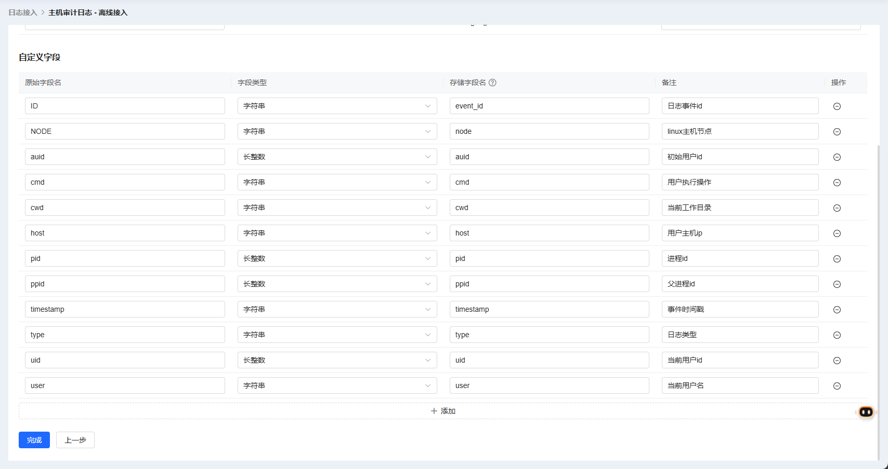

#### 完成接入
点击完成, 点击查看配置可以复制平台生成的`vector`配置文件内容（JSON）,
在后面的配置日志采集器步骤中使用；

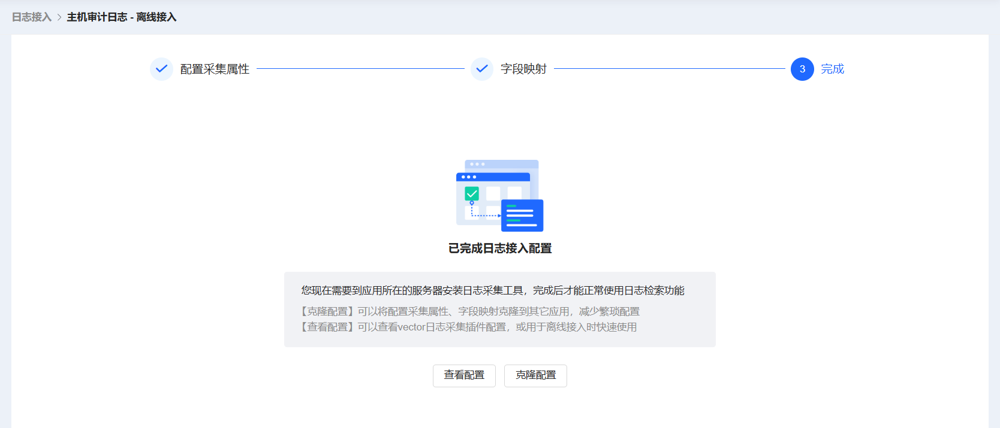

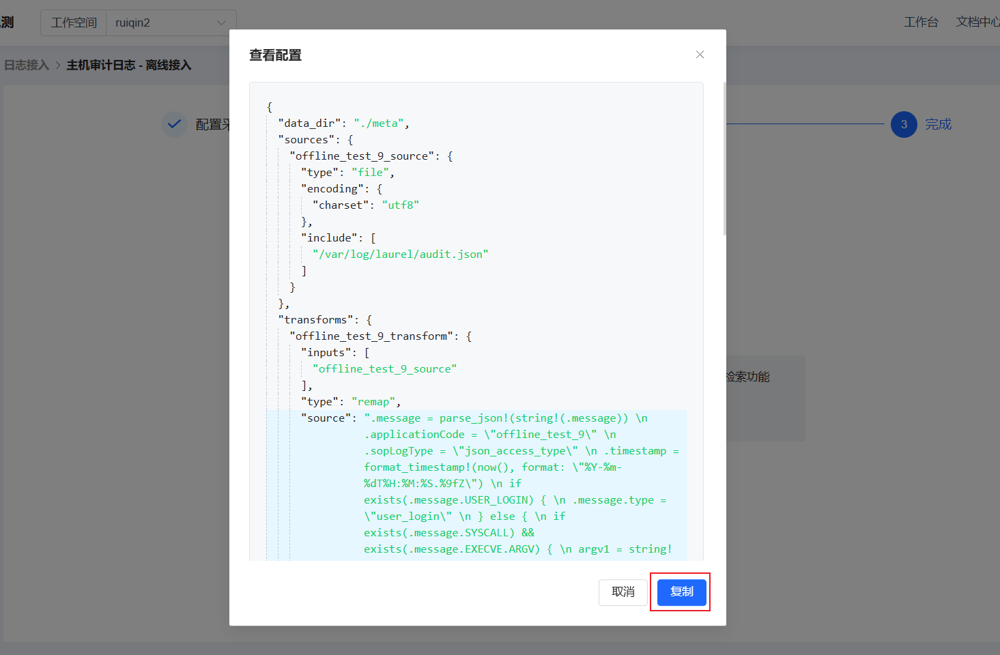

接入完成后，可以在日志接入页面查看接入详情, 也可以在日志检索页面查看日志具体内容)

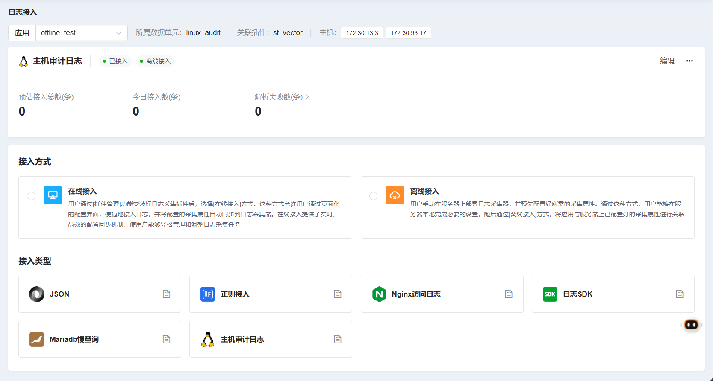


#### 手动配置日志采集器

##### 未接入过应用
如果安装的日志采集器`vector`没有接入过应用,
在`vector`安装目录的`config`目录下创建`vector.json`配置文件,
将完成接入后复制的`vector`配置文件内容粘贴到`vector.json`中,
即完成日志采集器配置

##### 已接入过应用
如果安装的日志采集器`vector`已接入过其他应用,只需将完成接入后复制的`vector`配置文件内容中
`sources`和`transforms`字段对应新增应用的内容添加到`vector.json`配置文件相应位置,
并在`sinks`中添加新增的`transform`, 即完成日志采集器配置

具体添加方式见`json`离线接入手动配置日志采集器[已接入过应用部分](#已接入过应用)

#### 启动日志采集器
配置好后,进入到日志采集器安装目录执行如下命令以启动启动日志采集器：
```shell
nohup ./bin/vector --config config/vector.json -w > nohup.log 2>&1 &
```

## 日志接入克隆
对于日志接入配置类似的应用，提供已接入应用配置克隆功能，方便快速接入相似应用

### 已接入应用克隆

#### 功能入口
1、选择被克隆的已接入应用，找到如下图按钮
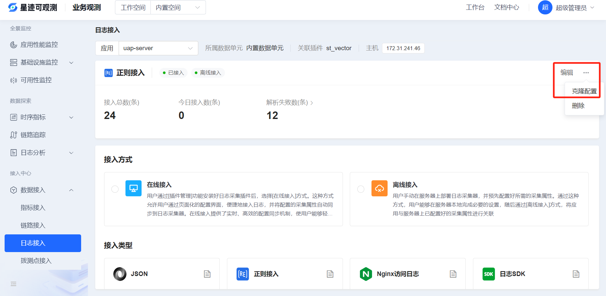

2、日志接入完成页面进行克隆
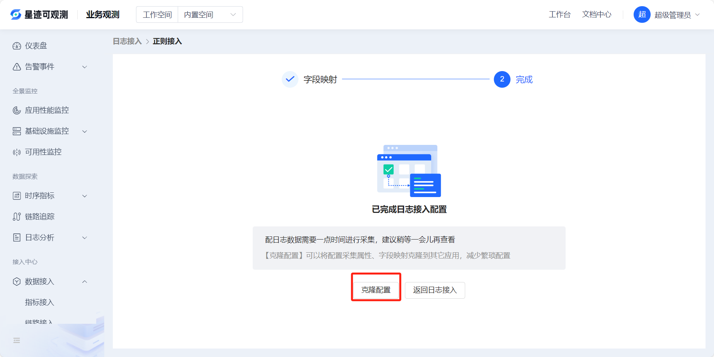

#### 未接入应用选择
点击后进入未接入应用选择界面，选择需要克隆接入的未接入应用
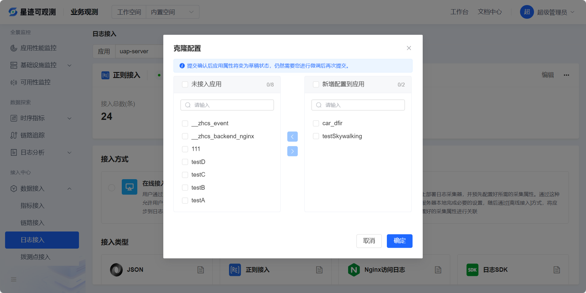

#### 编辑克隆的接入配置
在应用列表中选中上一步选择的未接入应用(后面有“草稿”字样)，会默认加载克隆配置中的接入方式和接入类型
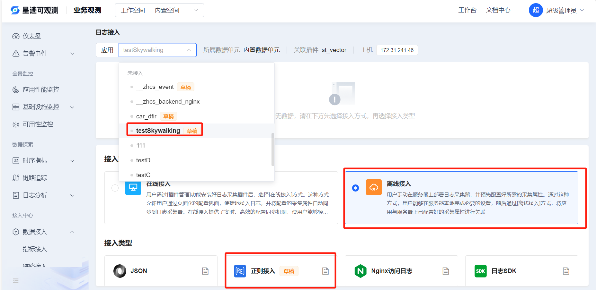

点击进入后，会自动加载克隆配置中的内容，按指引操作即可完成日志接入。

## 日志数据清理
### Doris数据清理

在进行日志接入时可以选择日志保留时间（天）：

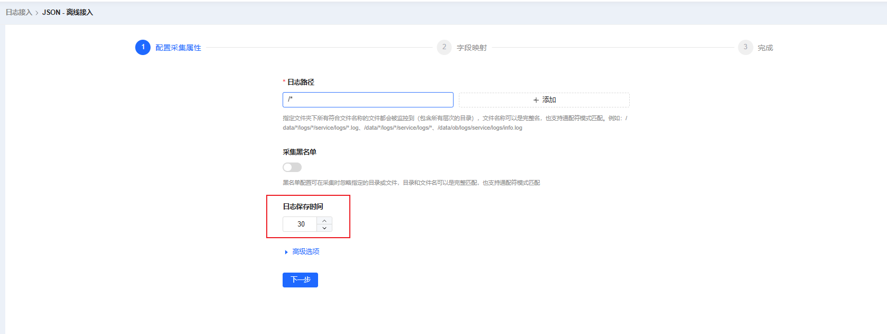

过期日志将被清除，**建议根据实际情况进行评估后合理设置日志保留天数，避免手动清除数据**。

若因为特殊原因必须手动清理doris存储的日志数据，建议按照以下方式进行

由于日志数据表（命名方式为：`log_record_applicationCode`）开启了自动分区，且默认按天进行分区，数据清理时建议删除特定某天对应的分区
需要注意的是，doris禁止在开启动态分区时手动删除或者添加分区，因此要先关闭动态分区，手动删除分区之后再开启。

```shell
 [HY000][1105] errCode = 2, detailMessage = Cannot add/drop partition on a Dynamic Partition Table, Use command `ALTER TABLE log_record_test SET ("dynamic_partition.enable" = "false")` firstly.
```

以下以表`log_record_test`为例：

```sql
# 关闭自动分区
ALTER TABLE log_record_test SET ("dynamic_partition.enable" = "false");
# 查看log_record_test表的分区
SHOW PARTITIONS FROM log_record_test;

# 删除指定分区
ALTER TABLE table_name DROP PARTITION partition_name;

# 重新开启自动分区
ALTER TABLE log_record_test SET ("dynamic_partition.enable" = "true");
# 查看是否成功开启自动分区
SHOW DYNAMIC PARTITION TABLES;
```

注意，如果设置了创建指定天数的历史分区且又再次开启了自动分区，如：

```sql
"dynamic_partition.history_partition_num" = "7"
```

当删除的分区在这个范围内，比如今天是1月10日，手动删除了1月7日的分区，在指定的历史分区内，doris会自动重新创建这个分区，但是分区内的数据不会恢复。

### kafka数据清理

#### kafka的日志

日志的英语是“log”，但Kafka的数据文件也被称为log，所以很多时候会造成一定的歧义。在Kafka中，日志分为两种：

- 操作日志
- 数据日志

其中操作日志就是我们一般认为的日志，由`$KAFKA_HOME/config/log4j.properties`管理

**数据日志是指Kafka的topic中存储的数据**，这种日志是在`$KAFKA_HOME/config/server.properties`文件中配置，配置项为log.dirs，默认为`/tmp/kafka-logs`，建议改成非tmp路径


#### 数据日志自动清理（推荐）

kafka有两种数据日志清理策略：

```properties
log.cleanup.policy=compact
log.cleanup.policy=delete
```

其中compact策略只能支持键值对存储的数据，delete则没有这个限制

1. 若存储数据为键值对，建议设置数据日志清理配置如下：

```properties
# $KAFKA_HOME/config/server.properties
# 开启压缩策略                                            
log.cleaner.enable=true
log.cleanup.policy=compact,delete
# 日志保留时间
log.retention.hous=168
# 按天滚动（segment生成）
log.roll.hours=24
```

注意设置的清理策略为`compact,delete`，因为若只设置`compact`只能保证同一个`key`仅保留最新的数据，但超期的`key`不会被清理，如果不停有`key`新增，仍会导致磁盘打满

2. 若存储数据不为键值对，建议设置数据日志清理配置如下：

```properties
# $KAFKA_HOME/config/server.properties
# 开启删除策略                                            
log.cleanup.policy=delete
# 日志保留时间
log.retention.hous=168
# 按天滚动（segment生成）
log.roll.hours=24
```

过期数据会被自动清理

**建议根据实际情况进行评估后合理设置日志在kafka中的保留时间（默认为7天），避免手动清除数据**


#### 手动清理topic部分数据

若因为特殊原因必须手动清理部分数据，建议采用以下方案

- 1.首先查看日志服务消费者组`log-consumer`的偏移量：

```shell
[root@cassandra kafka_2.13-2.8.2]./bin/kafka-consumer-groups.sh --describe --bootstrap-server <host_ip>:9092 --group log-consumer

GROUP           TOPIC            PARTITION  CURRENT-OFFSET  LOG-END-OFFSET  LAG             CONSUMER-ID                                                  HOST            CLIENT-ID
log-consumer    log_record_topic 0          1221306201      1221306201      0               consumer-log-consumer-1-4b0b4c23-b294-4471-9c4b-91e57bc3a801 /172.31.65.35   consumer-log-consumer-1
log-consumer    log_record_topic 1          1183324008      1183324008      0               consumer-log-consumer-1-4b0b4c23-b294-4471-9c4b-91e57bc3a801 /172.31.65.35   consumer-log-consumer-1
log-consumer    log_record_topic 2          1170516043      1170516043      0               consumer-log-consumer-1-b719318b-a278-48d4-b589-5e08d345d602 /172.29.247.156 consumer-log-consumer-1
```

`CURRENT-OFFSET` 为当前消费者组在对应分区的偏移量，`LAG`为积压量

- 2.可以将topic中已消费的记录（`CURRENT-OFFSET` 前的记录）清除，在`$KAFKA_HOME`执行以下命令：

```shell
[root@cassandra kafka_2.13-2.8.2]./bin/kafka-delete-records.sh --bootstrap-server <host_ip>:9092 --offset-json-file offsets.json

Executing records delete operation
Records delete operation completed:
partition: log_record_topic-2   low_watermark: 1170516043
partition: log_record_topic-0   low_watermark: 1221306201
partition: log_record_topic-1   low_watermark: 1183324008
```

命令解释：

- `./bin/kafka-delete-records.sh`：kafka提供的记录清理脚本
- `--bootstrap-server 172.30.14.135:9092` ：指定kafka服务主机host与端口
- `--offset-json-file offsets.json`：通过`offsets.json`指定需要清理的主题、分区及偏移量，具体内容见后

执行成功后的响应`low_watermark`表示删除数据后剩余最老记录的偏移量

**offsets.json**文件指定主题、分区、偏移量:

```json
{
    "partitions": [
      {
        "topic": "log_record_topic",
        "partition": 0,
        "offset": 1221306201
      },
      {
        "topic": "log_record_topic",
        "partition": 1,
        "offset": 1183324008
      },
      {
        "topic": "log_record_topic",
        "partition": 2,
        "offset": 1170516043
      }
    ]
  }
```

- **`topic`**: 主题名称，指定从哪个主题删除记录。
- **`partition`**: 分区号，指定从哪个分区删除记录。
- **`offset`**: 偏移量，指定从哪个偏移量开始删除记录；所有小于这个偏移量的记录将被删除，若offset比最旧的数据offset还小则不会生效，此处指定为消费者组已消费的偏移量，将已消费的全部清理。offset填写-1意味着topic分区数据全删除。