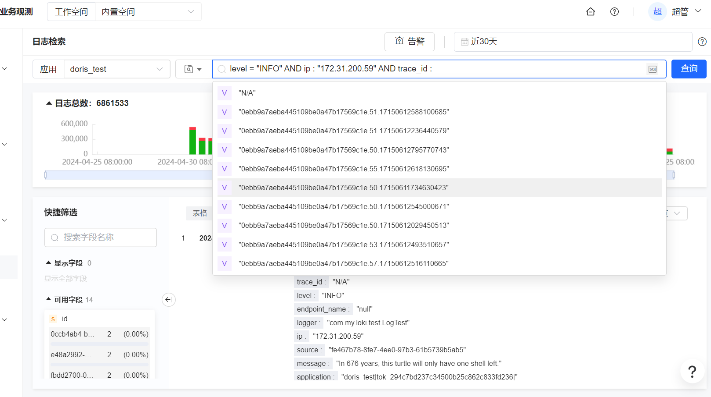
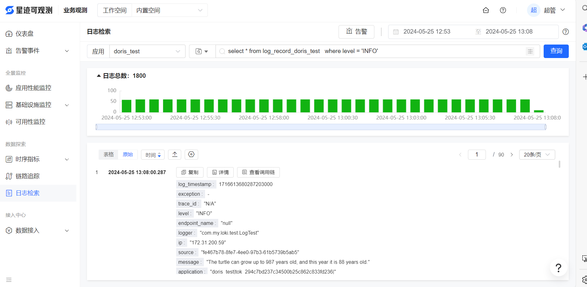
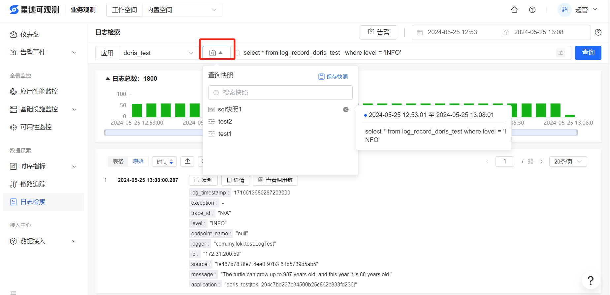
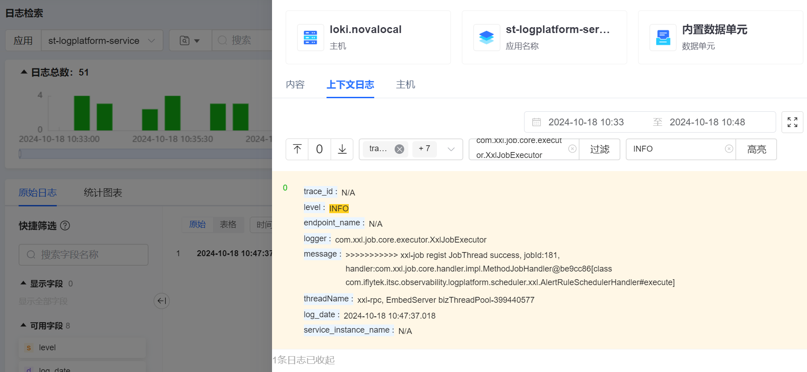
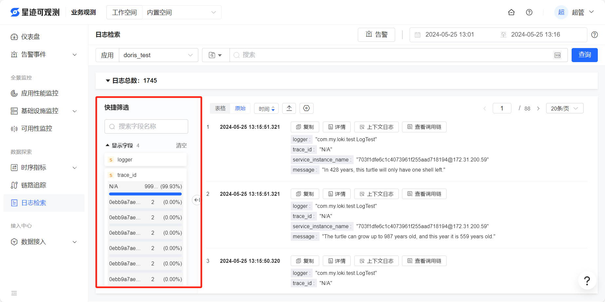
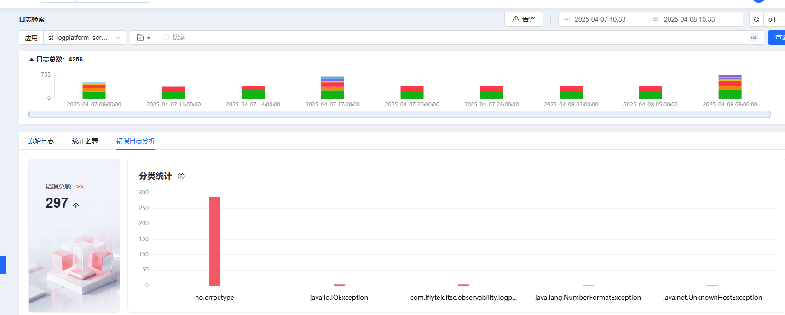
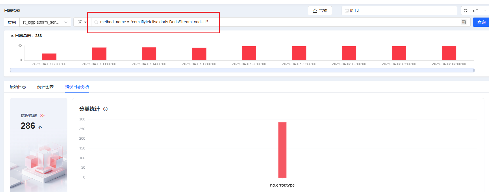
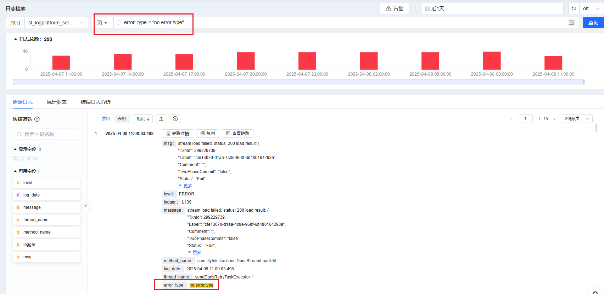

# 日志检索

## 进入日志检索菜单

选择应用根据查询过滤条件对日志进行精确检索和字段模糊匹配检索，过滤条件支持星迹自定义lql和标准sql语法，可以对查询出日志进行查看、上下搜索、跳转链路追踪、导出等操作，并且能对查询快照保存和快速引用，显示字段进行过滤，占比top10分析。

## lql语法检索

进入日志检索页面，选择应用，默认为lql语法查询，鼠标点击输入框会自动弹出该应用日志字段，选择字段后再选择=(精确匹配)或:(模糊匹配)，会自动带出10条记录供选择，如果是多条件，还可以选择and或or逻辑运算符。也可以按格式手动输入条件。
在右上角选择时间范围后，会显示检索结果。

## sql语法检索
选择应用，点击搜索框右侧图标切换到sql模式，在输入框中输入sql语句进行查询

## 查询快照保存

点击快照按钮，可以进行快照保存、查看和引用操作

## 上下文查询

点击单条日志顶部的“关联详情”按钮，可以进行内容查看和复制、上下文查询，并且支持字段筛选、过滤和高亮操作

## 字段筛选

快捷筛选中可以选择显示的字段，展开字段可以查看字段值占比top10

## 错误日志分析

如果日志应用开启了错误日志分析功能，可以查看任意时间段内的错误日志的错误类型（仅支持Java语言的日志）：

并且，还支持lql语法检索：

点击错误类型，即可跳转检索错误类型的全部日志：

