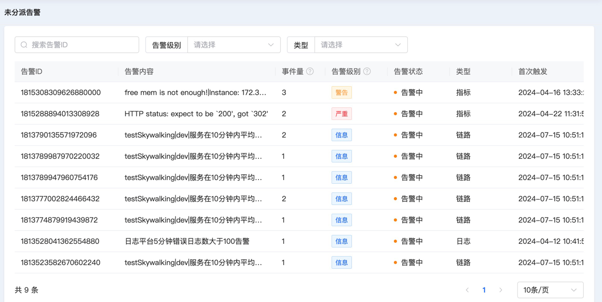
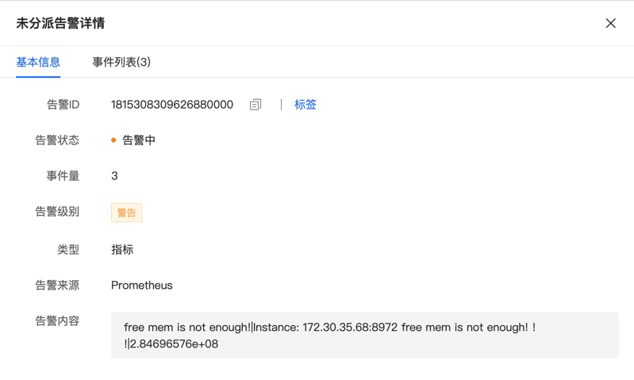
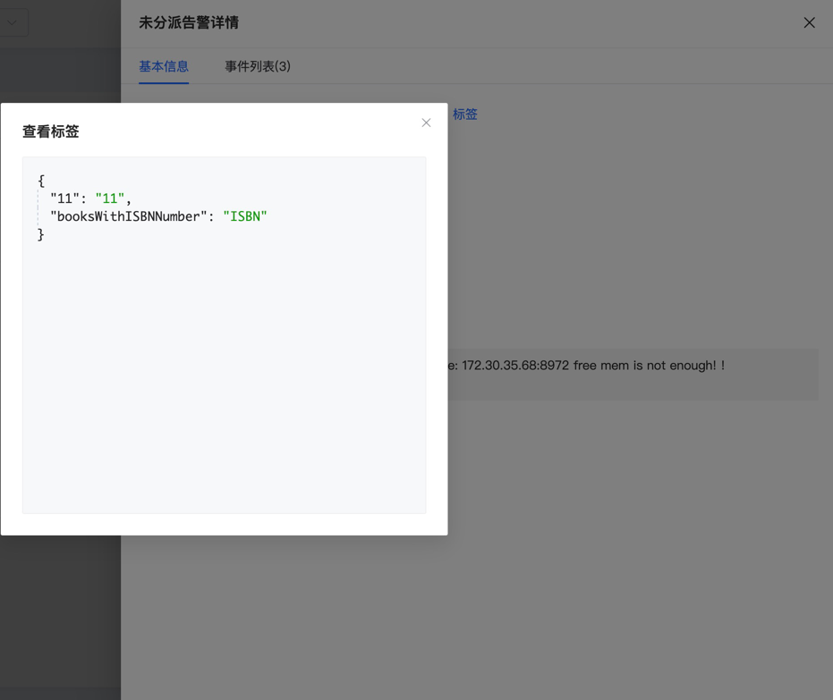
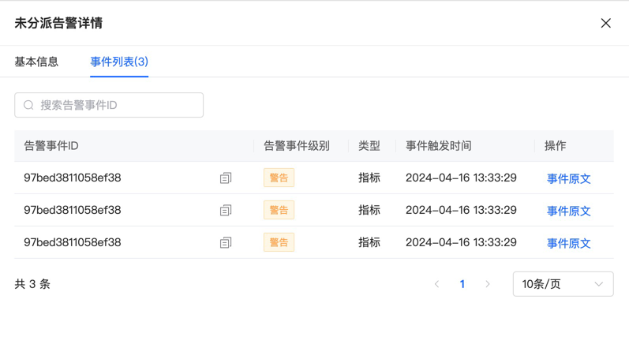
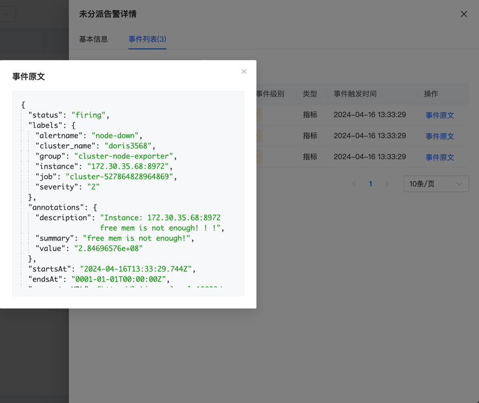

# 未分派告警

未分派告警是指没有被屏蔽，但是也没有命中任何分派策略的告警。

## 主页

展示未分派告警的基本信息，包括告警内容、级别、状态、类型等基本信息，还有首次触发时间，已经对应的告警事件数量。支持按照告警ID、告警级别和告警状态进行条件搜索。

## 详情

用户点击主页的告警ID就会跳转到详情页面，有两个子页面

### 基本信息

除告警来源信息之外，其余展示内容和主页相同。

点击该页面的标签按钮，展示该未分派告警的自定义标签内容。

### 事件列表

展示该未分派告警关联的所有告警事件，包括事件的原始ID、级别、类型和触发时间。

点击"事件原文"按钮，可以查看第三方告警事件的原始文本

