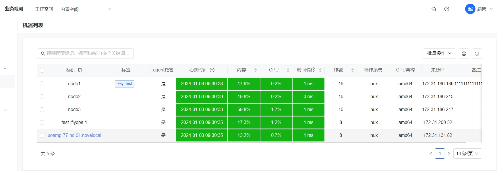
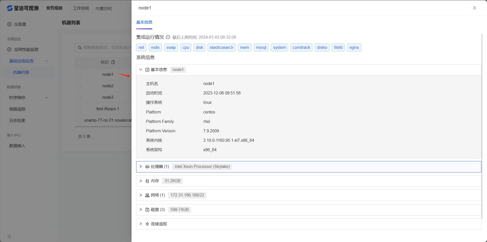

# 机器列表

指标监控在接收到监控数据之后，如果识别到是机器的监控指标，会从监控数据中提取出机器的 ident 信息，展示在机器列表页面。打开了 heartbeat 开关，机器列表会将机器的元信息（内存、CPU、时间偏移、核数、操作系统、CPU架构、心跳时间、来源IP等）展示出来，相当于一个简单的 cmdb 页面。

此外还可以通过右上角的批量操作，对机器进行打标签，打上标签之后，和机器相关的时序数据也会附上给机器打的标签，可以通过标签统一对时序数据进行筛选，配置告警规则，订阅规则等操作。

### 查看机器扩展信息

列表提供了查看机器扩展信息的功能，直接点击机器标识，右边会出现一个侧拉板，展示机器相关的更丰富的信息

