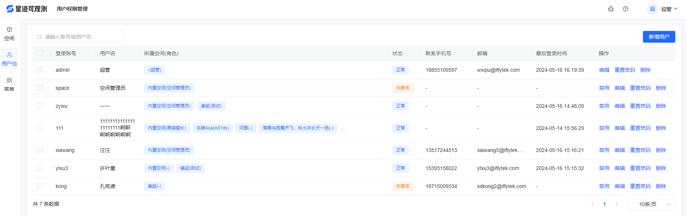
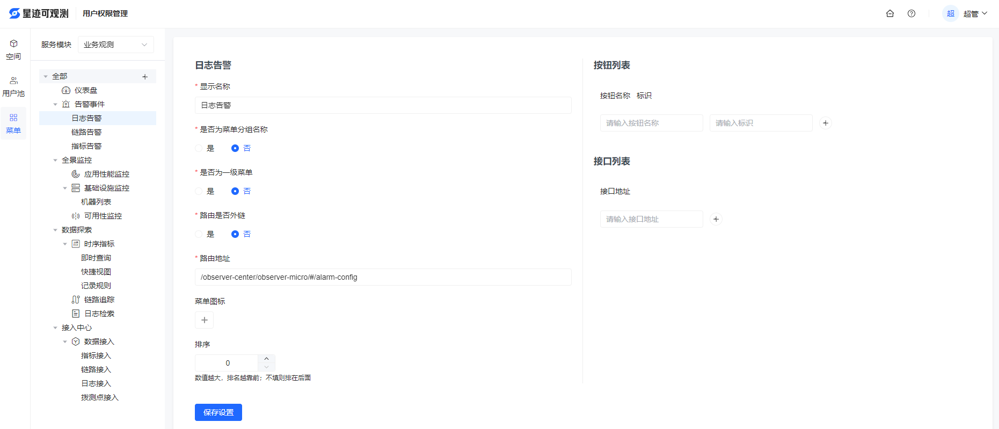
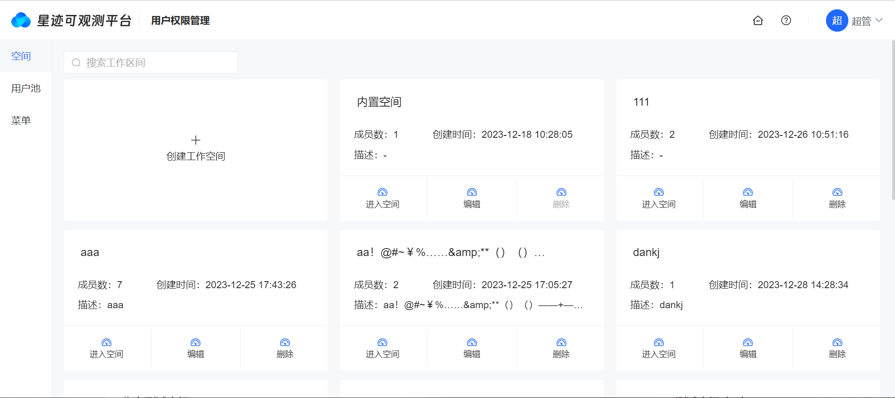
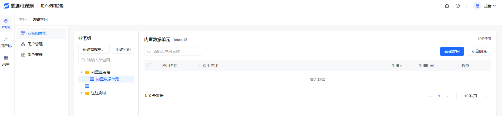
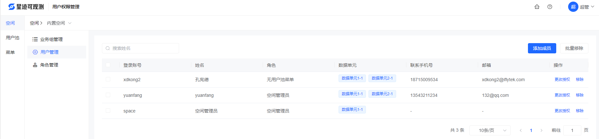
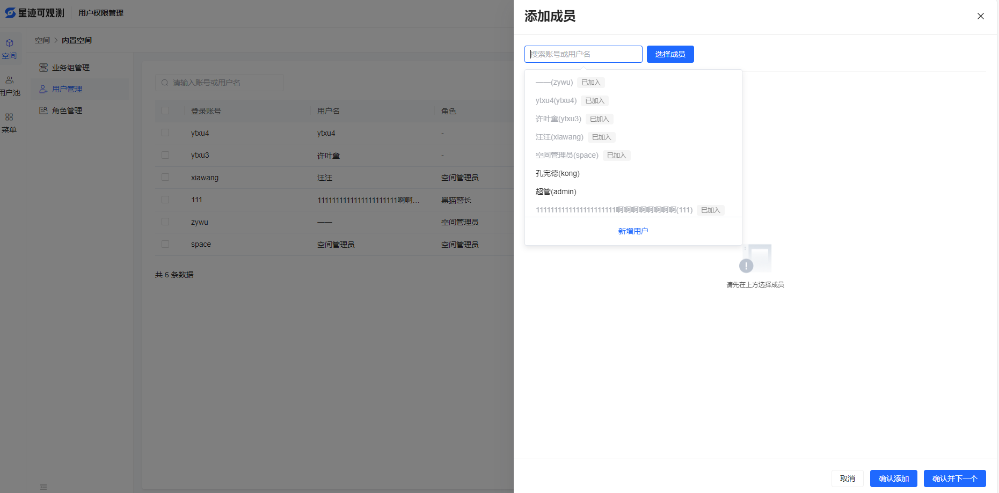
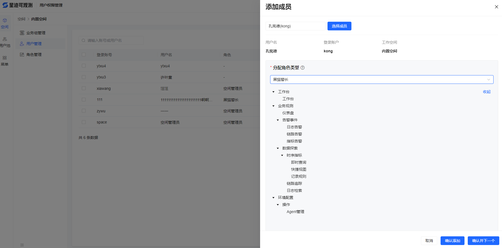
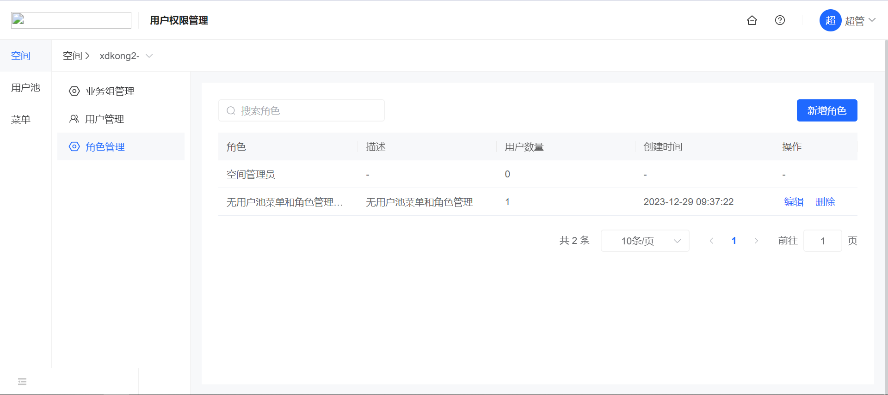

# 用户池

用户池展示的是系统中的全量用户。支持对用户进行禁用，开启，编辑基本信息，重置密码，删除等操作。平台默认一名超级管理员用户，该用户具有权限系统所有的权限，不可被禁用，不可被删除。

用户列表展示了每个用户所属空间以及空间中的角色，新增用户首状态为“未激活”，最后登录时间为空，当用户登录平台后，该用户状态变为“正常”，并且最后登录时间为用户登录时间。

用户列表如下所示

（1）新增用户：新增的用户设置默认密码，并提供复制密码功能，管理员可创建用户后复制密码给用户。可授权项目，授权项目后可参与告警平台告警组配置，但不授权角色无法登录平台。

（2）禁用：禁用的用户不能操作平台，禁用后的用户在用户列表中状态为“禁用”。被禁用的用户，可重新“启用”。

（3）编辑：同新增用户，登录帐号不可修改。

（4）重置密码：将该用户密码置为系统初始密码。初始密码同新增用户中的默认密码。

（5）删除：被空间关联的用户不可被删除。

# 菜单
菜单管理中是已经预制好的可观测平台所有菜单。支持新增、编辑、删除，但不建议作此操作，
也不建议将此权限授权他人，以免造成页面打开错误问题。

菜单通过服务模块选项，分别展示各服务模块下菜单树。

（1）新增：通过菜单树上，每个菜单后方的增加按钮，可新增该菜单的子集菜单。新增的菜单会先定义为“未命名1”，再通过编辑功能变更菜单属性

（2）编辑：可配置菜单属性，建议不要调整。

（3）删除：删除该菜单及所有子集菜单，并将删除和角色的关联关系。

# 空间管理

拥有超级管理员角色的用户拥有所有的空间权限，在空间列表中可以查看所有的空间数据，其余角色的用户只能在空间列表中查看被赋权的空间。

平台有一个初始化的内置空间，该内置空间不能被删除，其余属性与其他新建的空间无异。

空间列表不分页展示当前用户拥有的空间卡片，展示每个空间成员数，创建时间，描述等，如下所示

（1）新增空间：非超管创建空间后，无法第一时间看到创建的空间，因为该用户没有这个空间的权限，需要超管将该空间赋权给这个用户。

（2）编辑空间：同新增空间。

（3）删除空间：空间被删除后，会将该空间相关的所有信息全部删除。

选择一个空间，点击“进入空间”，空间左侧拥有三个菜单，“业务组管理”，“用户管理”，“角色管理”。其中，“角色管理”只有被管理员赋权拥有权限，才会显示。

## 1.1 业务组管理

数据单元是定义数据访问权限的最小隔离级别。

业务组反应的是当前工作空间下业务组织架构或产品线的划分，可以分配数据单元到业务组节点下，通过业务树去管理数据访问。

（1）新增业务组：设定业务组名称及上级业务组，用以显示业务组树，上级业务组置空，则表示一级业务组，业务组下可以新增子业务组。

（2）删除业务组：删除业务组的同时将子业务组一并删除，如果业务组/子业务组下挂载了数据单元，则将数据单元移动到一级展示

（3）编辑业务组：支持更改上级业务组，更改后，当前业务组移动到新的父业务组下最后一个子节点显示

（4）新增数据单元：同新增业务组，但是数据单元下不可再挂载任何元素，即数据单元为业务组树的叶子节点。数据单元会默认生成token，供数据采集端进行数据接入。

（5）删除数据单元：删除数据单元，会同步删除数据单元上附着的所有应用。

（6）编辑数据单元：同新增数据单元。

（7）新增应用：在数据单元上可创建应用。

（8）删除应用：支持批量删除应用。

（9）编辑应用：同新增应用。

## 1.2 用户管理
用户管理用于管理此工作空间下所有关联用户，工作空间也只对关联的用户可见。

（1）列表展示：可根据账号、姓名检索用户列表。列表展示用户的账号、姓名、角色、数据单元、联系手机号、邮箱。

（2）添加成员：列表页点击添加成员，可输入昵称、账号检索后，选中成员并点击添加成员，随后会展示该成员详情。
在角色授权处选择分配角色，下方会实时展示该角色菜单权限。
点击保存会保存此用户信息并跳至列表页。点击保存并下一个，会保存此用户并打开新的添加成员弹框，可继续添加成员。

（3）新增成员：添加成员时，如果成员不存在可新增成员，所填信息同用户池新增用户，但所属空间是固定的当前空间。

（4）更改授权：同添加成员，但去除了成员检索的步骤。可编辑成员角色。

（5）移除：点击移除会将此用户从此工作空间移除。同时去除他在此空间下的角色菜单权限。该用户将不再可见及操作此工作空间。

（6）批量移除：批量选中用户列表页第一列多选框，点击批量移除，会将被选中的用户从此工作空间移除。

## 1.3 角色管理

每一个用户被赋予空间下的角色后，才能对空间进行操作。角色列表如下

（1）新增角色：可根据空间中已经存在的参考角色进行快速菜单赋权，每一个角色默认授权“工作台”菜单权限。

（2）编辑角色：同新增

（3）删除角色： 支持角色删除

