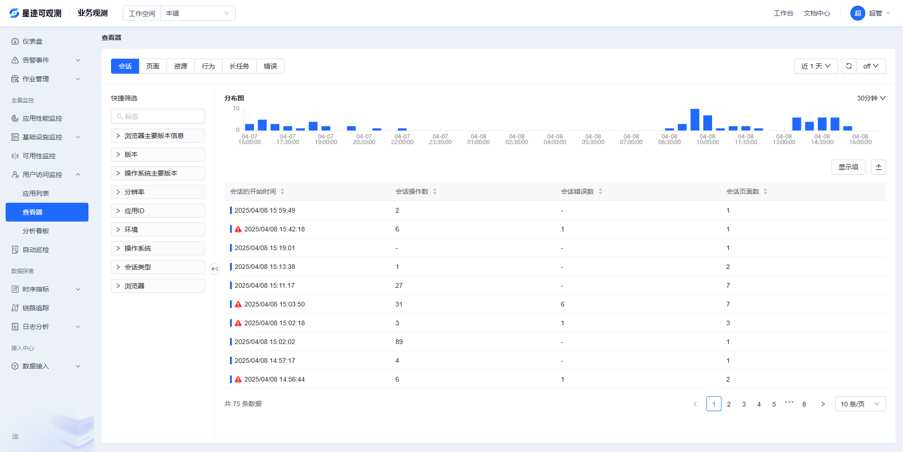

# 用户访问查看器

用户访问监测查看器可以帮助您查看与分析用户访问应用程序的详细信息。

在**用户访问监测 > 应用列表 > 查看器**，可了解每个用户会话、页面性能、资源、用户行为、长任务以及前端错误，帮助您通过搜索、筛选和关联分析全面了解和改善应用的运行状态和使用情况。

观测云用户访问监测下的查看器包括以下几种：

| 查看器类型          | 概述                                                                                                                                 |
| ------------------- | ------------------------------------------------------------------------------------------------------------------------------------ |
| 会话（Session）     | 用户持续访问的一段时长为一个会话，查看用户访问的一系列详情，包括用户访问时间、访问页面路径、访问操作数、访问路径和出现的错误信息等。 |
| 页面（View）        | 查看页面性能指标、页面加载资源、页面错误、回溯用户的操作路径                                                                         |
| 资源（Resource）    | 查看网页上加载的各种资源信息，包括状态码、请求方式、资源地址，加载耗时等。                                                           |
| 操作（Action）      | 查看用户在使用应用期间的操作交互，包括操作类型，页面操作详情，操作耗时等。                                                           |
| 长任务（Long Task） | 查看用户在使用应用期间，阻塞主线程超过 50ms 的长任务，包括页面地址、任务耗时等。                                                     |
| 错误（Error）       | 查看用户在使用应用期间，浏览器发出的前端错误，包括错误类型、错误内容等。                                                             |

**错误数据提示**

用户访问数据的状态分为<u>警告 (warning）和正常 (info）</u>两种类型。若用户访问数据类型为警告，即数据出现错误，则在查看器的数据列表前提示 ⚠️，帮助您快速识别用户访问时出现的性能问题，包括网络问题、页面加载错误、页面 DOM 解析错误等。

## 会话（Session）

可查看用户访问会话的一系列详情，包括用户访问时间、访问页面路径、访问操作数、访问路径和出现的错误信息等。

在会话查看器，您可以：

- 可视化的查看用户访问业务应用的浏览体验，直观的了解用户的操作行为；
- 结合用户访问的性能详情，快速了解及跟踪用户访问业务应用时的页面加载、资源错误等性能情况，帮助快速发现并优化应用程序的代码问题。

在会话查看器，您可以查看用户访问时的会话时长、会话类型（真实用户访问 "user"）、页面访问数量、操作数量、错误数、用户最初访问页面和最后浏览页面等。

**会话时长的定义** : 当用户开始浏览 Web 应用程序时，用户会话就开始了。它使用唯一的会话 ID（ `session_id` ）属性聚合在用户浏览期间收集的所有 RUM 事件。  
⚠️ **注意**：15 分钟不活动后会话将重置。

### 详情页

点击列表中需要查看的数据详情页，您可以查看当前应用的属性字段、会话详情、扩展字段等信息。

会话详情包括用户访问时长、访问类型、服务类型和访问详情；

**访问类型**：包括访问动作（action)、访问路径（view）和出现的错误信息（error）等。点击对应类型图标，即可**跳转至对应详情页**。

### 扩展字段

在搜索栏，可输入字段名称或值快速搜索定位；

点击复制图标，可复制该字段至剪贴板。

## 页面（View）

可查看用户访问环境、回溯用户的操作路径、分解用户操作的响应时间以及了解用户操作导致后端应用一系列调用链的性能指标情况。

在页面查看器，您可以：

- 追踪每一个页面的用户访问数据，包括加载时间、停留时间等；
- 结合每一个页面关联的资源请求、资源错误、用户行为等数据，全面分析用户访问业务应用的性能情况，帮助快速发现并优化应用程序的代码问题。

在页面查看器，您可以快速查看用户访问时的页面地址、页面加载类型、页面加载时间、用户停留时间等。

### 详情页

点击列表中需要查看的数据详情页，您可以查看用户访问的页面性能详情，包括属性、来源、性能详情、链路详情、错误详情等。

在**来源**支持查看当前页面的会话详情，筛选/复制查看当前的 Session ID 或进行跳转查看对应会话。

#### 性能

**性能**页面可以帮助您查看到用户访问指定应用时前端的页面性能，包括：页面加载时间、内容绘制时间、交互时间、输入延时等

以下图为例，可以看出 LCP（最大内容绘制时间）的指标达到了 2.2 秒（推荐时间 ≤3 秒），说明页面加载速度较为满意。

在搜索栏可输入字段名称或值快速定位

列表中每个事件包括访问行为（action)、访资源（resource）和出现的错误信息（error）、长任务（long task）等，点击对应类型，即可**跳转至对应详情页**。

#### 扩展字段

在搜索栏，可输入字段名称或值快速搜索定位；

点击复制图标，可复制该字段至剪贴板。

#### 关联 Fetch/XHR

查看用户访问时向后端发出的网络请求：

- 请求时间
- 请求路径
- 状态码
- 请求加载耗时

点击数据行可查看相关资源详情

#### 关联错误

查看当前页面发生的错误信息：

- 错误类型
- 错误内容
- 发生时间

点击数据行可查看相关错误详情

## 资源（Resource）

可查看网页上加载的各种资源信息，包括状态码、请求方式、资源地址、加载耗时等。

在资源查看器，您可以：

- 追踪每一个资源的用户访问请求，包括状态码、请求方式、资源地址、加载耗时等；
- 结合关联的资源请求、资源错误、日志等数据，全面分析用户访问业务应用的性能情况，帮助快速发现并优化应用程序的代码问题。

### 详情页

点击列表中需要查看的数据详情页，您可以查看用户访问的操作事件性能详情，包括：

- 来源
- 扩展字段

## 行为（Action）

可查看用户在使用应用期间的操作交互，包括操作类型、页面操作详情、操作耗时等。

在行为查看器，您可以：

- 追踪每一个用户操作事件，包括操作类型、名称和耗时
- 结合关联的请求、错误数据，全面分析应用性能问题

### 详情页

查看用户操作事件的完整详情

- 操作来源
- 扩展字段
- 性能指标
- 相关错误
- 相关资源

详细介绍请参考**页面详情页**

## 长任务（Long Task）

可查看用户在使用应用期间，阻塞主线程超过 50ms 的长任务，包括页面地址、任务耗时等。

在长任务查看器，您可以：

- 追踪每一个用户访问的长任务，包括操作类型、操作名称、操作耗时等；
- 结合关联的资源请求、资源错误等数据，全面分析用户访问业务应用的性能情况，帮助快速发现并优化应用程序的代码问题。

### 详情页

点击列表中需要查看的数据详情页，您可以查看用户访问的操作事件性能详情，包括来源、扩展字段、性能详情、关联错误等。

## 错误（Error）

可查看用户在使用浏览器前端应用时，所发生的前端错误。包括错误类型、错误内容等。

在错误查看器中，您可以集中查看所有错误类型的及其相关详情；

#### 所有错误

在错误查看器，可以快速查看用户访问的页面地址、代码错误类型、错误内容等。

#### 聚类分析

若需要查看发生频次较高的错误，可以在用户访问监测 > 查看器 > Error 选择<strong>聚类分析</strong>列表。

聚类分析是对所有错误的数据基于聚类字段进行相似性计算分析，将近似度高的错误进行聚合，提取并统计共同的 Pattern 聚类，帮助发现异常和定位问题。

默认根据 error_message 字段进行聚合，最多输入 3 个聚类字段，可自定义输入聚类字段，对错误进行聚合分析。

#### 详情页

点击列表中需要查看的数据页签，可以查看错误访问详情页，包括错误详情、扩展字段等。

