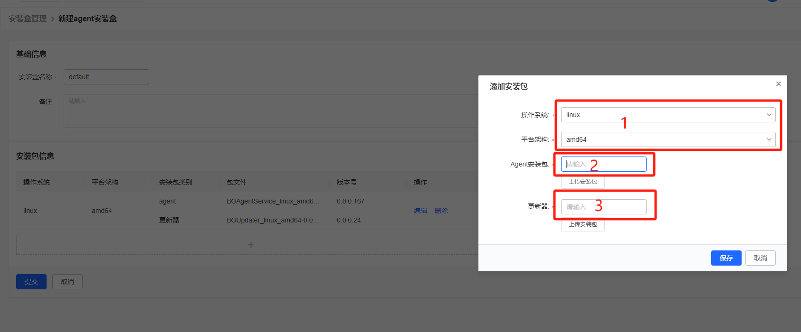
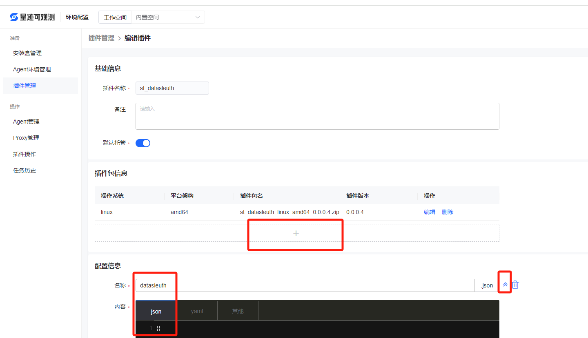
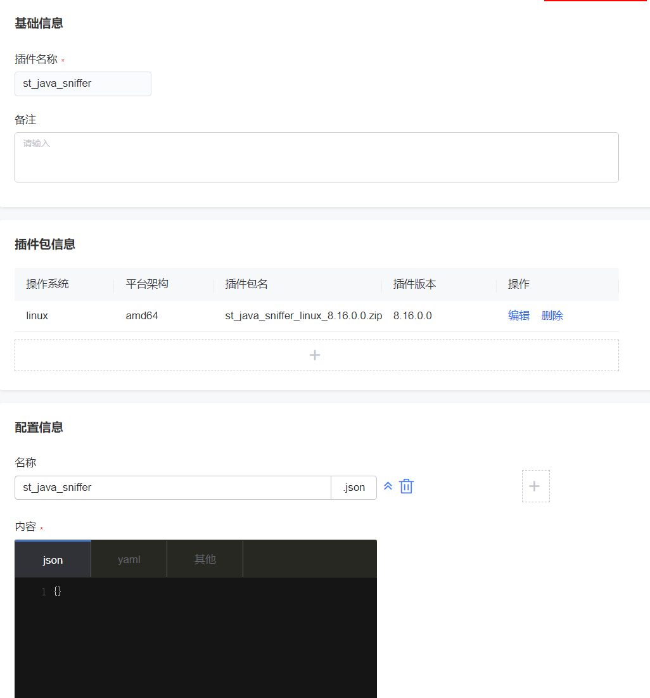
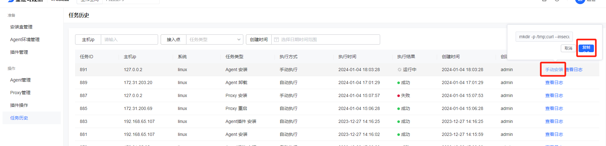
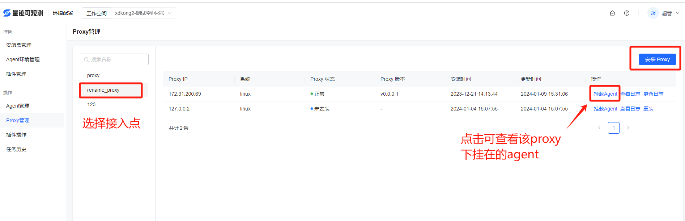
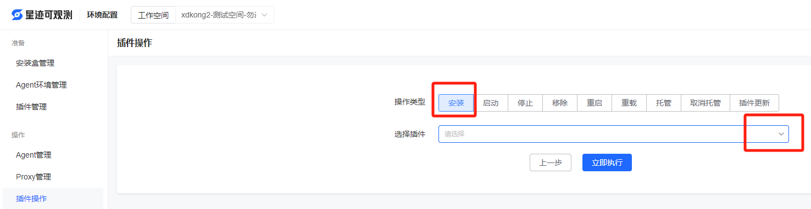

# 环境配置

## 简介

星迹的环境配置主要是指配置、安装采控相关的st_agent、proxy及各种插件。st_agent是需要安装到目标终端上的软件包，通过对终端上st_agent的控制来管理各种采集插件(如st_datasleuth)，来完成终端机器及其上面的各中间件的性能健康指标的数据采集；proxy是当业务方的一些服务器是在独立的内网中，与公网的接入有着严格的限制的时候使用的，可观测可以通过proxy的代理来管理内网中的agent。环境配置主要包括agent、proxy、插件的管理。

## 安装盒管理

agent的安装可以直接在可观测平台上进行, 而不用到具体的服务器上去手动部署, 因此, 需要提前把agent的安装包上传到可观测平台, agent安装盒模块就是管理需要安装的所有agent安装包的。agent安装盒分为agent安装盒和proxy安装盒, proxy是某些私有网络无法与公网直接联通时使用的, 要根据自己的网络情况选择性使用。agent安装盒里包含agent安装包和升级器，proxy安装盒包含proxy安装包和升级器。升级器是用来给agent和proxy自动化升级的。

上传上述的各种安装包时，一定要选择对应的操作系统及平台架构（下图中1处）。上传的包名按照我方给出时的，不要随意修改包名。在上传时，下图2, 3处不用手动填写，直接点击上传安装包，上传完成后会自动根据包名填写2，3处的内容。一组安装包添加完后，点击下方加好可以添加另一组不同操作系统和平台架构的包，但是一个操作系统+平台架构只能添加一组。如果有多个版本的安装包需要管理，只需要新建多个安装盒就可以，安装时选择需要的安装盒即可。

## agent环境管理

安装agent除了需要安装包外，还需要设置相关的环境变量，比如agent的数据目录，管理agent的服务器地址（gse服务），是否需要同时安装采集数据的插件（st_datasleuth）等信息。可以建立多个不同的agent环境，在安装agent的时候选择不同的环境，agent、Proxy、插件安装就会根据选择的agent环境进行安装。比如：

​    用root用户安装agent时，安装路径的配置就必须是默认的路径，agent安装方式也会使用操作系统管理agent；

​    而使用非root用户安装agent时，就必须配置一个该用户的agent环境，其中的路径必须配置为该用户拥有权限的目录，非root用户安装的agent就是普通安装，如果agent挂了，系统不会有自动拉起功能。

​		非root用户安装的agent和插件在功能上受到很多限制，比如进程列表获取不到进程端口，部分拨测功能不能用，agent挂了不会自动拉起等，所以**不建议使用非root用户安装agent**。

下面详细介绍每个配置的含义及配置方法。

- 名称：可以配置多套环境，安装时选择需要的环境，每套环境可以取个有辨识度的名称。
- 内网地址、外网地址：gse服务的ip或域名，给agent下达指令，agent的安装都是通过gse来进行的，复杂网络中可能有的服务器访问不到内网，所以需要gse有一个外网地址，非复杂网络两个填一样的就行。
- agent安装盒：上一步[安装盒管理](#安装盒管理)中配置的安装盒，里面是agent的安装包。
- 是否启用proxy：如果网络环境需要启用proxy，选择[安装盒管理](#安装盒管理)中配置的proxy安装盒。
- 代理端口：如果勾选了启用proxy，此处填写proxy将启用的端口，后续agent将通过此端口连接proxy。
- 主进程目录：如果该环境是新建给root用户安装agent的，不可更改默认路径，如果是给非root用户安装agent的，路径必须修改为该用户有权限的路径。
- 数据目录：如果该环境是新建给root用户安装agent的，不可更改默认路径，如果是给非root用户安装agent的，路径必须修改为该用户有权限的路径。
- 日志目录：如果该环境是新建给root用户安装agent的，不可更改默认路径，如果是给非root用户安装agent的，路径必须修改为该用户有权限的路径。
- 临时文件目录：如果该环境是新建给root用户安装agent的，不可更改默认路径，如果是给非root用户安装agent的，路径必须修改为该用户有权限的路径。
- 插件目录：如果该环境是新建给root用户安装agent的，不可更改默认路径，如果是给非root用户安装agent的，路径必须修改为该用户有权限的路径。
- 启用数据采集插件：必填，使用st_datasleuth插件。勾选后要填写n9e的地址，st_datasleuth插件上报采集的数据到n9e服务器，因为很多功能都是利用st_datasleuth插件完成的。
- 数据采集目标地址：st_datasleuth采集的数据上报的地址，指的是n9e服务的地址，只需要ip+端口；如http://127.0.0.1:17000

## 插件管理

与安装盒类似，要安装插件，必须先将插件包上传到星迹平台。插件可以由agent控制，负责插件的的安装、卸载等等操作，也可以由用户手动去服务器上安装。此处介绍的是由agent控制的，就是在星迹平台页面上管控插件的操作。插件是可以后期根据功能新增的，目前有st_datasleuth、st_vector、st_java_sniffer3个内置插件。每种插件配置什么内容下文都会详细介绍。

进入插件管理页后，点击新建插件按钮，有4个选项分别是指标插件、日志插件、链路插件、自定义插件，点击即可配置对应的插件，前3个插件时可观测提供的，插件包在部署包中，自定义插件是用来扩展的。

在环境管理页面安装和管理插件的方式我们称为在线安装，在线安装的好处是插件由可观测来管理，在很多用到插件的场景中，可观测系统都可以直接使用插件，比如中间件的数据采集，日志采集等都可以直接在页面进行配置接入，然后由可观测系统直接将任务下发给插件。但是有些特殊场景可能不支持在线安装管理插件，此时则需要手动安装，本文提供需要[离线安装的场景描述与datasleuth离线安装方法](#datasleuth离线安装)。

#### st_datasleuth的配置

- 插件名称：st_datasleuth，内置的不可更改。
- 默认托管：是否将插件托管给agent，托管后agent会通过心跳判断st_datasleuth的死活，并重启挂掉的st_datasleuth进程。
- 插件包信息：点击加号添加包信息，选择操作系统和平台架构，上传文件包后会自动填写版本号，前提是不要修改插件包的名称，就按照我方给你的包的原始名称。
- 配置信息：由于st_datasleuth不需要额外的配置信息，因此，名称位置填datasleuth，点击右边的向下箭头，里面填个{}即可，见下图。
- 启动命令：st_datasleuth插件的启动命令为  `chmod +x ./start.sh &&./start.sh {service} {data_group}`
- 停止命令：st_datasleuth插件的停止命令为  chmod +x ./stop.sh && ./stop.sh
- 备份配置：勾选后，升级插件时会把原来的配置文件备份一下，升级完成后在将原来备份的还原回来。
- 配置目录：st_datasleuth的配置相对目录为conf.d，不可填其他。
- 进程名称：st_datasleuth



#### st_vector的配置

- 插件名称：st_vector，内置的不可更改。
- 默认托管：是否将插件托管给agent，托管后agent会通过心跳判断插件的死活，并重启挂掉的插件进程。
- 插件包信息：点击加号添加包信息，选择操作系统和平台架构，上传文件包后会自动填写版本号，前提是不要修改插件包的名称，就按照我方给你的包的原始名称。
- 配置信息：由于st_vector不需要额外的配置信息，因此，名称位置填st_vector，点击右边的向下箭头，选json，里面填个{}即可，见下图。
- 启动命令：sh ./start.sh
- 停止命令：sh ./stop.sh
- 备份配置：勾选后，升级插件时会把原来的配置文件备份一下，升级完成后在将原来备份的还原回来。
- 配置目录：config/，不可填其他。
- 进程名称：./bin/vector


#### st_java_sniffer的配置

- 插件名称：st_java_sniffer，内置的不可更改。
- 插件包信息：点击加号添加包信息，选择操作系统和平台架构，上传文件包后会自动填写版本号，前提是不要修改插件包的名称，就按照我方给你的包的原始名称。
- 配置信息：由于st_java_sniffer不需要额外的配置信息，因此，名称位置填st_java_sniffer，点击右边的向下箭头，选json，里面填个{}即可，见下图。




## agent管理

agent管理页面展示的是已经安装的agent列表，agent的管理包括安装、重装、卸载、移除、重启、编辑、更新等。

#### 安装

点击安装进入安装页面，安装分为远程安装和手动安装，远程安装需要填写待安装的服务器的账号密码，星迹平台自动执行安装脚本，不需要自己去服务器上进行任何操作。手动安装不用填写账号密码，星迹平台会生成安装脚本，用户自己复制到服务器上去执行脚本。

- 接入点：安装页的接入点选择[agent环境管理](#agent环境管理)中配置好的环境即可
- 监控数据采集：是否同时安装st_datasleuth等插件, 如果需要安装插件就勾选上想要安装的插件（可以多选），如果暂时不确定要安装什么插件就不勾选，后面在插件操作里再安装。
- 安装信息：填写服务器的相关信息即可，批量安装时，可以点击复制行来填写多台服务器数据。

如果是选择远程安装，填写完信息点击安装就可以了；如果是手动安装，点击安装后，会跳转到任务历史页，星迹会初始化安装的信息，初始化完成后会出现手动安装的按钮，鼠标停上去会出现复制按钮，点击复制，然后登录到服务器上去执行刚刚复制的脚本即可，见下图。



#### 重装

重装会删除掉原来的agent后重新安装, 步骤跟安装类似。

#### 卸载

卸载会卸载掉机器上的agent，但是会保留星迹平台的记录，也就是说agent列表中还有这个agent，只是状态为未安装，此功能区别于移除。

#### 移除

卸载agent，并且从星际平台列表删除。

#### 重启

重新启动。

#### 编辑

只能编辑少量配置信息。

#### 更新

agent需要升级时，使用此功能。

## proxy管理

有的业务存在孤立的网络环境，其中的服务器无法直接与公网通信，此时可以安装一台proxy负责代理该局域网中的agent与gse服务通信。

#### 安装

proxy的安装与agent的安装步骤几乎完全一样，此处不在赘述。需要注意的是：安装时选择接入点的配置必须是勾选了启用proxy的接入点（在[agent环境管理](#agent环境管理)配置时）。而且，使用该proxy作为代理的agent安装都要使用跟proxy同样的接入点。agent也安装完成后，可以查看该proxy下挂载的agent，如下图：



proxy的其他操作与agent一样，参考agent的就行。

## 插件操作

在插件操作页面，勾选对应的节点后，点击下一步，可以看到对插件的各种操作，如下图：选择要操作的插件，选中响应的操作按钮，点击立即执行即可。此处对几个操作做一个简单的说明，主要是托管和取消托管，托管的意思是把插件托管给agent，agent会监听插件进程，如果插件挂了，agent会重新拉起。




## 任务历史

历史如无页面主要是查看上面各个操作的操作日志，比如agent安装、proxy安装、插件安装，都可以在此处查看相应的日志及操作状态。


##  datasleuth离线安装

datasleuth插件的离线安装是在有些特殊情况下，不支持在线安装的情况下使用的，比如：

1. Linux机器上,只使用可观测系统的部分服务，不部署采控服务(nodeman服务，gse服务 )情况下，需要离线安装datasleuth插件;
2. Windows机器上无法在线安装;
3. k8s集群中无法在线安装;

离线安装的插件无法在可观测的页面上进行管理，只能运维自己去服务器上管理插件。


### 1、 Linux版本安装

获取部署包并解压st_datasleuth_linux_amd64_x.x.x.x.zip

```shell
# 创建部署目录
mkdir -p /data/service/datasleuth
cd /data/service/datasleuth

# 解压
unzip  st_datasleuth_linux_amd64_x.x.x.x.zip
chmod +x st_datasleuth start.sh stop.sh
```

### 编辑datasleuth配置文件

```
vim conf.d/datasleuth.conf
```

```json
修改dataway的url,n9e服务的nginx代理地址
[dataway]
  urls = ["http://127.0.0.1"] 
添加全局tag，在global_host_tags下添加data_group，为数据单元，去可观测的权限管理页面拷贝正确地数据单元填在此处
[global_host_tags]
data_group=""

```

### 启动datasleuth

```shell
sh ./start.sh
```

### 停止datasleuth

```shell
sh ./stop.sh

```

### 添加采集任务

通过修改conf.d/目录下的各个组件配置（conf.d/db/mysql.conf）如开启不同的组件的采集，注意：第一次安装要先启动datasleuth才会生成XXX.conf文件。


### 2、 windows版本安装

获取部署包并解压st_datasleuth_windows_amd64_x.x.x.x.zip

```shell
# 创建部署目录并进入
D:\data\service\datasleuth
# 解压 st_datasleuth_linux_amd64_x.x.x.x.zip

```

### 编辑datasleuth配置文件

```
conf.d/datasleuth.conf
```

```json
修改dataway的url,n9e服务的访问地址
[dataway]
  urls = ["http://127.0.0.1:17000"] 

添加全局tag，在global_host_tags下添加os = "windows"，data_group为数据单元，去可观测的权限管理页面拷贝正确地数据单元填在此处
[global_host_tags]
os = "windows"
data_group=""


```

### 启、停datasleuth

```shell
方式一：
启动:双击st_datasleuth.exe启动，该方式启动不能管理cmd窗口，否则进程会停止。
停止：关掉cmd窗口
方式二：
启动:在powershell中执行Start-Process -WindowStyle hidden -FilePath '双击st_datasleuth.exe'
停止：在任务管理器的进程中找到双击st_datasleuth，并结束。
```

### 添加采集任务

通过修改conf.d/目录下的各个组件配置（conf.d/db/mysql.conf）如开启不同的组件的采集，注意：第一次安装要先启动datasleuth才会生成XXX.conf文件。

### 3、 k8s版本安装

1. 获取镜像包datasleuth-v1.0.0.5.tar并加载镜像到k8s的每个节点，版本号根据包名正确填写，文档给出的是示例。

```shell
加载镜像
docker load < datasleuth-v1.0.0.5.tar
```

2. 修改datasleuth.yaml配置

   ```
   1、ENV_DATAWAY环境的值为自己的n9e访问地址
   name: ENV_DATAWAY
   value: http://127.0.0.1:17000
   2、在ENV_GLOBAL_HOST_TAGS的值后面追加data_group，data_group为数据单元，去可观测的权限管理页面拷贝正确地数据单元填在此处。
   name: ENV_GLOBAL_HOST_TAGS
   value: host=__datasleuth_hostname,host_ip=__datasleuth_ip,data_group=tok_294c7bd237c34500b25c862c833fd236
   3、镜像的名称修改为自己加载的名称，文档中为示例。
   image: datasleuth:v1.0.0.5
   ```

3. 执行

   ```
   删除原来的：kubectl delete  -f  datasleuth.yaml
   启动          ： kubectl apply -f datasleuth.yaml
   查看是否启动成功： kubectl get pod -n datasleuth
   ```

4. 检查安装metric-server

   如果没有安装[Kubernetes-metrics-server](https://github.com/kubernetes-sigs/metrics-server)请先安装。
