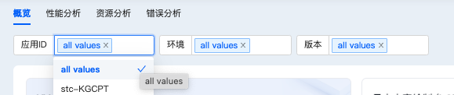
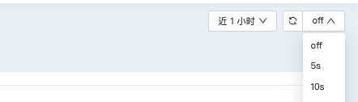
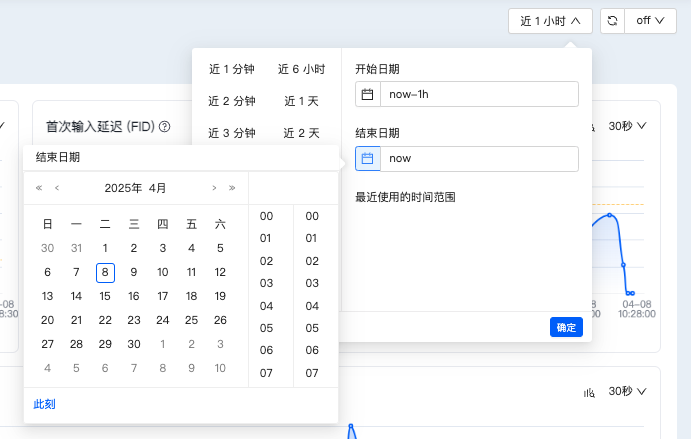
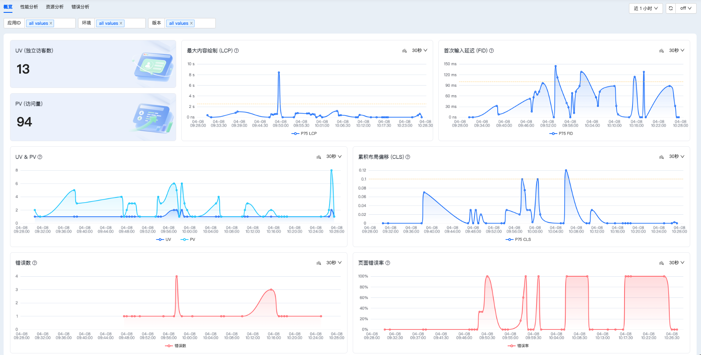
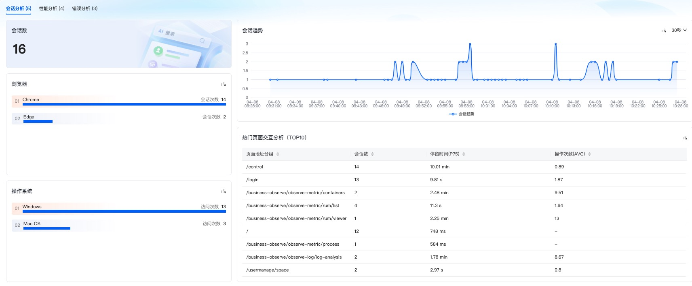
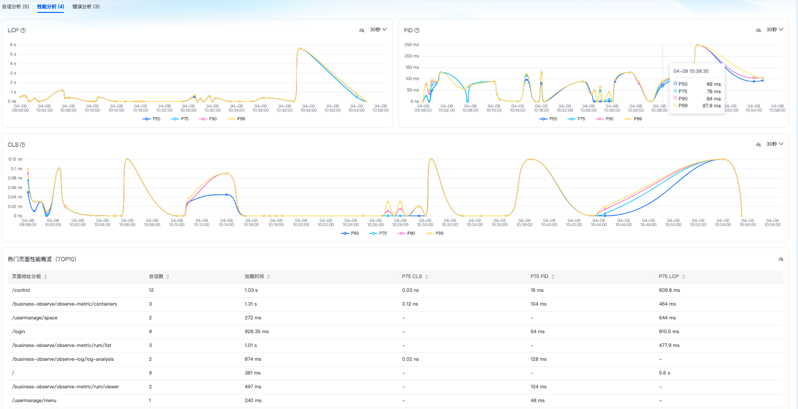
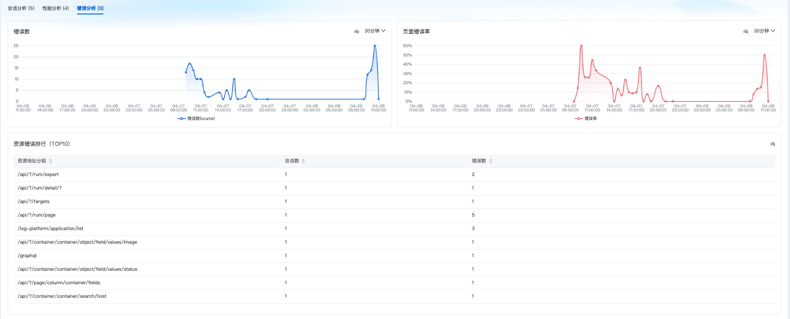

# 分析看板概览页操作文档

## 功能概述
用户访问监控支持对不同端口的应用进行可视化分析，并预设了多种监测方案。应用数据上传至监控插件并持久化到数据库后，您可以在分析看板中直接查看应用的分析情况，涵盖以下关键分析维度：
- 概览
- 性能
- 资源
- 错误

## 核心指标说明
以下是谷歌网站核心指标的详细说明，用于衡量网站的载入速度、互动性和页面稳定性：

| 指标名称 | 全称 | 说明 | 目标值 |
|---------|------|------|--------|
| **LCP** | Largest Contentful Paint | 计算网页可视范围内最大的内容元件需花多少时间载入 | < 2.5s |
| **FID** | First Input Delay | 计算用户首次与网页互动时的延迟时间 | < 100ms |
| **CLS** | Cumulative Layout Shift | 计算网页载入时的内容是否会因动态加载而页面移动（0表示没有变化） | < 0.1 |

## 概览页

### 1. 页面概述
概览页集中展示核心监测数据，支持通过应用ID/环境/版本等多维度筛选，提供自动刷新和自定义时间范围功能，包含四大分析模块的数据可视化呈现。

### 2. 筛选控制区

| 功能模块   | 操作说明                                                                 |
|------------|--------------------------------------------------------------------------|
| 字段选择   | 点击「应用ID/环境/版本」筛选框弹出值列表，展示当前查询区间内所有可选值       |
| 自动刷新   | 开关控制（默认关闭），开启后可设置刷新间隔（10s/30s/1min可选）             |
| 日期选择   | 支持快捷选项（最近1h/24h/7d）和自定义日期时间范围选择                      |

---

### 3. 主要指标模块

| 指标名称          | 说明                                                                 | 类型       |
|-------------------|----------------------------------------------------------------------|------------|
| UV               | 独立访客数，基于设备标识去重统计访问用户量                           | 数据卡片   |
| PV               | 页面访问总量，统计所有被浏览页面的访问次数                           | 数据卡片   |
| LCP(p75)         | 75分位最大内容绘制时间，反映页面主要内容加载效率                     | 趋势图     |
| FID(p75)         | 75分位首次输入延迟，衡量页面交互响应速度                             | 趋势图     |
| UV & PV          | 双轴对比图展示用户量与访问量的变化关系                               | 组合趋势图 |
| CLS(p75)         | 75分位累积布局偏移，评估页面视觉稳定性                               | 趋势图     |
| 错误数           | JS错误、资源加载错误等所有前端错误的累计数量                         | 趋势图     |
| 页面错误率       | (错误页面数/总页面数)×100%，反映页面访问成功率                       | 趋势图     |

---

### 4. 会话分析模块

| 指标名称                | 说明                                                                 | 类型       |
|-------------------------|----------------------------------------------------------------------|------------|
| 会话数                 | 用户连续活动的总和（30分钟无操作自动断开）                           | 数据卡片   |
| 浏览器分布             | 按Chrome/Firefox/Safari等分类统计访问来源                           | 分类图     |
| 操作系统分布           | 统计Windows/macOS/iOS/Android等系统占比                             | 分类图     |
| 会话趋势               | 按小时/天维度展示用户活跃度变化                                      | 趋势图     |
| 热门页面交互(TOP10)    | 综合浏览量、停留时长和操作次数的优质页面排行，支持按各字段升降序排序 | 排序表格   |

---

### 5. 性能分析模块

| 指标名称                | 说明                                                                 | 类型       |
|-------------------------|----------------------------------------------------------------------|------------|
| LCP分位值              | 展示50/75/90/99分位加载耗时，全面反映性能分布                        | 多线趋势图 |
| FID分位值              | 不同百分位的交互延迟数据，识别极端情况                               | 多线趋势图 |
| CLS分位值              | 各分位的布局偏移评分，检测视觉稳定性问题                             | 多线趋势图 |
| 热门页面性能(TOP10)    | 综合加载时间、核心指标的优质页面排行，支持按LCP/FID/CLS等字段排序    | 排序表格   |

---

### 6. 错误分析模块

| 指标名称                | 说明                                                                 | 类型       |
|-------------------------|----------------------------------------------------------------------|------------|
| 错误数                 | 与主要指标区实时同步的错误总量                                       | 趋势图     |
| 页面错误率             | 同步主要指标区的错误率数据                                           | 趋势图     |
| 资源错误榜(TOP10)      | 按错误数/影响会话数排名的关键资源列表，红色标注高频错误源            | 排序表格   |
