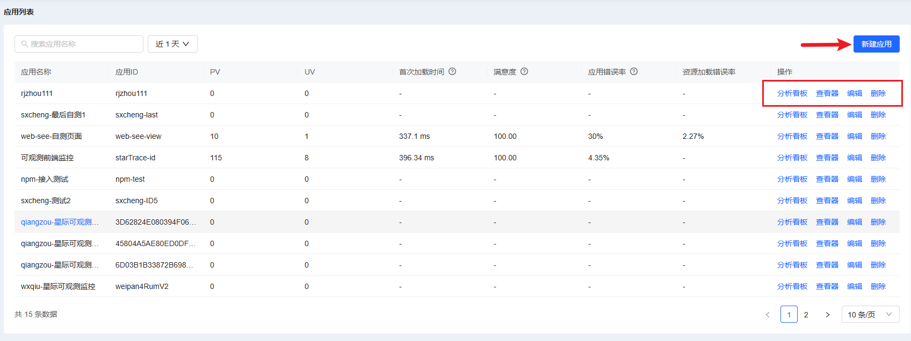
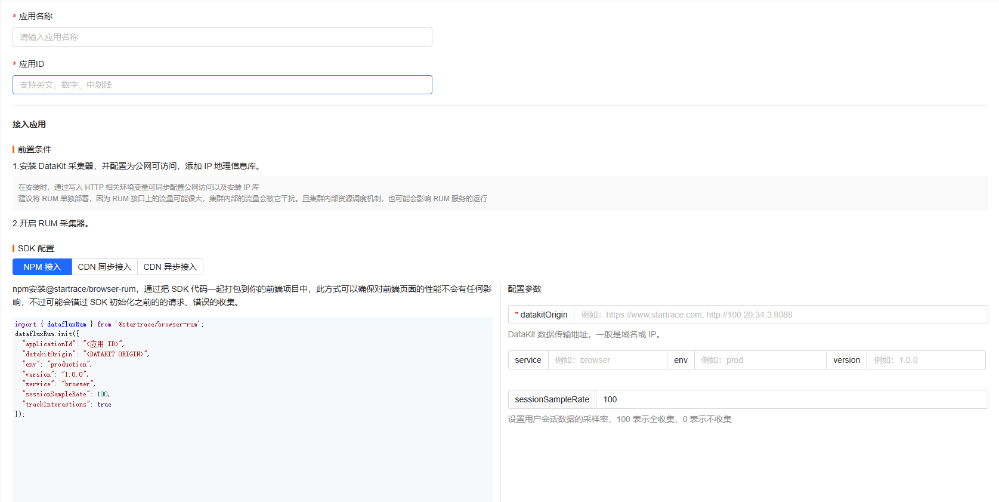

# 应用接入操作文档

## 应用列表

进入平台后，打开**业务观测 > 用户访问监控 > 应用列表**，可管理当前的应用，包括新增、编辑和删除应用，点击分析看板和查看器，将携带当前应用id进行数据的检索



## 应用接入

### 前置条件

1. 安装 datasleuth采集器

   需要安装一个datasleuth用来接收前端监控的数据，该datasleuth可以通过可观测页面的环境管理在线安装，也可以离线手动安装datasleuth，不管用什么方式安装完毕，都要去datasleuth的安装目录修改一些配置。

2. 暴露公网接口

   前端页面的数据上报到datasleuth，所以该datasleuth需要暴露到公网，通常通过Nginx代理来实现，下文都是基于Nginx代理datasleuth的方法；

3. 配置datasleuth

   按照以下方法配置datasleuth，即可开启datasleuth的前端监控功能：
   
   1、进入datasleuth的安装目录后
   
   `vim conf.d/datasleuth.conf`
   
   在后面加入以下配置，如果这些配置原来有，按照下面的修改：
   ```
   [http_api]
   
     # HTTP server address
     listen = "0.0.0.0:9529"
   
     # Disable 404 page to hide detailed Datakit info
     disable_404page = true
   
     # only enable these APIs. If list empty, all APIs are enabled.
     public_apis = []
   
     # Datakit server-side timeout
     timeout = "60s"
     close_idle_connection = false
   ```
   
   2、修改rum.conf
   
   `vim conf.d/rum/rum.conf`
   
   按照如下修改：
   
   ```
   [[inputs.rum]]
     # 是否启用该input
     enable_input = true
     endpoints = ["/v1/write/rum"]
   ```
   3、重启datasleuth
   
   ```
   sh stop.sh
   sh start.sh
   ```
   
   
   
4. 配置Nginx

在Nginx中做如下配置，实现Nginx代理datasleuth

```
location /v1/write/rum {
        proxy_pass http://datasleuth_ip:9529;
}
```


### 开始接入

1. 点击**新建应用**进入应用接入页面；
2. 输入应用名称；
3. 输入应用 ID；
4. 选择SDK 配置并填写配置参数，点击确定完成应用创建；
5. 复制对应的SDK配置内容到项目代码中，即可进行数据上报



#### SDK 配置

| 接入方式     | 说明                                                  |
| -------- | --------------------------------------------------- |
| NPM      | 将 SDK 代码打包到前端项目中，确保前端性能不受影响，但可能错过 SDK 初始化前的请求和错误收集。 |
| CDN 异步加载 | 通过 CDN 异步引入 SDK 脚本，不影响页面加载性能，但可能错过初始化前的请求和错误收集。     |
| CDN 同步加载 | 通过 CDN 同步引入 SDK 脚本，能收集所有错误和性能指标，但可能影响页面加载性能。        |

::: code-group

```js [NPM]
import { datafluxRum } from '@startrace/browser-rum';
datafluxRum.init({
  "applicationId": "<应用 ID>",
  "datakitOrigin": "<DATAKIT ORIGIN>",
  "env": "production",
  "version": "1.0.0",
  "service": "browser",
  "sessionSampleRate": 100,
  "trackInteractions": true
});
```

```html [CDN 同步接入]
<script src="http://127.0.0.1/dataflux-rum.js" type="text/javascript"></script> 
<script>
  window.DATAFLUX_RUM &&
    window.DATAFLUX_RUM.init({
  "applicationId": "<应用 ID>",
  "datakitOrigin": "<DATAKIT ORIGIN>",
  "env": "production",
  "version": "1.0.0",
  "service": "browser",
  "sessionSampleRate": 100,
  "trackInteractions": true
});
</script>
```

```html [CDN 异步接入]
<script>
(function (h, o, u, n, d) {
    h = h[d] = h[d] || {
    q: [],
    onReady: function (c) {
        h.q.push(c)
    }
    }
    d = o.createElement(u)
    d.async = 1
    d.src = n
    n = o.getElementsByTagName(u)[0]
    n.parentNode.insertBefore(d, n)
})(
    window,
    document,
    'script',
    'http://127.0.0.1/dataflux-rum.js',
    'DATAFLUX_RUM'
)
DATAFLUX_RUM.onReady(function () {
    DATAFLUX_RUM.init({
  "applicationId": "<应用 ID>",
  "datakitOrigin": "<DATAKIT ORIGIN>",
  "env": "production",
  "version": "1.0.0",
  "service": "browser",
  "sessionSampleRate": 100,
  "trackInteractions": true
});
});

</script>
```
:::

#### 参数说明

| 参数{width=160}       | 类型{width=100}      | 是否必须{width=100} | 默认值{width=100}   | 描述 |
|-----------------------|-----------|----------|----------|------|
| `applicationId`       | String    | 是       |          | 应用 ID。 |
| `datakitOrigin`       | String    | 是       |          | DataKit 数据上报 Origin，与代理datasleuth的nginx的域名或地址一致<br>注释: `协议（包括：//），域名（或IP地址）[和端口号]`<br>例如：https://www.startrace.com; http://100.20.34.3:8088 |
| `env`                 | String    | 否       |          | Web 应用当前环境，如 prod：线上环境；gray：灰度环境；pre：预发布环境；common：日常环境；local：本地环境。 |
| `version`             | String    | 否       |          | Web 应用的版本号。 |
| `service`             | String    | 否       |          | 当前应用的服务名称，默认为 `browser` |
| `sessionSampleRate`   | Number    | 否       | `100`    | 指标数据收集百分比：<br>`100` 表示全收集；`0` 表示不收集。 |
| `trackInteractions`   | Boolean   | 否       | `true`  | 是否开启用户行为采集。 |

