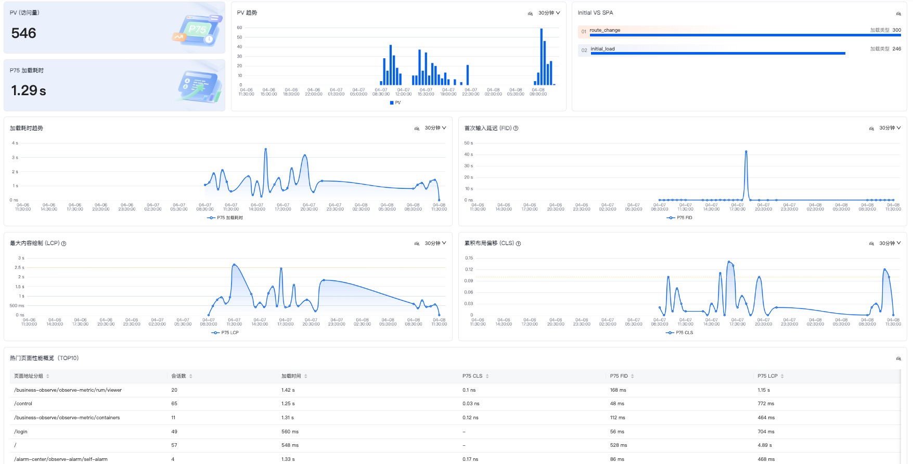
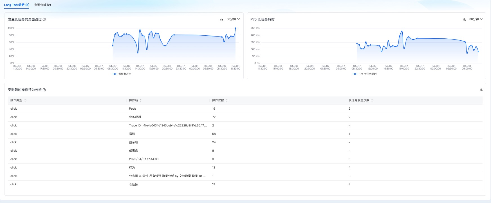
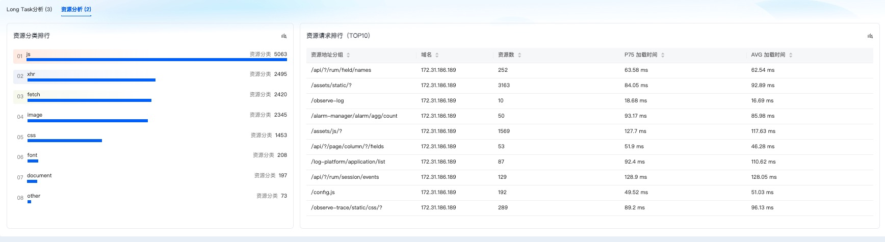

# 分析看板性能分析操作文档

## 功能概述
用户访问监控性能分析看板用于展示应用性能相关的监测指标。

## 基本操作
### 字段选择
- 可选字段：应用ID、环境、版本、资源地址分组、资源地址
- 筛选功能：[同分析看板概览页](./用户访问监控分析看板概览.md)

### 自动刷新
- 功能设置：[同分析看板概览页](./用户访问监控分析看板概览.md)

### 日期选择
- 功能设置：[同分析看板概览页](./用户访问监控分析看板概览.md)

## 监测数据展示

### 主要指标

| 指标名称 | 说明 | 类型 |
|---------|------|------|
| PV | [同分析看板概览页](./用户访问监控分析看板概览.md) | 数据卡片 |
| P75加载耗时 | 查询时间范围内，页面加载耗时的p75指标 | 数据卡片 |
| PV趋势 | 页面访问量随时间变化的趋势图 | 趋势图 |
| Initial VS SPA | 不同页面加载类型对应的页面访问数 | 分类图 |
| 首次输入延迟 (FID) | [同分析看板概览页](./用户访问监控分析看板概览.md) | 趋势图 |
| 累积布局偏移 (CLS) | [同分析看板概览页](./用户访问监控分析看板概览.md) | 趋势图 |
| 最大内容绘制 (LCP) | [同分析看板概览页](./用户访问监控分析看板概览.md) | 趋势图 |
| 加载耗时趋势 | 加载耗时p75指标随时间变化趋势图 | 趋势图 |
| 热门页面性能概览TOP10 | [同分析看板概览页](./用户访问监控分析看板概览.md) | 排序表格 |

### Long Task分析子模块

| 指标名称 | 说明 | 类型 |
|---------|------|------|
| 发生长任务的页面占比 | 发生长任务的页面访问量占总页面访问量的比率随时间变化的趋势图 | 趋势图 |
| P75长任务耗时 | 在查询时间范围内触发的长任务的耗时随时间变化趋势图 | 趋势图 |
| 受影响的操作行为分析 | 展示触发了长任务的操作类型、名称、次数及长任务次数（操作执行时间超过50ms视为长任务），支持排序 | 排序表格 |

### 资源分析子模块

| 指标名称 | 说明 | 类型 |
|---------|------|------|
| 资源分类排行 | 查询时间范围内不同类型的资源数量 | 分类图 |
| 资源请求排行TOP10 | 展示资源地址分组、域名、数量、资源加载时间的p75值和平均值，支持排序 | 排序表格 |
