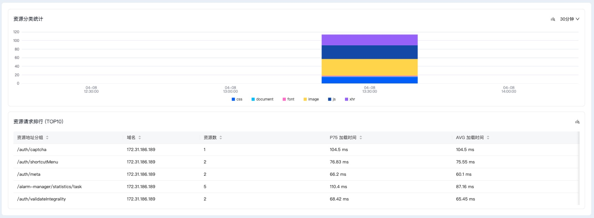
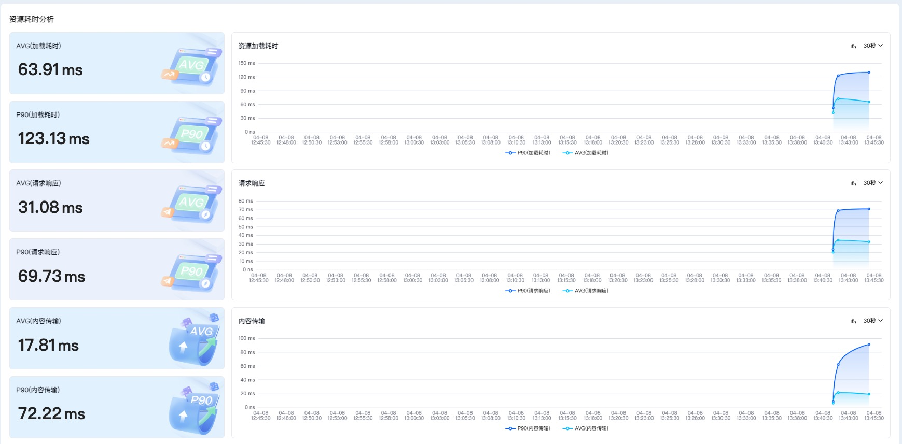

# 资源分析看板操作文档

## 功能概述
资源分析看板用于展示应用资源相关的监测指标，帮助用户了解资源加载性能及分布情况。

## 基本操作
### 字段选择
- **可选字段**：应用ID、环境、版本、加载类型、页面分组、浏览器

### 自动刷新
- **功能设置**：[同分析看板概览页](./用户访问监控分析看板概览.md)

### 日期选择
- **功能设置**：[同分析看板概览页](./用户访问监控分析看板概览.md)

## 监测数据展示

| 模块分类 | 指标名称 | 说明 | 类型 |
|---------|---------|------|------|
| 资源分类统计 | 资源分类统计 | 不同类型的资源分布随时间变化趋势图 | 趋势图 |
| 资源请求排行 | 资源请求排行TOP10 | [同性能分析看板](./用户访问监控性能分析看板.md) | 排序表格 |
| 资源加载耗时指标 | AVG(加载耗时) | 资源加载耗时在查询时间范围内的平均值 | 数据卡片 |
| 资源加载耗时指标 | P90(加载耗时) | 资源加载耗时在查询时间范围内的p90值 | 数据卡片 |
| 资源加载耗时指标 | 资源加载耗时趋势 | 资源加载耗时的p90值和平均值随时间变化的趋势图 | 趋势图 |
| 请求响应指标 | AVG(请求响应) | 资源请求响应在查询时间范围内的平均值 | 数据卡片 |
| 请求响应指标 | P90(请求响应) | 资源请求响应在查询时间范围内的p90值 | 数据卡片 |
| 请求响应指标 | 请求响应趋势 | 资源请求响应的p90值和平均值随时间变化的趋势图 | 趋势图 |
| 内容传输指标 | AVG(内容传输) | 资源内容传输时长在查询时间范围内的平均值 | 数据卡片 |
| 内容传输指标 | P90(内容传输) | 资源内容传输时长在查询时间范围内的p90值 | 数据卡片 |
| 内容传输指标 | 内容传输趋势 | 资源内容传输时长随时间变化的趋势图 | 趋势图 |
