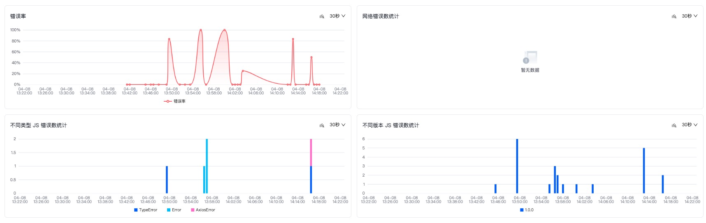
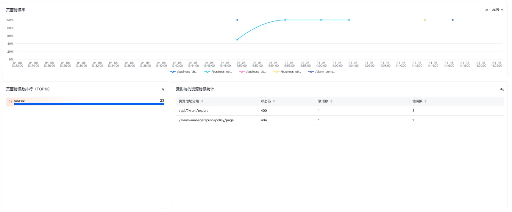

# 错误分析

## 功能概述
错误分析看板用于监控和展示应用运行过程中的错误相关指标，帮助开发团队快速定位和解决应用问题。

## 基本操作
### 字段选择
- **可选字段**：应用ID、环境、版本、错误来源、页面分组、浏览器
- **筛选功能**：[同分析看板概览页](./用户访问监控分析看板概览.md)

### 自动刷新
- **功能设置**：[同分析看板概览页](./用户访问监控分析看板概览.md)

### 日期选择
- **功能设置**：[同分析看板概览页](./用户访问监控分析看板概览.md)

## 监测数据展示

| 指标名称 | 说明 | 类型 |
|---------|------|------|
| 错误率 | [同分析看板概览页](./用户访问监控分析看板概览.md) | 数据卡片 |
| 不同类型的JS错误数统计 | 不同类型的JS错误数分布随时间变化的趋势图 | 趋势图 |
| 不同版本的JS错误数统计 | 不同版本下的JS错误数分布随时间变化的趋势图 | 趋势图 |
| 页面错误率 | 不同页面的错误率随时间分布的趋势图 | 趋势图 |
| 页面错误数排行 | 查询时间范围内不同来源的错误数 | 分类图 |
| 受影响的资源错误统计TOP10 | [同分析看板概览页](./用户访问监控分析看板概览.md) | 排序表格 |
