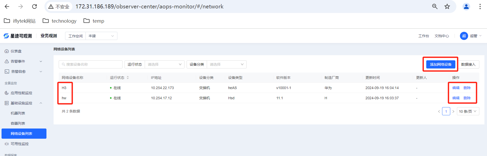
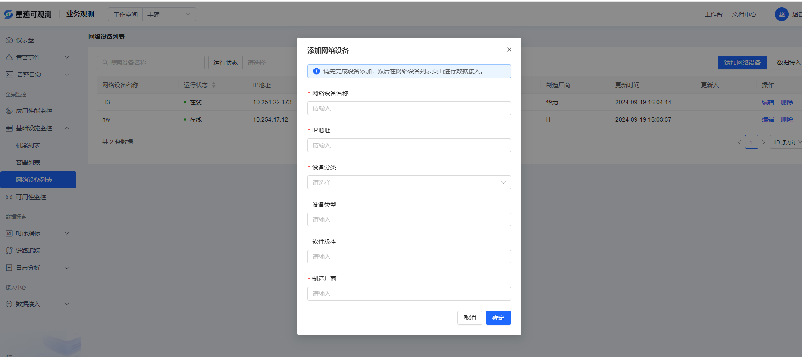
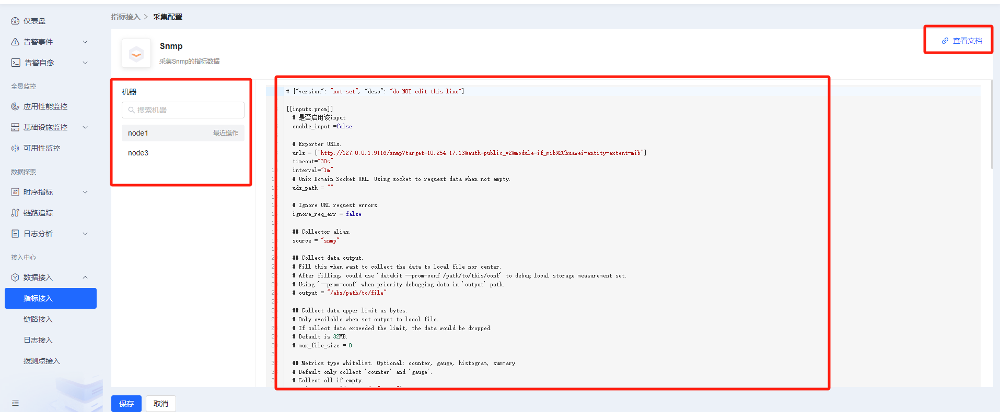
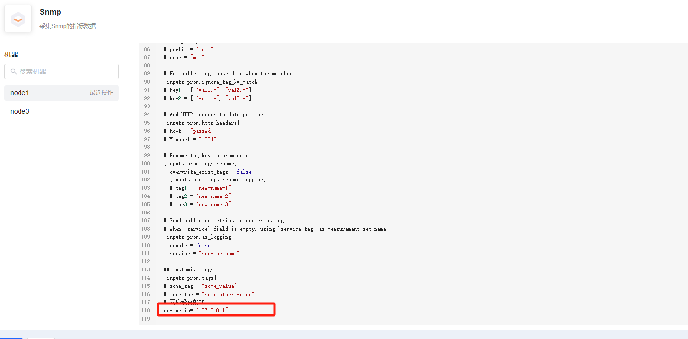
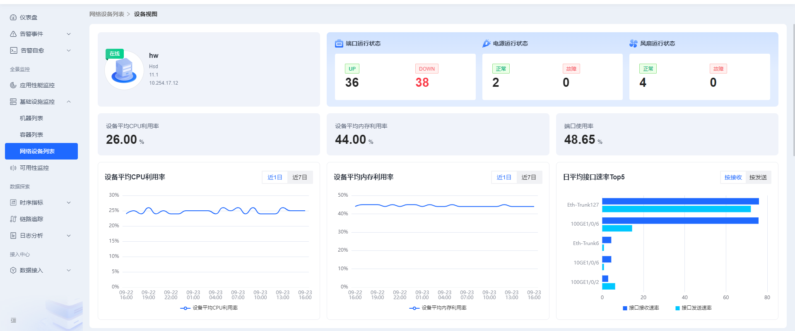

# 网络设备列表

网络设备列表需要先添加设备，所有添加的设备都会在列表中展示，列表中的设备数据可以编辑，删除，点击设备名称还可以查看详情。

添加设备页面需要用户填写自己设备的相关信息，IP地址是指网络设备的IP地址，不允许重复。

### 数据接入

​        添加设备后，最关键的步骤是数据接入，就是做相关配置来采集设备的指标数据，详情页中的数据都依赖采集的指标数据。点击列表页面右上方的数据接入，会跳转到snmp的配置页面。

​		页面左边的机器选择是选择一台机器来采集网络设备的数据，列表中的机器都是之前安装了datasleuth插件的机器主机名，点击其中一台，出现右边的配置页面。enable_input 改为true即可启用采集，urls配置snmp-exporter的地址，可以点击查看文档查看详细说明，用户需要学习一定的snmp-exporter相关知识。配置下方的 [inputs.prom.tags]中有个device_ip字段，记得一定要把它的值改为网络设备的IP，就是上面添加设备中的IP地址的值，否则数据跟列表中的设备关联不起来。

​		如果在多台机器上分别采集一个网络设备，则直接点击左边的机器分别进行配置即可，如果想要在同一个机器上采集多个网络设备，则需要将右边的配置全部复制一份，粘贴到配置最下面，然后重新修改相关配置，也就是说[[inputs.prom]]配置其实是个数组，可以配置多份。***注意：每一份配置都要记得修改device_ip字段！！！***

### 查看网络设备详细信息

点击网络设备名称，进入详情页。详情页可以查看各种详细数据。

