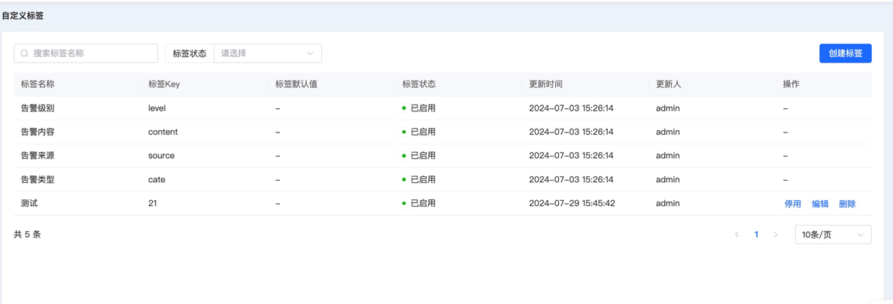
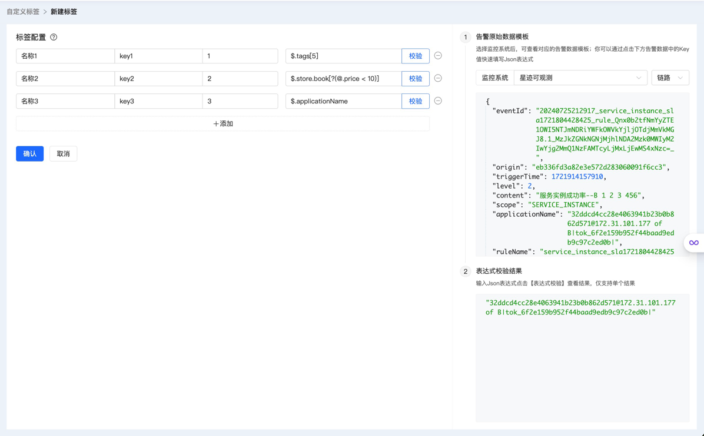
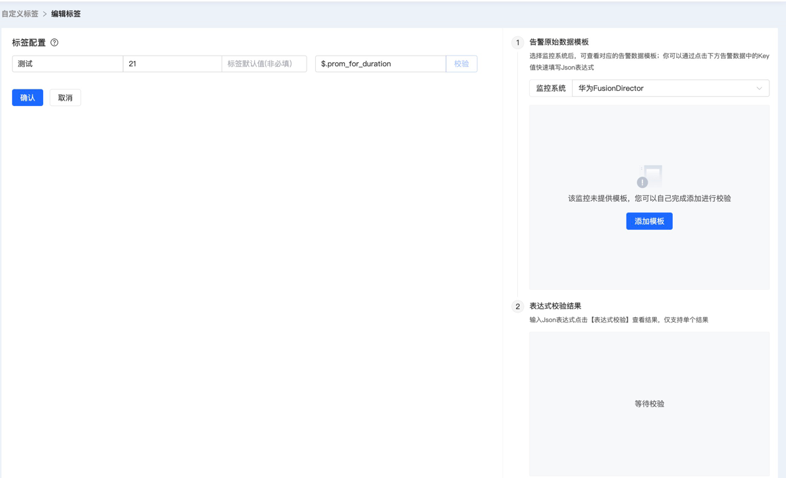

# 自定义标签

在智能告警平台，现有的标准化格式对于当下的场景并不能完全满足。提供自定义标签作为分派策略和屏蔽规则的判断条件，方便用户根据不同类型的告警，灵活制定处理方案。

告警集成模块在接收告警事件时, 会根据配置好的自定义标签提取事件中的标签, 可以在[所有告警操作文档](./所有告警操作文档.md)的去重列表中点击**标签**按钮查看提取到的标签。

## 主页

展示了标签的主要信息，包括内置标签和用户自定义标签，用户可以按照名称和状态进行条件搜索，也可以针对非内置的标签进行停用启用和删除操作

## 创建标签

用户在主页点击创建后进入该页面，支持批量创建自定义标签，需要设置标签的名称、key、默认值(可选)还有json表达式：

1）标签名称：用户自定义，在分派策略和屏蔽规则配置判断条件时，作为可选标签列表展示给用户

2）标签key：用户自定义，在后台存储分派策略和屏蔽规则的判断条件时使用，在根据自定义标签的json表达式提取标签时，作为变量名称接收解析的结果

3）标签默认值(非必填): 标签默认值在告警事件中根据表达式提取不到值或事件不存在该字段时, 会将该标签和标签默认值添加到去重告警的自定义标签中。

4）JSON表达式：用户自定义，根据该表达式，按照一定的语法规则，从原始告警的labels字段进行解析，结果作为标签的值。具体的语法规则请参考：[JsonPath GitHub 页面](https://github.com/json-path/JsonPath)

5）自定义标签模板：json字符串，分为星迹可观测数据模板，和非星迹类型数据模板。前者针对四种告警类型：链路、日志、指标、拨测，有4套内置模板。后者不区分告警类型，每类监控系统只绑定一套模板，由用户自己创建。

6）校验：点击校验，后台会根据当前页面展示的模板和对应标签的json表达式进行解析，并展示校验结果。用户可以通过此方式检查表达式是否满足语法规则并匹配到预期的key，以免提交之后在后台程序运行时出现异常，导致频繁回滚和修改，影响告警的主流程。

## 编辑标签

主页点击非内置标签的编辑按钮，跳转到编辑页面，对该标签的名称、key、默认值还有json表达式进行修改，操作步骤和创建页面类似

