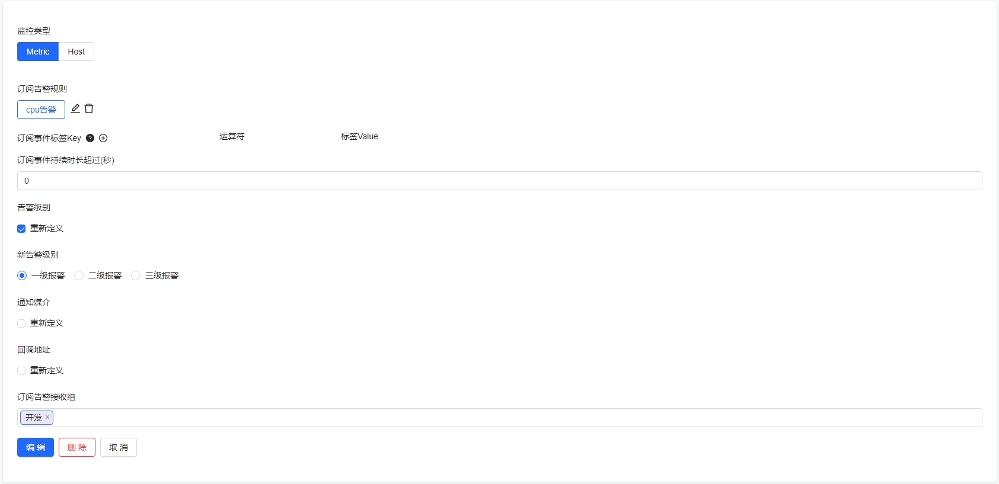

# 订阅规则操作文档

在使用监控平台的时候，有这样一种场景，一些机器和基础组件的告警规则是由基础架构的同学维护管理的，但业务的同学也想接收和自己业务相关的机器和基础组件的告警，如果直接去修改对应的告警规则的话，其实不太合适，这个时候，可以使用订阅规则，来订阅自己感兴趣的告警事件，当告警事件产生之后，通知到自己。

- 告警类型：想要订阅的告警事件的类型
- 订阅告警规则：一种告警事件的订阅筛选方式，根据订阅规则来筛选
- 告警事件等级：可以只订阅某个等级的告警事件
- 订阅事件标签：和屏蔽规则中的标签筛选类似，是有和配置的标签匹配的事件，才会走订阅逻辑
- 订阅事件持续时长：这个功能在告警升级的场景比较有用，如果告警事件产生之后，持续了很久还没恢复，再次出发的时候，如果满足的持续时长，可以把告警发送给业务负责人或者备值班人。
- 告警级别、通知媒介、回调地址：对于筛选到的告警事件，在发送的时候，我们可以修改原来的告警级别、通知媒介和回调地址
- 订阅接收组：订阅的告警事件，重新发给哪些团队

### 订阅规则使用方式推荐

服务级别的告警订阅，机器混部的场景
不同redis实例的告警，需要发给不同的业务组，在配置采集的时候，不同的redis服务，可以配一个 service=abc 的标签，在订阅规则中，每个服务创建一个订阅规则，订阅自己的 service 标签

只想订阅机器系统指标，不想订阅机器上报的服务指标
在配置系统指标告警规则的时候，在附加标签配置一个标识是系统指标的标签，例如 alert_cate=host，之前在配置订阅规则的时候，通过配置 alert_cate=host，可以实现只订阅系统指标告警的效果
