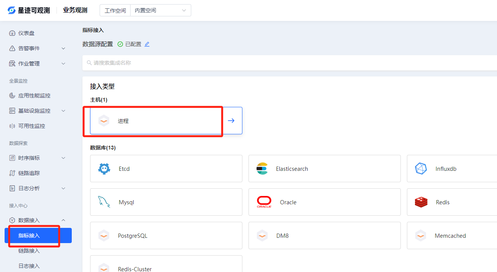
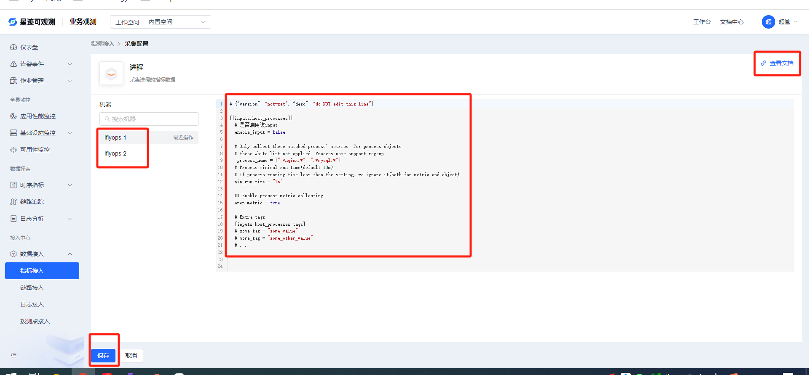
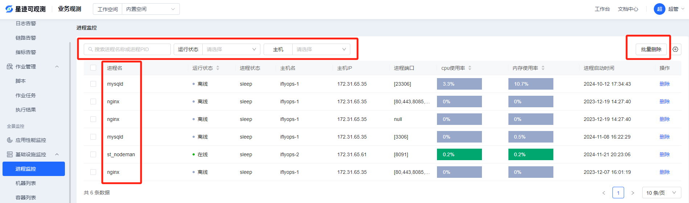
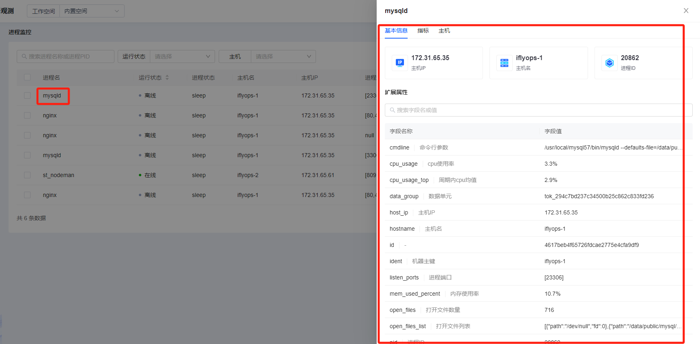

# 进程监控

要使用进程监控功能，需要用户在对应的机器上配置想要监控的进程（前提是该机器已经安装了datasleuth插件，采集功能是通过该插件完成的），配置方法如下：

1. 点击该图标，进入配置页面

2. 选择要采集的机器，并按照文档描述的进行配置

### 查看进程列表

接入进程采集之后就可以在进程监控列表查看进程的信息了，如下图，可以搜索、删除进程，删除在线的进程后，下个采集周期又会再次出现，主要用于删除离线进程。点击进程名可以看到详情页面，里面有进程的详细信息。

