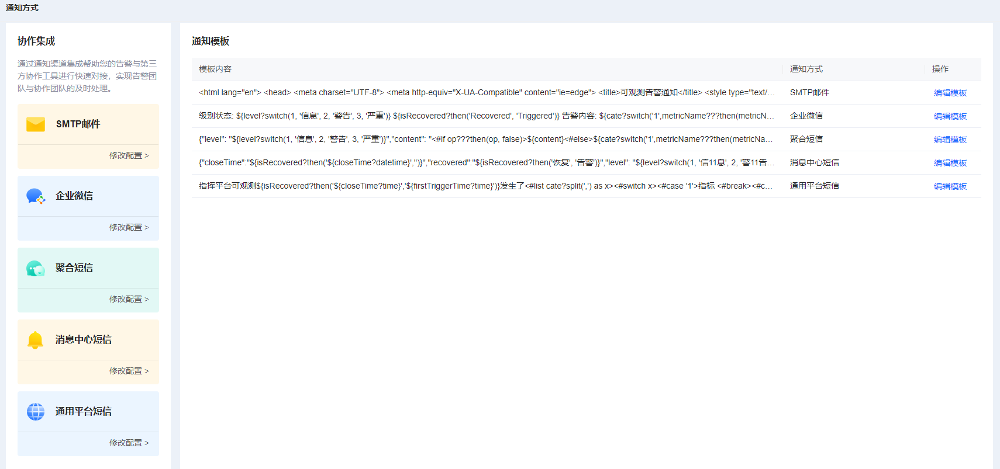
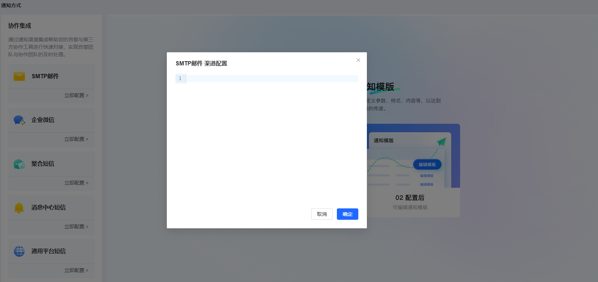
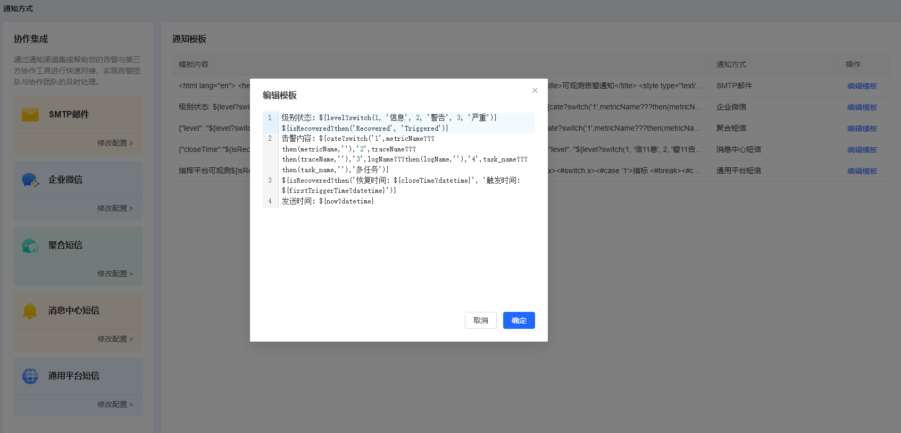
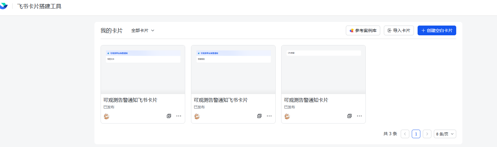
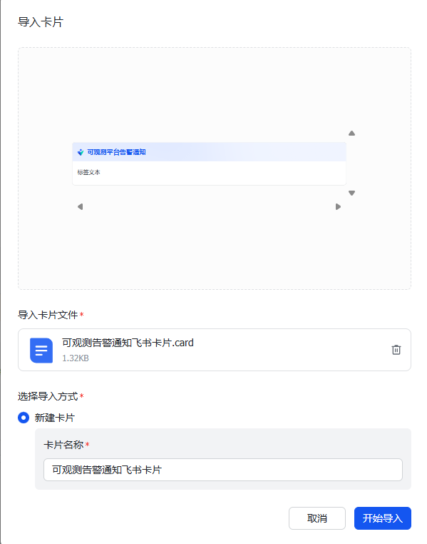
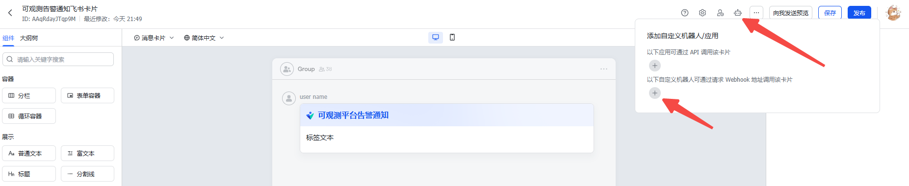
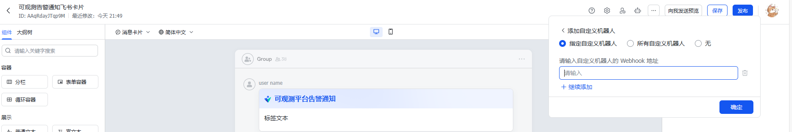
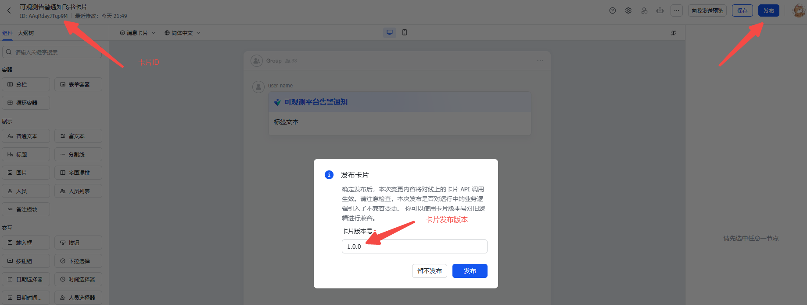

# 通知方式

通知方式定义了发送通知时所使用的渠道，还有通知内容的模板。

### 通知方式主页
左侧展示了通知方式列表，可渠道参数配置。右侧展示了当前工作空间下，每个通知方式使用的通知模板。



### 通知方式配置
点击通知方式图标右下角立即配置/修改配置（还没有创建配置的情况下显示为立即配置，已创建配置后一律显示为修改配置），跳转至弹窗界面编辑配置。声明对应通知方式调用发送通知接口时需要的参数。


##### 1、SMTP邮件配置示例
```text
host="mail.iflytek.com"
port=465
user="user@iflytek.com"
password="password"
from="user@iflytek.com"
```

SMTP邮件配置参数含义：
```text
host：这是SMTP服务器的主机地址，用于发送邮件，公司的SMTP服务器的地址是mail.iflytek.com
port：这是SMTP服务器的端口号。端口465通常用于SMTP over SSL (SMTPS) 连接，它是加密的SMTP连接方式
user：这是登录SMTP服务器的用户名。通常是完整的邮箱地址
password：这是登录SMTP服务器的密码。需要确保密码的安全性，并妥善保管
from：这是发件人的邮箱地址，即邮件的发件人
```

##### 2、企业微信配置示例
```text
corpid="wwwwwwwwwwwww"
secret="111111111111111111111111111"
agentid=1000003
```

企业微信配置参数含义：
```text
corpid: 企业微信的企业ID，用于标识企业的唯一身份
secret: 应用的Secret，用于通过API进行身份验证和访问权限控制
agentid: 应用的AgentID，用于标识企业微信应用的唯一身份
```
用户所在企业的管理员需要在企业微信管理后台注册一个应用，并获取上述参数，具体操作详见[企业微信官网](https://work.weixin.qq.com/)

##### 3、聚合短信配置示例
```text
appid="LLLLLLLLL"
tid="11111"
```

聚合短信配置参数含义：
```text
appid：聚合短信应用标识
tid：聚合短信模板ID
```

用户需要在讯飞云环境申请聚合短信应用获取appid，并申请短信模板获取tid，详细步骤见[聚合短信模板申请教程](http://cbb.iflytek.com/cbbsmp/Shelves/helpDoc/295?cbbId=zy-20201218-0001&nodeId=2698)

##### 4、消息中心短信配置示例
消息中心支持多个通道，此处使用聚合短信通道。
```text
senderSystem="xxxxxxxxxxxxxxxxxxxxxxxxx"
authCode="xxxxxxxxxxxxxxxxxxxxxxxxxxxx"
extend="{\"msgTid\":\"xxxxx\"}"
```

消息中心短信配置参数含义：
```text
senderSystem：项目ID
authCode：授权码
extend：请求扩展参数
msgTid：聚合短信模板ID
```

用户需要在消息中心申请项目和授权码，并进行通道相关配置。详细步骤见[消息中心帮助文档](http://cbb.iflytek.com/cbbsmp/Shelves/helpDoc/145?cbbId=zy-20210118-0005&nodeId=115)

##### 5、通用平台短信配置示例
```text
ak="xxxxxxxxxxxxxxxxxxx"
sk="xxxxxxxxxxxxxxxxxxx"
smsCode="xxxxxxxxxxxxxx"
tokenHmac="xxxxxxxxxxxx"
```

通用平台短信配置参数含义：
```text
ak：接口鉴权密钥
sk：接口鉴权密钥
smsCode：短信签名
tokenHmac：密钥加密方式
```

用户需要在通用平台申请模板，获取鉴权密钥。

##### 6、企业微信机器人配置示例
```text
webhook="https://xxxxxx"
```

企业微信机器人配置参数含义：
```text
webhook：自定义机器人webhook地址
```

##### 7、飞书机器人配置示例
```text
webhook="https://xxxxxx"
sign="xxxxxxx"
```

飞书机器人配置参数含义：
```text
webhook：自定义机器人webhook地址
sign: 自定义机器人开启了密钥鉴权时的密钥。未开启密钥鉴权需要填写空值""，非空时会参与鉴权。
```

### 通知方式编辑模板
点击编辑模板按钮，跳转至弹窗，编辑对应通知方式的通知模板。

在满足模板引擎的语法规则前提下，用户可自定义参数和模板内容。




##### 1、SMTP邮件通知模板

SMTP邮件通知模板示例：
```text
<html lang="en">
<head>
    <meta charset="UTF-8">
    <meta http-equiv="X-UA-Compatible" content="ie=edge">
    <title>可观测告警通知</title>
    <style type="text/css">
        .wrapper {
            background-color: #f8f8f8;
            padding: 15px;
            height: 100%;
        }
        .main {
            width: 600px;
            padding: 30px;
            margin: 0 auto;
            background-color: #fff;
            font-size: 12px;
            font-family: verdana,\'Microsoft YaHei\',Consolas,\'Deja Vu Sans Mono\',\'Bitstream Vera Sans Mono\';
        }
        header {
            border-radius: 2px 2px 0 0;
        }
        header .title {
            font-size: 14px;
            color: #333333;
            margin: 0;
        }
        header .sub-desc {
            color: #333;
            font-size: 14px;
            margin-top: 6px;
            margin-bottom: 0;
        }
        hr {
            margin: 20px 0;
            height: 0;
            border: none;
            border-top: 1px solid #e5e5e5;
        }
        em {
            font-weight: 600;
        }
        table {
            margin: 20px 0;
            width: 100%;
        }

        table tbody tr{
            font-weight: 200;
            font-size: 12px;
            color: #666;
            height: 32px;
        }

        .succ {
            background-color: green;
            color: #fff;
        }

        .fail {
            background-color: red;
            color: #fff;
        }

        .succ th, .succ td, .fail th, .fail td {
            color: #fff;
        }

        table tbody tr th {
            width: 80px;
            text-align: right;
        }
        .text-right {
            text-align: right;
        }
        .body {
            margin-top: 24px;
        }
        .body-text {
            color: #666666;
            -webkit-font-smoothing: antialiased;
        }
        .body-extra {
            -webkit-font-smoothing: antialiased;
        }
        .body-extra.text-right a {
            text-decoration: none;
            color: #333;
        }
        .body-extra.text-right a:hover {
            color: #666;
        }
        .button {
            width: 200px;
            height: 50px;
            margin-top: 20px;
            text-align: center;
            border-radius: 2px;
            background: #2D77EE;
            line-height: 50px;
            font-size: 20px;
            color: #FFFFFF;
            cursor: pointer;
        }
        .button:hover {
            background: rgb(25, 115, 255);
            border-color: rgb(25, 115, 255);
            color: #fff;
        }
        footer {
            margin-top: 10px;
            text-align: right;
        }
        .footer-logo {
            text-align: right;
        }
        .footer-logo-image {
            width: 108px;
            height: 27px;
            margin-right: 10px;
        }
        .copyright {
            margin-top: 10px;
            font-size: 12px;
            text-align: right;
            color: #999;
            -webkit-font-smoothing: antialiased;
        }
        .alarm-content{
            white-space: wrap;
            word-break: break-all;
        }
    </style>
</head>
<body>
<div class="wrapper">
    <div class="main">
        <header>
            <h3 class="title">可观测告警通知</h3>
            <p class="sub-desc"></p>
        </header>
        <hr>
        <div class="body">
            <table cellspacing="0" cellpadding="0" border="0">
                <tbody>
                <#if isRecovered>
                <tr class="succ">
                    <th>级别状态：</th>
                    <#switch level>
                        <#case 1>
                            <td>信息 recovered</td>
                            <#break>
                        <#case 2>
                            <td>警告 recovered</td>
                            <#break>
                        <#case 3>
                            <td>次要 recovered</td>
                            <#break>
                        <#case 4>
                            <td>重要 recovered</td>
                            <#break>
                        <#case 5>
                            <td>严重 recovered</td>
                            <#break>
                        <#default>
                            <#break>
                    </#switch>
                </tr>
                <#else>
                <tr class="fail">
                    <th>级别状态：</th>
                    <#switch level>
                        <#case 1>
                        <td>信息 triggered</td>
                            <#break>
                        <#case 2>
                        <td>警告 triggered</td>
                            <#break>
                        <#case 3>
                        <td>次要 triggered</td>
                            <#break>
                        <#case 4>
                        <td>重要 triggered</td>
                            <#break>
                        <#case 5>
                        <td>严重 triggered</td>
                            <#break>
                        <#default>
                            <#break>
                    </#switch>
                </tr>
                </#if>

                <tr class="alarm-content">
                    <th>内容：</th>
                    <td>${content}</td>
                </tr>

                <#if isRecovered>
                <tr>
                    <th>恢复时间：</th>
                    <td>${closeTime?datetime}</td>
                </tr>
                <#else>
                <tr>
                    <th>触发时间：</th>
                    <td>${firstTriggerTime?datetime}</td>
                </tr>
                </#if>

                <tr>
                    <th>发送时间：</th>
                    <td>
                        ${now?datetime}
                    </td>
                </tr>
                </tbody>
            </table>
        </div>
    </div>
    <hr>
    <footer>
        <div class="copyright" style="font-style: italic">
            FROM 可观测告警平台.
        </div>
    </footer>
</div>
</body>
</html>

```

##### 2、企业微信通知模板
企业微信通知模板示例：
```text
级别状态: ${level?switch(1, '信息', 2, '警告', 3, '次要', 4, '重要', 5, '严重')} ${isRecovered?then('Recovered', 'Triggered')}
告警内容: ${content}
${isRecovered?then('恢复时间: ${closeTime?datetime}', '触发时间: ${firstTriggerTime?datetime}')}
发送时间: ${now?datetime}
```

##### 3、聚合短信通知模板
聚合短信的模板内容需要和讯飞云申请的模板内容保持强关联。用户需要在讯飞云申请聚合短信模板，详细步骤见[聚合短信模板申请教程](http://cbb.iflytek.com/cbbsmp/Shelves/helpDoc/295?cbbId=zy-20201218-0001&nodeId=2698)

聚合短信处的短信模板示例：
```text
您好！收到可观测平台<recovered>通知： 告警级别：<level> 告警内容：<content> 触发时间：<triggerTime> 恢复时间：<closeTime>
```

对应通知模板示例：
```json
{"closeTime":"${isRecovered?then('${closeTime?datetime}','')}","recovered":"${isRecovered?then('Recovered', 'Triggered')}","level": "${level?switch(1, '信息', 2, '警告', 3, '次要', 4, '重要', 5, '严重')}","content":"${content}","triggerTime":"${firstTriggerTime?datetime}"}
```

##### 4、消息中心短信通知模板
消息中心短信的模板内容需要根据消息中心所使用的通知渠道做调整。如果消息中心使用聚合短信，则模板内容需要和讯飞云申请的模板内容保持强关联。用户需要在讯飞云申请聚合短信模板，详细步骤见[聚合短信模板申请教程](http://cbb.iflytek.com/cbbsmp/Shelves/helpDoc/295?cbbId=zy-20201218-0001&nodeId=2698)和[消息中心帮助文档](http://cbb.iflytek.com/cbbsmp/Shelves/helpDoc/145?cbbId=zy-20210118-0005&nodeId=115)


如消息中心使用聚合短信通道，而聚合短信的短信模板示例：
```text
您好！收到可观测平台<recovered>通知： 告警级别：<level> 告警内容：<content> 触发时间：<triggerTime> 恢复时间：<closeTime>
```

对应通知模板示例：
```json
{"closeTime":"${isRecovered?then('${closeTime?datetime}','')}","recovered":"${isRecovered?then('Recovered', 'Triggered')}","level": "${level?switch(1, '信息', 2, '警告', 3, '次要', 4, '重要', 5, '严重')}","content":"${content}","triggerTime":"${firstTriggerTime?datetime}"}
```

##### 5、通用平台短信通知模板
通用平台短信的模板内容需要和通用平台申请的模板内容保持强关联。用户需要在通用平台申请短信模板

如通用平台处短信模板示例：
```text
【短信签名】可观测@发生了@类@告警：@异常，请及时登录平台处理！
```

对应通知模板示例：
```text
可观测${isRecovered?then('${closeTime?time}','${firstTriggerTime?time}')}发生了<#list cate?split(',') as x><#switch x><#case '1'>指标<#break><#case '2'>链路<#break><#case '3'>日志<#break><#case '4'>拨测<#break></#switch></#list>类${level?switch(1,'信息',2,'警告',3,'次要',4,'重要',5,'严重','')}${isRecovered?then('恢复','')}告警：<#if op???then(op, false)>${content}<#else>${cate?switch('1',metricName???then(metricName,''),'2',traceName???then(traceName,''),'3',logName???then(logName,''),'4',task_name???then(task_name,''),'多任务')}</#if>异常，请及时登录平台处理！
```

此模板需创建星迹可观测来源数据的自定义标签，如下（参考自定义标签操作文档）：

| **标签名称**                 | **标签Key** | **Json表达式**   |
|--------------------------|-----------|---------------|
| 指标名称 | metricName      |       $.rule_name        |
| 链路名称                   |traceName    | $.ruleName     |
| 拨测名称                    | dialName        | $.task_name  |
| 日志名称                      | logName     |     $.applicationName          |

##### 6、企业微信机器人通知模板
企业微信自定义机器人消息频率限制每个机器人发送的消息不能超过20条/分钟。

参考文档：https://developer.work.weixin.qq.com/document/path/91770#markdown%E7%B1%BB%E5%9E%8B

文本通知模板示例（固定格式，可调整text.content的值）：
```text
{
    "msgtype": "text",
    "text": {
        "content": "级别状态: ${level?switch(1, '信息', 2, '警告', 3, '次要', 4, '重要', 5, '严重')} ${isRecovered?then('Recovered', 'Triggered')}\n告警内容: ${content}\n${isRecovered?then('恢复时间: ${closeTime?datetime}', '触发时间: ${firstTriggerTime?datetime}')}\n发送时间: ${now?datetime}"
    }
}
```

markdown通知模板示例（固定格式，可调整markdown.content的值）：
```text
{
    "msgtype": "markdown",
    "markdown": {
        "content": "### 可观测告警通知
        > 级别状态: ${level?switch(1, '信息', 2, '警告', 3, '次要', 4, '重要', 5, '严重')} ${isRecovered?then('<font color=\\"info\\">Recovered</font>', '<font color=\\"warning\\">Triggered</font>')}
        > 告警内容: ${content}
        > ${isRecovered?then('恢复时间: ${closeTime?datetime}', '触发时间: ${firstTriggerTime?datetime}')}
        > 发送时间: ${now?datetime}"
    }
}
```

##### 7、飞书机器人通知模板
飞书自定义机器人消息频率限制单租户单机器人 100 次/分钟，5 次/秒。

参考文档：https://open.feishu.cn/document/client-docs/bot-v3/add-custom-bot?lang=zh-CN

文本通知模板示例（固定格式，可调整content.text的值）：
```text
{
    "msg_type": "text",
    "content": {
        "text": "可观测告警通知\n级别状态: ${level?switch(1, '信息', 2, '警告', 3, '次要', 4, '重要', 5, '严重')} ${isRecovered?then('Recovered', 'Triggered')}\n告警内容: ${content}\n${isRecovered?then('恢复时间: ${closeTime?datetime}', '触发时间: ${firstTriggerTime?datetime}')}\n发送时间: ${now?datetime}"
    }
}
```

飞书卡片对客户端版本有要求，此处基于7.18.2及以下客户端版本，需要创建飞书模板。7.20版本则可以直接在通知模板中构造卡片格式，无需创建飞书模板。 7.20客户端版本飞书卡片参考上面提到的飞书机器人参考文档。

飞书卡片通知模板示例（固定格式，可调整card.data中的属性值）：
```text
{
    "msg_type": "interactive",
    "card": {
        "type": "template",
        "data": {
            "template_id": "AAqBod2Bxef0n",
            "template_version_name": "1.0.0",
            "template_variable": {
                "alarm_list": [
                    {
                        "value": "级别状态: ${level?switch(1, '信息', 2, '警告', 3, '次要', 4, '重要', 5, '严重')} ${isRecovered?then('Recovered', 'Triggered')}"
                    },
                    {
                        "value": "告警内容: ${content}"
                    },
                    {
                        "value": "${isRecovered?then('恢复时间: ${closeTime?datetime}', '触发时间: ${firstTriggerTime?datetime}')}"
                    },
                    {
                        "value": "发送时间: ${now?datetime}"
                    }
                ]
            }
        }
    }
}
```

飞书卡片通知模板参数含义：
```text
template_id：飞书卡片ID
template_version_name: 飞书卡片发布版本
template_variable.alarm_list：通知元素
```

飞书卡片制作:

1、新建文本“可观测告警通知飞书卡片.txt”

2、文本粘贴内容：
```text
{"name":"可观测告警通知飞书卡片","dsl":{"config":{},"i18n_elements":{"zh_cn":[{"tag":"repeat","variable":"alarm_list","elements":[{"tag":"column_set","flex_mode":"none","background_style":"default","horizontal_spacing":"8px","horizontal_align":"left","columns":[{"tag":"column","width":"weighted","vertical_align":"top","background_style":"default","elements":[{"tag":"markdown","content":"${alarm_list.value}","text_align":"left","text_size":"normal"},{"tag":"markdown","content":"","text_align":"left","text_size":"normal"}],"weight":1}],"margin":"16px 0px 0px 0px"}]}]},"i18n_header":{"zh_cn":{"title":{"tag":"plain_text","content":"可观测平台告警通知"},"subtitle":{"tag":"plain_text","content":""},"template":"blue","ud_icon":{"tag":"standard_icon","token":"hirelogo_colorful"}}}},"variables":[{"apiName":"variable_3wr30b5mjtf","type":"objectArray","name":"object_list_1","desc":"循环容器生成的变量","mockData":[{},{},{}],"structDescriptions":[]},{"type":"objectArray","apiName":"var_m8gpb6zy","name":"alarm_list","desc":"","mockData":[{"value":"标签文本"}],"structDescriptions":[{"type":"text","name":"value","desc":"","apiName":"var_s3jgr43woof"}]},{"apiName":"variable_zpefruq4v0i","type":"objectArray","name":"object_list_2","desc":"循环容器生成的变量","mockData":[{},{},{}],"structDescriptions":[]}]}
```

3、修改文本后缀名txt为card，得到文件“可观测告警通知飞书卡片.card”

飞书卡片模板上传：

1、飞书卡片地址：https://open.xfchat.iflytek.com/cardkit


2、点击右上角导入卡片，上传模板卡片“可观测告警通知飞书卡片.card”。点击开始导入。


3、配置自定义机器人：输入机器人webhook地址后，点击确定保存。



4、点击发布，记住版本号，再点击发布后，卡片发布完成。发布后可在左上角点击卡片ID复制。版本号、卡片ID将用于可观测平台通知模板配置。
