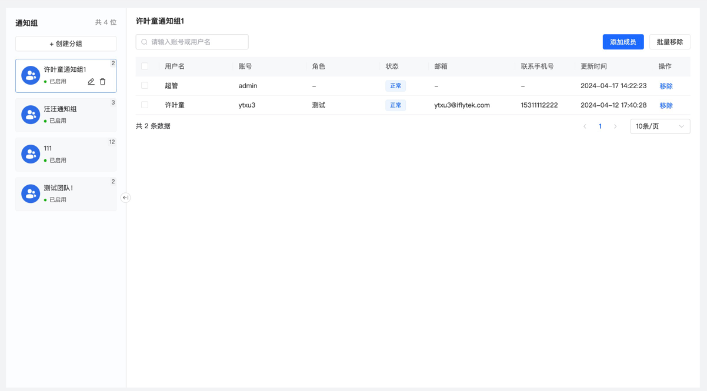
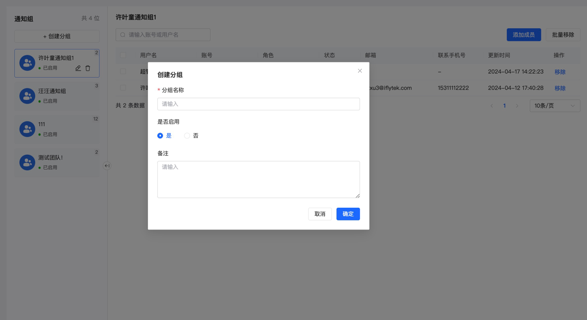
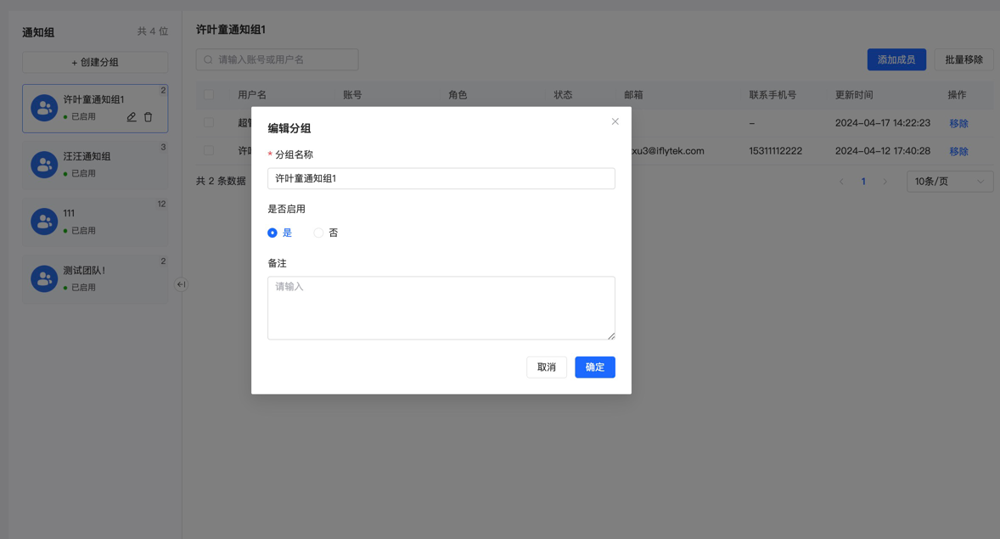
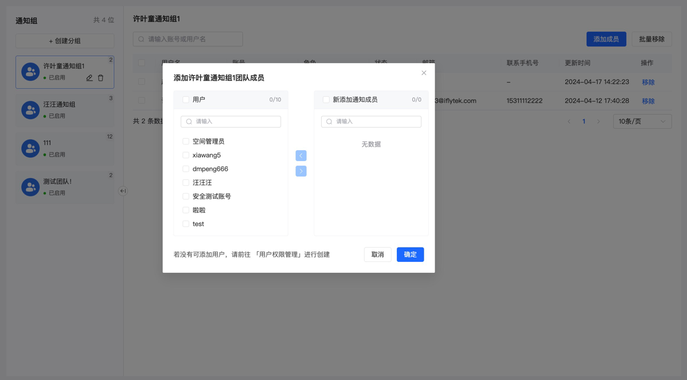

# 通知组

通知组声明了特定用户群体的集合，后续的告警分派还有通知发送都是以通知组为单位进行的。

通知组主页：通知组主页左侧列举了所有通知组的基本信息；右侧展示了当前选中通知组下的所有成员信息；可以通过勾选成员点击批量移除来移除成员。

通知组创建：点击新建，输入通知组的名称，设置通知组的状态，自定义备注。

通知组编辑：点击编辑图标，更新通知组的名称、状态和备注。

通知组成员添加：勾选弹窗左侧的用户，迁移到右侧，点击确定完成用户添加

