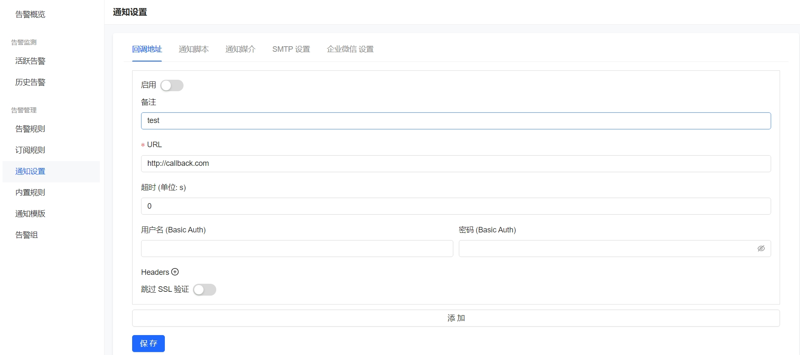
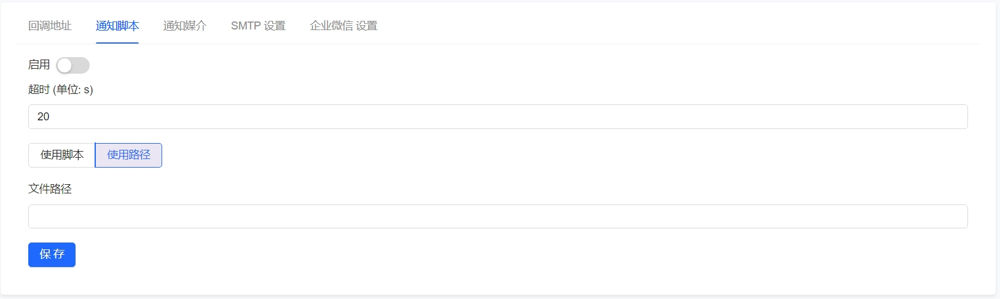
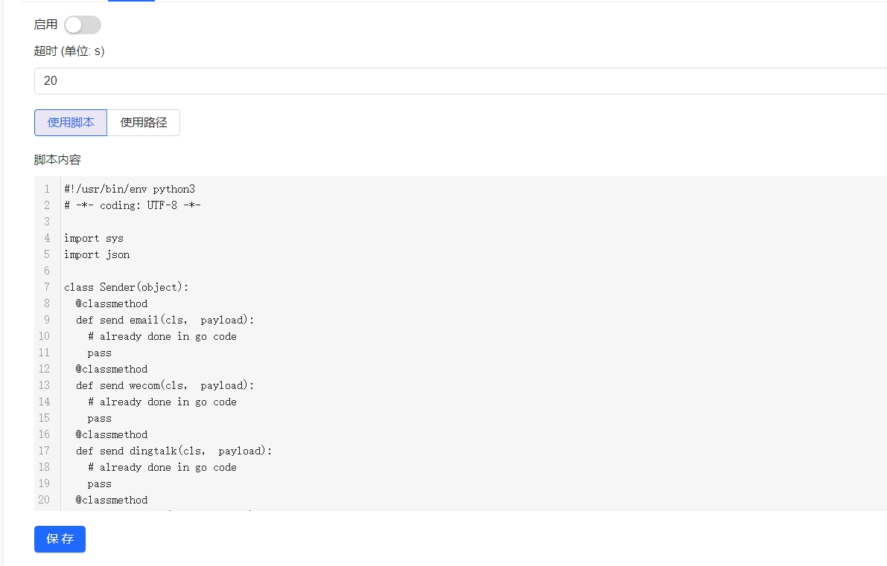
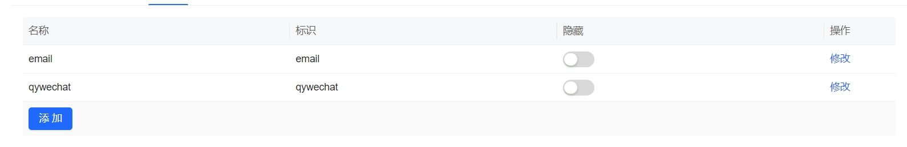
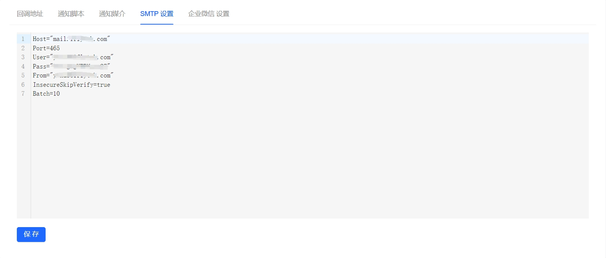
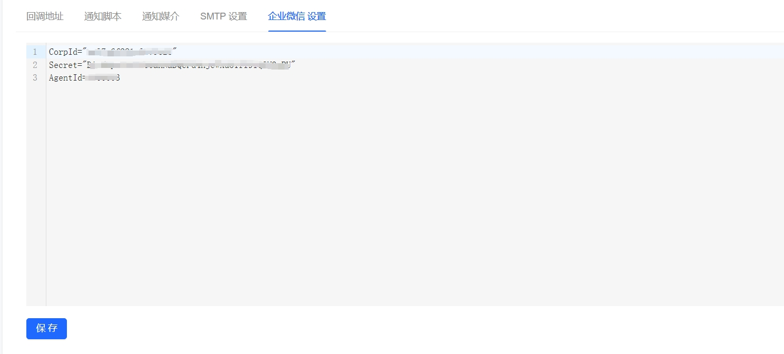

# 通知配置操作文档

### 回调地址

在回调地址可以配置全局的回调，之后又告警生成，就会把时间发送给在此页面配置的回调地址

###  通知脚本

通知脚本支持两个配置方式，一个是配置脚本路径，使用的前提是，需要把脚本放到**监控系统进程**所在的机器上，如果你之前使用了自己写的通知程序，并且用的是非脚本语言编写的，可以使用这种方式

### 通知媒介

在通知媒介中配置的通知通道，会在告警规则配置，通知媒介中显示出来，如果你们公司有的通知媒介没用到，可以在这个页面将其隐藏掉

### SMTP

邮件告警的发送邮件配置

### QYWECHAT

企业微信的配置

