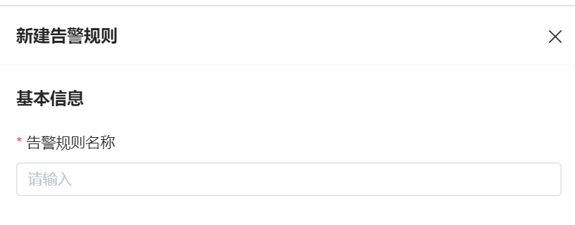
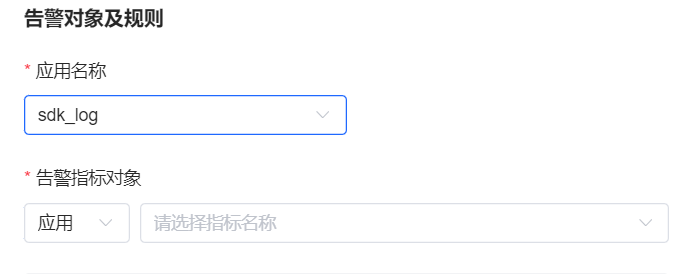
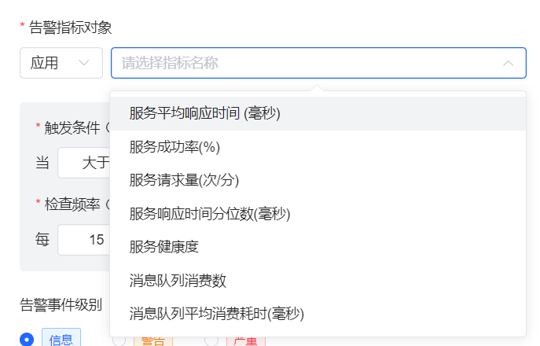
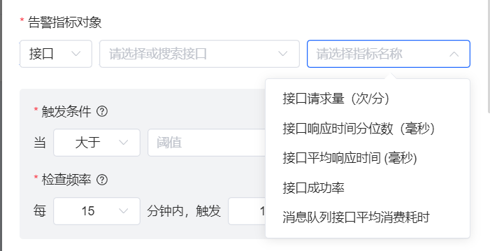
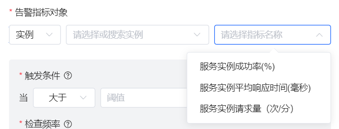
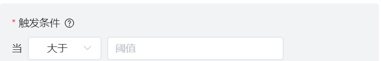
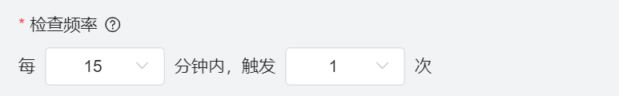
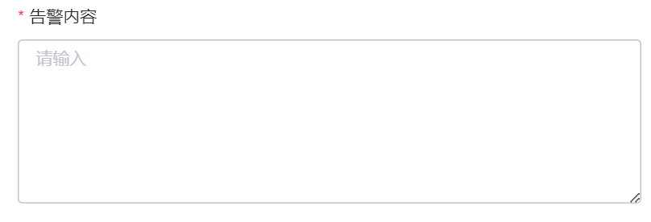

# 链路告警

链路追踪模块不仅提供了强大的数据采集和可视化功能，还提供了灵活的告警配置能力，帮助我们实时掌握系统的运行状况，快速响应和解决潜在问题。在本节中，将详细介绍如何在链路追踪模块中对服务指标进行设置告警规则。

## 告警规则

告警规则提供了人性化的配置能力，可以满足各种场景下的配置需求。告警规则主要分为四部分，基本信息、告警对象及规则，下面详细介绍下告警对象及规则的配置参数。

### 基本信息

- 告警规则名称：告警规则的名称，可以表明这个规则是对什么服务的指标进行监控

### 告警对象及规则

#### 应用名称
- 下拉框，单选，展示当前空间下所有已经在权限系统建立且已经接入到链路服务的应用名称
#### 告警指标对象
* 有应用/实例/接口三个对象维度的告警指标可以选择

- 分为接口，实例，应用三大领域指标，选择不同领域的应用服务的指标
#### 触发条件

- 告警指标对象数据与触发条件进行比较，是形成告警事件的条件

#### 检查频率
- 告警指标对象在设置的检查时间间隔内达到触发条件次数后，形成告警事件。 注意：触发次数的单位是分钟，即若每个触发条件在一分钟内达到多次，只统计一次。

#### 告警事件级别
- 异常告警事件的一种级别

#### 告警内容
- 支持${name},${id}变量配置，最终告警事件中的内容会被实际替换成 领域实际名称和id

#### 静默周期

- 在检查频率的时间内触发了告警事件后，在静默周期配置的时间周期阶段不形成告警事件。 （例如检查频率配置5min，静默周期配置5min，在检查频率时间范围内触发了告警事件，那么在 第5分钟~第10分钟内，同一告警源只能触发一次告警）

