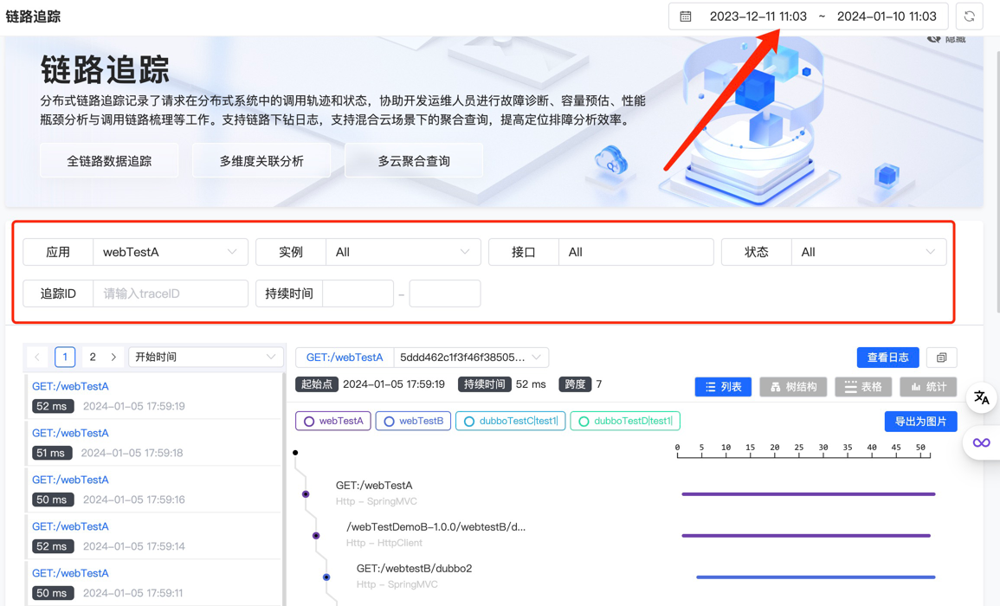
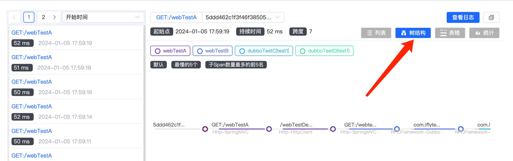
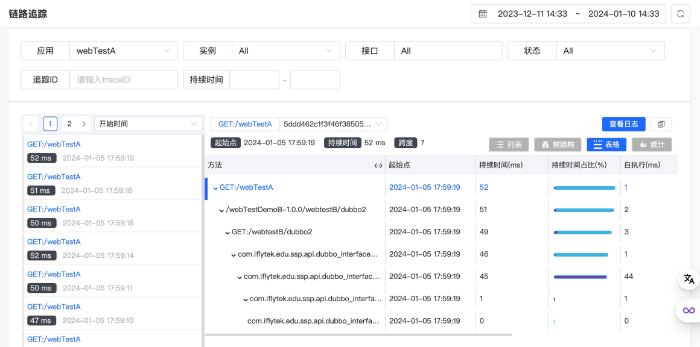
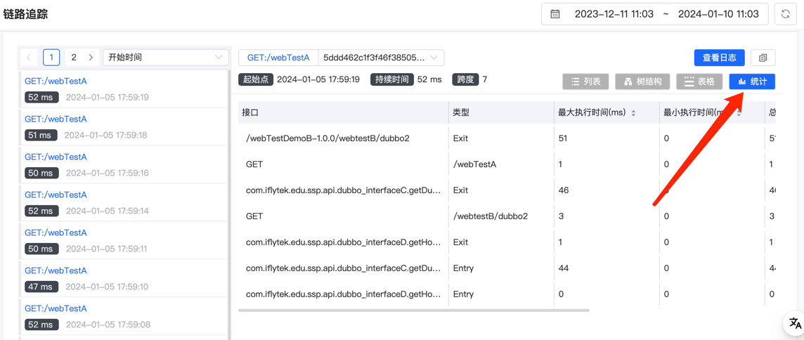

# 链路追踪

链路追踪页面主要展示了在微服务架构中，一次完整的用户请求链路。用户可以在这个页面查看到请求从开始到结束在系统里的完整路径，包括调用了哪些服务、哪些数据库、还有响应时间是多少等等。

## 使用指南

### 查询

在主页右上角选择需要查询链路所在的时间区间，在标题正下方的方框内自定义查询条件，包括需要关联的服务和实例，接口名称，链路状态，还有链路ID和持续时间。页面会动态加载出满足查询条件的所有链路，在左下方的列表里展示出来。

#### 链路详情

点击左边列表的指定链路，会在右边展示出该链路的详细信息。包括链路ID，起始时间和持续时间，还有链路关联的所有服务以及所有跨度的可视化时序图。在时序图里，可以清晰地看到整条链路从起始到结束的过程中途经的每个跨度的名称和类型。

#### 树结构

点击树结构，会将起始跨度作为父节点，后续链路的跨度作为子节点，按照跨度之间的调用关系，将链路转换成树状的结构，可以更加直观地反映跨度之间的串行和并行关系。

#### 表格

点击表格，会顺序展示出每个跨度的自执行时间，及其在总耗时中的占比，可以更加直观地看出每个跨度的快慢，该功能在链路延迟较长进行问题定位时能提供重要参考。

#### 统计

点击统计，会展示出在该链路里各接口的数学统计值，包括最大最小时间，还有总时间，执行次数和平均时间。
