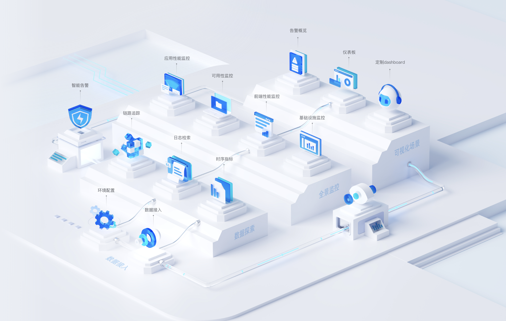

# 星迹可观测平台介绍

## 星迹可观测平台
全领域场景的可观测产品，旨在满足基础设施、应用和业务监测需求。提供故障预防、发现与定位能力，优化资源使用和用户体验，助力企业数字化转型。

## 什么是可观测性
可观测性是通过对开发测试、IT运维、业务运营、安全合规等全业务运营流程，借助日志、指标、链路等数据进行关联分析，衡量、预防、发现、定位、解决业务问题，实现业务效能提升的一种能力。可观测性是从系统内部出发，基于白盒化的思路去监测系统内部的运行情况，可观测性贯穿应用开发的整个生命周期，通过分析应用的指标、日志和链路等数据，构建完整的观测模型，主动观测与关联应用的各项指标，从而实现故障诊断、根因分析和快速恢复。        近年来，随着数字化转型和云原生应用的普及，以及企业对稳定性和可靠性的要求增加，企业正在经历着一场基础设施和开发方式的变革。在这样的背景下，对于传统监控系统的需求和期望也发生了变化，需要监控技术从“监控”走向“可观测”。而在 2023 年，应用可观测性被 Gartner 列入「2023 年十大战略技术趋势」之一，可观测性在 IT 领域逐渐引起广泛关注：

1. 传统的基础设施、容器、微服务等技术的广泛应用，企业IT运维环境变得越来越复杂，问题定位难度更高，同时观测对象演变与种类增多，对于观测能力的要求提升。
2. 客户体验直接影响业务表现，进一步提高对系统表现的要求。企业对于运维的复杂性以及对故障诊断、根因分析和快速恢复的需求日益增加。
3. DevOps等理念叠加持续集成、持续部署等工作流和工具的组合，在这种情况下，通过梳理各类依赖关系和代码追踪，提高开发者对系统掌握度的可观测性，已经成为保障系统稳定性的重要因素。

## 星迹应用场景

1. 系统监控和分析：通过深度的系统监控和分析，可以帮助组织提前发现潜在问题并提醒IT员工
2. 故障排除：通过观察和分析应用程序的行为，可以快速定位和解决问题
3. 性能优化：通过观察和分析应用程序的性能指标，可以找出性能瓶颈并进行优化
4. 用户体验优化：通过观察和分析用户的行为，可以了解用户的需求和痛点，并进行优化
5. 业务决策：通过观察和分析业务数据，可以支持业务决策
6. 容量规划：通过观察和分析应用程序的使用情况，可以预测未来的资源需求并进行规划
