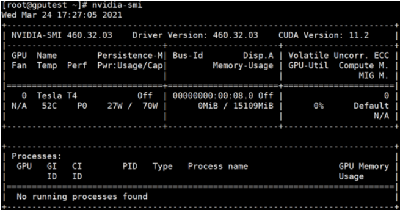
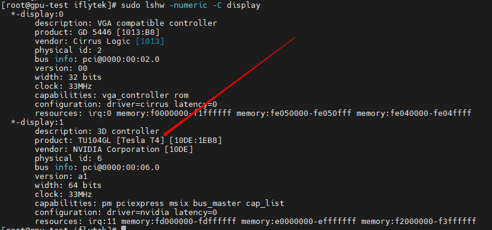
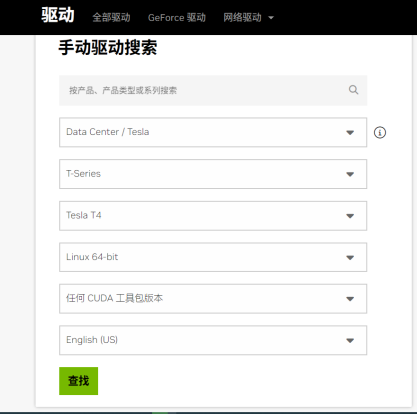

# Nvidia

## 配置

### 1、安装驱动

#### 1.1 驱动检查

```text
[root@iflyops-1 ~]# nvidia-smi
```
输出如下内容，说明驱动安装成功


#### 1.2 驱动安装

##### 1.2.1 查看服务器型号
```text
[root@iflyops-1 ~]# cat /etc/redhat-release
```

##### 1.2.2 查看服务器显卡型号
```text
[root@iflyops-1 ~]# sudo lshw -numeric -C display
或
[root@iflyops-1 ~]# lspci | grep -i vga
```


##### 1.2.3 访问英伟达官网：
https://www.nvidia.cn/Download/index.aspx?lang=cn 
根据自己显卡的系列型号，选择对应的版本，进行下载。 如下图所示：


##### 1.2.4 驱动安装

###### 1.2.4.1 安装编译环境gcc
```text
yum -y install gcc kernel-devel "kernel-devel-uname-r == $(uname -r)" dkms
```

###### 1.2.4.2 禁用第三方开元的Nvidia驱动
```text
lsmod | grep nouveau
```

如果有任何输出，那么就是nouveau在启用，需要关闭，按照以下步骤
```text
vim /usr/lib/modprobe.d/dist-blacklist.conf
```

#写入以下内容
```text
blacklist nouveau
options nouveau modeset=0
```

#保存并退出

重启虚机lsmod | grep nouveau 没有任何输出就代表禁用了nouveau

如果这个办法没有 成功禁用nouveau  ，直接移除这个驱动（备份出来）
```text
cd /lib/modules/3.10.0-957.el7.x86_64/kernel/drivers/gpu/drm/nouveau/
mv nouveau.ko.xz nouveau.ko.xz.org
```

重启虚机lsmod | grep nouveau 没有任何输出就代表禁用了nouveau
如果没有生效尝试第三种方案
```text
vim /etc/modprobe.d/blacklist-nouveau.conf
# 添加下列两行
blacklist nouveauoptions nouveau modeset=0
dracut --force
```

重启虚机lsmod | grep nouveau 没有任何输出就代表禁用了nouveau

###### 1.2.4.3 安装驱动

将驱动上传，然后跑
```text
chmod o+x NVIDIA-Linux-x86_64-460.32.03.run
./NVIDIA-Linux-x86_64-460.32.03.run
```

nvidia-smi检查驱动安装结果

###### 1.2.4.4 打开GPU驱动内存常驻模式（打开GPU驱动内存常驻模式可以减少GPU掉卡、GPU带宽降低、GPU温度监测不到等诸多问题。建议打开GPU驱动内存常驻模式并配置开机自启动）

```text
nvidia-smi -pm 1
```
或

以下命令对较新版本的GPU驱动有效
```text
nvidia-persistenced --persistence-mode
```
开机自启动配置示例：
```text
vim /etc/rc.d/rc.local
# 在文件中添加一行
nvidia-smi -pm 1
# 赋予/etc/rc.d/rc.local文件可执行权限
chmod +x /etc/rc.d/rc.local
# 重启系统进行验证
```

### 2、安装exporter

#### 2.1 nvidia_gpu_exporter开源exporter地址
https://github.com/utkuozdemir/nvidia_gpu_exporter

#### 2.2 nvidia_gpu_exporter下载与安装
```text
[root@iflyops-1 ~]# wget https://github.com/utkuozdemir/nvidia_gpu_exporter/releases/download/v1.2.1/nvidia_gpu_exporter_1.2.1_linux_x86_64.tar.gz
```

#### 2.3 解压后启动exporter
```text
[root@iflyops-1 ~]# ./nvidia_gpu_exporter
```
启动后访问以下地址查看gpu指标 http://127.0.0.16:9835/metrics

若端口冲突，可以 -h 查看命令指引，配置端口
```text
[root@iflyops-1 ~]# ./nvidia_gpu_exporter -h
```

## 采集配置

在指标接入页面修改相关配置。其它使用默认配置即可
```text
[[inputs.prom]]
  # 是否启用该input
  enable_input = true

  # Exporter URLs.
  urls = ["http://127.0.0.16:9835/metrics"]
```

## 指标含义

| 指标                                                       | 说明                                              |
| ---------------------------------------------------------- |-------------------------------------------------|
| nvidia_gpu_exporter_build_info                             | 显示 NVIDIA GPU Exporter 构建信息（版本，修订，分支和构建的Go语言版本） |
| nvidia_smi_accounting_buffer_size                          | 记账模式的缓冲区大小                                      |
| nvidia_smi_accounting_mode                                 | 显示 GPU 记账模式的状态                                  |
| nvidia_smi_clocks_applications_graphics_clock_hz           | 应用程序的图形处理器时钟频率                                  |
| nvidia_smi_clocks_applications_memory_clock_hz             | 应用程序的内存时钟频率。                                    |
| nvidia_smi_clocks_current_graphics_clock_hz:               | 当前的图形处理器时钟频率。                                   |
| nvidia_smi_clocks_current_memory_clock_hz:                 | 当前的内存时钟频率。                                      |
| nvidia_smi_clocks_current_sm_clock_hz:                     | 当前的流多处理器(SM)时钟频率。                               |
| nvidia_smi_clocks_current_video_clock_hz:                  | 当前的视频时钟频率。                                      |
| nvidia_smi_clocks_default_applications_graphics_clock_hz:  | 默认应用程序的图形处理器时钟频率。                               |
| nvidia_smi_clocks_default_applications_memory_clock_hz:    | 默认应用程序的内存时钟频率。                                  |
| nvidia_smi_clocks_max_graphics_clock_hz:                   | 图形处理器的最大时钟频率。                                   |
| nvidia_smi_clocks_max_memory_clock_hz:                     | 内存的最大时钟频率。                                      |
| nvidia_smi_clocks_max_sm_clock_hz:                         | 流多处理器(SM)的最大时钟频率。                               |
| nvidia_smi_clocks_throttle_reasons_*:                      | 显示 GPU 时钟降速的原因。                                 |
| nvidia_smi_command_exit_code:                              | 上次抓取命令的退出代码。                                    |
| nvidia_smi_compute_mode:                                   | 显示 GPU 的计算模式。                                   |
| nvidia_smi_count:                                          | 显示 GPU 的数量。                                     |
| nvidia_smi_display_active:                                 | 显示是否有活动的显示器连接到 GPU。                             |
| nvidia_smi_display_mode:                                   | 显示 GPU 的显示模式。                                   |
| nvidia_smi_ecc_errors_corrected_*:                         | 显示 ECC 错误纠正情况。                                  |
| nvidia_smi_ecc_errors_uncorrected_*:                       | 显示 ECC 未纠正错误情况。                                 |
| nvidia_smi_ecc_mode_current:                               | 当前 ECC 模式。                                      |
| nvidia_smi_ecc_mode_pending:                               | 待定 ECC 模式。                                      |
| nvidia_smi_encoder_stats_*:                                | 编码器的状态，如平均帧率，平均延迟，会话数等。                         |
| nvidia_smi_enforced_power_limit_watts:                     | 强制执行的功耗限制（瓦特）。                                  |
| nvidia_smi_gpu_info:                                       | GPU 信息，包括 GPU 的 UUID，名称，驱动模型，VBIOS版本，驱动版本等。     |
| nvidia_smi_index:                                          | GPU 索引。                                         |
| nvidia_smi_inforom_ecc:                                    | Inforom ECC 信息。                                 |
| nvidia_smi_pcie_link_width_max:                            | PCIe链接的最大宽度。                                    |
| nvidia_smi_persistence_mode:                               | 持久模式的状态。                                        |
| nvidia_smi_power_default_limit_watts:                      | 默认的功率限制，单位是瓦特。                                  |
| nvidia_smi_power_draw_watts:                               | 当前绘制的功率，单位是瓦特。                                  |
| nvidia_smi_power_limit_watts:                              | 设置的功率限制，单位是瓦特。                                  |
| nvidia_smi_power_management:                               | 电源管理的状态。                                        |
| nvidia_smi_power_max_limit_watts:                          | 最大的功率限制，单位是瓦特。                                  |
| nvidia_smi_power_min_limit_watts:                          | 最小的功率限制，单位是瓦特。                                  |
| nvidia_smi_pstate:                                         | 当前的性能状态 (P-state)。                              |
| nvidia_smi_retired_pages_double_bit_count:                 | 双位错误退役页面的数量。                                    |
| nvidia_smi_retired_pages_pending:                          | 待处理的退役页面数量。                                     |
| nvidia_smi_retired_pages_single_bit_ecc_count:             | 单位ECC错误退役页面的数量。                                 |
| nvidia_smi_serial:                                         | GPU的序列号。                                        |
| nvidia_smi_temperature_gpu:                                | GPU的温度。                                         |
| nvidia_smi_temperature_memory:                             | 内存的温度。                                          |
| nvidia_smi_utilization_gpu_ratio:                          | GPU利用率，单位是百分比。                                  |
| nvidia_smi_utilization_memory_ratio:                       | 内存利用率，单位是百分比。                                   |
| process_cpu_seconds_total:                                 | 进程所消耗的总CPU时间，单位是秒。                              |
| process_max_fds:                                           | 进程所能打开的最大文件描述符数量。                               |
| process_open_fds:                                          | 进程当前打开的文件描述符数量。                                 |
| process_resident_memory_bytes:                             | 进程常驻内存的大小，单位是字节。                                |
| process_start_time_seconds:                                | 进程开始时间，单位是自Unix纪元以来的秒数。                         |
| process_virtual_memory_bytes:                              | 进程虚拟内存的大小，单位是字节。                                |
| process_virtual_memory_max_bytes:                          | 进程最大虚拟内存的大小，单位是字节。                              |
| promhttp_metric_handler_requests_in_flight:                | 当前正在处理的抓取请求数量。                                  |
| promhttp_metric_handler_requests_total:                    | 所有已完成的抓取请求数量，按HTTP状态码分类。                        |
| nvidia_smi_pcie_link_width_current:                        | 当前的PCIe链接宽度。                                    |
| nvidia_smi_ecc_errors_corrected_aggregate_device_memory:   | 累计的设备内存已纠正的ECC错误数量。                             |
| nvidia_smi_ecc_errors_corrected_aggregate_dram:            | 累计的DRAM已纠正的ECC错误数量。                             |
| nvidia_smi_ecc_errors_corrected_aggregate_l1_cache:        | 累计的L1缓存已纠正的ECC错误数量。                             |
| nvidia_smi_ecc_errors_corrected_aggregate_l2_cache:        | 累计的L2缓存已纠正的ECC错误数量。                             |
| nvidia_smi_ecc_errors_corrected_aggregate_register_file:   | 累计的寄存器文件已纠正的ECC错误数量。                            |
| nvidia_smi_ecc_errors_corrected_aggregate_total:           | 累计的所有已纠正的ECC错误总数。                               |
| nvidia_smi_ecc_errors_corrected_volatile_device_memory:    | 易失性设备内存已纠正的ECC错误数量。                             |
| nvidia_smi_ecc_errors_corrected_volatile_dram:             | 易失性DRAM已纠正的ECC错误数量。                             |
| nvidia_smi_ecc_errors_corrected_volatile_l1_cache:         | 易失性L1缓存已纠正的ECC错误数量。                             |
| nvidia_smi_ecc_errors_corrected_volatile_l2_cache:         | 易失性L2缓存已纠正的ECC错误数量。                             |
| nvidia_smi_ecc_errors_corrected_volatile_register_file:    | 易失性寄存器文件已纠正的ECC错误数量。                            |
| nvidia_smi_ecc_errors_corrected_volatile_total:            | 易失性所有已纠正的ECC错误总数。                               |
| nvidia_smi_ecc_errors_uncorrected_aggregate_cbu:           | 累计的CBU未纠正的ECC错误数量。                              |
| nvidia_smi_ecc_errors_uncorrected_aggregate_device_memory: | 累计的设备内存未纠正的ECC错误数量。                             |
| nvidia_smi_ecc_errors_uncorrected_aggregate_dram:          | 累计的DRAM未纠正的ECC错误数量。                             |
| nvidia_smi_ecc_errors_uncorrected_aggregate_l1_cache:      | 累计的L1缓存未纠正的ECC错误数量。                             |
| nvidia_smi_ecc_errors_uncorrected_aggregate_l2_cache:      | 累计的L2缓存未纠正的ECC错误数量。                             |
| nvidia_smi_ecc_errors_uncorrected_aggregate_register_file: | 累计的寄存器文件未纠正的ECC错误数量。                            |
| nvidia_smi_ecc_errors_uncorrected_aggregate_total:         | 累计的所有未纠正的ECC错误总数。                               |
| nvidia_smi_ecc_errors_uncorrected_volatile_cbu:            | 易失性CBU未纠正的ECC错误数量。                              |
| nvidia_smi_ecc_errors_uncorrected_volatile_device_memory:  | 易失性设备内存未纠正的ECC错误数量。                             |
| nvidia_smi_ecc_errors_uncorrected_volatile_dram:           | 易失性DRAM未纠正的ECC错误数量。                             |
| nvidia_smi_ecc_errors_uncorrected_volatile_l1_cache:       | 易失性L1缓存未纠正的ECC错误数量。                             |
| nvidia_smi_ecc_errors_uncorrected_volatile_l2_cache:       | 易失性L2缓存未纠正的ECC错误数量。                             |
| nvidia_smi_ecc_errors_uncorrected_volatile_register_file:  | 易失性寄存器文件未纠正的ECC错误数量。                            |
| nvidia_smi_ecc_errors_uncorrected_volatile_total:          | 易失性所有未纠正的ECC错误总数。                               |
| nvidia_smi_ecc_mode_current:                               | 当前的ECC模式。                                       |
| nvidia_smi_ecc_mode_pending:                               | 待设置的ECC模式。                                      |
| nvidia_smi_encoder_stats_average_fps:                      | 编码器的平均帧率。                                       |
| nvidia_smi_encoder_stats_average_latency:                  | 编码器的平均延迟。                                       |
| nvidia_smi_encoder_stats_session_count:                    | 编码器的会话数量。                                       |
| nvidia_smi_enforced_power_limit_watts:                     | 实施的功率限制，单位是瓦特。                                  |
| nvidia_smi_index:                                          | GPU索引。                                          |
| nvidia_smi_inforom_ecc:                                    | Inforom ECC信息。                                  |
| nvidia_smi_inforom_oem:                                    | Inforom OEM信息。                                  |
| nvidia_smi_memory_free_bytes:                              | 空闲内存，单位是字节。                                     |
| nvidia_smi_memory_total_bytes:                             | 总内存，单位是字节。                                      |
| nvidia_smi_memory_used_bytes:                              | 已使用的内存，单位是字节。                                   |
| nvidia_smi_pci_bus:                                        | PCI总线信息。                                        |
| nvidia_smi_pci_device:                                     | PCI设备信息。                                        |
| nvidia_smi_pci_device_id:                                  | PCI设备ID。                                        |
| nvidia_smi_pci_domain:                                     | PCI领域信息。                                        |
| nvidia_smi_pci_sub_device_id:                              | PCI子设备ID。                                       |
| nvidia_smi_pcie_link_gen_current:                          | 当前的PCIe链接生成。                                    |
| nvidia_smi_pcie_link_gen_max:                              | PCIe链接的最大生成。                                    |