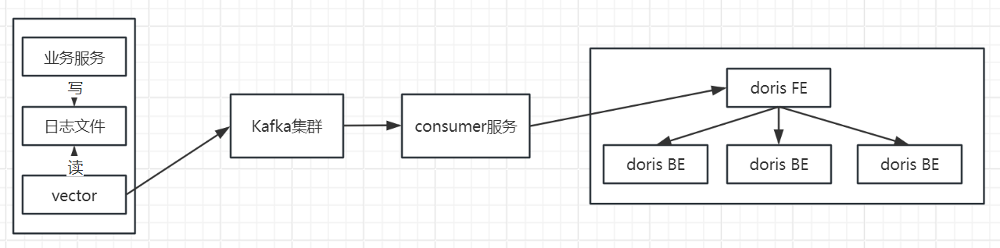
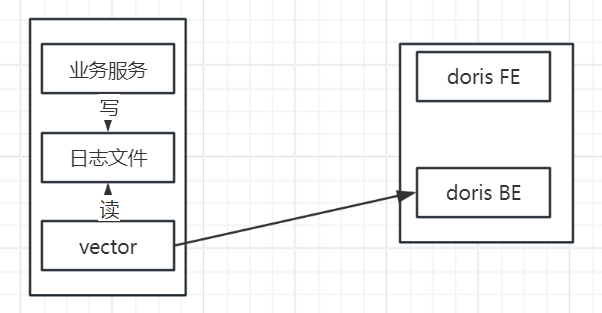
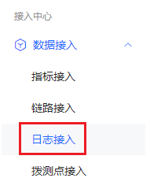
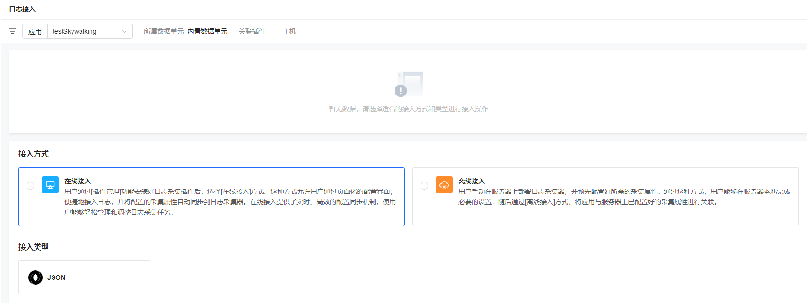

# 日志系统接入

## 日志量评估

日志系统采用Doris存储，部署规模及机器配置和日志量紧密相关，在接入前需要提供日志打印的tps和平均单条日志大小，以此来评估出部署规模和机器配置，如果日志量很小并且不需要保证高可用，可以支持最小化单点部署。

部署服务器规格建议：

| 每天日志量 | 推荐机器配置 | 推荐部署方案     |
| :--------- | :----------- | :--------------- |
| 0~10G      | 4C8G * 1     | 1节点FE，1节点BE |
| 10G~100G   | 8C16G * 1    | 1节点FE，1节点BE |
| 100G~300G  | 12C24G * 2   | 1节点FE，2节点BE |
| 300G以上   | 16C32G * 3   | 1节点FE，3节点BE |

磁盘配置按  每天日志量 * 保存天数 * 副本数 / 4 / BE节点数 * 1.3，计算存储服务器磁盘大小，乘1.3是预留出30%的冗余空间。

## 接入日志SDK

详见 [日志sdk接入](日志sdk接入.md) 文档

## 日志采集

根据实际情况，日志采集可以支持两种方式

### 标准模式



业务服务输出日志到日志文件，通过vector采集日志并发送到Kafka集群，部署Kafka日志消费服务消费处理日志数据，发送到Doris FE，FE中通过stream load 处理写入到BE服务保存。

vector需要编写对应的.toml文件，配置需要采集的日志文件、日志处理以及日志输出目的，这里以集成通用日志sdk输出日志和用户自定义格式两种类型举例

#### 采集通用日志sdk输出日志

- 日志示例

  集成通用日志sdk后，输出日志为json格式，包括以下字段内容，日志文件中不涉及跨行输出，每一行都是一条日志

  ```json
  {
      "traceId":"",
      "level":"INFO",
      "dateTime":1700706936805920072,
      "ip":"172.30.12.119",
      "application":"LokiTest",
      "methodName":"logTest",
      "logger":"com.my.loki.test.LogTest",
      "message":"The turtle can grow up to 303 years old, and this year it is 147 years old.",
      "exception":"",
      "source":"71db762c-74e2-4e23-bb7b-04c0e66db6fd",
      "threadName":"main"
  }
  ```
  
- vector配置

  ```toml
  # vector数据保存位置，主要保存所读取日志文件位置记录
  data_dir = "/var/lib/vector"
  
  # 读取日志文件
  [sources.log_test_logs]
  type = "file"
  include = [ "/root/itsc/log-test/logs/*.log" ]
  
  # 日志内容处理
  [transforms.parse_logs] 
  type = "remap"
  inputs = ["log_test_logs"] 
  # 将message字段json格式化，然后添加applicationCode字段
  source = '''
    .message = parse_json!(string!(.message))
     # applicationCode需要和下文中创建应用时的application_code保持一致
    .message.applicationCode = "loki_test"
  ''' 
  
  # 日志输出，将日志内容输出到kafka集群
  [sinks.kafka_cluster]
  type = "kafka"
  inputs = ["parse_logs"]
  bootstrap_servers = "172.30.14.135:9092,172.30.13.3:9092,172.30.93.17:9092"
  topic = "log-test-topic"
  encoding.codec = "text"
  batch.max_bytes = 10485760
  batch.max_events = 10000
  batch.timeout_secs = 1
  ```

- 输出日志内容

  ```json
  {
      "application":"LokiTest",
      "applicationCode":"observability_loki_test",
      "className":"com.my.loki.test.LogTest",
      "date":1700550522169,
      "exception":"",
      "ip":"172.30.12.119",
      "level":"INFO",
      "logger":"com.my.loki.test.LogTest",
      "machineName":"loki.novalocal",
      "message":"The turtle can grow up to 739 years old, and this year it is 508 years old.",
      "method_name":"logTest",
      "platform":"observability",
      "traceId":""
  }
  ```

#### 采集用户自定义格式输出日志

- 日志示例

  每行日志都以时间开头，日志内容包括日志时间、线程名、日志级别、打印日志类和消息内容，涉及到异常日志打印时的跨行合并.输出字段必需和上面sdk字段保持一致，没有的字段可以为空

  ```
  2023-11-20 16:51:16.276 [http-nio-48002-exec-3] INFO  com.iflytek.aitownlet.common.event.utils.RedisUtil - 当前用户已失效！
  2023-11-20 16:51:16.667 [http-nio-48002-exec-3] ERROR c.i.a.common.event.exception.ExceptionController - 请求地址'/common-event/event/queryDetail',发生系统异常.
  com.iflytek.aitownlet.common.exception.BusinessException: 【business_9999】事件不存在
          at com.iflytek.aitownlet.common.event.service.impl.TEventServiceImpl.queryDetail(TEventServiceImpl.java:600)
          at com.iflytek.aitownlet.common.event.service.impl.TEventServiceImpl$$FastClassBySpringCGLIB$$2f0d96f9.invoke(<generated>)
          at org.springframework.cglib.proxy.MethodProxy.invoke(MethodProxy.java:218)
          at org.springframework.aop.framework.CglibAopProxy$DynamicAdvisedInterceptor.intercept(CglibAopProxy.java:689)
          at com.iflytek.aitownlet.common.event.service.impl.TEventServiceImpl$$EnhancerBySpringCGLIB$$fc4cfe42.queryDetail(<generated>)
          at com.iflytek.aitownlet.common.event.controller.EventController.queryDetail$original$t5ugOl9F(EventController.java:202)
          at com.iflytek.aitownlet.common.event.controller.EventController.queryDetail$original$t5ugOl9F$accessor$5aCxMlcP(EventController.java)
          at com.iflytek.aitownlet.common.event.controller.EventController$auxiliary$cSNC1klr.call(Unknown Source)
          at org.apache.skywalking.apm.agent.core.plugin.interceptor.enhance.InstMethodsInter.intercept(InstMethodsInter.java:86)
          at com.iflytek.aitownlet.common.event.controller.EventController.queryDetail(EventController.java)
          at sun.reflect.NativeMethodAccessorImpl.invoke0(Native Method)
          at sun.reflect.NativeMethodAccessorImpl.invoke(NativeMethodAccessorImpl.java:62)
          at sun.reflect.DelegatingMethodAccessorImpl.invoke(DelegatingMethodAccessorImpl.java:43)
          at java.lang.reflect.Method.invoke(Method.java:498)
  ```

- vector配置

  ```toml
  # vector数据保存位置，主要保存所读取日志文件位置记录
  data_dir = "/root/itsc/vector/data_dir"
  
  # 读取日志文件，并使用正则匹配日志开头格式处理跨行日志合并
  [sources.log_test_logs]
  type = "file"
  include = [ "/root/itsc/vector/logtest/*.log" ]
    [sources.log_test_logs.multiline]
      start_pattern = '^\d{4}-\d{2}-\d{2}\s\d{2}:\d{2}:\d{2}\.\d{3}\s+\[.*\]\s+[A-Z]+ '
      mode = "halt_before"
      condition_pattern = '^\d{4}-\d{2}-\d{2}\s\d{2}:\d{2}:\d{2}\.\d{3}\s+\[.*\]\s+[A-Z]+ '
      timeout_ms = 1000
  
  # 日志内容处理
  [transforms.parse_logs]
  type = "remap"
  inputs = ["log_test_logs"]
  # 将message字段通过正则匹配出时间、线程名、级别、类名和日志内容，并将applicationCode、file、host字段添加到message字段中，最后输出message为json格式
  source = '''
    . |= parse_regex!(.message, r'^(?P<log_date>\d{4}-\d{2}-\d{2}\s\d{2}:\d{2}:\d{2}\.\d{3})\s+\[(?P<thread_name>.*)\]\s+(?P<level>\w+)\s+(?P<class_name>.*)\s+-\s+(?P<msg>[\s\S]*)')
    .message.id = uuid_v4()
    # applicationCode需要和下文中创建应用时的application_code保持一致
    .message.applicationCode = "loki_test"
    .message.dateTime = to_unix_timestamp(parse_timestamp!(.log_date, format: "%Y-%m-%d %H:%M:%S.%3f"), unit: "nanoseconds")
    .message.threadName = (.thread_name)
    .message.level = (.level)
    .message.logger = (.class_name)
    .message.message = (.msg)
    .message.source = "00010dae-6dc2-4460-b80f-dd24c822c168"
    .message.ip = "172.30.34.73"
  '''
  
  # 日志输出，将日志内容输出到kafka集群
  [sinks.kafka_cluster]
  type = "kafka"
  inputs = ["parse_logs"]
  bootstrap_servers = "172.30.14.135:9092,172.30.13.3:9092,172.30.93.17:9092"
  topic = "log-test-topic"
  encoding.codec = "text"
  batch.max_bytes = 10485760
  batch.max_events = 10000
  batch.timeout_secs = 1
  ```

- 输出日志内容

  会输出两条处理后的日志，并且从日志数据中解析出类名、级别、线程名等信息，输出json格式

  ```json
  {
      "applicationCode":"observability_loki_test",
      "logger":"com.iflytek.aitownlet.common.event.utils.RedisUtil",
      "level":"INFO",
      "dateTime":1704266987276000000,
      "message":"当前用户已失效！",
      "source":"00010dae-6dc2-4460-b80f-dd24c822c168",
      "threadName":"http-nio-48002-exec-3",
      "ip": "172.30.34.73"
  }
  ```

  ```json
  {
      "applicationCode":"observability_loki_test",
      "logger":"c.i.a.common.event.exception.ExceptionController",
      "level":"ERROR",
      "log_date":1704266987667000000,
      "threadName":"http-nio-48002-exec-3",
      "source":"00010dae-6dc2-4460-b80f-dd24c822c168",
      "ip": "172.30.34.73",
      "message":"请求地址'/common-event/event/queryDetail',发生系统异常.\ncom.iflytek.aitownlet.common.exception.BusinessException: 【business_9999】事件不存在\n        at com.iflytek.aitownlet.common.event.service.impl.TEventServiceImpl.queryDetail(TEventServiceImpl.java:600)\n        at com.iflytek.aitownlet.common.event.service.impl.TEventServiceImpl$$FastClassBySpringCGLIB$$2f0d96f9.invoke(&lt;generated&gt;)\n        at org.springframework.cglib.proxy.MethodProxy.invoke(MethodProxy.java:218)\n        at org.springframework.aop.framework.CglibAopProxy$DynamicAdvisedInterceptor.intercept(CglibAopProxy.java:689)\n        at com.iflytek.aitownlet.common.event.service.impl.TEventServiceImpl$$EnhancerBySpringCGLIB$$fc4cfe42.queryDetail(&lt;generated&gt;)\n        at com.iflytek.aitownlet.common.event.controller.EventController.queryDetail$original$t5ugOl9F(EventController.java:202)\n        at com.iflytek.aitownlet.common.event.controller.EventController.queryDetail$original$t5ugOl9F$accessor$5aCxMlcP(EventController.java)\n        at com.iflytek.aitownlet.common.event.controller.EventController$auxiliary$cSNC1klr.call(Unknown Source)\n        at org.apache.skywalking.apm.agent.core.plugin.interceptor.enhance.InstMethodsInter.intercept(InstMethodsInter.java:86)\n        at com.iflytek.aitownlet.common.event.controller.EventController.queryDetail(EventController.java)\n        at sun.reflect.NativeMethodAccessorImpl.invoke0(Native Method)\n        at sun.reflect.NativeMethodAccessorImpl.invoke(NativeMethodAccessorImpl.java:62)\n        at sun.reflect.DelegatingMethodAccessorImpl.invoke(DelegatingMethodAccessorImpl.java:43)\n        at java.lang.reflect.Method.invoke(Method.java:498)"
  }
  ```

  

### 极简模式



在业务量很小的情况下，引进Kafka集群会使链路变得复杂化，我们提供了一个极简的模式，支持通过vector采集客户端处理完日志后，直接将日志发送到Doris BE，省去Kafka和consumer服务的部署和维护。
注意：这种方式解析出来的字段要和日志存储表的字段保持一致。

#### 采集通用日志sdk输出日志

- 日志示例

  集成通用日志sdk后，输出日志为json格式，包括以下字段内容，日志文件中不涉及跨行输出，每一行都是一条日志

  ```json
  {
      "traceId":"",
      "level":"INFO",
      "dateTime":1700706936805920072,
      "ip":"172.30.12.119",
      "application":"LokiTest",
      "methodName":"logTest",
      "logger":"com.my.loki.test.LogTest",
      "message":"The turtle can grow up to 303 years old, and this year it is 147 years old.",
      "exception":"",
      "source":"71db762c-74e2-4e23-bb7b-04c0e66db6fd",
      "threadName":"main"
  }
  ```

- vector配置

  ```toml
  # vector数据保存位置，主要保存所读取日志文件位置记录
  data_dir = "/var/lib/vector"
  
  # 读取日志文件
  [sources.log_test_logs]
  type = "file"
  include = [ "/root/itsc/log-test/logs/*.log" ]
  
  # 日志内容处理
  [transforms.parse_logs]
  type = "remap"
  inputs = ["log_test_logs"]
  # 将message字段json格式化，在外层添加所需字段赋值为message中对应字段值，删除host、source_type、file字段
  source = '''
    .message = parse_json!(string!(.message))
    .id = uuid_v4()
    # 将纳秒时间戳转化为2023-11-12 12:00:00.123格式
    .log_date = format_timestamp!(from_unix_timestamp!(.message.dateTime, unit: "nanoseconds"), format:"%F %H:%M:%S%.3f", "local")
    .timestamp = (.message.dateTime)
    .application = (.message.application)
    .source = (.message.source)
    .level = (.message.level)
    .logger = (.message.logger)
    .method_name = (.message.methodName)
    .thread_name = (.message.threadName)
    .trace_id = (.message.traceId)
    .ip = (.message.ip)
    .exception = (.message.exception)
    .message = (.message.message)
    del(.host)
    del(.source_type)
    del(.file)
  '''
  
  # 输出日志到doris
  [sinks.doris]
  type = "http"
  inputs = ["parse_logs"]
  # 配置Doris BE地址
  uri = "http://172.30.35.68:8040/api/log_platform/log_record_loki_test/_stream_load"
  auth.strategy = "basic"
  auth.user = "root"
  auth.password = ""
  batch.max_bytes = 10485760
  batch.max_events = 10000
  batch.timeout_secs = 3
  buffer.type = "disk"
  buffer.max_size = 1073741952
  buffer.when_full = "block"
  encoding.codec = "json"
  request.headers.Expect = "100-continue"
  request.headers.strip_outer_array = "true"
  request.headers.format = "json"
  method = "put"
  ```

  

#### 采集用户自定义格式输出日志

- 日志示例

  每行日志都以时间开头，日志内容包括日志时间、线程名、日志级别、打印日志类和消息内容，涉及到异常日志打印时的跨行合并

  ```
  2023-11-20 16:51:16.276 [http-nio-48002-exec-3] INFO  com.iflytek.aitownlet.common.event.utils.RedisUtil - 当前用户已失效！
  2023-11-20 16:51:16.667 [http-nio-48002-exec-3] ERROR c.i.a.common.event.exception.ExceptionController - 请求地址'/common-event/event/queryDetail',发生系统异常.
  com.iflytek.aitownlet.common.exception.BusinessException: 【business_9999】事件不存在
          at com.iflytek.aitownlet.common.event.service.impl.TEventServiceImpl.queryDetail(TEventServiceImpl.java:600)
          at com.iflytek.aitownlet.common.event.service.impl.TEventServiceImpl$$FastClassBySpringCGLIB$$2f0d96f9.invoke(<generated>)
          at org.springframework.cglib.proxy.MethodProxy.invoke(MethodProxy.java:218)
          at org.springframework.aop.framework.CglibAopProxy$DynamicAdvisedInterceptor.intercept(CglibAopProxy.java:689)
          at com.iflytek.aitownlet.common.event.service.impl.TEventServiceImpl$$EnhancerBySpringCGLIB$$fc4cfe42.queryDetail(<generated>)
          at com.iflytek.aitownlet.common.event.controller.EventController.queryDetail$original$t5ugOl9F(EventController.java:202)
          at com.iflytek.aitownlet.common.event.controller.EventController.queryDetail$original$t5ugOl9F$accessor$5aCxMlcP(EventController.java)
          at com.iflytek.aitownlet.common.event.controller.EventController$auxiliary$cSNC1klr.call(Unknown Source)
          at org.apache.skywalking.apm.agent.core.plugin.interceptor.enhance.InstMethodsInter.intercept(InstMethodsInter.java:86)
          at com.iflytek.aitownlet.common.event.controller.EventController.queryDetail(EventController.java)
          at sun.reflect.NativeMethodAccessorImpl.invoke0(Native Method)
          at sun.reflect.NativeMethodAccessorImpl.invoke(NativeMethodAccessorImpl.java:62)
          at sun.reflect.DelegatingMethodAccessorImpl.invoke(DelegatingMethodAccessorImpl.java:43)
          at java.lang.reflect.Method.invoke(Method.java:498)
  ```

- vector配置

  ```toml
  # vector数据保存位置，主要保存所读取日志文件位置记录
  data_dir = "/root/itsc/vector/data_dir"
  
  # 读取日志文件，并使用正则匹配日志开头格式处理跨行日志合并
  [sources.log_test_logs]
  type = "file"
  include = [ "/root/itsc/vector/logtest/error.log" ]
    [sources.log_test_logs.multiline]
      start_pattern = '^\d{4}-\d{2}-\d{2}\s\d{2}:\d{2}:\d{2}\.\d{3}\s+\[.*\]\s+[A-Z]+ '
      mode = "halt_before"
      condition_pattern = '^\d{4}-\d{2}-\d{2}\s\d{2}:\d{2}:\d{2}\.\d{3}\s+\[.*\]\s+[A-Z]+ '
      timeout_ms = 1000
  
  # 日志内容处理
  [transforms.parse_logs]
  type = "remap"
  inputs = ["log_test_logs"]
  # 将message字段通过正则匹配出时间、线程名、级别、类名和日志内容，并添加applicationCode、id字段，将message内容设置为解析出的msg内容，删除外层msg、timestamp、source_type字段
  source = '''
    . |= parse_regex!(.message, r'^(?P<log_date>\d{4}-\d{2}-\d{2}\s\d{2}:\d{2}:\d{2}\.\d{3})\s+\[(?P<thread_name>.*)\]\s+(?P<level>\w+)\s+(?P<logger>.*)\s+-\s+(?P<msg>[\s\S]*)')
    .id = uuid_v4()
    .application_code = "observability_loki_test"
    .log_timestamp = to_unix_timestamp(parse_timestamp!(.log_date, format: "%Y-%m-%d %H:%M:%S.%3f"), unit: "nanoseconds")
    .source = "00010dae-6dc2-4460-b80f-dd24c822c168"
    .message = (.msg)
    del(.msg)
    del(.timestamp)
    del(.source_type)
  '''
  
  # 输出日志到doris
  [sinks.doris]
  type = "http"
  inputs = ["parse_logs"]
  # 配置Doris BE地址
  uri = "http://172.30.35.68:8040/api/log_center/vector_sink_log_test/_stream_load"
  auth.strategy = "basic"
  auth.user = "root"
  auth.password = ""
  batch.max_bytes = 10485760
  batch.max_events = 10000
  batch.timeout_secs = 3
  buffer.type = "disk"
  buffer.max_size = 1073741952
  buffer.when_full = "block"
  encoding.codec = "json"
  request.headers.Expect = "100-continue"
  request.headers.strip_outer_array = "true"
  request.headers.format = "json"
  method = "put"
  ```
  
  

## 创建数据表

### 创建应用表

在接入日志前确定好平台和应用名称，将应用信息维护在数据库中，建表语句如下：

```sql
CREATE TABLE IF NOT EXISTS log_platform.log_application_config
(
  `application_code` VARCHAR(50) NOT NULL COMMENT "应用业务码",
  `application_name` VARCHAR(50) NOT NULL COMMENT "应用名",
  `table_name` VARCHAR(200) NOT NULL COMMENT "数据表名",
  `keep_hour` INT COMMENT "日志保存时间",
  `create_time` DATETIMEV2 NOT NULL COMMENT "创建时间",
  `update_time` DATETIMEV2 NOT NULL COMMENT "更新时间"
)
UNIQUE KEY(application_code)
COMMENT "接入应用表"
 
DISTRIBUTED BY HASH(application_code)
PROPERTIES (
  "replication_allocation" = "tag.location.default: 1"
);
```

添加应用信息

```sql
INSERT INTO log_application_config VALUES ('test', '测试使用', 'log_record_test', 24, '2023-11-21 17:32:21', '2023-11-21 17:32:21')
```


### 按应用创建日志存储表

#### 集成通用日志sdk日志存储表

日志系统中日志按应用分表保存，在Doris管理页面创建对应日志数据表，表名命名规则为log_record_{$applicationCode}，applicationCode为采集时设定的applicationCode值，建表语句如下:

```sql
CREATE TABLE IF NOT EXISTS log_platform.log_record_loki_test
(
    `id` VARCHAR(50) COMMENT "日志id",  
    `log_date` DATETIMEV2(3) COMMENT "日志打印时间",
    `log_timestamp` BIGINT COMMENT "日志打印时间戳",
    `application` VARCHAR(100) COMMENT "应用",
    `source` VARCHAR(50) COMMENT "日志来源",
    `level` VARCHAR(10) COMMENT "日志级别",
    `logger` VARCHAR(200) COMMENT "打印日志对象名",
    `method_name` VARCHAR(100) COMMENT "打印日志的方法名",
    `thread_name` VARCHAR(100) COMMENT "打印日志的线程名",
    `trace_id` VARCHAR(500) COMMENT "调用链trace id",
    `ip` VARCHAR(20) COMMENT "应用服务器所在主机ip",
    `service_instance_name` VARCHAR(200) COMMENT "服务实例名称",
    `endpoint_name` VARCHAR(200) COMMENT "服务接口名称",
    `message` STRING COMMENT "日志内容",
    `exception` STRING COMMENT "日志异常信息"
)
ENGINE = OLAP
PARTITION BY RANGE (`log_date`)
(
)
DISTRIBUTED BY HASH(`id`) 
PROPERTIES (
    "dynamic_partition.enable" = "true",
    "dynamic_partition.time_unit" = "DAY",
    "dynamic_partition.create_history_partition" = "true",
    "dynamic_partition.start" = "-30",
    "dynamic_partition.end" = "7",
    "dynamic_partition.prefix" = "p",
    "replication_allocation" = "tag.location.default: 1",
    "compression"="zstd"
);
```

#### 用户自定义日志存储表

目前只有在极简模式直接vector采集数据发送到Doris时，才可以自定义日志存储表，需根据自定义日志采集时解析出的字段来建对应的日志存储表，注意有几个必需字段：

id：日志记录唯一id

log_date：日志时间，例如"2023-01-01 12:12:12.123"

log_timestamp：日志时间戳，纳秒数

source：日志来源标识，可以在采集分析时在每个服务的日志中加入一个固定的值，或者对某几个字段进行md5取值。

level：日志级别

## nginx日志接入
nginx日志存储表：
```sql
CREATE TABLE IF NOT EXISTS log_platform.log_record_nginx_access
(
  `id` VARCHAR(50) NOT NULL COMMENT "日志id", 
  `log_date` DATETIMEV2(3) NOT NULL COMMENT "日志打印时间",
  `log_timestamp` BIGINT NOT NULL COMMENT "日志打印时间戳",
  `source` VARCHAR(50) NOT NULL COMMENT "日志来源",
  `level` VARCHAR(10) NOT NULL DEFAULT "INFO" COMMENT "日志级别",
  `message` STRING COMMENT "日志内容",
  `http_referer` VARCHAR(2000) COMMENT "",
  `remote_addr` VARCHAR(20) COMMENT "客户端IP地址",
  `remote_user` VARCHAR(20) COMMENT "客户端IP地址",
  `request_uri` VARCHAR(2000) COMMENT "请求完整地址",
  `uri` VARCHAR(500) COMMENT "请求地址",
  `request_length` BIGINT COMMENT "请求长度（包括请求行、请求头和请求正文）",
  `request_time` BIGINT COMMENT "服务器处理请求的时长",
  `request_method` VARCHAR(20) COMMENT "请求方法",
  `upstream_addr` VARCHAR(20) COMMENT "上游服务器的主机名或IP地址",
  `upstream_response_time` BIGINT COMMENT "上游服务器处理请求的时长",
  `user_agent` VARCHAR(200) COMMENT "客户端浏览器或应用程序的标识信息",
  `client_type` VARCHAR(100) COMMENT "客户端类型",
  `platform_source` VARCHAR(100) COMMENT "平台来源",
  `http_x_forwarded_for` VARCHAR(200),
  `status` BIGINT COMMENT "请求的状态",
  `time_local` DATETIMEV2(3) NOT NULL COMMENT "本地时间",
  `bytes_sent` BIGINT COMMENT "发送到客户端的字节数",
  `body_bytes_sent` BIGINT COMMENT "发送到客户端消息体的字节数",
  `connection` BIGINT COMMENT "",
  `host` VARCHAR(50) COMMENT "",
  `page_url` VARCHAR(500) COMMENT "请求来源于哪个页面",
  `core_page` TINYINT COMMENT "是否为核心页面",
  `user_id` VARCHAR(200) COMMENT "用户标识" 
)
ENGINE = OLAP
PARTITION BY RANGE (`log_date`)
(
)
DISTRIBUTED BY HASH(`id`)
PROPERTIES (
  "dynamic_partition.enable" = "true",
  "dynamic_partition.time_unit" = "DAY",
  "dynamic_partition.create_history_partition" = "true",
  "dynamic_partition.start" = "-7",
  "dynamic_partition.end" = "7",
  "dynamic_partition.prefix" = "p",
  "replication_allocation" = "tag.location.default: 1",
  "compression"="zstd"
);
```
添加nginx应用记录：
```sql
INSERT INTO log_application_config VALUES ('nginx-access', 'nginx-access', 'log_record_nginx_access', 24, '2024-01-31 17:32:21', '2024-01-31 17:32:21');
```

设置nginx打印日志格式：
```text
log_format main '{"http_referer":"$http_referer","remote_addr":"$remote_addr","remote_user":"$remote_user","request_uri":"$request_uri","request_length":"$request_length","request_time":"$request_time","request_method":"$request_method","upstream_addr":"$upstream_addr","upstream_response_time":"$upstream_response_time","http_user_agent":"$http_user_agent","http_x_forwarded_for":"$http_x_forwarded_for","status":"$status","time_local":"$time_iso8601","body_bytes_sent":"$body_bytes_sent","bytes_sent":"$bytes_sent","connection":"$connection","host":"$host","user_id":"$http_user_id","uri":"$uri"}';
```
grafana中导入nginx通用大盘：nginx通用大盘-1707102964529.json(见部署包)

## 日志线上接入操作文档
前提: 需要先在空间管理创建需要接入的应用, 同时在环境配置中安装日志采集插件

### 进入数据接入菜单选择日志接入



### 选择一个应用
按照当前环境信息选择在线或者离线接入, 接入类型选择JSON, 日志文件的内容输出格式需要是JSON, 否则会解析失败


### 选择主机
选择需要接入的主机

### 配置采集属性
配置日志的采集路径等信息

### 配置字段映射
根据业务原始日志配置相应的数据库存储字段

### 完成
点击完成, 可以在日志接入页面查看接入信息

## 日志平台相关服务部署

详见 [日志系统部署](../deploy/日志系统部署.md) 文档
