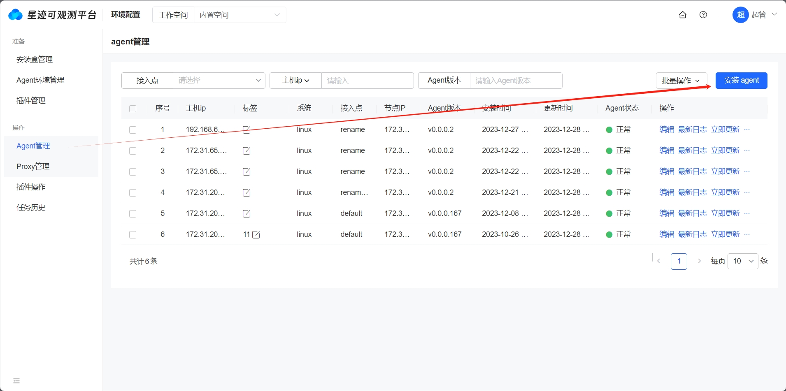
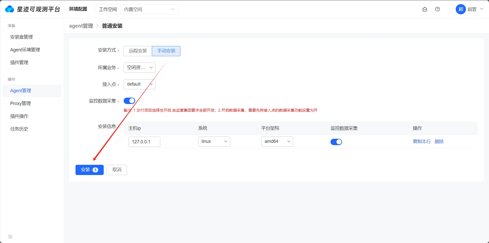
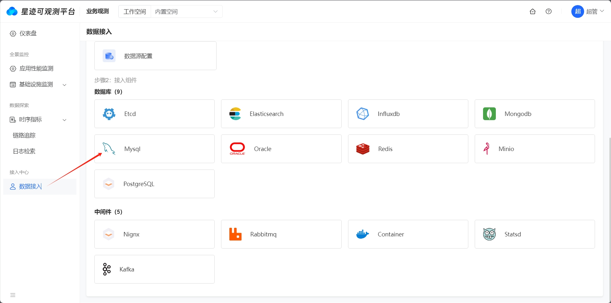

# 时序指标接入

## 采集插件安装

### 方案一：使用环境配置安装

可观测平台提供了环境配置功能，通过平台的agent安装和管理插件。

1. 环境配置基础信息配置

   详见[环境配置操作文档](../guide/环境配置操作文档.md)

2. 配置数据源

   

3. 安装采集插件

   1. 点击安装agent

   

   2. 填写指定内容并安装，支持远程安装和手动安装



4. 时序指标的采集插件已经集成在平台的agent中，agent安装完成后，采集插件也安装成功。路径如下：

```shell
# tree /usr/local/stplugins/st_datasleuth/default/0.0.0.4/ -L 2
/usr/local/stplugins/st_datasleuth/default/0.0.0.4/
├── bin
│   ├── cache
│   ├── conf.d
│   ├── data
│   ├── externals
│   ├── gitrepos
│   ├── pipeline
│   ├── pipeline_remote
│   ├── python.d
│   ├── start.sh
│   ├── st_datasleuth
│   ├── std.log
│   └── stop.sh
└── etc
    ├── datasleuth.json
    └── plugin.json
```

> 采集插件路径中的0.0.0.4是版本号，根据实际情况变化，可在环境配置中配置和查看。

5. 修改采集组件的配置信息

   这里演示在线修改采集配置的功能，也可以通过手动的方式直接修改配置文件，文件在_/usr/local/stplugins/st_datasleuth/default/0.0.0.4/bin/conf.d_目录中。

   1. 选择需要监控的组件

      

6. 选择机器进行配置

   选择需要配置的主机，点击主机即可查看对应的配置，可在右侧配置中进行修改，查看或修改过配置的主机有个`最近操作`的标识，点击保存按钮的时候会把所有最近操作过的配置保存。

   
   
   以下是MySQL的采集配置样例：

```toml
# {"version": "not-set", "desc": "do NOT edit this line"}

[[inputs.mysql]]
  # 是否启用该input
  enable_input = true

  host = "localhost"
  user = "root"
  pass = "123456"
  port = 3306
  # sock = "<SOCK>"
  # charset = "utf8"

  ## @param connect_timeout - number - optional - default: 10s
  # connect_timeout = "10s"

  ## Deprecated
  # service = "<SERVICE>"

  interval = "30s"

  ## @param inno_db
  innodb = true

  ## table_schema
  tables = []

  ## user
  users = []

  ## 开启数据库性能指标采集
  # dbm = false

  # [inputs.mysql.log]
  # #required, glob logfiles
  # files = ["/var/log/mysql/*.log"]

  ## glob filteer
  #ignore = [""]

  ## optional encodings:
  ##    "utf-8", "utf-16le", "utf-16le", "gbk", "gb18030" or ""
  #character_encoding = ""

  ## The pattern should be a regexp. Note the use of '''this regexp'''
  ## regexp link: https://golang.org/pkg/regexp/syntax/#hdr-Syntax
  #multiline_match = '''^(# Time|\d{4}-\d{2}-\d{2}|\d{6}\s+\d{2}:\d{2}:\d{2}).*'''

  ## grok pipeline script path
  #pipeline = "mysql.p"

  ## Set true to enable election
  election = true

  # [[inputs.mysql.custom_queries]]
  #   sql = "SELECT foo, COUNT(*) FROM table.events GROUP BY foo"
  #   metric = "xxxx"
  #   tagKeys = ["column1", "column1"]
  #   fieldKeys = ["column3", "column1"]
  
  ## 监控指标配置
  [inputs.mysql.dbm_metric]
    enabled = true
  
  ## 监控采样配置
  [inputs.mysql.dbm_sample]
    enabled = true  

  ## 等待事件采集
  [inputs.mysql.dbm_activity]
    enabled = true  

  [inputs.mysql.tags]
    # some_tag = "some_value"
    # more_tag = "some_other_value"
```

### 方案二：手动安装

1. 获取采集插件安装包datasleuth

2. 在采集组件所在的服务器中部署采集插件

    1. 获取安装包datasleuth.tar.gz
    2. 创建目录并解压
    ```shell
    # mkdir /data/service/datasleuth -p

    # tar -zxvf datasleuth.tar.gz -C /data/service/datasleuth
    ```
    3. 启动
    ```shell
    # cd bin

    # sh start.sh
    09:13:14 st_datasleuth startup successful.PID is 352243
    ```

3. 修改采集插件主配置文件`conf.d/datasleuth.conf`

```toml
enable_pprof = false
pprof_listen = ""
install_version = "1.0.0.4"
protect_mode = true
ulimit = 64000

[logging]
  log = "/var/log/iflytek/st/plugins/datasleuth/log"
  gin_log = "/var/log/iflytek/st/plugins/datasleuth/gin.log"
  level = "info"
  disable_color = false
  rotate = 32
[io]
  feed_chan_size = 1
  max_cache_count = 1000
  flush_interval = "10s"
  output_file = ""
  output_file_inputs = []
  enable_cache = false
  cache_max_size_gb = 10
  cache_clean_interval = "5s"
  [io.filters]

[dataway]
  # 配置监控服务的地址
  urls = ["http://{monitor_host}:17000"]
  basic_auth_user = ""
  basic_auth_pass = ""
  timeout = "30s"
  http_proxy = ""
  max_idle_conns_per_host = 64
  max_fail = 20

[sinks]

  [[sinks.sink]]

[environments]
  ENV_HOSTNAME = ""

[cgroup]
  enable = true
  path = "/datasleuth"
  cpu_max = 30.0
  cpu_min = 5.0
  mem_max_mb = 4096

[heartbeat]
  enable = true
  # interval, unit: s
  interval = 10
  timeout = 5000
  dial_timeout = 2500
  max_idle_conns_per_host = 100
```

4. 开启需要采集组件的配置，这里以mysql为例，配置文件`bin/conf.d/db/mysql.conf`

```toml
# {"version": "not-set", "desc": "do NOT edit this line"}

[[inputs.mysql]]
  # 是否启用该input
  enable_input = true

  host = "localhost"
  user = "root"
  pass = "123456"
  port = 3306
  # sock = "<SOCK>"
  # charset = "utf8"

  ## @param connect_timeout - number - optional - default: 10s
  # connect_timeout = "10s"

  ## Deprecated
  # service = "<SERVICE>"

  interval = "30s"

  ## @param inno_db
  innodb = true

  ## table_schema
  tables = []

  ## user
  users = []

  ## 开启数据库性能指标采集
  # dbm = false

  # [inputs.mysql.log]
  # #required, glob logfiles
  # files = ["/var/log/mysql/*.log"]

  ## glob filteer
  #ignore = [""]

  ## optional encodings:
  ##    "utf-8", "utf-16le", "utf-16le", "gbk", "gb18030" or ""
  #character_encoding = ""

  ## The pattern should be a regexp. Note the use of '''this regexp'''
  ## regexp link: https://golang.org/pkg/regexp/syntax/#hdr-Syntax
  #multiline_match = '''^(# Time|\d{4}-\d{2}-\d{2}|\d{6}\s+\d{2}:\d{2}:\d{2}).*'''

  ## grok pipeline script path
  #pipeline = "mysql.p"

  ## Set true to enable election
  election = true

  # [[inputs.mysql.custom_queries]]
  #   sql = "SELECT foo, COUNT(*) FROM table.events GROUP BY foo"
  #   metric = "xxxx"
  #   tagKeys = ["column1", "column1"]
  #   fieldKeys = ["column3", "column1"]
  
  ## 监控指标配置
  [inputs.mysql.dbm_metric]
    enabled = true
  
  ## 监控采样配置
  [inputs.mysql.dbm_sample]
    enabled = true  

  ## 等待事件采集
  [inputs.mysql.dbm_activity]
    enabled = true  

  [inputs.mysql.tags]
    # some_tag = "some_value"
    # more_tag = "some_other_value"
```

5. 启动采集插件

```shell
# sh bin/start.sh
09:14:39 st_datasleuth startup successful.PID is 23734
```


### 数据观测

通过上述两个方案部署成功之后，可以在系统的**业务观测 > 时序指标 > 快捷视图**中查看上报的数据，具体操作详见[快捷视图操作文档](../guide/快捷视图操作文档.md)。
