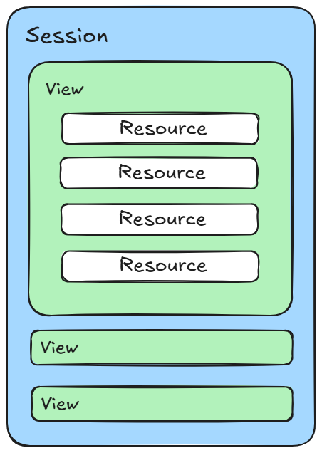

# 用户访问监控接入说明

## 应用接入

通过收集 Web 应用的指标数据，以可视化方式分析应用性能。前置条件包括：1、安装 DataKit 采集器，并配置为公网可访问，添加 IP 地理信息库；3、开启 RUM 采集器。应用的接入方式详见[应用接入操作文档](../guide/用户访问监控应用接入操作文档.md)。

## 应用数据采集

应用数据采集到星迹可观测平台后，可以通过业务观测下的查看器和仪表盘进行异常数据的检索和查看。

### 数据类型

用户访问监控包括六种数据类型：

| 
类型
        | 描述                                                                             |
| --------- | ------------------------------------------------------------------------------ |
| session   | 用户会话信息记录，当前会话中，基于会话维度抓取用户页面、资源、操作、错误、长任务相关访问数据。                                |
| view      | 用户访问页面时，都会生成一个页面查看记录。当用户停留在同一页面上时，资源，长任务，错误和操作记录将通过 `view_id` 属性链接到相关的 RUM 视图。 |
| resource  | 用户访问页面时，加载的资源信息记录。                                                             |
| error     | 用户访问监测采集器收集浏览器上的所有前端错误。                                                        |
| long_task | 对于浏览器中的任何阻塞主线程超过 50ms 的任务，都会生成一条长任务记录。                                         |
| action    | 跟踪用户页面浏览过程中所有的用户交互记录。                                                          |

### 全局属性

用户访问监控的场景构建和事件告警都可以通过下面的全局属性进行查询。

#### SDK 属性

| 字段            | 类型     | 描述                         |
| ------------- | ------ | -------------------------- |
| `sdk_name`    | string | 采集器名称，固定名称：df_web_rum_sdk。 |
| `sdk_version` | string | 采集器版本信息。                   |

#### 应用属性

| 字段        | 类型     | 描述                                                                                                                  |
| --------- | ------ | ------------------------------------------------------------------------------------------------------------------- |
| `app_id`  | string | 必填，用户访问应用唯一 ID 标识，在应用列表上面创建监控时自动生成。                                                                                 |
| `env`     | string | 必填，环境字段。属性值：prod/gray/pre/common/local。其中： prod：线上环境； gray：灰度环境； pre：预发布环境； common：日常环境； local：本地环境。 |
| `version` | string | 必填，版本号。                                                                                                             |
| `service` | string | 必填，用户访问 SDK 内配置的 service 字段对应值。                                                                                     |

#### 用户 & 会话属性

| 字段           | 类型     | 描述                               |
| ------------ | ------ | -------------------------------- |
| `session_id` | string | 会话 id （用户会话 15 分钟内未产生交互行为则视为过期）。 |

#### 设备 & 分辨率属性

| 字段                      | 类型     | 描述            |
| ----------------------- | ------ | ------------- |
| `os`                    | string | 操作系统          |
| `os_version`            | string | 操作系统版本        |
| `os_version_major`      | string | 设备报告的主要操作系统版本 |
| `browser`               | string | 浏览器提供商        |
| `browser_version`       | string | 浏览器版本         |
| `browser_version_major` | string | 浏览器主要版本信息     |
| `screen_size`           | string | 屏幕宽度*高度，分辨率   |

#### 网络属性

| 字段             | 类型     | 描述                                                                                  |
| -------------- | ------ | ----------------------------------------------------------------------------------- |
| `network_type` | string | 网络连接类型，属性值参考： wifi \| 2g \| 3g \| 4g \| 5g \| unknown（未知网络）\| unreachable（网络不可用） |

### 其他数据类型属性

#### Session
| 字段                        | 描述                     |
|-----------------------------|--------------------------|
| session_start_time          | 会话的开始时间           |
| session_long_task_count     | 会话长任务数             |
| session_first_view_host     | 会话首个页面域名         |
| session_first_view_id       | 会话首个页面ID           |
| network_type                | 网络类型                 |
| session_last_view_host      | 会话最后一个页面域名     |
| session_first_view_path     | 会话首个页面路径         |
| session_last_view_url_query | 会话最后一个页面查询     |
| sdk_version                 | 采集器版本               |
| session_last_view_path      | 会话最后一个页面路径     |
| session_last_view_url       | 会话最后一个页面URL      |
| session_action_count        | 会话操作数               |
| is_signin                   | 是否注册                 |
| sdk_name                    | 采集器名称               |
| browser_version_major       | 浏览器主要版本信息       |
| session_error_count         | 会话错误数               |
| os_version                  | 操作系统版本             |
| session_resource_count      | 会话资源数               |
| source                      | 数据来源                 |
| version                     | 版本                     |
| service                     | 服务                     |
| session_first_view_url_query| 会话首个页面查询         |
| userid                      | 用户ID                   |
| os_version_major            | 操作系统主要版本         |
| session_view_count          | 会话页面数               |
| session_first_view_url      | 会话首个页面URL          |
| browser_version             | 浏览器版本               |
| session_id                  | 会话ID                   |
| screen_size                 | 分辨率                   |
| app_id                      | 应用ID                   |
| env                         | 环境                     |
| os                          | 操作系统                 |
| session_last_view_id        | 会话最后一个页面ID       |
| session_type                | 会话类型                 |
| time_spent                  | 持续/停留时间            |
| browser                     | 浏览器                   | 

#### View
| **字段**                     | **描述**                     |
|------------------------------|------------------------------|
| upload_time                  | 创建时间                     |
| view_resource_count          | 页面资源数                   |
| userid                       | 用户ID                       |
| view_url_query               | 页面URL查询                  |
| browser                      | 浏览器提供商                 |
| dom_ready                    | DOM就绪                      |
| view_action_count            | 页面操作数                   |
| device                       | 移动设备厂商                 |
| view_host                    | 页面URL域名                  |
| sdk_name                     | 采集器名称                   |
| view_error_count             | 页面错误数                   |
| os_version                   | 操作系统版本                 |
| screen_size                  | 分辨率                       |
| view_url                     | 页面URL                      |
| env                          | 环境                         |
| view_long_task_count         | 页面长任务数                 |
| os_version_major             | 操作系统主要版本             |
| time_spent                   | 停留时间                     |
| dom_content_loaded           | DOM加载时间                  |
| largest_contentful_paint     | 最大内容绘制                 |
| is_signin                    | 是否注册                     |
| view_referrer                | 页面来源                     |
| cumulative_layout_shift      | 累积布局偏移                 |
| network_type                 | 网络类型                     |
| dom                          | DOM解析耗时                  |
| sdk_version                  | 采集器版本                   |
| view_id                      | 页面ID                       |
| session_type                 | 会话类型                     |
| browser_version_major        | 浏览器主要版本信息           |
| version                      | 版本                         |
| dom_interactive              | DOM构建完毕                  |
| is_login                     | 是否登录                     |
| load_event                   | 事件加载时间                 |
| service                      | 服务                         |
| browser_version              | 浏览器版本                   |
| resource_load_time           | 资源加载的时间               |
| source                       | 页面数据来源                 |
| view_loading_type            | 加载类型                     |
| first_contentful_paint       | 首次内容绘制                 |
| first_paint_time             | 首次渲染时间                 |
| os                           | 操作系统                     |
| dom_complete                 | DOM解析完成                  |
| session_sample_rate          | 会话采样率                   |
| view_apdex_level             | 页面满意度                   |
| loading_time                 | 加载时间                     |
| app_id                       | 应用ID                       |
| session_id                   | 会话ID                       |
| time_to_interactive          | 首次可交互时间               |
| view_path                    | 页面URL路径                  | 

#### Resource
| 字段                        | 描述                     |
|-----------------------------|--------------------------|
| upload_time                 | 创建时间                 |
| app_id                      | 应用ID                   |
| resource_id                 | 资源ID                   |
| browser_version_major       | 浏览器主要版本信息       |
| duration                    | 请求加载耗时             |
| session_sample_rate         | 会话采样率               |
| userid                      | 用户ID                   |
| device                      | 设备厂商                 |
| resource_decode_size        | 资源解码大小             |
| resource_ttfb               | 资源响应时间             |
| screen_size                 | 屏幕分辨率               |
| service                     | 服务                     |
| browser                     | 浏览器                   |
| view_url                    | 页面URL                  |
| view_id                     | 页面ID                   |
| view_url_query              | 页面URL查询              |
| source                      | 数据来源                 |
| os_version_major            | 操作系统主要版本         |
| resource_url_host           | 资源URL域名              |
| sdk_name                    | 采集器名称               |
| is_login                    | 是否登录                 |
| network_type                | 网络类型                 |
| resource_delivery_type      | 资源交付类型             |
| resource_url_path_group     | 资源URL路径分组          |
| view_host                   | 页面URL域名              |
| resource_size               | 资源大小                 |
| resource_trans              | 资源传输时间             |
| view_path                   | 页面URL路径              |
| resource_redirect_time      | 资源重定向时间           |
| resource_transfer_size      | 资源传输大小             |
| resource_method             | 资源方法                 |
| sdk_version                 | 采集器版本               |
| resource_type               | 资源类型                 |
| resource_url                | 资源URL                  |
| resource_first_byte         | 资源首包时间             |
| resource_status_group       | 资源状态分组             |
| browser_version             | 浏览器版本               |
| env                         | 环境                     |
| os_version                  | 操作系统版本             |
| resource_encode_size        | 资源编码大小             |
| resource_first_byte_time    | 资源首包                 |
| resource_status             | 资源状态                 |
| resource_protocol           | 资源协议                 |
| session_type                | 会话类型                 |
| resource_url_query          | 资源URL查询              |
| resource_download_time      | 资源下载时间             |
| os                          | 操作系统                 |
| resource_redirect           | 资源重定向               |
| resource_render_blocking_status | 资源渲染阻塞状态     |
| session_id                  | 会话ID                   |
| version                     | 版本号                   |
| is_signin                   | 是否注册                 |
| view_referrer               | 页面来源                 |
| resource_url_path           | 资源URL路径              |
| action_id                   | 用户行为ID               | 

#### Action
| **字段**                | **描述**               |
|-------------------------|------------------------|
| upload_time             | 创建时间               |
| os_version_major        | 操作系统主要版本       |
| sdk_version             | 采集器版本             |
| device                  | 移动设备厂商           |
| browser                 | 浏览器                 |
| view_path               | 页面URL路径            |
| action_type             | 操作类型               |
| os                      | 操作系统               |
| view_url                | 页面URL                |
| session_type            | 会话类型               |
| view_host               | 页面域名               |
| browser_version         | 浏览器版本             |
| view_id                 | 页面ID                 |
| action_id               | 用户行为ID             |
| action_error_count      | 操作错误数             |
| app_id                  | 应用ID                 |
| is_signin               | 是否注册               |
| network_type            | 网络类型               |
| version                 | 版本号                 |
| source                  | 数据来源               |
| userid                  | 用户ID                 |
| view_url_query          | 页面URL查询            |
| action_name             | 操作名称               |
| action_long_task_count  | 操作长任务数           |
| service                 | 服务                   |
| env                     | 环境                   |
| sdk_name                | 采集器名称             |
| view_referrer           | 页面来源               |
| os_version              | 操作系统版本           |
| session_id              | 会话ID                 |
| browser_version_major   | 浏览器主要版本信息     |
| action_resource_count   | 操作资源数             |
| duration                | 加载耗时               |
| screen_size             | 分辨率                 |
| action_position         | 行为定位               |
| action_target           | 行为目标               |
| is_login                | 是否登录               |
| session_sample_rate     | 会话采样率             | 

#### Long Task
| 字段                     | 描述                   |
|--------------------------|------------------------|
| long_task_start_time     | 长任务开始时间         |
| view_url                 | 页面URL                |
| view_url_query           | 页面URL查询            |
| browser                  | 浏览器                 |
| os_version_major         | 操作系统主要版本       |
| version                  | 版本号                 |
| view_id                  | 页面ID                 |
| browser_version_major    | 浏览器主要版本信息     |
| network_type             | 网络类型               |
| browser_version          | 浏览器版本             |
| userid                   | 用户ID                 |
| app_id                   | 应用ID                 |
| service                  | 服务                   |
| long_task_id             | 长任务ID               |
| sdk_name                 | 采集器名称             |
| session_type             | 会话类型               |
| session_sample_rate      | 会话采样率             |
| source                   | 数据来源               |
| view_referrer            | 页面来源               |
| is_signin                | 是否注册               |
| sdk_version              | 采集器版本             |
| env                      | 环境                   |
| session_id               | 会话ID                 |
| view_host                | 页面URL域名            |
| duration                 | 加载耗时               |
| os_version               | 操作系统版本           |
| device                   | 移动设备厂商           |
| screen_size              | 分辨率                 |
| is_login                 | 是否登录               |
| scripts                  | 脚本                   |
| view_path                | 页面URL路径            |
| os                       | 操作系统               |
| action_id                | 用户行为ID             |
| upload_time              | 创建时间               | 

#### Error
| **字段**               | **描述**               |
|------------------------|------------------------|
| upload_time            | 创建时间               |
| view_path              | 页面URL路径            |
| os                     | 操作系统               |
| session_id             | 会话ID                 |
| source                 | 数据来源               |
| browser                | 浏览器                 |
| sdk_version            | 采集器版本             |
| screen_size            | 分辨率                 |
| app_id                 | 应用ID                 |
| session_sample_rate    | 会话采样率             |
| userid                 | 用户ID                 |
| error_handling         | 错误处理               |
| network_type           | 网络类型               |
| is_signin              | 是否注册               |
| version                | 版本                   |
| env                    | 环境                   |
| error_stack            | 错误堆栈               |
| os_version_major       | 操作系统主要版本       |
| error_source           | 错误来源               |
| browser_version        | 浏览器版本             |
| sdk_name               | 采集器名称             |
| error_id               | 错误ID                 |
| error_message          | 错误信息               |
| view_id                | 页面ID                 |
| browser_version_major  | 浏览器主要版本信息     |
| os_version             | 操作系统版本           |
| is_login               | 是否登录               |
| device                 | 移动设备厂商           |
| view_referrer          | 页面来源               |
| view_url               | 页面URL                |
| view_url_query         | 页面URL查询            |
| service                | 服务                   |
| session_type           | 会话类型               |
| error_type             | 错误类型               |
| view_host              | 页面URL域名            |
| action_id              | 用户行为ID             | 