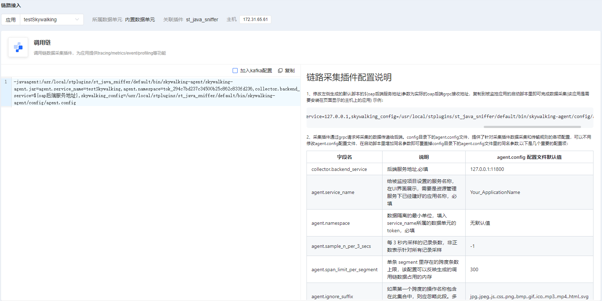

# 链路数据接入
## 非容器化服务
### 采集插件安装和脚本生成
#### 方案一：使用线上化配置安装和生成脚本
1. 根据环境配置操作文档在服务器上安装好 st_java_sniffer 插件
   * 详见[环境配置操作文档](../guide/环境配置操作文档.md)
2. 在业务观测-数据接入-链路接入页面选择需要接入该插件的应用， 下方是以testSkywalking应用为例生成的对应的默认接入脚本



```shell
-javaagent:/usr/local/stplugins/st_java_sniffer/default/bin/skywalking-agent/skywalking-agent.jar=agent.service_name=testSkywalking,agent.namespace=tok_294c7bd237c34500b25c862c833fd236,collector.backend_service=${oap后端服务地址},skywalking_config=/usr/local/stplugins/st_java_sniffer/default/bin/skywalking-agent/config/agent.config
```
替换${oap后端服务地址}变量为实际oap后端服务地址即可
* 注意： 如果选择kafka作为传输链路数据通道，勾选页面加入kafka配置，脚本自动增加plugin.kafka.bootstrap_servers=${kafka地址}配置，修改${kafka地址}为对应的kafka地址，集群用逗号分割
* 示例：
```shell
-javaagent:/usr/local/stplugins/st_java_sniffer/default/bin/skywalking-agent/skywalking-agent.jar=agent.service_name=testSkywalking,agent.namespace=tok_294c7bd237c34500b25c862c833fd236,collector.backend_service=127.0.0.1:11800,skywalking_config=/usr/local/stplugins/st_java_sniffer/default/bin/skywalking-agent/config/agent.config,plugin.kafka.bootstrap_servers=127.0.0.1:9092
```
####  方案二：手动安装和生成脚本

1. 进入被监控项目所在服务器，下载采集插件压缩包
2. 解压压缩包，得到skywalking-agent目录：
```shell
   tar -zxvf apache-skywalking-java-agent-$(版本号).tgz
   rm -rf apache-skywalking-java-agent-$(版本号).tgz
   cd skywalking-agent
```
3. 根据skywalking-agent包所在的位置，资源管理服务建好的应用名称和应用名称所属的数据单元token,oap后端服务地址实际值来替换下方脚本的变量即可

```shell
-javaagent:${skywalking-agent包所在的路径}/skywalking-agent.jar=agent.service_name=${资源管理服务建好的应用名称},agent.namespace=${应用名称所属的数据单元token},
collector.backend_service=${oap后端服务地址},
skywalking_config=${skywalking-agent包所在的路径}/config/agent.config
```
* 注意： 如果选择kafka作为传输链路数据通道，脚本增加plugin.kafka.bootstrap_servers=127.0.0.1:9092配置，集群用逗号分割
* 示例：
```shell
-javaagent:/data/public/agent/skywalking-agent.jar=agent.service_name=testSkywalking,agent.namespace=tok_294c7bd237c34500b25c862c833fd236,collector.backend_service=127.0.0.1:11800,skywalking_config=/usr/local/stplugins/st_java_sniffer/default/bin/skywalking-agent/config/agent.config,plugin.kafka.bootstrap_servers=127.0.0.1:9092
```
### 脚本接入

1. 修改监控项目的脚本，使用改好的脚本复制到被监控项目的启动脚本里即可完成数据采集

2. 运行启动脚本之后，会在skywalking agent 的logs目录下生成skywalking-api.log文件，打开文件看到如下内容：

   ```
   INFO 2023-10-16 10:50:25.079 main Version : SkyWalking agent version: 8.16.0-cb6fa60 
   INFO 2023-10-16 10:50:27.091 main AgentClassLoader : ${skywalking-agent包所在的路径}/plugins/apm-asynchttpclient-2.x-plugin-8.16.0.jar loaded. 
   INFO 2023-10-16 10:50:27.091 main AgentClassLoader : ${skywalking-agent包所在的路径}/plugins/apm-vertx-core-3.x-plugin-8.16.0.jar loaded. 
   INFO 2023-10-16 10:50:27.091 main AgentClassLoader : ${skywalking-agent包所在的路径}/plugins/nats-2.14.x-2.15.x-plugin-8.16.0.jar loaded. 
   ......
   INFO 2023-10-16 10:50:27.106 main AgentClassLoader : ${skywalking-agent包所在的路径}/activations/apm-toolkit-logging-common-8.16.0.jar loaded. 
   INFO 2023-10-16 10:50:27.106 main AgentClassLoader : ${skywalking-agent包所在的路径}/activations/apm-toolkit-kafka-activation-8.16.0.jar loaded.
   ```

上述日志说明，plugins目录下的插件都已经被成功加载，Agent探针已经成功注入到监控项目里，用于在程序运行时采集性能数据

## 容器化服务
### 修改需要接入st_java_sniffer 服务的pod的yaml 文件

#### 1.将需要接入agent 的pod 增加新的initContainers

```yaml
  initContainers:
    - name: agent-container
      image: artifacts.iflytek.com/stc-docker-repo/kgcpt/st_java_sniffer:v8.16.0.1
      volumeMounts:
        - name: skywalking-agent
          mountPath: /agent
      command: [ "/bin/sh" ]
      args: [ "-c", "cp -R /skywalking/agent /agent/" ]        
```
* image 地址：artifacts.iflytek.com/stc-docker-repo/kgcpt/st_java_sniffer:v8.16.0.1


#### 2.给自己的应用容器添加环境变量

```yaml
 env:
        - name: JAVA_TOOL_OPTIONS
          value: "-javaagent:/skywalking/agent/skywalking-agent.jar"
        - name: SW_AGENT_NAME
          value: chapter10-devops-demo #填写可观测平台里创建的应用名称
        - name: SW_AGENT_COLLECTOR_BACKEND_SERVICES
          value: oap.skywalking:11800 #填写oap 部署地址
        - name: SW_AGENT_NAMESPACE
          value: tok_a204c33c46364a4d92590eb3b99d20cb    #填写可观测平台里创建的应用名称所属的数据单元
        - name: SW_KAFKA_BOOTSTRAP_SERVERS  #可选环境变量，使用kafka作为数据链路通道的时候，才需要配置
          value: '127.0.0.1:9092'   
```
* SW_AGENT_NAME 填写可观测平台里创建的应用名称
* SW_AGENT_COLLECTOR_BACKEND_SERVICES 填写oap 部署地址
* SW_AGENT_NAMESPACE 填写可观测平台里创建的应用名称所属的数据单元
* SW_KAFKA_BOOTSTRAP_SERVERS:可选，如果是通过kafka传输链路数据，则这里填写kafka broker ip，集群用逗号分割，
#### 3.增加volumes

```yaml
  volumes:
    - name: skywalking-agent
      emptyDir: {}
```

#### 4.分别给两个容器挂载skywalking-agent 卷
```yaml
   volumeMounts: 
              - 
                name: "skywalking-agent"
                mountPath: "/agent"       
```
```yaml
    volumeMounts: 
              - 
                name: "skywalking-agent"
                mountPath: "/skywalking"     
```
#### 5. 重新启动pod

* 接入完整示例：
```yaml
 kind: Deployment
apiVersion: apps/v1
metadata:
  name: auth
  namespace: default
  labels:
    app: auth
  annotations:
    deployment.kubernetes.io/revision: '9'
    kubesphere.io/creator: admin
spec:
  replicas: 1
  selector:
    matchLabels:
      app: auth
  template:
    metadata:
      creationTimestamp: null
      labels:
        app: auth
      annotations:
        kubesphere.io/creator: admin
        kubesphere.io/imagepullsecrets: '{}'
        logging.kubesphere.io/logsidecar-config: '{}'
    spec:
      volumes:
        - name: skywalking-agent
          emptyDir: {}
      initContainers:
        - name: agent-container
          image: >-
            artifacts.iflytek.com/stc-docker-repo/kgcpt/st_java_sniffer:v8.16.0.1
          command:
            - /bin/sh
          args:
            - '-c'
            - cp -R /skywalking/agent /agent/
          resources: {}
          volumeMounts:
            - name: skywalking-agent
              mountPath: /agent
          terminationMessagePath: /dev/termination-log
          terminationMessagePolicy: File
          imagePullPolicy: IfNotPresent
      containers:
        - name: auth
          image: 'artifacts.iflytek.com/stc-docker-repo/kgcpt/auth:v4.0.4'
          env:
            - name: JAVA_TOOL_OPTIONS
              value: '-javaagent:/skywalking/agent/skywalking-agent.jar'
            - name: SW_AGENT_NAME
              value: authtest
            - name: SW_AGENT_COLLECTOR_BACKEND_SERVICES
              value: '127.0.0.1:11800'
            - name: SW_AGENT_NAMESPACE
              value: tok_294c7bd237c34500b25c862c833fd236
            - name: SW_KAFKA_BOOTSTRAP_SERVERS
              value: '127.0.0.1:9002'  
            - name: NODE_NAME
              valueFrom:
                fieldRef:
                  apiVersion: v1
                  fieldPath: spec.nodeName
          resources: {}
          volumeMounts:
            - name: skywalking-agent
              mountPath: /skywalking
          terminationMessagePath: /dev/termination-log
          terminationMessagePolicy: File
          imagePullPolicy: IfNotPresent
      restartPolicy: Always
      terminationGracePeriodSeconds: 30
      dnsPolicy: ClusterFirst
      nodeSelector:
        kubernetes.io/hostname: k8s-node1
      serviceAccountName: default
      serviceAccount: default
      securityContext: {}
      imagePullSecrets:
        - name: pull-artifacts-image-secret
      schedulerName: default-scheduler
  strategy:
    type: RollingUpdate
    rollingUpdate:
      maxUnavailable: 25%
      maxSurge: 25%
  revisionHistoryLimit: 10
  progressDeadlineSeconds: 600          
```

## 采集插件个性化配置

1.采集插件通过grpc请求将采集的数据传递给后端。config目录下的agent.config文件，提供了针对采集插件数据采集和传输规则的各项配置，以下是几个重要的配置项：

| 字段名                          | 说明                                           | agent.config 配置文件默认值                                 |
|------------------------------|----------------------------------------------|-------------------------------------------------------------|
| collector.backend_service    | 后端服务地址,必填                                    | 127.0.0.1:11800      |
| agent.service_name           | 给被监控项目设置的服务名称，在UI界面展示，需要是资源管理服务下已经建好的应用名称，必填 | Your_ApplicationName                       |
| agent.namespace    | 数据隔离的最小单位，填入service_name所属的数据单元的token，必填     | 无默认值 |
| agent.sample_n_per_3_secs    | 每 3 秒内采样的记录条数，非正数表示针对所有记录采样                  | -1                                    |
| agent.span_limit_per_segment | 单条 segment 里存在的跨度条数上限，该配置可以反映生成的调用链数据占用的内存   | 300                                  |
| agent.ignore_suffix          | 如果第一个跨度的操作名称包含在此集合中，则应忽略此段。多个值应该用","分隔       | jpg,.jpeg,.js,.css,.png,.bmp,.gif,.ico,.mp3,.mp4,.html,.svg |

* 注意：可以不用修改agent.config配置文件，在启动脚本里增加同名参数即可覆盖掉config目录下的agent.config文件里的同名参数


## 示例

下述是一份项目接入到星迹可观测平台的启动脚本实例：增加testD应用采样率个性化配置为每3秒内采样1000条

```shell
java -javaagent:/usr/local/stplugins/st_java_sniffer/default/bin/skywalking-agent/skywalking-agent.jar=agent.service_name=testD,agent.namespace=tok_a204c33c46364a4d92590eb3b99d20cb,collector.backend_service=172.30.34.73:11800,agent.sample_n_per_3_secs=1000,skywalking_config=/usr/local/stplugins/st_java_sniffer/default/bin/skywalking-agent/config/agent.config -Dserver.port=9091 -jar test.jar
```

由于星迹可观测平台设置了权限管理系统，所以service_name,namespace需要填如资源管理服务里建立好的应用和数据单元，否者查询不到对应的数据，
上述实例中，就是将test项目以testD服务名称注册到了星迹可观测的tok_a204c33c46364a4d92590eb3b99d20cb数据单元下。进入到星迹可观测平台这个数据单元所属的工作空间主页下面，如果可以看到应用，并且展示了监控性能数据，那就说明该服务已经成功接入到星迹可观测监控系统了


